# 第一部分：AB实验基础

> &#x20;    在数字化时代的大背景下，在数据驱动的产品增长理论和实践中，AB实验起的作用越来越重要。AB实验相关的知识成为数据科学、产品增长领域的核心技能之一。越来越多的岗位需要产品、运营、数据等职位候选人掌握AB实验相关的知识。了解和掌握AB实验的理论基础、基本流程、核心要素、特点和应用优势，变得非常有意义且必要。
>
>

## 一、AB实验的基本原理和应用

&#x20;     本章首先介绍AB实验的基本概念和原理，然后介绍AB实验的3个基本要素—**实验参与单元、实验控制参数、实验指标**，以及对于这3个基本要素的要求，之后介绍AB实验的2个核心价值—**验证因果关系和量化策略效果**，接着介绍在实践应用中AB实验的2个关键特性—**先验性和并行性**，最后介绍AB实验的典型应用场景和一些经典的案例，通过案例帮助读者更加直观地认识和理解AB实验原理和价值。

### 1.1 什么是AB实验

&#x20;   近几年随着增长概念的普及，其重要增长手段—AB实验的曝光度也越来越高。AB实验并不是近几年才有的，从推荐系统诞生开始，AB实验就扮演着重要的角色。本节主要介绍AB实验的基本概念，包括AB实验和在线AB实验的定义以及AB实验的常见类型。

#### 1.1.1 AB实验的定义

&#x20;    AB实验又称为受控实验（ControlledExperiment）或者对照实验。AB实验的概念来自生物医学的双盲测试，双盲测试中病人被随机分成两组，在不知情的情况下分别给予安慰剂和测试用药，经过一段时间的实验后，比较这两组病人的表现是否具有显著的差异，从而确定测试 用药是否有效。2000年，Google工程师将这一方法应用在互联网产品测试中，此后AB实验变得越来越重要，逐渐成为互联网产品运营迭代科学化、数据驱动增长的重要手段。从国外的Apple、Airbnb、Amazon、Facebook、Google、LinkedIn、Microsoft、Uber等公司，到国内的百度、阿里、腾讯、滴滴、字节跳动、美团等公司，在各种终端（网站、PC应用程序、移动应用程序、电子邮件等）上运行着大量的AB实验。这些公司每年进行数千到数万次实验，涉及上亿的用户，测试内容涵盖了绝大多数产品特征的优化，包括用户体验（颜色、字体和交互等）、算法优化（搜索、广告、个性化、推荐等）、产品性能（响应速度、吞吐量、稳定性、延迟）、内容（商品、资讯、服务）生态管理系统、商业化收入等。因为AB实验被引入互联网公司后，应用场景主要是大规模的在线测试，所以也被称作在线AB实验或在线对照实验（Online ControlledExperiment，OCE）。本书如果没有特殊说明，提到的AB实验均指在线AB实验。常见的在线AB实验中，用户被随机、均匀地分为不同的组，同一组内的用户在实验期间使用相同的策略，不同组的用户使用相同或不同的策略。同时，日志系统根据实验系统为用户打标记，用于记录用户的行为，然后数据计算系统根据带有实验标记的日志计算用户的各种实验数据指标。实验者通过这些指标去理解和分析不同的策略对用户起了什么样的作用，是否符合实验预先的假设。如图1-1所示，图中流程概括了AB实验的经典模式。

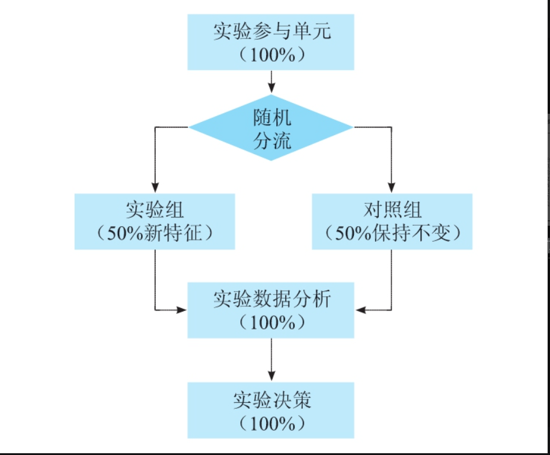

图1-1　AB实验流程

&#x20;     将图1-1所示的流程应用到产品迭代中，就是将具有不同功能、不同策略的产品版本，在同一时间，分别让两个或多个用户组访问。这些参与实验的用户组是从总体用户中随机抽样出来的，一般只占总体用户的一小部分，而且不同组用户的属性、构成成分是相同或相似的。先通过日志系统、业务系统收集各组用户的行为数据和业务数据，然后基于这些数据指标分析、评估出相比之下更好的产品版本，最后推广到全部用户。以图1-2为例，我们试图通过AB实验找出哪个颜色的横幅位点击率更高：A组保持浅色横幅不变，B组采用深色的横幅，分析哪个颜色更能引起用户的关注，提升用户的点击率。如果通过实验发现深色横幅的点击率更高，就将深色横幅位推广到全部用户。当然，在实际应用中，AB实验的效果评估一般没有这么简单，比如除了点击率之外，还需要综合考虑其他的指标。

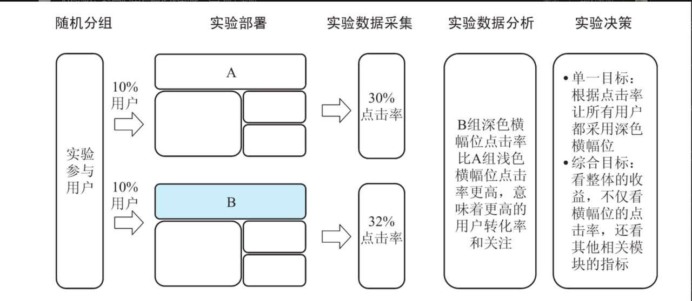

图1-2　AB实验测试哪个颜色横幅位点击率更高

#### 1.1.2 AB实验的类型

&#x20;       不同分类视角来看，AB实验有着不同的类型。

●从实验实施的产品形态来看，AB实验可以分为App类型、PC类型、网页页面类型等。

●从实验代码运行的机制来看，AB实验可以分为前端页面类型、后端服务类型等。

●从实验分流的对象来看，AB实验可以分为用户类型、会话类型、页面类型、元素类型等。

●从实验服务调用的方式来看，AB实验可以分为SDK类型、接口服务类型等。

●从实验内容来看，AB实验可以分为交互类、算法类、内容类、工程性能类等。

&#x20;     这些是AB实验常见的分类方式。当然，AB实验的分类不局限于以上分类，可以根据实际情况，采用不同的分类方式。不管何种类型的AB实验，都应符合分流→实验→数据分析→决策的基本流程，以及需要满足AB实验的3个基本要素。&#x20;

### 1.2 AB实验的3个基本要素

&#x20;     AB实验虽然能帮助我们更科学地做出决策，但并不能科学地辅助所有决策，这是因为不是任何一件事情都可以进行AB实验。例如，不能对并购进行实验，因为我们不能让并购和它的反事实（即没有发生并购）同时发生；不能测试在奥运会中投放哪种广告更好，因为奥运会就一次，不能反复进行测试。本节详细介绍进行AB实验首先需要具备的基本要素。

#### 1.2.1 实验参与单元

&#x20;     进行AB实验首先必须要有能够参与实验的对象，即实验参与单元，一般来说就是能参与实验的用户。在AB实验中，把参与实验的用户分为两组或者多组，其中至少有一组作为对照组，对照组用户什么都不改变，作为对比实验效果的基线；其余组为实验组，实验组可以进行各种产品特征实验。要确保实验的科学性，仅有参与用户还不够，参与用户还需要满足几个关键条件。

##### 1.实验参与单元互不干扰实验

&#x20;     参与单元（例如实验用户）被分配到不同的实验组，需要确保不同的实验参与单元互相不干扰或者干扰小到可以忽略。如果不同实验组之间的实验参与单元相互影响，那么就会影响实验结果的正确评估。比如，告诉实验组用户，对照组的用户正在吃某种药物，而且身体有所好转，那么对照组的用户可能也会转而使用这种药物，这势必会影响到对照组的实验结果，无法观测到没有使用药物的真实数据。这个问题也被称为SUTVA，将在第4章详细讨论。

##### 2.实验参与单元合理随机化

&#x20;     实验参与单元随机化就是将随机化过程应用于实验参与单元，以实现将它们分到不同的实验组的目的。科学随机化非常重要，需要确保分配给不同实验组的实验参与单元在统计学上是相似的，从而以较高概率确定因果关系。在随机化的过程中，必须以持久且独立的方式将实验参与单元映射到实验组。持久的意思是，实验参与单元在整个实验期间不得改变分组。为了保证实验效果，实验参与单元将不被告知任何实验相关的信息。实验参与单元最好对于实验信息无感知，否则会对实验造成干扰。

&#x20;     不要对随机化掉以轻心，在实践中，存在很多失败的随机化例子，都说明了科学随机化的重要性和面临的挑战。造成随机过程失败的原因多种多样，简单来说，就是随机过程变得不随机了，使得在实验前不应存在统计学差异的实验组和对照组出现显著差异，出现了实验影响以外的影响因素干扰实验结果。我们将在第5章详细讨论实验随机分流的问题。

##### 3.足够的实验参与单元

&#x20;     根据统计学的理论，AB实验的实验参与单元需要达到一定数量，统计指标才是有意义的（相关统计知识在第3章介绍）。特别是在进行一些指标提升幅度不是很大的实验时，实验参与单元的数量尤其重要。一般来说，实验实际提升效果越不明显，就越需要更多的参与单元来确认实验效果。同理，实验参与单元的1数量越多，实验就可以检测出越小的效果变化，检测的精度也就越高。

&#x20;     以内容行业的AB实验经验来说，对于点击量、曝光量等变化幅度较大的指标，检测出1%的指标相对变化，往往需要十万级以上的实验参与单元；对于留存率这类变化幅度较小的指标，检测出1%的指标相对变化，需要更多的实验参与单元。如果实验参与单元数量不够，比如一些初创、垂类的产品，用户只有几千或几万个，这个时候通过AB实验检测出的变化是粗粒度的，可能只能有效检测出3%、5%甚至10%以上相对幅值的实验效果。

&#x20;     从直观上也不难理解，用户越少，指标本身的变化和波动就越大，我们往往难以判断一个实验组和对照组之间的小幅度差异是天然的随机波动还是实验带来的效果。如果这个差异值足够大，大到超出了一般的波动范围，那么这个差异是实验带来的可能性就高一些。对于小用户体量的产品来说，预期提升很小的指标一般不建议进行AB实验。如果一个优化策略能够带来很大的提升，那么用较少的用户量也是可以检测出的。

&#x20;     处于初创期的产品往往能够通过渠道放量、用户增长等方式快速获得更多用户，从而逐步具备进行更加精准的AB实验的条件。随着用户规模的增加以及业务发展的日趋成熟，检测较小的变化变得越来越重要。例如，像亚马逊这样的大型网站，某指标0.5%的增长带来的收益可能就是上亿美元。不同阶段的产品、不同数量级的实验单元都可以做AB实验，关键是实验参与单元数量要达到满足实验检测当前业务变化所需的精度，并将实验结果误差控制在可接受的范围。如何找到合适的实验单元量以及业务评估精度，在4.3节会详细介绍。

#### 1.2.2 实验控制参数

&#x20;     实验控制参数是影响产品某项指标的可控实验变量，也被称为因子或变量。简单来说，就是实验策略中不同的赋值，比如横幅栏颜色实验中，控制参数就是颜色，实验组控制参数的赋值为红色，对照组赋值为蓝色。实验控制参数也需要满足一些条件方可进行AB实验。

##### 1.实验控制参数可分配

&#x20;     在简单的AB实验中，通常只有一个参数，这个参数有两个赋值或者多个赋值。在在线实验中，通常使用多变量设计。一起评估多个变量的实验，称为多变量实验（Multi-Variable Test，MVT）​，比如同时评估字体颜色和字体大小，允许实验者在参数交叉时发现全局最优值。在简单的AB实验中，一般将实验参与单元随机分为实验组和对照组。控制参数也就对应地分配给实验组和对照组。例如，某App的字体大小是一个控制参数，这个参数可以有10号、12号等不同的值。我们将不同的值赋予不同的组别，比如实验组10号，对照组12号，这两组除了字体的差异外无其他差异，这样就可以通过实验数据对比出10号、12号字体在使用过程中对产品指标的影响。

&#x20;    控制参数可分配是实验可以顺利进行的最关键因素，如果不可分配就没法进行AB实验，只能借助其他方法进行判断和决策。

##### 2.实验控制参数容易改变

&#x20;    做AB实验需要控制参数容易改变，如果改变控制参数很困难，实验成本就非常高。一般来说，软件通常比硬件更容易更改。然而某些软件领域也需要一定级别的质量保证，比如飞机飞行控制系统软件的更改就需要航空管理局的批准。服务器端软件比客户端软件更容易更改，这是因为客户端软件的改变一般需要版本发布之后才能完成。对于那些不升级版本的用户，新实验特性就无法触达了。大部分情况只有80%～90%的用户会完成升级，一部分老用户甚至一直停留在旧版本。版本升级是一个缓慢的过程，一般App至少需要1～2周来完成这个升级。此外，现在产品迭代速度非常快，很多App在1～2周，最多1个月内，就会发布一个新版本。很可能老版本的升级还没有全部完成，又有新版本发布，用户一直处于动态变化的过程中，这种不稳定的状态对于检测实验效果存在一定干扰。现在也有一些新技术使得应用程序可以在后端改变前端的展示效果，使得服务的升级和更改能够迅速完成。

#### 1.2.3 实验指标

&#x20;    实验指标是用于评估实验结果的各项指标数据。从实验评估效果的角度来看，需要实验指标满足两个基本要求。

##### 1.实验指标能反映实验者的意图

&#x20;    因为实验的效果主要是通过实验指标来判断的，所以对于实验指标的一个基本要求就是，实验指标要能反映实验者的意图。如何理解这句话呢？在线实验中，主要通过用户在产品上的行为来收集数据，这个方式最大的优势是不需要用户做出额外的动作，包括提交问卷等，而只是完全真实地记录用户行为而已。这种不被用户感知的方式，相比于与用户访谈等方式，能更加真实地反映用户行为。

&#x20;    这种数据收集方式带来了一个问题，就是行为数据不能直接反映用户行为的原因。比如，一个用户最近访问次数减少了，或者一个用户一段时间后流失了，这背后的原因可能是产品本身导致的，也可能是受外部因素影响的。从行为数据上是没有办法直接得到答案的，我们只能通过一些行为数据去推测原因，这样的推测也只是一个可能的概率，没有办法得到完全的证实。建立我们关心的产品问题和这些行为数据之间的关联，本质上就是寻找指标的指向性，11.2节会详细讨论指向性。

##### 2.实验指标可测、易测

&#x20;    实验指标是评估实验的关键，如果想观察的实验结果无法容易且准确地获得评估指标数据，即使我们进行了实验，也没有办法评估实验结果。在真实环境的测试中，用户的反馈是很难获得的。虽然可以通过电话、邮件或者访谈等方式获得用户反馈，但这些都不能完全反映用户的真实想法。在软件领域，这些实验数据相对容易获得，其他领域的实验数据可能就困难多了。比如，一些社会学类的实验和药物类的实验所需要的数据，可能都需要人工一个个去采集。有了可采集的实验数据以及相应的实验指标后，另一个关键问题就是需要实验关键指标已达成一致，并且可以实际评估。如果目标太难衡量，那么替代指标达成一致就尤为重要了，这便是11.3节将谈到的OEC。

### 1.3 AB实验的2个核心价值

&#x20;     本节主要介绍在实验效果评估中，AB实验的2个核心价值：定性因果和定量增长。

#### 1.3.1 定性因果：验证因果关系，确保方向正确

&#x20;     如果仅依靠人的直觉和经验，很难保证每次产品迭代优化的方向都朝着我们期望的方向进行。Google和Microsoft相关统计表明，即使是很有经验的产品经理，正确判断产品策略的概率也只有约1/3。在凭经验难以做出正确决策的情况下，我们必须有一个有效手段来辅助判断，以提高准确率。方向性的判断是需要判断本次优化是否在朝着期望的方向进行。简单来说，某个策略的改变是否会导致某个产品指标的改变，其本质是一种因果关系的判断。维基百科对于因果关系的定义是第一个事件“因”和第二个事件“果”之间的作用关系，其中后一事件被认为是前一事件的结果。一般来说，一个事件是很多原因综合产的结果，而且原因都发生在较早的时间点，而该事件又可以成为其他事件的原因。

&#x20;     在因果关系的定义中有一个关键点——因果发生是有时间前后关系的。这种前后关系，就是我们需要验证的关系：因为产品做了某个改变，所以用户有某种感知；因为改进了某个特征，所以产品在向目标方向前进。在社会科学领域，AB实验被广泛用于验证因果关系，也是目前已知的快速、低成本验证因果关系最好的方法。其他大部分数据分析手段，如常见的回归分析、关联分析以及机器学习模型，主要表明的是一种相关性。相关不代表因果，是科学和统计学经常强调的重要概念。两个事物有明显的相关性（即当一件事出现时，另一件事也出现）​，不一定表示两者之间有因果关系（即一件事出现的原因是另外一件事出现，或者一件事出现的结果是另外一件事出现）。相关性和因果性究竟有何不同？为什么验证因果关系如此重要？我们来看几个具体的例子。

&#x20;     有一个著名的因果关系与相关关系案例是“巧克力消耗量与获得诺贝尔奖的数量”。数据显示，消耗巧克力越多的国家，人均诺贝尔奖数量越高，相关系数r达到了0.791。虽然有很高的相关性，但是我们能通过提高巧克力的消耗来提高获得诺贝尔奖的数量吗？显然是不能的。

&#x20;     相关网站收集了很多看起来很荒谬的相关性例子，比如自杀率和科学投入量高度正相关、缅因州的离婚率和人造奶油消耗量高相关等。美国缅因州的离婚率和人造奶油消耗量在2000年至2009年间达到了极强的相关性，相关系数为0.9926。

&#x20;     吃人造奶油和离婚明显是没有因果关系的两件事，吃多点人造奶油不至于让人性情大变而导致离婚，离婚之后也不太可能因为心情沮丧而多吃人造奶油。如果我们的研究目的是找出缅因州离婚率下降的主因，人造奶油消耗量和离婚率之间的相关性有用吗？显然这个相关性的作用是很有限的，你不能据此得出结论：少吃人造奶油有助于婚姻和谐。我们希望得到的是真正影响离婚率的因素，这需要有针对性地调查或实验。研究人员可能会想到，是否有一个第三因素，导致缅因州离婚率和人造奶油消耗量共同下降，比如经济形势。

&#x20;    上述示例很好地说明了相关性不能代表因果性。在产品的优化迭代中，因果关系是我们的核心关注点。

●在信息流领域，推荐系统给用户推荐更小众、更符合用户兴趣的内容，或者推荐更广泛的、多样性更好但是不一定那么贴近用户兴趣的内容，哪种用户的留存率更高？

●电子购物网站在商品页面和购物车页面给用户优惠红包，哪种用户转化率更高？红包额度多大时，平台收益最多？

●更醒目的跳转按钮是否会促进着陆页的转化？

●使用什么样的信息收集话术、选项和交互方式，用户更愿意配合？

&#x20;     以上这些问题都需要待验证的因果关系，这正是AB实验可以大展身手的地方。既然最关注的是因果关系，相关性是不是就毫无价值呢？当然不是，相关性在探索性的研究中是很有用的。相关性在实践中预示着某种关系，可以帮助我们确定下一步研究的方向。相关性的典型例子如产品的价格和销量的关系，汽车数量和空气质量的关系。这些相关性的例子都暗示了进一步的因果关系。从经济学的角度看，价格下降会提升需求，从而增加销量。从环境学的角度看，虽然汽车数量增加使得尾气排放量增加，进而导致空气质量变差，但空气质量变差并不是完全由汽车数量增加导致的。

&#x20;    在产品设计和迭代的过程中，我们一般会希望提升日活跃用户数量、用户活跃度、用户留存率、用户使用时长等指标。探索这些目标指标和用户的各种行为、特征之间的关系，通过分析，往往会有以下发现。

●用户阅读兴趣和信息流曝光内容的重合度和用户活跃度正相关。

●用户画像的丰富程度和用户活跃度正相关。

●用户参与互动数量与用户使用时长正相关。

●用户使用某功能次数与用户留存率正相关。

&#x20;    虽然有如此多相关性的发现，但是实际上，我们并不知道究竟这些关系是如何相互作用的。以“用户参与互动数量与用户使用时长正相关”为例，如果单纯从相关性角度来讲，我们可以认为互动数量与用户使用时长有着很高的相关性。如果该产品的核心KPI是用户使用时长，基于这个分析结果，在很多产品中大概率会发生的事情是，产品设计者希望通过一些策略增加互动数量，从而提升用户使用时长。互动是一个显而易见的抓手，而时长很难直接干预。

&#x20;    这个思路究竟对不对呢？我们不知道是因为用户本身就是时长较高的用户，所以参与互动比较多，还是因为用户参与互动多了，时长变长了。这里面可能隐藏着真正的影响因素，比如他本身就是一个活跃用户，互动和时长只不过是高活跃的数据现象。我们没有证据能证明用户参与互动多，使用时间就会长；也没有证据证明用户使用时间长，参与互动就多。这两者之间的因果性是不确定的、未知的。因为产品形态、用户构成等不一样，所以互动和时长之间的因果关系对于不同的产品可能有不同的模式。比如在A产品中，用户参与互动数量提升的同时使用时长也提升了；在B产品中，用户参与互动数量提升了，使用时间并没有任何变化。正是由于种种复杂性，只有通过AB实验才能知道它们之间究竟是否存在因果关系。

&#x20;    综上，不是所有的相关性都有因果关系，也不是所有的相关性都没有因果关系。这一切都需要还原到具体的产品和场景中，通过AB实验加以验证。

&#x20;    在实际的产品迭代中，我们最希望找到的是因果性。只有找到了因果性，我们才能知道策略究竟对于目标是不是有直接作用，从而有针对性地做产品优化和提升。AB实验重要的价值在于，能够帮助我们确定因果关系，确保产品迭代和优化的方向是正确的。

#### 1.3.2 定量增长：实践数据驱动，精细成本收益

&#x20;    AB实验的重要作用还在于可以准确量化策略效果，从而真正做到数据驱动、精益迭代。如果不能测量一个东西，也就没法优化它。在实践中，量化一般不是问题，最大的问题在于准确量化，量化一定要准确才有意义。不要小看1%的差异，即便每次1%的变化，一年365天累计下来就是37.8倍（1.01的365次方等于37.8）。通过AB实验，不但可以验证因果关系，还可以获得具体的量化数据，其意义在于执行策略A后，可以得到关注的核心指标究竟能提升多少。这一点非常重要，数据量化不仅能帮助我们及时排除不好的方案，降低新产品或新特性的发布风险，还能帮助我们消除不同的意见纷争，根据实际数据效果确定最佳方案。

&#x20;     为什么AB实验可以量化因果效应的效果呢？我们首先需要理解因果推断模型。理解因果推断模型不仅能帮助我们了解为什么AB实验可以进行量化，还可以帮助我们更好地理解AB实验中常见的一些问题。因果推断常用的模型有两个：一个是著名的统计学家Donald Rubin教授在1978年提出的潜在结果框架（Potential OutcomeFramework，POF）​，也称为Rubin因果模型（Rubin Causal Model，RCM）​；另一个是Judea Pearl教授在1995年提出的因果图模型。这两个模型在本质上是等价的。从数据分析的角度，潜在结果框架更加通俗易懂。下面我们使用潜在结果框架来解释因果推断模型。&#x20;

&#x20;     用Ti表示个体i是否进行了某个实验，例如是否被投放了红点、是否被灰度了某功能、画像是否被丰富过、是否被推荐了多样性的内容。实验的个体取1，对照的个体取0。{Yi(1), Yi(0)}表示个体i进行实验和作为对照的潜在结果。例如，Yi(0)表示一个用户没有被投放红点时的活跃度，Yi(1)表示一个用户被投放红点时的活跃度。由于这些潜在结果在投放红点之前就已经“命中注定”​，因此成为“潜在结果”。Yi(1)-Yi(0)表示个体i接受实验后的个体因果作用。

&#x20;    不幸的是，每个个体要么接受实验，要么接受对照，{Yi(1), Yi(0)}中必然缺失一半，我们用Yi表示个体i的观察结果，当用户Ti=0时，我们会观察到Yi=Yi(0)，否则会观察到Yi=Yi(1)。也就是说，两个潜在结果，我们永远只能观察到其中一个，另一个不得而知。由此可见，个体的因果作用是不可识别的。个体观测的结果用公式表示如下。

&#x20;    虽然个体的因果作用不可识别，但是在T做随机化分组的前提下，我们可以识别总体的平均因果作用（Average Causal Effect，ACE）。

&#x20;    在期望算子满足线性的时候，计算公式如下。（请注意，非线性的算子导出的因果度量很难被识别。）

&#x20;    在T独立随机化分组的时候，也就是个体参与实验与否完全与结果无关的时候，可以进一步得出如下推导

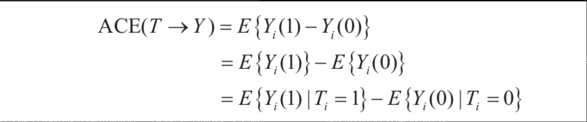

&#x20;    引入一个中间假设变量，实验人群不做实验的潜在结果为。

&#x20;    平均因果作用转化如下。

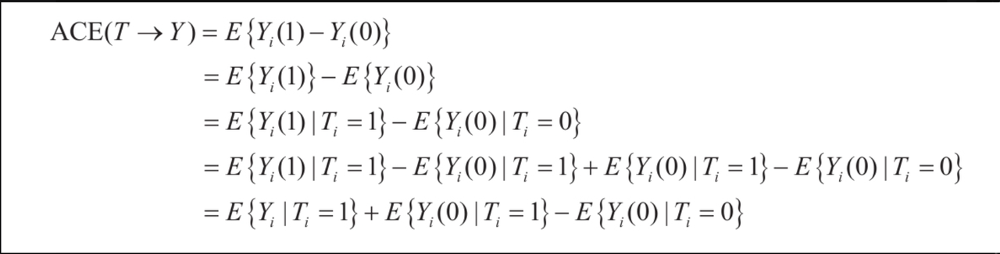

&#x20;    其中E{Yi|Ti=1}是实验对于参与实验的人的平均因果效应，δ=E{Yi(0)|Ti=1}-E{Yi(0)|Ti=0}是随机分组带来的选择偏差。如果AB实验随机分流足够均匀，实验组（T=1的用户）和对照组（T=0的用户）是同质的，这时的选择偏差应该无限接近0。下面用更简单直观的方式来描述一下这个过程。

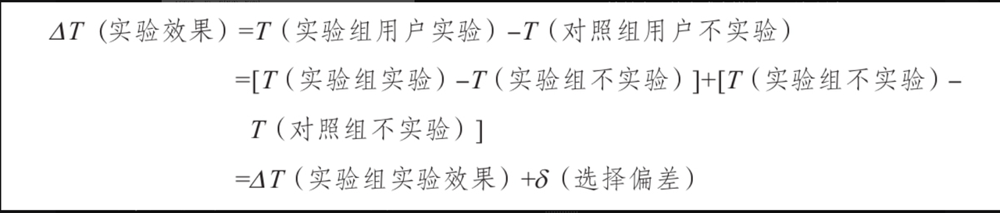

&#x20;    上面的公式表明，将实际影响（接受实验的实验人群会发生什么）与反事实（如果他们没有接受实验会发生什么）进行比较是建立因果关系的关键。在随机分配单位给变量的情况下，因为第一项是观察到的实验组用户接受实验与不接受实验之间的差异，第二项选择偏差的期望值为零，所以可以使用AB对照实验来评估因果关系。

&#x20;     我们通过上面的数学推演理解了为什么AB实验能量化变化并验证其中的因果关系。正是因为AB实验让我们获得了产品迭代与指标之间的因果以及量化关系，所以说AB实验是数据驱动产品迭代与优化的基石。

### 1.4 AB实验的2个关键特性

&#x20;    AB实验得以在工程中广泛应用和推广，与AB实验的2个关键特性密不可分：一个特性是先验性，通过小流量预先获得效果评估；另一个特性是并行性，多个实验可并行开展。这两个特性也使得AB实验具有更高的应用价值和更广泛的应用场景。

#### 1.4.1 先验性：小流量预先获得效果评估

&#x20;    对于产品，特别是互联网产品迭代需要敏捷开发，快速试错。如果采用全员试错的方式，新版本、新功能全量发布后，发现重大漏洞或者用户体验不好，然后回滚，不仅对于用户体验的伤害比较大，而且很多时候甚至无法收集到有效的用户反馈信息。产品在开发者不知情的情况下就被用户放弃了，从而导致产品失败。这些传统的做法不仅不能满足敏捷迭代的需求，而且需要投入很高的试错成本。

&#x20;    AB实验能很好地解决上述问题，采用统计学中抽样统计的思路，通过观测抽样的小样本行为来推断总体样本行为。AB实验的先验性主要是指通过小流量的实验方式预先获得实验结果，而不需要等到全量发布。同样是用数据统计与分析新功能、新版本的效果，以往的方式是先将版本发布，再通过数据验证效果（后验）。AB实验则是通过科学的实验设计、流量分割与小流量采用的方式来预先获得实验结论。由此可见，AB实验是一种“先验”的实验体系，属于预测型结论，与“后验”的验证性结论相比有很大的优势。

#### 1.4.2 并行性：同一个实验对象可以有多个实验并行开展

&#x20;    AB实验对实验用户进行随机正交分层，一个用户可以同时进行多个不同的实验。对于不同类型的实验，可以分别在不同的实验层中进行。这样做可以节省实验流量和时间，特别是在用户量比较小的情况下，能够极大提升实验数量，从而提升产品迭代效率。并行性涉及的核心原理是正交分层机制，会在第5章详细讨论。

### 1.5 AB实验行业应用

&#x20;    2000年，Google首次将传统AB实验引入到互联网产品改进评估中，用于测试搜索结果页展示多少搜索结果更合适。虽然这次AB实验因为搜索结果加载速度的问题失败了，但是这次AB实验是一个里程碑，标志着在线AB实验的诞生。从那以后，AB实验被广泛应用于互联网公司的优化迭代。据统计，Airbnb（市值1000亿美元）每周有超过1000个实验，Facebook（市值10000亿美元）每天在线的实验超过10000个。一个公司在线AB实验的数量也在一定程度上反映了这个公司的规模、数据驱动文化的成熟度。

#### 1.5.1 AB实验应用场景

&#x20;    AB实验被运用到了产品优化的方方面面。在众多应用场景中，有三类非常典型。

##### 1.推荐类场景

信息流推荐、电商购物推荐、音乐推荐、视频推荐等都属于推荐类场景。推荐系统中的推荐算法，特别是现在广泛应用的深度学习等模型，本身就具有很强的黑盒属性。优化一个特征、一个模型、一路算法、一个参数之后，用户体验如何，是不是向着期望的目标方向移动，都是无法简单通过经验来判断的，通过AB实验才能知道。如果不使用AB实验进行评估，很难有其他手段验证新推荐策略的效果。这个场景中，AB实验和推荐系统是相生相伴的，有推荐系统就必须有AB实验。

##### 2.运营类场景

&#x20;    运营活动包括场景的拉新促活（吸引新用户，活跃老用户）​，各种运营活动中投放的红包、优惠券、短信等。一般这类活动都能带来立竿见影的用户增长或者成交量增长。更为重要的是，从长期来评估，这些投入是否带来了总的正向ROI。在实际中，很多活动带来的增量是短暂的，用户的长期留存效果往往低于自然流量的长期留存。如果没有AB实验的量化，很难说清楚这些活动真实的长期收益。

##### 3.UI设计和交互类场景

&#x20;    在UI设计和交互类场景中，由于按钮、颜色、款式、字体等有太多的选择，而每个人的偏好不同，以至于在产品内部很难达成一致，更不用说面对不同的使用人群。究竟哪个方案是最优的，也只有通过实验的方式进行量化才最具说服力。在没有使用AB实验之前，UI设计师经常面对各种挑战，有人说字体太大，有人说字体太小，往往谁都很难拿出有说服力的证据。而且有的时候由于变化过于细微，肉眼都难以分辨，比如Bing的标题色彩的UI实验。采用AB实验以后，大家就不会因为自己的审美而争执不下了，简单地把AB实验的数据结果呈现出来就可以做出决策。

&#x20;    这三类场景非常有代表性，分别代表了算法优化黑盒属性、长短期综合收益ROI、感性决策众口难调这3个在产品优化过程中的典型问题。当然，AB实验适用的场景并不局限在这三类，满足实验基本条件的产品问题基本都可以采用AB实验来解决。表1-1中总结了常见的实验类型，以及实施AB实验的建议程度。注意，这只是常规情况下，结合实际应用中考虑各种实际情况的一个相对建议程度，仅供参考。

表1-1　不同实验类型的AB实验建议程度

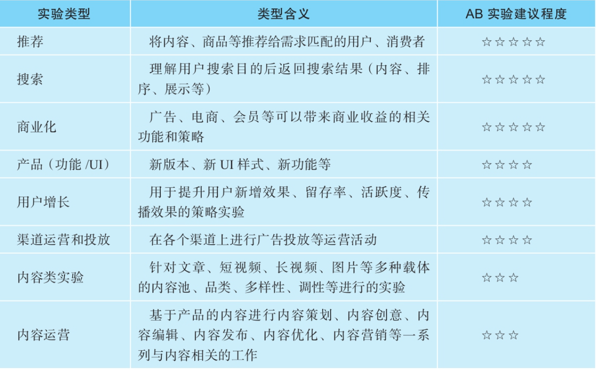

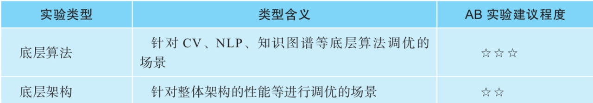

&#x20;    从产品研发流程来看，基于AB实验的研发流程相比传统产品的研发流程，其优势是全方位的，如表1-2所示。

表1-2　基于AB实验的产品研发流程的优势

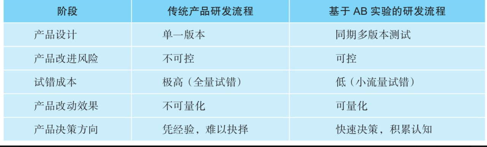

#### 1.5.2 AB实验应用案例

&#x20;    本节通过几个案例来介绍AB实验在实际应用中发挥的作用和价值。

##### 1.Bing案例

&#x20;    2012年，Bing的一个员工建议改进广告显示方式，将标题下的第一行文字合并到标题行，形成一个长标题行。由于这个方案开始并不被看好，因此优先级较低，被搁置了6个月，之后因其代码难度较低而被实施，并投放给真实用户进行评估：随机向一部分用户展示新的标题布局，将用户与网站的互动记录下来，包括广告点击和由此产生的收入。

&#x20;    实验开始几小时后，一个“收入过高”的警报被触发，表示新标题布局的广告产生了太多的收益。这样“好得难以置信”的警报非常有用，因为这通常表明出现严重的漏洞，比如收入情况被记录了两次，或网页只有一个广告显示，而其余部分被破坏了。然而，对于这个实验来说，其增加的收入是有效的，Bing的广告收入增长了惊人的12%。在没有损害关键用户体验指标的情况下，当时仅在美国就转化为每年超过1亿美元的收入增长。这个实验因为效果太好而令人难以置信，所以在很长一段时间里被重复做了多次，结果都是大幅的收入提升。

&#x20;    这个实验的价值不仅在于获得了实验本身的成功，同时展示了在线AB实验的几个关键问题。

●直觉和经验通常难以评估一个创意的价值。一个可以创造超过1亿美元的简单改变，却被推迟了半年。

●微小改变也可能带来巨大影响。对于一个程序员来说，几天的工作就能带来1亿美元的ROI是极其罕见的。

●极少有能够带来巨大效果的实验。Bing每年有超过一万个实验，像这样通过简单改变带来巨额收益的情况，近年来仅此一次。

●友好、强大、易得的实验工具是低成本实验的基础。Bing的工程师可以访问微软的实验系统EXP，这使得科学评估变得很容易。

●整体评估标准十分清晰。在这个实验中，营收就是OEC的关键点。只关注营收是不够的，有可能导致网站上广告横飞，这无疑会影响用户体验。Bing使用OEC来衡量收益和用户体验指标，包括每个用户的会话次数（用户流失还是用户黏性增加）和其他几个组成部分。关键在于，营收大幅增长的同时，用户体验指标没有明显下降。

&#x20;    Bing的实验相关团队由数百人组成，负责每年将单个OEC指标提高2%。这2%是每年做的所有实验效果的总和。大多数改进都是逐个实验进行的，而且大多数改进程度轻微，甚至有些迭代的版本的效果是负的。

&#x20;    对于产品来说，重要的不仅是业务指标，还有产品性能。2012年，Bing的一名工程师改变了JavaScript的生成方式，大大缩短了发送给客户端的HTML代码的长度，从而提高了性能，AB实验也显示了惊人的指标改进效果。Bing做了一个跟踪实验以评估对服务器性能的影响，结果表明，性能改进还显著改善了关键用户指标，比如服务器加载服务的时间减少了10ms，此项性能改进带来的收入提升的部分就足以承担工程师全年的成本。

&#x20;   2015年，随着Bing搜索性能的提高，当服务器在不到一秒的时间内返回第95个百分位数的结果（即95%的查询结果）时，有人质疑性能提高是否还有价值。Bing的团队进行了后续研究，关键用户指标仍有显著提高。虽然对收益的相对影响有所降低，但Bing的收益在这段时间里得到大幅提升，每1ms的性能提升都比过去更有价值，每4ms的改进所带来的收入可以支付一位工程师一年的工资。多个公司都进行了性能实验，结果都表明性能提升非常关键。在亚马逊，100ms的减速实验使销售额下降了1%。Bing和Google的发言人在2009年联合发表的一篇演讲揭示了性能对关键指标的显著影响，这些关键指标包括不同的查询、收益、点击、满意度和点击时间。

&#x20;    减少恶意插件也能提升产品体验。虽然广告是一项利润丰厚的业务，但如果用户安装的免费软件包含恶意插件，这些恶意插件就会污染网页上的广告。使用恶意插件的用户不仅页面上被添加了多个广告，而且通常是低质量、不相关的广告，产生了糟糕的用户体验。微软对380万潜在受影响的用户进行了AB实验，结果显示当实验组通过控制权限减少了恶意插件的使用后，实验组用户的所有关键指标都得到了改善，包括每个用户的访问量。此外，用户搜索能更成功、更快捷地点击有用的链接，年收入也提高了数百万美元。

##### 2.Google案例

&#x20;   Google在2011年启动了改进广告排名机制的实验。开发工程师测试了改进后的模型，他们进行了数百项AB实验，并且进行了多次迭代。有些实验横跨所有市场，有些用于特定市场，以便更深入地了解对广告客户的影响。功能的巨大改动，加上AB实验的帮助，最终使得Google巧妙地将多个功能进行组合，提升了广告用户的用户体验。Google以更低的单个广告费用获得了更好的广告效果。

&#x20;  2016年，Google对搜索页面的链接颜色进行了测试。当时许多用户反映，当自己输入词汇或短语时，大部分用户会看到10条链接，链接名为蓝色，网址为绿色，有一部分用户看到的链接名是黑色。这已经不是Google第一次对链接颜色做AB实验了，重视搜索结果页面颜色的Google经常面向数亿网络用户实时测试多种颜色的效果。在更早的时候，Google就开始测试不同深浅的蓝色，整整测试了41种蓝色，最终筛选出了指标表现最好的，而选用这种蓝色要比其他蓝色每年多为Google带来两亿美元的收入。

##### 3.奥巴马竞选案例

&#x20;    2012年，奥巴马数字团队对其竞选筹款策略进行了全方位的优化，从网页到电子邮件，无一例外。在20个月的时间里，团队进行了约500个实验，最终将捐赠转换率增加49%、注册转换率增加161%。他们曾策划过一次推广活动，为支持者赢得与总统共进晚餐的机会。在在线表单的设计方案上，研究小组实验了一种流线型文本格式的表单和一种带有总统图像的表单。AB实验结果显示，后者让参加抽奖的捐款人数增加了6.9%。

##### 4.亚马逊案例

&#x20;    2004年，亚马逊在主页上发布了一个信用卡优惠活动。这项业务虽然单次点击收入很高，但点击率很低。该团队进行了一个AB实验，将这项优惠报价移动到用户添加商品后看到的购物车页面，页面上显示了简单的数学计算，突出显示用户如果使用优惠将节省多少费用。因为向购物车添加商品的用户有明确的购买意图，所以该报价显示在了正确的时间点。AB实验表明，这个简单的改变使亚马逊的年利润增加了数千万美元。亚马逊的Greg Linden创造了一个基于用户购物车中的商品展示个性化推荐的模型。当用户添加某个商品时，系统会出现类似商品的推荐。Linden觉得测试模型看起来很有潜力，而一位营销高级副总裁坚决反对，声称它会分散人们的注意力，让他们不愿意下单支付。Linden因此被禁止继续研究这个问题。尽管如此，他还是进行了一项AB实验，结果是这一功能以巨大的优势胜出，最终购物车推荐功能上线，目前国内的主流电商平台都复用了这一功能。

##### 5.抖音案例

&#x20;    抖音是字节跳动公司旗下一款创意短视频社交软件。字节跳动非常重视AB实验，其实验平台每天新增约1500个实验，服务400多项业务，目前累计做了70万次实验。从产品命名到交互设计，从改变字体、弹窗效果、界面大小，到推荐算法、广告优化、用户增长，抖音把AB实验应用到了每一个业务和每一项决策中。

&#x20;    外界很关心“抖音”名字的由来，这其实就是AB实验的结果。当年字节跳动做短视频产品时，有很多候选名字，字节跳动将产品原型起成不同的名字、使用不同的Logo，在应用商店做AB实验，在预算、位置等条件保持一致的情况下，测算用户对产品名字的关注度、下载转化率等指标表现。AB实验帮助字节得到了名字的排名，当时“抖音”排到了第一。后来结合其更符合长期认知、更能体现Logo形态的特点，​“抖音”之名就此确定。充分地进行AB实验，是一个能够在很大程度上补充信息的过程，能够消除很多偏见，反映客观的事实。进入抖音App时，可以看到3个视频推荐流，一个是基于位置的“同城”标签栏，一个是基于关注关系的“关注”标签栏，另一个是基于兴趣推荐的“推荐”标签栏。把哪个标签栏作为用户进入时的默认内容，用户体验更好，产品的核心指标表现更好呢？通过AB实验的方式，对照组用户默认进入“关注”、实验组1的用户默认进入“同城”、实验组2的用户默认进入“推荐”​，最后对比各组的实验数据，选出用户在哪个组的指标表现更好。

&#x20;    通过实验结果发现，有一些用户喜欢默认关注，有一些用户喜欢默认推荐，有一些用户喜欢同城推荐，如何才能达到最优效果呢？这个问题也可以通过AB实验的方式进行验证。实验可以这样设计，首先根据用户的特征以及历史偏好，分别计算出进入“关注”和“推荐”这两个标签栏的权重值，比如有的用户的关注量比较大，关注的内容也比较丰富，历史数据表明他们也更喜欢观看自己关注过的内容，这个情况下，​“关注”标签栏就会获得较高的权重，成为默认的标签栏。如果用户关注的对象比较少，更愿意通过平台推荐发现一些新鲜的事物，这种情况下，​“推荐”标签栏就会获得较高的权重。实验可以设计为如下几组。

●实验组1：默认进入“推荐”标签栏。

●实验组2：默认进入“同城”标签栏。

●实验组3：根据用户各个标签栏的权重决定进入策略。

●对照组：默认进入“关注”标签栏。

##### 6.淘宝案例

&#x20;    电商网站淘宝网每天也在进行着各种各样的实验，一般情况下，我们都感知不到正在被实验。就像链接https://detail.tmall.com/item.htm?spm=a230r.1.14.14.498e4a519c23Vi\&id=610851809895\&ad\_id=\&am\_id=\&cm\_id=140105335569ed55e27b\&pm\_id=\&abbucket=2一样，字段abbucket=1是分配给实验组用户的，abbucket=2是分配给对照组的。

&#x20;    移动互联网时代，每天我们都使用着各种各样的网络软件产品，进入产品各种各样的实验中。其实每一位产品用户每天都在帮所使用的产品做着AB实验，只不过用户在一项实验中只会获得一个特征，无法同时获得其对照的特征，而且用户被分到什么组是完全随机的，用户对实验是无感知的。这种随机性、无感知性也在一定程度上保证了AB实验的客观性和可信度。

#

## 二、AB实验的关键问题

&#x20;    在第二部分，我们将深入讨论AB实验的关键问题和统计学知识，只有掌握这些理论基础才能更好地进行后续实践。在理论基础之上会介绍实验参与单元和随机分流，这两个部分与业务紧密相连，不同的业务和场景有不同的选型和方案，关系到实验效果的评估的可靠性和准确性。SRM问题和AA实验作为保证AB实验可靠性的手段，也将重点介绍。实验评估分析中实验灵敏度和实验的长期影响问题是两个较难解决的常见问题，在本部分也会进行讨论。

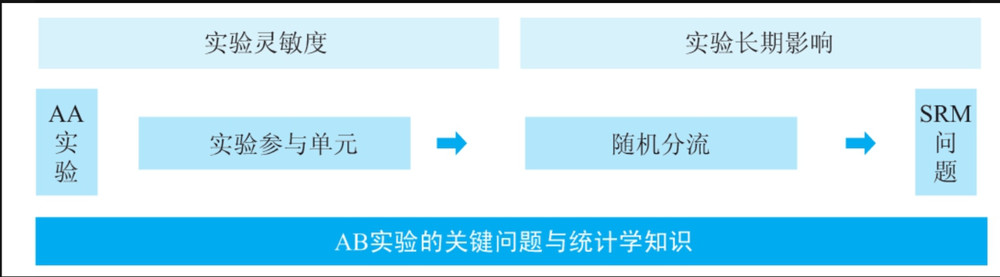

AB实验关键问题矩阵

##

&#x20;    在日益浓厚的数据文化中，特别是在互联网领域，大家逐渐养成了“用数据说话”​“一切都用实验决策”的思维方式。在过去几年里，我们看到AB实验大量增长，不仅实验组合更加多样化，每个实验观测的指标数量也大幅增加，有些实验的评估指标甚至增长到了成百上千个。AB实验的基本原理看似很简单，但在缺乏经验的实验者手中、简陋的AB实验平台上还是非常容易出错的。在没有很好的实验指导、良好的平台支撑的情况下，大部分人都无法设计有效的AB实验，不能正确地消化这成百上千个实验指标的结果。根据一项调研，实际上可能有三分之一的AB实验都存在问题。对AB实验的错误解读会导致非最优决策以及对业务增长的不准确预期，从而损害公司的长期利益。

&#x20;   导致AB实验结果被误判的原因有很多，从有偏差的实验设计、有偏差的用户选择到有偏差的统计分析，以及试图将AB实验结果推广到实验总体、实验时间框架之外等。本章主要基于AB实验的基本过程以及AB实验所需的基本技术要素，总结在进行AB实验的过程中，各个环节上可能存在的问题。

### &#x20;  2.1 实验参与对象的3个问题

&#x20;  关于实验参与对象主要有3个问题。

●实验参与对象是否被合理随机化。在实际工程中涉及随机函数选择、正交分层框架设计等问题，其本质是考虑随机过程是否真的随机进行了，是否能够消除不同实验组之间用户选择的偏差。即使用性能最好的哈希函数进行分组，也存在出现碰撞等问题的可能。另外，在随机化的过程中，有少量的极值、异常对象会对随机后数据指标产生很大的影响。对于这些问题的检测和解决都是需要考虑的。

●实验参与对象是否相互独立。AB实验结果有效需要满足一个基本假设——个体处理稳定性假设（Stable Unit Treatment Value AssumptionSUTVA）。这个假设是指任何实验单元的潜在结果不会随分配给其他单元的处理而变化，每个组中参与对象的行为不受分配给其他组的参与对象的影响。在大多数实际应用中，这是一个合理的假设。然而，在一些情况下，这个假设是不成立的。一旦这个假设不成立，得出的AB实验结果就是无效的。对于为什么需要这个假设；什么情况下这个假设不成立；如果假设不成立，该如何处理等SUTVA相关的问题，我们会在第4章详细讨论。

●实验参与对象的数量是否足够进行实验评估也是需要考虑的问题。如果实验参与对象的样本量不足，即使得到实验结果，也无法进行有效的实验评估。实验参与对象所需要的样本量与实验需要检测的最小业务变化幅度、显著性水平、业务指标的选择等有着紧密的关系，这些问题我们将在第3、4、8章详细进行讲解。

### 2.2 实验随机分流的3个问题

&#x20;     在对实验参与对象随机分流的环节中有如下3个关键问题。

●最小分流单元采用什么颗粒度是最佳的选择，是元素级别、页面级别、会话级别还是用户级别？选择不同颗粒度的最小分流单元，在评估实验效果的时候有什么不同，需要注意哪些问题？这些问题会在第4章详细讨论。

●在分流的时候，如何在不增加实验评估复杂度的情况下实现流量复用，基于产品和各个系统的综合考虑，采用什么样的流量框架是最合适的？采用什么样的随机函数可以提升随机分流的性能？这些问题会在第5章详细讨论。

●对于同一个实验中的各组实验对象，它们是同质的吗？存在SRM问题吗？如果存在这些问题，观察到的实验组和对照组之间的差异不是实验导致的，而是引入了其他系统性偏差，这就有可能导致有偏差的结论，甚至反向的结论。获得有偏差的结果是一场噩梦，它使整个AB实验徒劳无功。如果没有正确的诊断算法，找出这些偏差的根本原因并修复它，往往比运行AB实验本身需要更长的时间。根据一项调查，仅这种SRM问题导致AB实验无效的比例大约占所有无效实验的10%。关于随机分流，以及用户SRM等问题，会在第6章详细讨论。

### 2.3 实验指标的2个问题

&#x20;    实验指标体系包含了两个关键问题。

●如何建立一个完善的产品指标体系，包括指标的设计、评估、进化和计算等一系列相关问题。

●如何选择合适的实验评估指标，包括从产品视角、工程视角出发，综合考虑实验指标的指向性和敏感性，以及多个目标指标如何合并为综合评价标准（Overall Evaluation Criterion，OEC）等问题。指标体系很重要且相对独立，我们将在第三部分重点讨论相关的话题。

### 2.4 实验分析和评估的3个问题

&#x20;     在实验分析和评估环节存在的问题更多，也更加难以解决，这部分的问题往往更加个性化和多样化。前面2.1～2.3节谈到的问题，比如实验参与单元数量、随机分流、指标体系等问题可以通过建设实验平台等工具进行规避、监控和解决。实验分析和评估是针对单个实验的，每个实验从目标到指标都有自己的不同之处，不仅需要进行系统化的处理和规范，也需要具体问题具体分析。分析过程中需要对实验设计、产品特性、数据指标以及统计分析的理解相对透彻，才能更好地深入实验评估。分析和评估相关的问题总结归纳起来主要有以下3个。

#### 2.4.1 对于统计结果理解是否正确

●如何解读实验结果中P值、置信度、置信区间等的关系？

●实验得出的相对提升，究竟是一个自然的波动还是真实的实验提升？

●实验参与单元的数量是否足以检出想要的实验效果？

●实验统计的power值是否充足？

●实验数据统计精度是否可以检测出业务的提升？

#### 2.4.2 实验分析的过程是否正确

●在实验过程中有没有进行AA实验？

●在实验过程中有没有进行SRM测试？

●在实验过程中有没有偷窥实验？

●实验分析过程中，是否存在幸存者偏差、辛普森悖论等问题？

●局部实验的结果如何推导为全局提升量，转化过程是否正确？

#### 2.4.3 实验分析结果的外推是否正确

&#x20;    如果前面实验中的每一个环节都没有问题，实验组的效果是正向的，那么实验决策决定将这个实验全量（也称发布）到所有用户。这个环节一般来说没有太大难度，在一些特定情况下会有问题，即实验结果被推广到实验的设置之外，不再有效。

●群体外推：将结果推广到实验群体之外，在一个子群体上进行实验，并假设对整个群体的影响是相同的。

●时间外推：同样危险的是在实验时间范围之外推广，因为不能确保长期影响和短期影响是相同的。

&#x20;    通常受AB实验机会成本的限制，一般实验运行不超过两周，而进行全量实验意味着这个策略会长期作用在线上，一两周的效果是否等于1个月甚至6个月后的效果是不确定的。当进行AB实验时，除了选择正向的策略外，也需要衡量这个策略长期影响的大小。因为实验相关人员希望得到的结果是“如果我们使用某个策略，指标X将在下个季度增长∆”。这种说法隐含地假定在一个两周长的实验中，测量的影响会持续一个季度，当实验效果是时间依赖时，这显然是不正确的。更为复杂的是，并不是所有的实验指标都会在实验中显示和时间的相关性。&#x20;

&#x20;    如果没有自动化的检测手段，即使是最有经验的实验者，也很难筛选出数千个指标，寻找与时间相关的实验效果。对于有哪些常见的时间依赖的实验效果，如何发现它们，以及如何评估长期实验效果，我们将在第9章详细讨论。

&#x20;    上面介绍的实验分析问题在很多AB实验中都没有被很好地回答，它们在AB实验中特别容易出现，并影响实验结果，最终得到的是一些错误的解读和结论。统计一个数字容易，得到可信可靠的实验结论是不容易的。我们可以很容易地统计出B组策略比A组策略的点击率高2.7%，B组策略上线之后真的可以将点击率提高2.7%吗？如果没有实验系统以及科学的实验方法，那么很难保证最终效果。

&#x20;    参与AB实验的人大多遇到过一个令人头疼的问题：实验的结果是正向的，全量上线后大盘数据却没有涨。这是一个复杂的系统问题，可能有多种多样的原因，除了我们上面谈到的那些影响AB实验的问题外，还有一个原因就是统计本身的概率问题。因为我们采用的是统计中的假设检验来判断实验结果，本身就存在犯错误的概率。比如我们采用95%的置信度，那么犯第一类错误的概率是5%（AB实验中，A组没有效果，而实验系统判定A组为有效果的错误是第一类错误）​，犯第二类错误的概率最高有95%。

&#x20;    实验系统中，用户设置95%的置信度，此时需要承担5%的第一类错误风险。在一切都正常的情况下，A组实验有效果，全量上线之后没有效果的风险有5%。这个情况无法避免，大约20次实验中就会出现一次。换句话说，如果20、30次实验中出现了1～2个实验，虽然实验效果正向，但是全量后没有效果，其实这是一个正常现象，在可以接受的范围内。如果做了不到10个实验，就出现了2～3个以上实验效果正向，全量后没有效果的情况，那么实验方法和系统大概率是有问题的，而且问题大概率来自本章讨论的这些问题。在第3～9章我们会针对这些问题产生的原因、如何识别、如何避免和处理展开详细讨论。

## 三、AB实验的统计学知识

&#x20;   因为整个AB实验的过程涉及大量统计学知识，所以我们在第3章专门讲解统计学相关的知识。AB实验是先从全体用户中随机抽取一小部分用户作为样本进行实验，然后基于样本用户的实验效果推断全体用户表现。如何保证推断过程的科学性以及对结果进行解读和判断，涉及统计学相关理论的支持。虽然市面上有很多关于概率论和统计学的图书，但是书本上的知识和AB实验的应用场景还是有一定差异。在没有实战经验的情况下将理论和实际进行对应和结合有一定难度。很多场景不满足理论假设，同时实践也需要考虑业务场景、产品特性、工程实现、计算性能、效率等问题。

&#x20;  本章采用贴近生活和工作的实际案例，帮助读者更好地理解概念背后所代表的含义，以便在AB实验中灵活应用这些概念。虽然已经尽量用简单易懂的方式来叙述，但这一章相对来说，还是有些抽象难懂。不过理解这些底层原理和概念非常有必要，这对于正确理解AB实验以及正确开展实验和评估实验都很有帮助。图3-1所示是AB实验相关的统计学知识图谱，读者可以根据这个图快抓住学习的路径和重点。

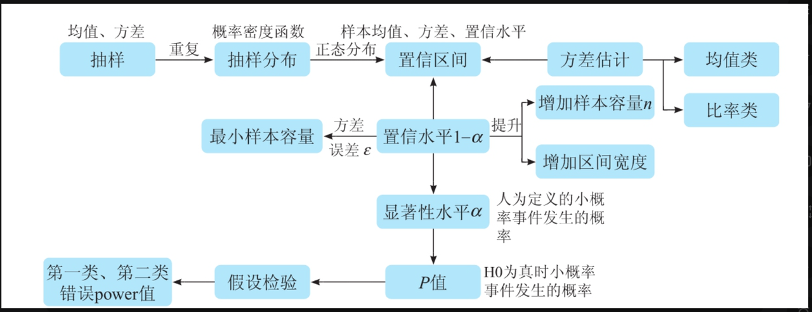

图3-1　AB实验统计学相关知识

### 3.1    随机抽样和抽样分布

&#x20;     抽样是从总体中抽取一部分个体组成新集合的过程。简单随机抽样是通过逐个抽取的方法抽取一个新样本，且每次抽取时个体被抽到的概率相等。简单随机抽样有两个要求：

1）个体来自同一个总体；

2）个体的抽取是独立的，被抽到的概率相同。

&#x20;    抽样的意义在于通过小部分抽样用户的表现去估计全部用户的表现。因为无论是工业上实体物品检查，还是虚拟互联网里的用户实验，一般都不可能对所有的物品进行检查，或者对所有的用户进行实验，这不仅成本很高，而且通常是不可行的，所以我们希望只用一小部分用户的表现，就能推论出所有用户的表现。这里所说的表现，主要是通过量化后的指标来衡量，比如用户数、用户使用时长、用户留存、用户点击率等。用来估计这些指标的两个重要的统计量（或者说统计参数）是均值和标准差。

&#x20;    举个例子，某个App应用中，全体日活跃用户有500万个，用户人均使用时长指标的总体均值为μ，总体标准差为σ。从这500万个用户中随机抽取100个，这100个用户就构成了一个简单随机样本。这100个用户的使用时长的均值为样本均值，样本标准差为s。样本均值又称为总体均值μ的点估计量，样本标准差s称为总体标准差σ的点估计量。s的计算公式如下。

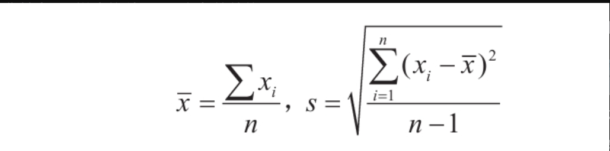

具体数据如表3-1所示，总体均值为20min，样本均值为20.5min，总体标准差为1.6min，样本标准差为1.5min。

表3-1　100人组成的简单随机样本的点估计值

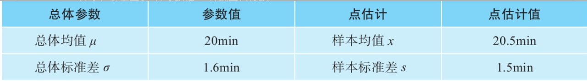

&#x20;    不难理解，由于样本只是抽取了总体的一小部分用户，因此样本均值和总体均值肯定有所差异，可以用如下公式来表达。

&#x20;    公式中的ε就是两者之间的差异，那么这个差异到底有多大，会在什么范围内呢？这是我们在估计的时候需要掌握的。在实际中，很多时候不知道总体的真实均值μ，需要通过样本均值以及偏差ε去估计。由于样本均值可以通过样本直接计算，因此重点是需要找到偏差ε。

&#x20;    如何计算ε呢？直观来看，抽样的用户数量越大，样本均值和总体均值的差异就越小，如果逼近全体用户，样本均值就会无限接近总体均值μ。当无法得到全部用户数据时，是否可以采用反复抽取100个用户的方法，得到不同的随机样本呢？假设重复这个随机抽样过程1000次，得到1000组简单随机样本，每组随机样本都包含了100个用户。对这1000组随机样本分别求均值，就得到了1000个样本均值$$\frac{}{x_{1}},\frac{}{x_{2}},\frac{}{x_{3}}...,\frac{}{x_{1000}}$$

，它们就形成了样本均值$$\frac{}{x}$$的一个抽样分布。通过这个分布，我们就能将样本均值$$\frac{}{x}$$与总体均值μ的接近程度做一个概率度量。样本均值$$\frac{}{x}$$实际上就是一个随机变量，它也有均值、标准差和概率分布。通过数学推导，可以得出如下公式。

上面的公式表明样本均值$$\frac{}{x}$$的数学期望等于总体均值，标准差等于总体标准差除以$$\sqrt{n}$$（注：这个公式适用于总体有限）。有了这两个参数，确定$$\frac{}{x}$$的概率分布就可以得出$$\frac{}{x}$$的抽样分布特征。样本的概率分布有两种情况：

&#x20;    1）总体服从正态分布；2）总体不服从正态分布。

&#x20;    当总体服从正态分布时，任何样本容量的样本均值的抽样分布都是正态分布。当总体不服从正态分布时，通过中心极限定理（Central Limit Theorem，CLT）可以确定$$\frac{}{x}$$的抽样分布。

&#x20;    中心极限定理是从总体中抽取容量为n的简单随机抽样，如果n足够大，则样本均值$$\frac{}{x}$$的采样分布将近似于正态分布，而与该变量在总体中的分布无关。统计研究人员分析各种不同总体（比如常见的均匀分布、兔耳分布、指数分布等）在不同样本容量下的抽样分布，发现当样本容量大于30时，$$\frac{}{x}$$的抽样分布可用正态分布近似；当总体严重偏态或者出现异常点，样本容量达到50时，也近似正态分布。当总体为离散型时，需要的样本容量一般依赖于总体的比例。以常见的均匀分布为例（图3-2中正态分布为1～5的均匀分布）​，在不同的样本容量下，其抽样分布形状如图3-2所示，当n>5时，其分布逐渐向正态分布靠近；当n=15左右时，已经可近似视为正态分布。

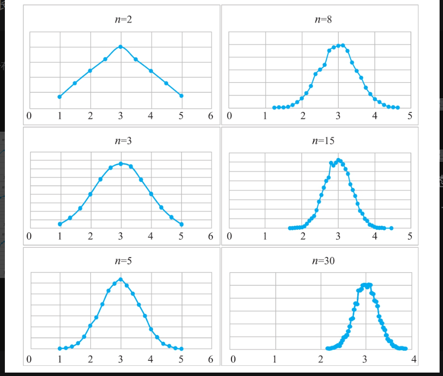

图3-2　均匀分布总体下不同容量的抽样分布示意图

&#x20;    关于抽样分布的形态，我们有如下总结。

●如果总体分布为正态分布，样本容量n为任意数，u的抽样分布都是正态分布。

●如果总体分布为非正态分布，样本容量30\<n<50，u的抽样分布可用正态分布近似。       中心极限定理非常重要，它意味着即使原始数据分布不是正态的，从中抽取样本后，样本均值的分布也是正态的。这样我们就可以用均值的正态分布来估计置信区间，进而可以进行参数检验（如t检验等）​，来评估两个样本均值之间是否存在差异。由于案例中采用的抽样样本容量为100，远大于50，因此可以视为近似服从正态分布，近似画出样本均值$$\frac{}{x}$$的抽样分布，如图3-3所示。

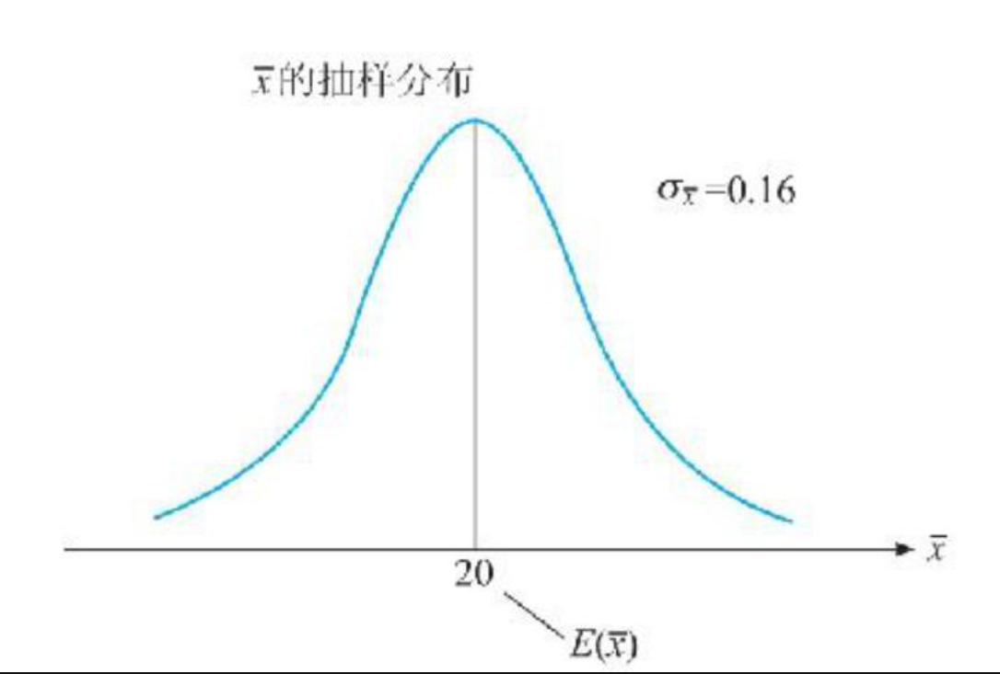

图3-3　100个用户的简单随机样本时长均值的抽样分布

&#x20;    这里需要特别注意两个概念——样本容量和样本量。

●样本容量：每个随机样本里面个体的个数。例子中样本容量是100。

●样本量：随机抽样的次数，即得到的样本数量。例子中样本量是1000。

&#x20;   虽然E($$\frac{}{x}$$)=μ与样本容量无关，但是样本标准差和样本容量有关，样本容量越大，标准差越小。如图3-4所示，从图形上看，样本容量为10万的钟形比样本容量为50000的更集中、更尖，说明样本容量越大，钟形越集中、越尖。从数学上反映为样本均值落在总体均值某一特定范围内的概率也越大。这符合我们的直观认知，样本容量越大时，我们对这个事情的确定性越高。当样本容量为极限，即等于总体样本中个体数N时，钟形就会收缩为一条竖线。基于抽样分布，就能计算出在总体均值μ附近一定距离内的概率。

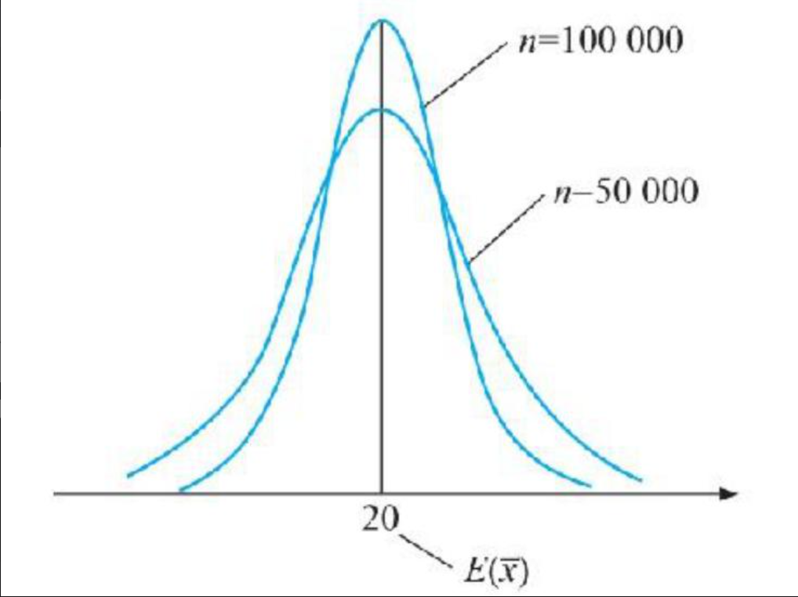

图3-4　不同样本容量的简单随机样本中的抽样分布

&#x20;   假设产品人员认为人均时长指标样本均值在总体均值±0.05min以内，样本均值是总体均值一个可接受的估计值，问题就转换为根据100用户组成的简单随机样本，得到的样本均值在总体均值±0.05min的概率是多少？

&#x20;   如果总体均值已经确定为20min，问题就变成样本均值介于19.95～20.05min的概率。图3-5所示的抽样分布中，阴影部分的面积恰好等于这个概率值。由于抽样分布是正态分布，均值为20min，标准差为0.16min，因此我们就可以通过标准正态分布概率表来查找这个概率（曲线下的面积)。

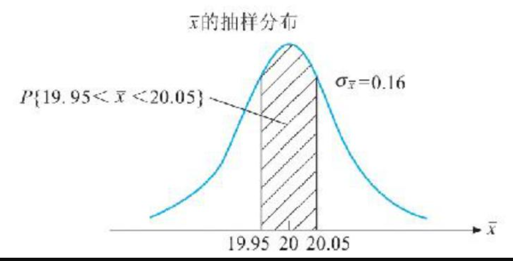

图3-5　样本均值在总体均值附近的概率

&#x20;    首先计算区间右端点20.05对应的Z值，通过查表得到曲线下方该点左侧区域的面积。再计算左侧点19.95的Z值，通过查表得到该点左侧区域的面积。最后两者相减就得到了所求概率。

z(20.05)=$$\frac{20.05-20}{0.16}$$=0.3125，查表得到累积概率为0.6217。

z(19.95)=$$\frac{19.95-20}{0.16}$$=-0.3125，查表得到累积概率为0.3783。

&#x20;     上述计算说明，由100个用户组成的简单随机样本中，以0.2344的可靠性保证样本均值在总体均值附近±0.05min以内，即样本均值与总体均值差异大于±0.05min的概率为1-0.2344=0.7656。也就是说，大概只有23.4%的机会使得样本在认可的范围内。由于这个概率明显偏低，因此需要考虑增加样本容量，使得钟形更加集中，以提升样本在这个范围内的概率。这是因为当n=N（无穷大）时，样本均值$$\frac{}{x}$$在总体均值的概率会接近100%。

### 3.2 区间估计和置信区间

&#x20;    通过构造抽样分布，并且抽样分布符合正态分布，查找标准正态概率表可以知道，任何整体分布随机变量都有95%的值在总体均值附近±1.96个标准差内 ，即有95%的概率可以相信区间\[-1.96]内包含总体均值μ。区间\[-1.96 ]称为95%的置信区间，此区间是在95%的置信水平下建立的。将这区间扩展为如下更具有普遍意义的公式。

式中α是显著性水平，那么置信水平就是1-α，$$z_\frac{a}{2}$$是标准整态概率分布上侧面积为a/2时的Z值。表3-2中展示了常用的置信水平下的Z值。

表3-2常用的置信水平的$$z_\frac{a}{2}$$值

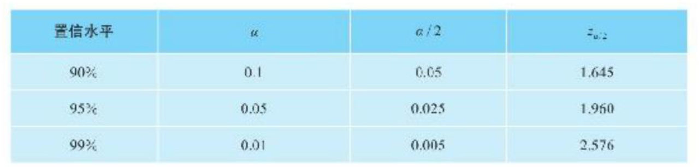

&#x20;      置信区间中的$$z_\frac{\alpha}{2}\frac{\delta}{n}$$称为边际误差，和μ=$$\frac{}{x}$$+ε公式中想要找的ε存在对应关系。

### 3.3 样本容量和边际误差

&#x20;    基于抽样分布中样本容量以及边际误差的分析，想要增加置信水平有两个方法。

●可以通过增加样本容量n来改变分布形状，使钟形更加集中。这方法的好处是可以在不增加边际误差的情况下增加置信水平。

●增大边际误差，即增加置信区间的宽度，可以在不改变样本容量的情况下，增加置信水平。

&#x20;    不同的指标类型，有不同的边际误差计算方法。指标主要分为均值类指标和比率类指标两种。

#### &#x20;    3.3.1 均值类指标

&#x20;    均值类指标的边际误差公式如下。

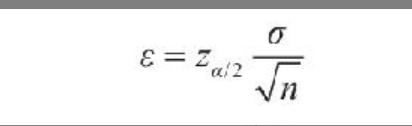

&#x20;    不难看出，边际误差和样本容量成反比，和方差成正比，和显著性水平成正比。在实际运用中，由于显著性水平的要求是相对固定的，一般为95%，变化空间比较小，因此方差一般是由样本数据计算得出，能通过一些手段，比如指标选择、异常处理等（详见第8章）进行改变。指标选择、指标计算方式的流程固化后，改变的空间就比较小了。在这个情况下，当我们需要获得更小的边界误差的时候，就需要更大样本容量n。究竟需要多大的样本容量n才能满足需要的边界误差呢？我们可以根据如下公式推导得出。

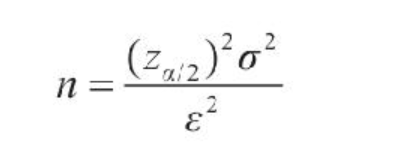

&#x20;     这个公式的含义是，在当前的方差水平下，要以1-α的把握检测出边际误差不大于ε的变化，至少需要n个样本。边际误差究竟是指什么呢？直观来说就是在统计中，业务人员主观上可以接受的误差范围。在用户使用时长的案例中，业务人员可以接受的误差为0.05min内，则需要的样本容量如下。

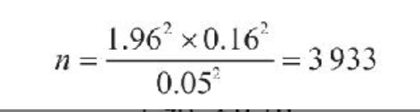

&#x20;    如果需要将边际误差减少到0.1min内，则需要的样本容量如下。

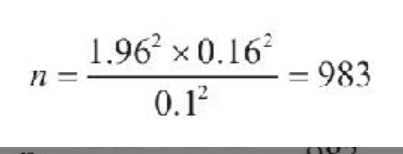

再举一个例子，已知一个公司的员工工资方差是500元，调查人员希望通过抽样调查的方式获得所有员工的平均工资。调查人员认为，估计出来的平均工资有95%的概率（置信水平）在真实平均工资100元（边际误差）左右浮动，是可以接受的。需要抽取多少个员工进行统计作为一个样本，才能满足上述边际误差的要求呢？计算公式如下。

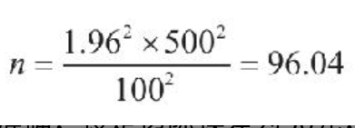

&#x20;    根据公式计算，抽取97名员工进行统计就可以满足要求。如果希望这个估计范围更加准确，设定边际误差为50元，也就是分析人员认为，估计出来的平均工资要在真实值50元上下浮动，那么所需样本量如下。

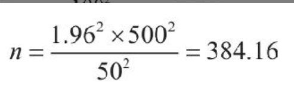

&#x20;    这次需要抽取385名员工进行统计才可以满足要求。可以看出，边际误差减少为原来的$$\frac{1}{2}$$时，所需样本容量变成原来的4倍，是指数级关系。

&#x20;    在应用中，应该根据实际需要来提出边际误差。在满足业务需求的情况下，尽量采用较大的边际误差水平。本例中，边际误差减少一半，所需要的样本容量就变为原来的4倍，实验参与用户增加了，就可能延长实验周期，相应地增加了实验计算量。如果实验有负面影响，那么受到影响的用户增加了，就可能扩大商业收入的损失。因为边际误差是业务需要检出的最低变化幅度，所以又称为最小检出水平。

#### 3.3.2 比率类指标

&#x20;    比率类指标$$\frac{}{p}$$（比如点击率）的方差计算和均值类指标有所不同，不过样本容量和边际误差计算原理类似，不难推导出比率类指标的区间估计公式。

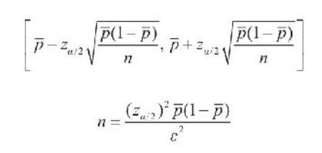

&#x20;    注意，这里由于$$\frac{}{p}$$在抽样前是未知的，因此需要用一个近似值来代替它。近似值的选取方法如下。

●使用经验值或者通过小样本抽取、计算出一个近似$$\frac{}{p}$$值。

●如果上述方法不可行，可以取$$\frac{}{p}$$=0.5，保证n取的是一个最大值，也就是说为任何其他情况，所需要的样本容量都会比$$\frac{}{p}$$=0.5时需要的样本容量小。

&#x20;    举一个例子，一般推荐信息流中，点击率为10%，那么$$\frac{}{p}$$=0.1，按照5%的变化幅度，该指标的边际误差为10%×5%=0.005，可计算出此时需要的实验样本容量如下。

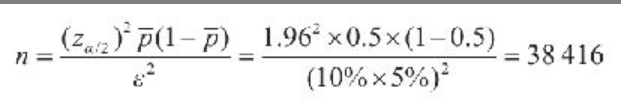

&#x20;   这个数据表示的含义是，用38416个用户估计出整体用户的平均点击率，有95%的概率误差在5%范围内。

### 3.4 假设检验

&#x20;    本节将详细介绍为什么在AB实验中需要采用假设检验的方法来评估实验效果，而不是简单地进行大小比较，以及在实验中，假设检验是如何工作的。

#### 3.4.1 为什么需要假设检验

&#x20;    AB实验和假设检验有什么关系呢？假设有一个AB实验是从总体用户中随机抽样A、B两组进行实验，每组10000个用户。A组用户作用了新策略，B组用户保持原有策略不变，作为对比的基线，即对照组。通过实验，分别收集A、B两组用户所关心的指标，假设实验最关键的指标是人均时长，得到A组的人均时长为20min，方差为4min；B组的人均时长为19.95min，方差为4min。基于这些实验数据，想要知道作用了新策略的A组用户的人均时长$$t_A$$，是不是比B组用户的人均时长$$t_B$$更长。

&#x20;    首先能想到的直观又简单的方法是直接比较$$t_A$$和$$t_B$$的大小。然而不能这样做。如果只是通过简单的均值比较，就判断出A组效果比B组效果好，这和真实的情况是存在偏差的。抽样样本可以构造出一个区间，这个区间以一定的概率（置信度）包含总体均值。实验组A和对照组B现在可以各自构造出一个95%的置信区间，意味着A、B两组样本的总体落在这两个区间的概率是95%。

&#x20;    A组总体人均时长95%的置信区间如下。

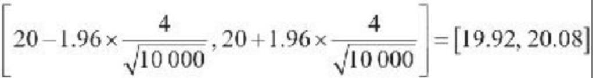

&#x20;    B组总体人均时长95%的置信区间如下。

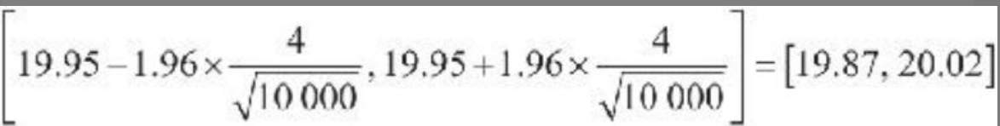

&#x20;    不难发现，A组的置信区间和B组的置信区间是交织在一起的，这说明在95%的置信度下，A组总体均值既可能大于B组，也可能等于B组，还可能小于B组。而且这两个区间重合比例越高，就越难断定$$t_A$$和$$t_B$$的大小。比如两个双胞胎，体重很接近，哥哥可能早上多吃一点就比弟弟重，晚上弟弟多吃一点就比哥哥重，我们很难用一个时刻的体重作为判断他们谁轻谁重的依据。模棱两可的结果大家都很难接受，还是希望尽量得到一个相对明确且可信的结果。这个时候就需要用到假设检验。

#### 3.4.2 如何进行假设检验

&#x20;    假设检验的核心思想是小概率事件在一次实验中几乎不可能发生。假设检验就是利用这个小概率事件的发生进行反证。假设检验的基本过程如下。1）做出一个假设$$H_0$$，以及它的备择假设$$H_1$$（$$H_0$$的对立假设）。2）在$$H_0$$成立的情况下，根据置信度构造出一个小概率事件。根据抽样的结果，观察小概率事件是否发生，如果发生了，那么我们就可以拒绝原假设$$H_0$$，接受$$H_1$$；如果没有发生，这个时候就不能拒绝原假设$$H_0$$。需要特别注意的是，不能拒绝原假设不等于接受原假设，只能说差异还不够显著，不能达到拒绝$$H_0$$的程度。下面我们通过几个生活实例来理解假设检验的过程。

1.抽签游戏

&#x20;    有4个同学，小明、小军、小兰和小美，抽签决定放学后谁留下来扫地。盒子里面有4张纸条，其中3张白纸和1张写着“扫地”的纸。每个人抽签，如果没有抽中，就把纸条放回盒子中。

1）作出原假设$$H_0$$：小明没作弊；其备择假设：小明作弊了。

2）基于小明没有作弊的假设$$H_0$$，构造小概率事件—小明没有抽中的概率如下。

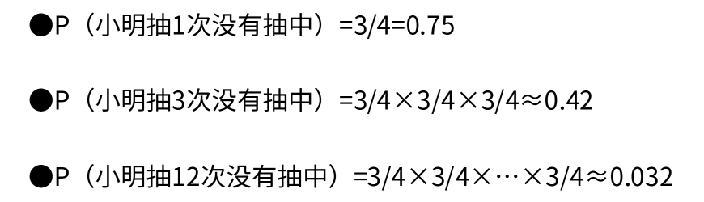

&#x20;    小明抽12次都没有抽中的概率约为3.2%，是一个小概率事件，如果真实发生了，那我们就可以拒绝$$H_0$$，接受$$H_1$$，认为小明作弊了。

&#x20;    这从现实生活中也不难理解，一个人抽了12次都没有抽中，这肯定不符合常理，作弊的可能性更大。当然也不排除小明确实运气太好了，抽了12次都没有抽到，而这样的好运气发生的概率是非常小的。

2.扔骰子游戏

&#x20;    小明和小红玩扔骰子的游戏，每次扔到6点的概率是1/6。

1）作出原假设$$H_0$$：小明没作弊；其备择假设$$H_1$$：小明作弊了。

2）基于小明没有作弊的假设$$H_0$$，构造小概率事件—小明连续3次都扔到6点的概率是1/6×1/6×1/6≈0.46%，这是一个概率很低的事件，也就是一个小概率事件。

&#x20;   现在观察小概率事件是否发生，如果观察到小明扔3次都扔到6点，小概率事件发生了，这就证明原假设$$H_0$$不成立，即小明没有作弊不成立，也就是说小明作弊了。如果只观察了1次，小明扔到6点这个事件在$$H_0$$为真的情况下，发生的概率是1/6≈16.67%，这就不算一个一般意义上的小概率事件。这个时候我们就不能拒绝原假设$$H_0$$，不能说小明作弊了，同时我们也不能说小明没有作弊，只能说判断的条件还不够，实验还需要继续观察，直到小概率事件发生。

&#x20;   上面两个例子在进行假设检验的过程中有一个共同的关键点—关于小概率事件的界定。究竟多小的概率算小概率事件，这主要取决于实际的业务场景，可以理解为能容忍犯第一类错误的概率。第一类错误的含义是虽然$$H_0$$假设成立，但是拒绝了$$H_0$$假设的概率（详见3.4.3节）​，也是通常所说的显著性水平。一定要明确的是，显著性水平是人为定义出来的概率值，和实际实验观察是没有关系的。显著性水平不是一个固定不变的数字，值越大，原假设被拒绝的可能性就越大。显著性水平应根据所研究问题的性质和对结论准确性的需求而定。一般来说，在实际的AB实验中，显著性水平取5%是比较常见的。

&#x20;    以扔骰子为例，假设给定的显著性水平是5%，也就是说，如果观察到一个发生概率小于5%（显著性水平α）的小概率事件发生了，比如小明连续扔3次都是6点这件发生概率为0.46%的小概率事件发生了，我们就拒绝原假设$$H_0$$，接受它的备择假设$$H_1$$，认为小明作弊了。做出这个决策的时候，犯第一类错误的可能性就是0.46%。也就是说，在小明没有作弊的情况下，这件事发生的概率是0.46%，因为我们认为只要犯错误的概率低于5%（显著性水平α）就可以接受，那么就可以采用这个决策。

&#x20;     如果犯错误的概率只接受低于0.1%，这时拒绝$$H_0$$犯错误的概率为0.46%，还不能做出拒绝$$H_0$$的决策。怎么办呢？我们可以让小明继续扔一次骰子，如果观察到此时仍然是6点，那么这件事情发生的概率就是1/6×1/6×1/6×1/6≈0.077%，低于显著性水平0.1%，这个时候就可以在显著性水平为0.1%下做出决策—小明作弊了。

&#x20;    一般来说，常见的显著性水平设置为5%，即如果一个发生概率低于5%的事情发生了，就拒绝原假设$$H_0$$。如果希望降低犯错误的概率，就要把显著性水平设置得更低一些。比如在一些医学实验上，这个阈值可能会调整为1%，甚至0.1%。有一些场景，对于犯第一类错误的容忍度比较高，则会把显著性水平调得更高，比如10%。

&#x20;    下面我们用一个“产品新策略对产品人均时长是否有影响”的AB实验来看一下假设检验的过程。实验基本假定是，实验分为实验组A和对照组B，实验组A在新策略作用下人均时长为$$t_A$$，对照组B在老策略作用下人均时长为$$t_B$$。实验设计者想知道新策略对比老策略，人均时长究竟有没有提升。下面尝试用假设检验的方法来解答。

&#x20;     首先给出原假设$$H_0$$：A组相对B组的用户，人均时长没有显著差异。

&#x20;     原假设$$H_0$$：$$t_A$$=$$t_B$$，等价于Δ$$t$$=$$t_A$$-$$t_B$$=0。

&#x20;     然后给出备择假设$$H_1$$：A组相对B组的用户，人均时长有显著差异。

&#x20;     备择假设$$H_1$$：$$t_A$$≠$$t_B$$，等价于Δ$$t$$=$$t_A$$-$$t_B$$≠0。

&#x20;     注意，这里时长$$t_A$$、$$t_B$$指的是总体用户，而实际得到的是做实验时抽样样本的数据指标 $$\frac{}{t_A}$$、 $$\frac{}{t_B}$$，$$\frac{}{t_A}$$→$$t_A$$、$$\frac{}{t_B}$$ →$$t_B$$，于是问题转变为

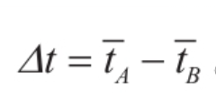

&#x20;    从直观上来讲，如果Δt非常小，接近于0，那么几乎可以认为原假设$$H_0$$为真。如果Δt非常大，就有理由拒绝原假设。现在的问题是，Δt究竟需要多大，才足够认为A、B两组有差异；需要多小，才足够认为A、B两组没有差异呢？如果我们在一次实验中观察到Δt=0.2，能不能拒绝原假设H0呢？

&#x20;   假设检验的步骤如下。

&#x20;   第一步，给出原假设$$H_0$$，即A组和B组人均时长没有显著差异：Δt=$$t_A$$-$$t_B$$=0，其备择假设$$H_1$$，即A组和B组人均时长有显著差异：Δt=$$t_A$$-$$t_B$$≠0。

&#x20;   第二步，在假设$$H_0$$成立的情况下，将没有差异的两组进行AA实验（见第7章）​，只有3%的情况发生了|Δt|≥0.2。假设我们设定事情发生的概率低于5%，就是一个小概率事件，那么说明这是一个小概率事件，一般很难发生的事情发生了，可以推论大概率原假设$$H_0$$不成立。

&#x20;    在这个过程中，我们注意到有两个关键的数据—3%和5%。5%的意义在于人为定义了一个显著性水平5%，用于判断小概率事件。3%就是在$$H_0$$为真的情况下，小概率事件发生的真实概率。3%是通过实验获得的样本均值和方差，再利用其符合正态分布，通过构造分布曲线计算出来的。

&#x20;    显著性水平α和P值是假设检验中关键的两个概念。显著性水平α是人为定义的用于判断是否为小概率事件的阈值，如果低于该阈值，则认为是小概率事件，也是可以接受判断发生错误的概率。P值是小概率事件发生的实际概率，如果P值<显著性水平，则认为小概率事件发生了，拒绝原假设$$H_0$$。

&#x20;    用假设检验的方法进行判断就变得简单多了，方式如下。

&#x20;    P值<α时，就可以拒绝$$H_0$$，接受$$H_1$$。

&#x20;    以产品新策略对产品人均时长是否有影响的实验为例：拒绝$$H_0$$，接受$$H_1$$，就是认为备择假设$$H_1$$：$$t_A$$≠$$t_B$$成立，即实验组A和对照组B的指标有显著差异，新策略有显著效果。

&#x20;    因为α是人为规定的，所以假设检验问题就可以简化为如何计算P值。在正态分布时，P值和t值有一个对应关系，求P值可以转化为求检验统计量t值，对于双总体，方差未知的抽样问题有如下计算。

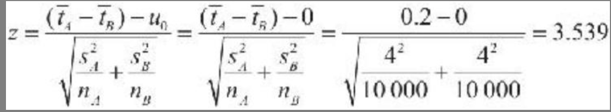

&#x20;    当α=0.05时，对于双侧检验$$t\frac{a}{2}$$=$$t_ 0.025$$=1.96，如果t≤-1.96或者t≥1.96就会拒绝H0，这时就可以拒绝H0，认为A组与B组有显著差异。到这里，自然会进一步想到，如果实验中观测到Δt<0.2，能说明两组没有差异吗？或者说观测到Δt小于多少的时候，能认为两组数据没有差异呢？如果Δt=0.15，这时t=2.66，t>$$t_0.025$$=1.96，此时可以拒绝H0，认为A、B有差异。如果Δt=0.1，这时t=1.77，t<$$t_0.025$$=1.96，此时无法拒绝H0。需要特别注意的是，这时也没有办法接受H0，说A、B没有差异。为什么呢？因为这个时候，我们不知道是由于检验精度不够导致结果不显著，还是确实没有效果。怎么办呢？还需要另外一个指标—**功效**&#x4E00;起作出判断。

&#x20;    重点关注

&#x20;    P值是H0为真的时候，观察到实验数据出现的概率，本质是关于$$H_0$$为真的一个条件概率。

&#x20;    如果P值<显著性水平，则认为小概率事件发生了，拒绝原假设$$H_0$$。P值的取值范围是\[0,1]，一般来说，P值越小越能反映A、B之间是有差异的。当P值比显著性水平大时，却不可以说A、B没有差异，即不能得出任何结论。

&#x20;    P值经常被曲解，常见的关于P值的错误陈述和理解如下。

误解1：如果P值=0.05，则$$H_0$$假设只有5%的可能性为真。

更正：P值是在假设H0为真的情况下计算的，而不是H0假设为真的可能性。

误解2：差异不显著（如P值>0.05）表示组间无差异。

更正：当AB实验的置信区间包含0时，并不意味着0比置信区间内的其他值更有可能。没有差异很可能是实验的功效不足导致的。

误解3：P值=0.05表示我们观察到的数据在$$H_0$$假设下只有5%的概率会出现。

更正：根据P值的定义可知，这个说法是不正确的，P值包括与观察到的值相等或更多的极值。

误解4：P=0.05意味着如果拒绝H0假设，则误报的概率仅为5%。

&#x20;更正：发生误报的概率和P值没有关系。

&#x20;     显著性水平是当原假设$$H_0$$为真时，可以容忍的第一类错误发生的概率，是人为定义的小概率事件发生的最大概率值。

#### 3.4.3 第一类错误、第二类错误和功效

&#x20;    通过抽签和扔骰子的例子不难理解，虽然是小概率事件，但也有可能是真实发生的。如果小明没有作弊，我们却判定他作弊了，这就是第一类错误；如果小明作弊了，我们却判断他没有作弊，这就是第二类错误，如表3-3所示。

表3-3　第一类错误和第二类错误

&#x20;    假设检验的过程中，理想的情况是$$H_0$$为真的时候接受$$H_0$$，$$H_1$$为真的时候拒绝$$H_0$$。统计推断不可能保证完全正确，根据假设检验做出的决策当然也存在犯错误的可能，总结起来为以下4种情况，如表3-4所示。

表3-4 假设检验的第一类错误和第二类错误&#x20;

&#x20;      在AB实验中，原假设$$H_0$$一般都是假设实验组和对照组无差异，也就是实验没有效果。第一类错误是$$H_0$$为真但是被拒绝了，即虽然实验没有效果，但是被判断为有效果。第二类错误是$$H_0$$为假但是接受了，即虽然实验有效果，但是被判断为无效果。一般来说，第一类错误的危害更大，要重点控制发生的概率。同时，我们也需要关注第二类错误，虽然第二类错误不会直接对产品和用户造成损失，但是对于公司而言，进行任何一项实验的开发都是有成本的，如果第二类错误发生的概率过高，会导致团队的成绩无法被客观证实，提升产品效果的策略无法上线，错失产品发展的机会。

&#x20;     除了第一类和第二类错误，还有第三类错误，就是虽然实验组和对照组有差异，系统也检测出来了，但是差异的方向反了，也就是本来实验组是好于（或者差于）对照组的，系统给出的结果却是对照组差于（好于）实验组。这种情况理论上是存在的，因为实际发生的概率较低，所以应重点关注的还是第一类和第二类错误。

&#x20;     为了控制第二类错误，引入一个概念—功效（power）。功效是指当$$H_0$$不成立时，做出拒绝$$H_0$$的结论正确的概率。功效=1-第二类错误发生的概率β，即功效越大，第二类错误发生的概率越小。功效越大，第三类错误发生的概率也越小，基本会趋近于0。

&#x20;    结合P值，基本判断流程如下。如果P值<α，则拒绝原假设$$H_0$$，认为策略有效。如果P值≥α，不能拒绝原假设$$H_0$$，也不能接受$$H_1$$，此时不能说策略有效，但是也不能说策略无效。需要进一步观察功效，如果功效>80%（一般选择80%）​，说明犯第二类错误的概率也很低了，即策略有效却被判断为无效的概率很低，此时策略大概率就是无效的。如果功效<80%，此时策略有效却被判断为无效的概率还是比较大的。策略有可能是真的没效果，那么怎么办呢？这就需要我们继续观察实验，直到P值或者功效达到可以判断。

&#x20;     根据这个思路可以绘制基本的判断流程如图3-6所示。

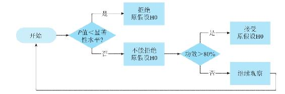

图3-6　根据P值、显著性水平、功效进行判断

&#x20;     图3-6中继续观察这一步，本质上就是希望通过一些手段（如增加样本容量等）增加Z值，进而达到某个可以作出拒绝原假设$$H_0$$的临界值。Z值的计算中，只有两个变量可以操作，一个是样本数量n，另一个是方差σ。可以通过增加n或者减少方差σ去增加z，从而拒绝H0。这个过程就是通过增加样本量或者降低方差来提升检验精度，在第8章会详细介绍如何提高实验精度。

#### 3.4.4 如何计算功效

&#x20;     本节通过一个实例来说明如何计算功效。

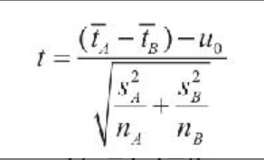

&#x20;     根据上面的公式，当显著性水平α=0.05时，对于双侧检验$$t_\frac{a}{2}$$=$$t_0.025$$=1.96，如果t≤-1.96或者t≥1.96，可以反推出一个可以拒绝$$H_0$$假设的Δt= $$\frac{}{t_A}$$- $$\frac{}{t_B}$$

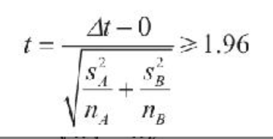

&#x20;     当Δt>0.11，或者Δt<-0.11时，就可以拒绝原假设$$H_0$$，认为$${t_A}\not=$$ $${t_B}$$。

&#x20;     第二类错误是我们做出接受H0：$${t_A}=$$ $${t_B}$$，即Δt=0的假设，但实际上$${t_A}\not=$$ $${t_B}$$。要满足这个条件，需要选择一个-0.11<Δt<0.11的u值。现在我们选择u=0.05，认为真实人均时长差值的均值为0.05，此时如果接受$$H_0$$：Δt=0，犯第二类错误的概率是多大呢？转化问题为当真实差值的均值为0.05时，求样本均值-0.11<$$\frac{}{Δt}$$<0.11的概率，如图3-7所示。

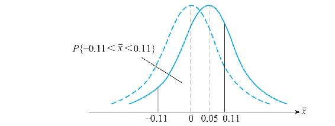

图3-7　当u=0.05时发生第二类错误的概率

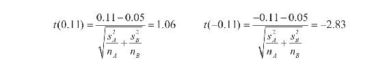

&#x20;      当样本均值为0.11和-0.11时，分别对应的概率为0.8554、0.0023，对应样本均值在-0.11到0.11之间的概率为

&#x20;      表示此时发生第二类错误β的概率为0.8531，此时功效=1-0.8531=0.1469。

&#x20;      同理，如果假设接受u=0.02，则计算公式如下。

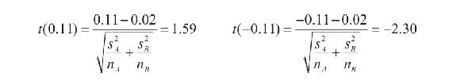

&#x20;     当样本均值为0.11和-0.11时，分别对应的概率为0.9441、0.0107，对应样本均值在-0.11到0.11之间的概率为

&#x20;     表示此时发生第二类错误β的概率为0.9334，此时功效=1-0.9334=0.0666。

&#x20;     我们发现如果u逐渐向假设的均值$$u_0$$=0靠近，发生第二类错误的概率会逐渐变高。为什么u越接近原假设值$$u_0$$时，犯第二类错误的概率越高；远离原假设值$$t_A$$时，犯第二类错误的概率逐渐降低？其实u越大时，越靠近拒绝$$H_0$$的区域，也就是$$H_0$$越可能为假，此时接受$$H_0$$的可能性也就变低了，犯第二类错误的概率变低了。当u变成$$u_0$$，即u=0时，此时z=1.96，接受$$H_0$$的概率为(0.975-0.5)×2=0.95，达到第二类错误的概率上限95%。因为我们设定的置信度是95%，从图3-7中可以看到，一旦进入其余5%的区间，我们会拒绝$$H_0$$；只有在95%的区间内，我们可能会接受$$H_0$$，所以第二类错误的最大概率为95%。

### 3.5 非参数检验

&#x20;    无论是t检验还是z检验，基于参数的检验方法都有一个隐含的前提，即要求符合独立同分布。基于这个前提，可以得到用于推断一个或多个总体参数（例如总体均值、总体标准差）的抽样分布。实际上，有时可能样本总体的概率并不符合独立同分布。比如，在搜索中，各条目间不一定独立，可能存在干扰，比如用户读过更好的条目或者相似的条目，可能不会再点击新的条目等。现在很多实验系统开始采用非参数的方法对总体进行推断。非参数的方法对总体概率没有分布形式的要求，不对模型做任何参数假设，完全是基于数据模拟的方法。因为没有假设，无须标准差的理论计算，所以也不关心估计的数学形式有多复杂，即使不符合正态分布，也一样适用。

&#x20;    目前用得比较多的是bootstrap和jackknife这两种非参数的检验方法，它们的差异在于bootstrap进行有放回的采样，jackknife进行无放回的采样。假设所有样本被随机分为N份，jackknife每次从N份样本中删除一份样本，将剩余的样本形成一个新样本，jackknife利用更少的样本，即更少的信息来进行估计，工程实施上也更容易计算。事实上，jackknife方差为bootstrap方差的一阶近似。

&#x20;    下面通过一个计算案例来简单介绍bootstrap的原理。

&#x20;    30个中学生身高（单位为cm）从低到高排列：137.0、138.5、140.0、141.0、142.0、143.5、145.0、147.0、148.5、150.0、153.0、154.0、155.0、…、156.0、157.0、158.0、158.5、159.0、160.5、161.0。下面用bootstrap方法来求置信区间。

&#x20;    第一步，从原始样本中有放回地抽取一个容量为20的样本：138.5、138.5、140.0、…、158.5、160.5。

&#x20;    第二步，计算样本均值u=153.5。

&#x20;    第三步，重复前两步1000次，得到bootstrap统计量的经验分布，绘制密度函数图形如图3-8所示。

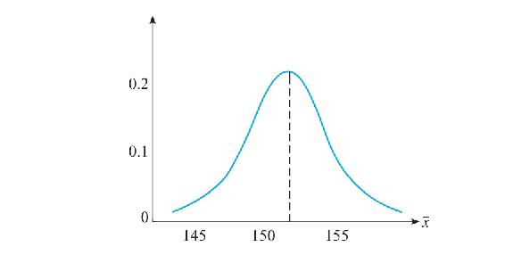

图3-8　bootstrap抽样均值的密度函数

&#x20;    基于密度函数，可以计算出95%的置信区间。在求置信区间的时候，由于选择不同的区间长度，会得到不同的边界值，因此可以通过最短区间长度法来确定唯一的置信区间。假设获得的置信区间为，区间长度为6.8，这是选择样本容量为20获得的置信区间。通过实验可以得到，当样本容量变小的时候，同等置信水平下，置信区间会变大，估计精度也会随之变低。在选择样本容量的时候需要考虑估计精度。

&#x20;    在实际应用中，jackknife方法应用得更多，一般不是把每个用户作为一个样本点，而是将聚合后的n个用户分为一个桶，一个桶作为一个点，然后采用jackknife方法去获取整个样本的分布，从而减少计算量。

### 3.6 方差估计问题

&#x20;    在区间估计、假设检验中，均值和方差是置信区间、P值等指标计算的核心基石，而且减少方差是提升实验检测精度的主要手段之一。如果错误地估计方差，那么P值和置信区间都将是错误的，从而使假设检验得出错误的结论。高估方差导致假阴性，低估方差导致假阳性。

&#x20;    首先回顾一下均值指标方差的计算过程，假设有i=1,2,3,…,n个独立同分布的样本。在大多数情况下，i既可以是用户，也可以是会话、页面等。

&#x20;    均值为

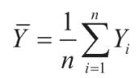

&#x20;    样本方差为var(Y)=

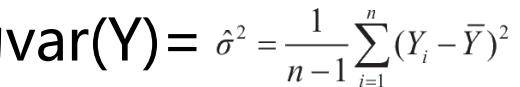

&#x20;    计算均值的方差为

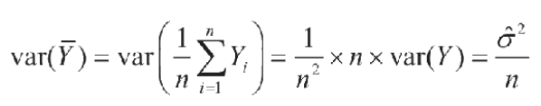

&#x20;    方差估计中的常见问题主要有：对于不同类型指标（变化绝对值、变化相对值、比率类指标、特殊类指标）方差估计的不同方法，以及异常值对于方差估计的影响等问题。

#### 3.6.1 变化绝对差和相对差的方差

&#x20;      估计以$$Y_t$$表示实验组中某个实验指标的结果，$$Y_c$$以表示对照组中该实验指标的结果，绝对差和相对差的定义如下。

绝对差：Δ=Yt-Yc。

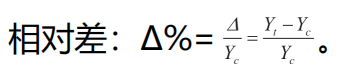

&#x20;      在报告实验结果时，一般更多地使用相对差异，而不是绝对差异。因为绝对差没有参照，所以很难定义这个绝对差变化的大小。举例来说，在一个实验中，如果用户使用产品时长多了0.1min，仅凭0.1min，很难判定使用时长是否是多了很多，或者与其他指标的影响情况如何。实验者或者决策者通常能更好地理解变化的相对幅度。一般来说，0.5%的涨幅就是一个相对较小的涨幅，而5%是一个相对大的涨幅。为了正确估计绝对差异Δ、相对差异Δ%上的置信区间，我们需要分别估计绝对差异、相对差异的方差。

&#x20;     绝对差异Δ的计算只涉及两个正态随机变量的差$$\frac{}{Δ}$$=  $$\frac{}{Y_t}$$- $$\frac{}{Y_c}$$的分布问题，由于正态随机变量的差或和仍然是正态的，因此比较容易处理。绝对差异的方差是每个分量的方差之和，公式如下。

&#x20;    相对差异Δ%的方差估计涉及两个正态随机变量 $$\frac{\frac{}{Y_t}}{\frac{}{Y_c}}$$的商的分布，而正态性在商的运算中并不能保持，这个问题就变得复杂了，在统计学上称为随机变量的比率分布。对于两个正态随机变量的商的分布，从20世纪30年代开始就有不少学者进行研究。这个问题的一个经典例子是人的颅骨的高宽比例的分布。在医学上，比较两种药物的有效性，也经常涉及比率分布问题。

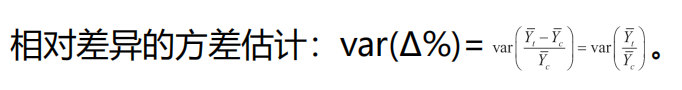

#### 3.6.2 比率类指标的方差估计

&#x20;     许多重要的指标来自两个指标的比率。例如，点击率通常定义为总点击量与总页面浏览量之比，每次点击收益定义为总收益与总点击量之比。与每个用户点击量或每个用户收入等指标不同，当使用两个指标的比率时，分析单位不再是用户，而是页面浏览量或点击量。当实验按用户单位随机化时，可能会给估计方差带来挑战。

&#x20;      方差基础公式很简单：

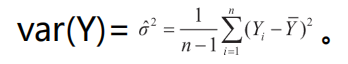

&#x20;     这背后有一个关键假设：样本$$Y_1$$,$$Y_2$$…,$$Y_n$$需要满足独立同分布假设，或者至少不相关。独立同分布是指在随机过程中，任何时刻的取值都为随机变量。如果这些随机变量服从同一分布，且互相独立，那么这些随机变量就是独立同分布的。在进行AB实验的时候，如果分析单元与实验（随机化）单元相同，则满足该假设。比如，对于用户级指标，由于每个$$Y_i$$代表用户的度量，分析单元与实验单元匹配，因此独立同分布假设是满足的。如果分析单元与实验（随机化）单元不相同，通常会违反该假设。比如，对于页面级指标，每个$$Y_i$$代表一个页面的度量，或者一篇文章的曝光量、点击量时，由于实验是由用户随机化的，因此$$Y_1$$,$$Y_2$$和$$Y_3$$可能都来自同一个用户，并且是“相关的”。基于这种“用户内相关性”使用简单公式计算的方差将是有偏差的。要正确估计方差，可以将比率指标写为“用户级别指标的平均值”的比率：M=$$\frac{\frac{}{X}}{\frac{}{Y}}$$,因为$$\frac{}{X}$$,$$\frac{}{Y}$$是极限联合二元正态，M是两个平均值的比值，所以也是正态分布。我们可以通过delta方法估计方差，公式如下:

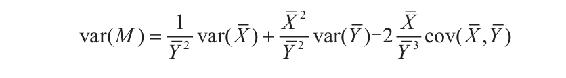

&#x20;    计算比率类指标的相对百分比方差时，由于实验组指标$$Y_t$$和对照组指标$$Y_c$$是相对独立的，因此计算公式如下。

#### 3.6.3 其他指标的方差估计

&#x20;      在本章大多数讨论中，假设的统计数字是平均值、比率值，如果对其他类型统计数据感兴趣，比如分位数，该怎么计算呢？当涉及基于时间序列的指标时，通常使用分位数，而不是平均值来衡量。大多数基于时间的指标是在事件、页面级别进行的，而实验是在用户级别随机进行的。在这种情况下，可以用密度估计和delta方法的组合。

&#x20;     需要特别注意的是，有些比率类指标不能以两个用户级指标的比率的形式得出，例如页面加载时间的第90百分位数。对于这些指标，我们可能需要使用bootstrap方法或者jackknife方法，模拟随机抽样获得方差估计，从而不需要预设指标的任何参数，也不需要满足正态分布。尽管bootstrap的计算量比较大，但它是一个强大的工具，应用广泛，是delta方法很好的补充。

#### 3.6.4 异常点对方差估计的影响

&#x20;     在数据收集的过程中，异常值以各种形式出现，通常是由爬虫、作弊用户、僵尸程序或垃圾邮件行为引入的。异常值对均值和方差都有很大影响，在统计测试中，对方差的影响往往大于对均值的影响。比如给实验组增加一个单一的异常值，当我们改变异常值大小时，会注意到虽然异常值增加了实验组整体的平均值，但它增加的方差更多。在估计方差时，去除异常值是至关重要的。一个实用而有效的方法是简单地将观测值限制在一个合理的阈值内。例如，正常用户不太可能在一天内执行超过500次的搜索或超过1000次的页面浏览。还有许多异常值去除技术，感兴趣的读者可以阅读相关文章。

### 3.7 多重测试问题

&#x20;     本节介绍在AB实验中经常说的多重测试，以及发生多重测试后我们应该如何控制这个错误发生的概率。

#### 3.7.1 什么是多重测试问题

&#x20;     通过假设检验的方式来判断实验结果，每一次判断都存在一定的概率判断错误。多重测试问题的本质是，如果判断的次数变多，这个错误的概率就可能增加。举个简单的例子，假设我们以5%显著性水平，来判断实验结果，那每次判断正确（不犯第一类错误）的概率是95%。如果我们对同样的事情进行多次判断，比如开设了N个相同的实验组，并且进行N次判断，此时我们全部判断正确的概率变为(95%)N，判断错误的概率就变为1-(95%)N，都随着N的增加而增加，这时实验结论容易导致假阳性。在AB实验中，我们首先要尽量避免进行多重测试。如果多重测试无法避免，就需要对这个错误的概率进行控制。

#### 3.7.2 如何避免多重测试

&#x20;     为了尽量避免多重测试的发生，首先需要明确哪些行为可能会导致多重测试。在AB实验的应用中，多重测试问题的主要来源有以下几个方面。

●多次重复进行相同的实验。比如进行一次实验后发现实验结果不符合预期，没有显著的正向效果，又重复进行几次相同的实验，可能某一次就出现了正向显著效果，这种情况就极有可能是多重测试产生的结果。图3-9所示的实验A中，实验A\*和A\*\*是在不同的时间进行的与A相同的实验。

●多次进行相同对比。比如一个实验组有多个对照组进行多次对比（图3-9中的实验B）​，或者一个对照组有多个相同的实验组进行多次对比（图3-9中的实验C）​，或者多个实验组与多个对照组之间进行多多对比，都属于这种情况。这里需要强调的是，多个实验组一定都是策略相同的实验才构成的多重测试。如果是不同策略的实验组，与同一个对照组对比不构成多重测试。在实践中，这种情况也非常常见，实验者出于各种考虑，开设了多个相同的实验组，实验结果发现有一个实验组有显著效果，其余实验组没有显示显著效果，很容易采用有效果的实验组数据作为实验决策数据，这非常容易导致实验结论的假阳性。

●实验进行过程中多次查看实验结果（图3-9中的实验E）​，即常说的实验偷窥，也容易导致多重测试。因为在进行实验的过程中，实验数据未达到稳定时会处于一个波动的过程中，有可能某个时刻呈现显著正向效果，某个时刻无显著效果，甚至某个时刻会显著负向。如果随机在实验过程中偷窥实验结果，刚好看到某个显著正向，就很有可能导致实验过早停止，导致实验结论假阳性。

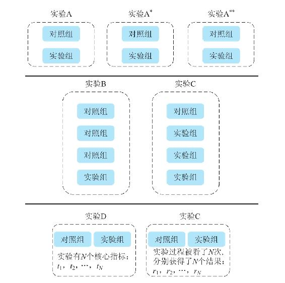

图3-9 几种常见的多重测试情况（更正：最下面右边为实验E）

&#x20;      当我们有成百上千个实验、每个实验都有多个指标、多个对照、多次迭代、多次中途查看实验结果时，问题就会变得非常糟糕。进行比较的次数越多，造成假阳性的可能性就越大。为了尽量减少多重测试带来的问题，采取一些措施和规范是很有必要的。

●在构建实验指标体系的时候，核心实验指标的设置和选择要尽量少，一旦核心指标增加了，就会出现多目标的比较，造成假阳性的可能性就会变大。

●在实验过程中不要多次查看实验结果，不以实验过程的数据作为实验结果的判断依据。

●在不可避免要进行多重测试的时候，选择适当的统计方法来处理多重比较的问题，控制第一类错误的发生率（假阳性率）​，对于提升实验推断的可靠性和成功率至关重要。

#### 3.7.3 如何控制多重测试问题

&#x20;      有时不可避免地要进行多重测试，比如实验有多个关键指标需要观察。在这种情况下，需要确保多次测试中，第一类和第二类错误仍得到合理控制。控制总体第一类错误，最常用的是Bonferroni法，其基本原理是：若进行n次检验，显著性水平（检验水准）α应校正为α/n，或将P值乘以n后再与α比较。比如，某AB实验具有3个指标，采用Bonferroni法进行多重性校正后的检验水准α=0.05/3=0.0167。Bonferroni法虽然可以控制有多个指标实验的总体第一类错误率，但该方法太保守了，要求太严苛了。后来，Bonferroni法也出现了多种扩展形式。

##### 1.Fallback法

&#x20;    以一个信息流实验为例，该实验关注的结果指标有两个—用户人均使用时长和次日留存率。由于该实验具有两个结果指标，因此采用Bonferroni法，在双侧α=0.05的水平上控制总体第一类错误率，但总体第一类错误率在不同指标之间进行了不均匀分配。如图3-10所示，该实验中检验分为两步。

&#x20;    第一步，进行人均使用时长的组间差异检验，定义在P值≤0.01的水平。如果人均时长指标差异显著，则确证次日留存率获益的概率可能会增加。

&#x20;    第二步，做如下考虑：如果第一步中人均时长差异显著，那么次日留存率的分析将设定在更高的水平，P值≤0.05；否则，第二步的分析将设定为P值≤0.04。

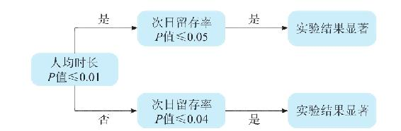

图3-10　Fallback检验决策规则

##### 2.Holm法

&#x20;    Holm法显示了将α平均分配检验策略，如图3-11所示。

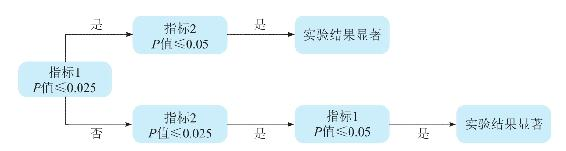

图3-11 Holm检验决策规则

&#x20;    第一步，指标1的显著水平建立在P值≤0.025的水平。

&#x20;    第二步，如果指标1效果显著，那么指标2的显著性水平为P值≤0.05；如果指标1的效果不显著，那么指标2的显著性水平为P值≤0.025。

&#x20;    第三步，如果第一步中指标1效果不显著，那么可以对指标1再次检查。如果第二步中指标2的效果显著，并且指标1的P值≤0.05，那么指标1的显著效果被确证。注意这里的指标1和指标2一般是有先后顺序的，在检验指标2之前先检验指标1。

&#x20;    Fallback法和Holm法也可以简单扩展到具有3个或者更多指标和对比的实验中。这两种修正方法，比较简单和保守，使用了一个一致但小得多的P值阈值（比如Holm法，α除以指标数）。这在目标指标非常多的时候通常不适用，那应该怎么做呢？这里还有一个简单的经验法则。

●将所有指标分成3组：一阶指标，那些预计会受到实验影响的指标；二阶指标，那些可能会受到影响的指标；三阶指标，那些不太可能受到影响的指标。

●对每一组应用分级显著性水平（例如，分别为0.05、0.01和0.001）。

&#x20;    这些经验法则基于一种有趣的贝叶斯解释，在进行实验之前，你相信H0是正确的吗？信念越坚定，应该使用的重要性级别就越低。

&#x20;    通过对AB实验相关统计学知识的系统学习，我们清晰地掌握了方差估计、假设检验、显著性水平、置信区间、第一类错误、第二类错误、统计功效、非参数检验、多重测试等重要的概念。

# 第二部分：AB实验进阶

## 四、AB实验参与单元

&#x20;     实验参与单元是在实验中被随机分流的对象，也叫最小随机化单元。实验参与单元并不一定是一个用户或者一个设备，它可能只是用户浏览的一个页面、一篇文章或者用户的一次会话。实验参与单元的颗粒度可粗可细，选择什么样的实验参与单元取决于实验评估的需要，而且在实验评估时需要选择与实验参与单元相匹配的颗粒度。为了保证实验评估结果的准确性，还需要实验参与单元满足一定的假设条件，比如个体处理稳定性假设。

&#x20;     在不满足假设的情况下，需要通过一些策略来降低这些干扰对于实验结果的影响。同时在实验中，为了达到一定的实验评估精度，还需要实验参与单元达到一定数量。如何计算所需的实验参与单元数量，以及在不同的计算方式下需要注意什么问题，都是AB实验设计中需要考虑的。

### 4.1 实验参与单元的选择

&#x20;    实验参与单元的选择在实验设计中至关重要，它关系到用户体验，也会影响用来衡量实验影响的指标选择。一旦选择好实验参与单元，在整个实验过程中，就会按照选定的实验参与单元进行实验标记，以及实验数据的计算和分析。

#### 4.1.1 常见的实验参与单元

&#x20;    在互联网产品的AB实验中，有以下几种比较常见的实验参与单元。

●元素级别（item-level）​：指对实验元素，比如一篇文章、一首歌曲等进行随机分流并标识实验id的随机过程。在Interleaving实验方法中就采用了类似的方法，Interleaving最初被Netflix用来进行视频内容的推荐。如图4-1所示，其基本过程是，用户不进行随机分组，所有用户会收到算法A和算法B的推荐内容交替混合后的结果。这使得用户可以同时看到算法A和算法B的推荐结果，却不知道内容是由算法A还是算法B推荐的。实验通过计算不同算法推荐内容的用户观看时长等实验指标，来比较算法A和算法B。这种方法主要用于用户无感知的搜索算法中的搜索结果或者推荐算法中的推荐结果。

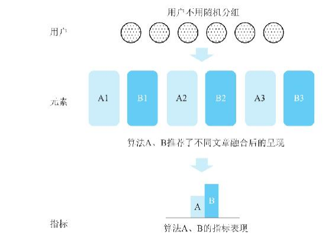

图4-1 元素级别的随机对象

●页面级别（page-level）​：产品页面被视为实验参与单元，进行实验的页面每打开一次，就会被随机函数分配到不同的实验组中。如图4-2所示，不同的用户打开相同的页面，相同的用户在不同的时间打开多次页面，都会分别算作一次实验参与，进而被分配实验id和实验组。页面级别实验在Web端比较常用，一般不用于App端。

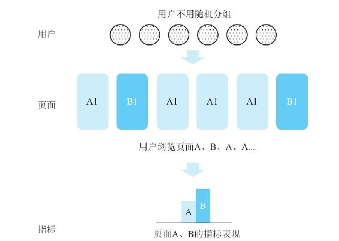

图4-2 页面级别的随机对象

●会话级别（session-level）​：会话的概念在Web端和App端都存在，基本含义是用户在网站的一次访问时查看的一组页面或是启动一次App后在App内的行为，通常从启动App到退出App定义为一个会话，需要考虑前后台切换、时间限制、刷新机制等问题。比如一般采用App切到后台30分钟，用户再启动就算一个新会话，如果30分钟内启动且进程没有被杀掉，仍然算作同一个会话；切换到后台不管多少分钟，只要进程被杀掉，再启动就算新会话。这往往和机型、品牌和用户操作习惯相关，因而也可能会给实验统计带来一些偏差。如图4-3所示，同样不对用户进行分组，用户形成了1、2、3、1、4、2的会话序列，同一个用户不同会话被视为不同的会话，这些会话被随机分到不同的实验id，分别进入实验组A、B，最后统计实验组A、B的数据进行实验效果分析。

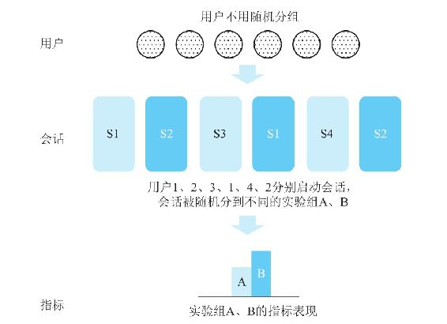

图4-3 会话级别的随机对象

●用户级别（user-level）​：用户级别相对容易理解，就是以用户为实验参与单元。在实验过程中，一旦用户被分到A组，直到实验结束，该用户都一直属于实验组A，而不会被分到同一个实验的B组中，有可能被分到其他层的实验中。这里的用户是一个虚拟的概念，它既可能是一台设备，也可能是一个账号，用来代表背后的用户。如图4-4所示，用户被随机分为A、B两组，分别体验不同的策略A、B，然后计算A、B两组用户的各项实验指标并分析实验效果。

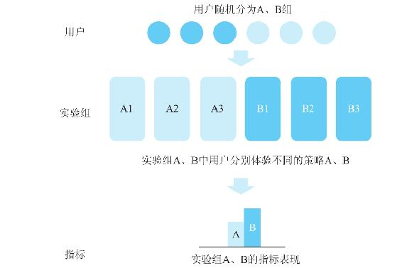

图4-4　用户级别的随机对象

&#x20;    以上4个级别的实验参与单元的粒度从小到大，粒度越小，可以使用的分割单元越多，所能同时进行的实验量也越大。从用户体验的角度来看，粒度越小，用户体验的连续性越差。如何平衡这个关系，选择合适的实验参与单元呢？主要有两个关键考虑因素：1）实验所需要的流量以及实验检测精度；2）用户体验的连续性。

&#x20;    一般在流量足够的情况下，为了保证体验的稳定性和连续性，最好采用用户级别。在不影响用户体验的前提下，采用更细粒度的随机单元，能更精准、快速地获取实验效果。什么类型的实验会影响用户体验呢？简单来说，就是看策略A和策略B切换时，用户能不能明显感知这个变化。比如实验的内容是字体大小、界面颜色等，如果采用文章、页面、会话粒度，用户显然会明显感知变化，如果在A页面看到蓝色字体，在B页面看到绿色字体，这些变化会干扰用户的行为和决策，从而影响实验对于字体颜色这一特征的评估，实验结果的可信度也就降低了。如果是推荐类、搜索结果类的实验，用户无法感知一篇文章究竟是A算法推荐的还是B算法推荐的，这种情况下，可以用文章、页面、会话等粒度进行随机分流。

&#x20;    选择小粒度的实验参与单元，除了可以增加实验流量外，还有一个好处是可以增加实验效果评估精度。一方面随机化的粒度越细，产生的实验单元越多，使得指标平均值的方差越小，实验将具有更强的统计能力来检测较小的变化。另一方面，实验标记将会更精准地作用在实验区域上，而不会纳入更多非实验范围的数据淹没实验效果。比如以用户为实验参与单元，可能会存在用户分布不均的问题。以人均时长指标为例，因为非常活跃的用户是少数，他们贡献的观看时长却占较大的比例，所以在将用户分组的AB实验中，多数活跃用户被分在A组还是B组，将对结果产生较大影响。因为这些活跃用户整体占比较少，在随机分配过程中分配不够均匀的概率也很高，从而影响实验结果的概率也较高，所以在不影响体验连续性的前提下，从实验效果评估的角度，应该尽可能选择较小粒度的随机单元进行分流。

&#x20;    需要注意的是，如果实验特征的粒度跨越实验参与单元的粒度起了作用，则不能使用该粒度的实验参与单元进行分流。举个例子，要测试产品页面上一个交互界面的颜色用红色好还是蓝色好。如果这个交互界面只在产品的这一个页面出现，那么可以选择页面级别的实验参与单元，因为这个情况下，页面级别就已经包含了这个实验特征。如果这个交互界面同时还在其他多个页面出现，就不能选择页面级别的实验参与单元。因为如果按照页面进行随机化，就会出现用户在A页面看到红色交互界面，在B页面看到蓝色交互界面的情况，从而影响用户产品体验一致性。

#### 4.1.2 实验参与单元粒度与实验评估

&#x20;    在实验评估的时候需要注意粒度匹配的问题，即实验随机分流的粒度和评估指标的粒度相匹配。粗粒度的随机分流实验可以往下兼容评估指标，比如一个用户级别的随机分流实验，能往下细分评估会话、页面、元素级别的指标。细粒度的随机分流实验不能往上兼容，一个页面级别的实验，不能评估用户时长、用户留存等用户级别的指标。

&#x20;    通常建议随机化单元与分析单元相同，或者随机化单元比分析单元粒度更粗。当分析单元与随机化单元相同时，由于单元之间的独立性假设在实践中是合理的，因此更容易正确地计算指标的方差。例如，由于按页面随机化意味着每个页面上的点击是独立的，因此计算平均点击率（点击/页面浏览量）的方差是标准的。如果随机化单元是用户，并且指标分析单元也是用户，例如每用户会话数、每用户点击数和每用户页面浏览量，则分析相对简单。

&#x20;    如果随机化单元比分析单元粒度粗，例如按用户随机化，分析页面点击率是可行的，只是需要更细微的分析方法，如bootstrap或delta方法。在这种情况下，使用同一个用户id的作弊机器人可能会歪曲实验结果。例如，拥有10000个页面浏览量的机器人全部使用相同的用户id完成。如果需要考虑这种类型的场景，可以限制单个用户对更细粒度指标的贡献，或者切换到基于用户级别的指标（例如每用户的平均点击率）。

&#x20;    相反，当在用户级别（例如，每用户会话数或每用户收入）计算指标并且随机化是在更精细的粒度（例如页面级别）时，用户体验可能包含各种特征体（同时来自实验组、对照组的特征体）的混合，这时在用户级别计算指标是没有意义的。当随机化按页面进行时，不能使用用户级别的指标来评估实验。如果这些指标是OEC的一部分，那么就不能使用更精细的粒度进行随机化。&#x20;

#### 4.1.3 用户级别的实验参与单元

&#x20;    综合来看，选择用户级别的实验参与单元颗粒度仍是最主要的一种方式。它具有体验稳定性，同时可以对用户进行长期观察。因为有一些用户行为可能会随着时间推移而发生变化，所以需要更长期的实验观察。比如一些UI方面的改变，用户从不喜欢逐渐变得喜欢；一些具备自适应能力的算法，用户从一开始不太习惯使用到逐渐接受等。如果采用非用户级别的随机化单元，就无法追踪用户的这种变化过程。采用用户级别的随机化单元时，常见的用户标识有如下两类。

●登录账户类，比如账号、手机号等，这类用户id稳定性最好，跨平台，跨设备之后都可以识别，从而保持了对同一个用户行为实验数据采集的稳定性。同时也存在一些小问题，比如一些产品的账号体系（比如视频App的会员账号）允许同时运行在多个设备中，一个家庭的多个用户在同一账号下观看的是不同的视频内容，这样的账号对于实验的分析评估其实会存在一定的干扰。

●设备id类，指绑定到某一个设备号，虽然设备id不具跨设备或跨平台一致性，但这类用户id在一定时间内也具备一定的稳定性，对于短期实验来说影响相对较小。从更长周期来看，也会存在设备更新等情况。对于iOS设备来说，一般设备id指广告标示符，对于安卓设备来说，一般设备id指国际移动设备识别码。

&#x20;   在应用中，出于各种实际的限制或者需求，AB实验中用户随机分组的方式会变得更加复杂。比如一些含收费项目的产品，有时就不能对全量用户进行随机分组，因为有一些功能只有一部分付费用户才能体验，所以在优化这个付费功能的时候，就只能对订阅了这些功能的付费用户进行随机分组。这种针对一部分用户进行AB实验的情况非常常见。

●客户端版本实验只对最新版本的用户生效。

●基于用户静态特征的实验，比如只对三四线城市的用户生效。

●针对用户行为、状态特征的实验，只对新用户、高活跃用户生效。这种定向实验对一部分用户群体进行随机分流，会涉及如何处理用户中另一部分未被选择进行实验的用户的问题。一般有两种处理定向用户群流量下发的方法。

●先锁定全部流量，然后从流量中筛选符合条件的进行实验打标，其余不符合条件的流量虽然不进行实验，但这部分流量也被实验占用。这种方法的优点是可以避免后面的实验用户分布不均匀，缺点是会造成比较大的流量浪费。●直接从流量中选取符合条件的用户进行实验，不符合条件的回归流量池。这种方法的优点是可以尽可能充分地使用流量，缺点是可能会造成同层级后续开启实验用户的分布和大盘用户分布不一致，从而导致无法很好地评估这些实验全量后对于大盘指标的提升效果。

&#x20;      下面通过一个具体的例子来说明这两种方法的差异。一个产品有100万个用户，其中新用户20万个，老用户80万个，新用户人均使用时长为10min，老用户人均使用时长为20min，大盘人均使用时长为18min。现在需要对10万个新用户进行实验，有如下两种实验方案。

方案一：如图4-5所示，实验1锁定10万个新用户，分为A1、B1两组进行实验。剩下的90万个用户（10万个新用户和80万个老用户）进行实验2，不区分新老用户，对用户整体进行随机分流，分为A2、B2两组进行实验。实验2对新用户使用时长提升2min，对老用户使用时长提升1min

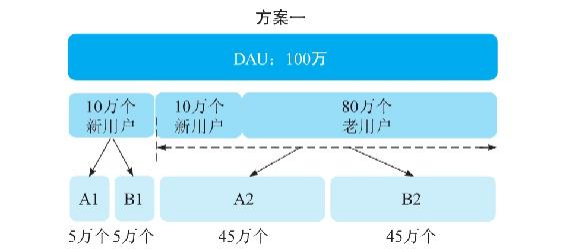

图4-5 只锁定参与实验用户的分流方法

&#x20;     实验组A2的人均使用时长为\[80×(20+1)+10×(10+2)]/(80+10)=20min。

&#x20;     对照组B2的人均使用时长为(80×20+10×10)/(80+10)=18.89min。

&#x20;     实验组A2提升：(20-18.89)/18.89≈5.87%。

&#x20;     实际上对产品来说，整体新老用户的构成是2∶8而不是1∶8，修正后实验2的影响如下。

&#x20;     修正后实验组A2的人均使用时长为\[80×(20+1)+20×(10+2)]/(80+20)=19.2min。

&#x20;     修正后对照组B2的人均使用时长为大盘平均时长18min。实验组A2提升：(19.2-18)/18=6.67%。

&#x20;     可以看到，修正后的实验组A2对于大盘提升了6.67%，高于没有修正时的5.87%。也就是说这种方式可能给大盘实验效果估计带来偏差。

&#x20;     方案二：如图4-6所示，实验1需要10万个新用户，按照新老用户比例抽取大盘中的50万个用户，将其中的10万个新用户分为A1、B1两组进行实验，其余40万个被抽取的老用户不参与实验且被锁定，不再参与其他实验的分流。剩下的50万个用户（10万个新用户和40万个老用户）进行实验2，不区分新老用户，对用户整体进行随机分流，分为A2、B2两组进行实验。此时实验2的结果和大盘预估是一致的，因为用户比例和大盘是一致的。

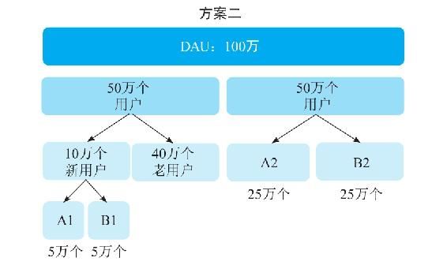

图4-6 锁定全部分流用户的分流方法

&#x20;     实验组A2的人均使用时长为 \[40×(20+1)+10×(10+2)]/(40+10)=19.2min。&#x20;

&#x20;     对照组B2的人均使用时长为18min。&#x20;

&#x20;     实验组A2提升：(19.2-18)/18=6.67%。&#x20;

&#x20;     在流量够用的情况下，建议使用方案二。如果流量比较紧张，采用方案一时需要特别注意正确评估实验对于大盘的影响。方案二还有一种情况是，40万个用户也参与实验指标的计算。这样虽然实验分流处理更简单，但是这40万个不参与实验的用户会稀释实验效果，影响实验评估的精度。

### 4.2 实验参与单元的SUTVA问题

&#x20;     实验参与单元满足SUTVA是实验分析的前提，如果实验单元不符合SUTVA，得到的实验结论大概率是无效的。究竟什么是SUTVA，为什么需要让SUTVA成立，哪些情况会导致SUTVA不成立，以及如何解决SUTVA不成立的问题，都是我们在进行AB实验时需要掌握和关注的。

#### 4.2.1 什么是SUTVA

&#x20;    SUTVA（Stable Unit Treatment Value Assumption，个体处理稳定性假设）是指在AB实验分析中，假设实验中每个实验参与单元的行为是相互独立的。对于以用户为实验参与单元的情况来说，独立的意思就是一个用户的行为不受其他用户影响。在大多数应用中，这是一个合理的假设，比如使用带有折扣券的新结账流程的用户更有可能完成购买，并且该行为独立于其他用户；领取了红包的用户更愿意回到App进行消费，并且这个行为独立于其他用户。如果A组用户相互干扰和沟通，或者不同组之间的用户相互干扰，比如A组用户与B组用户沟通，B组用户发现自己没有红包，通过一些方法也去领了红包，这个时候SUTVA就不成立了。如果SUTVA不成立，实验结果分析将导致结论不正确。我们将违反SUTVA的情况称为干扰了个体处理稳定性假设，也称为实验参与单元之间的溢出或泄漏。

#### 4.2.2 为什么需要让SUTVA成立

&#x20;     AB 实 验 因 果 分 析 主 要 基 于 鲁 宾 因 果 模 型 （ Rubin CausalModel，RCM）进行，这是AB实验分析的一个标准框架。鲁宾因果模型的分析框架有3个基本要素。

●潜在结果

●SUTVA

●分配机制

&#x20;     潜在结果的意思是，给定一个实验单元和一系列动作，把一个“实验单元-动作”确定为一个潜在结果。“潜在”这个词表达的意思是并不总能在现实中观察到这个结果，但理论上可能发生。对于任何一个实验单元，​“处理动作”与“不处理动作”这两个潜在结果之间的差别就是处理的因果效用或者处理效果。处理效果定义为

&#x20;       E=Y（处理动作）-Y（不处理动作）​，

&#x20;      表达式中括弧内的是干预动作，Y表示这个动作的效果。以头疼吃药为例，要评估头疼吃药是不是有作用，存在4种可能性的组合。

&#x20;     ●Y（吃药）=不头疼；Y（没吃药）=头疼

&#x20;     ●Y（吃药）=头疼；Y（没吃药）=头疼

&#x20;     ●Y（吃药）=不头疼；Y（没吃药）=不头疼

&#x20;     ●Y（吃药）=头疼；Y（没吃药）=不头疼

&#x20;     对应的实验效果E如下。

&#x20;     ●吃药使头疼消失了（即有效，证明因果关系陈述成立）。

&#x20;     ●吃药没有效果。

&#x20;     ●吃药有没有效果未知。

&#x20;     ●吃药阻止头疼消失（反效果、负效果，虽然不常见，但理论上存在这种可能）。

&#x20;      因果推断的基础问题是，对于同一个实验单元，最多只有一个潜在结果被实现，从而只有一个潜在结果能被观测到，总有一个观测不到，即缺失值。因为因果效应是指在同一时间，对同一单元的处理和不处理的对比，处理效果的计算依赖于所有的潜在结果，而不只依赖于实际观测到的结果，所以就无法直接结算因果效应。而且，实际上参与实验效果评估的往往不止一个实验单元，当考虑多于一个实验单元时，事情会变得更复杂。

&#x20;      举一个例子，假设Andy和Cathy在同一个办公室，并且都在为同一门课准备教案。两个人可能同时头疼，并且两个人都可以选择吃药或不吃药。现在每个人都有A、B、C、D共4种潜在结果，针对4种潜在结果的两两组合，一共有6种组合($$\binom{4}{2}$$=6)

&#x20;     为什么两个人的行为要一起考察呢？这是因为两者的行为可能存在相互影响。影响因素可能是，Cathy说：​“对不起，我头疼做不了教案了。”那么Andy要做更多的工作，因此也头疼了。当只有1个人时，只需进行两个潜在结果（吃药或不吃药）的比较，并可以观测到1个数据点（1个人的1个实现）​；当变成2个人后，就需要进行4个潜在结果的6种比较，而实际上只能观测到2个数据点（2个人的各1个实现）​，情况就变成了2个数据点的6种比较，这样观测到的数据就更少了。当有更多的实验单元时，添加了更多的潜在比较，用于比较的潜在结果数据就越发不够了。这样，我们将永远无法获得足够的数据去估计想要的东西。想要解决相互影响导致的更多结果不可观测的问题，可以假设Cathy不影响Andy，Andy也不影响Cathy，每个人吃或不吃药与另一个人做什么互不影响，会使问题变得简单一些。把这个想法扩展到多个单元，可以做出定义：任何单元的潜在结果不会因分配给其他单元的处理而变化，并且对于每个单元，不同的处理对应唯一不同的结果。这就是SUTVA。

&#x20;     SUTVA可以解决这种相互影响导致更多潜在结果无法获得，从而无法进行因果效应估计的问题。即使在SUTVA的基础上进行因果效应的估计，还需要分配机制满足一定的要求。如果分配机制不合理，得到的实验结果也是有偏差的。因为一些个体参与实验，另一些个体没有参与实验，本质上无法观测到同一批用户的两个结果，所以需要从可以观测的结果出发，通过分配机制，估计未观测的结果，从而得到因果效应。如果没有合理的分配机制，会出现什么情况？还是以头疼吃药为例，可以先找一群吃了头疼药的人记录结果后取平均，再找一群没有吃头疼药的人记录结果后取平均，两者之差如下。用T=1表示实验组吃药的人，T=0表示对照组不吃药的人。

&#x20;    上式中，由于需要实际观测数据，实验组只能观测到吃药的效果，对照组只能观测到不吃药的效果，因此上面的等式等价为

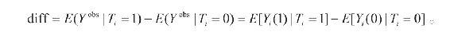

&#x20;    上式中，E\[Yi(1)|Ti=1]是实验组吃药的效果，E\[Yi(0)|Ti=0]是对照组不吃药的效果。为方便比较，引入一项无法观测的数据，实验组不吃药的效果为E\[Yi(0)|Ti=1]，等式变为

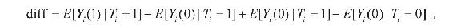

&#x20;    其中，E\[Yi(1)|Ti=1]-E\[Yi(0)|Ti=1]是实验效果，E\[Yi(0)|Ti=1]-E\[Yi(0)|Ti=0]是选择偏差。

&#x20;    选择偏差代表在实验组和对照组都不接受处理时存在的系统偏差。如果选择偏差非常大，处理效果甚至会相反。

&#x20;    选择偏差是很常见的，比如去医院的都是病人，他们的身体状况通常很差，吃头疼药的都是头疼的人等。分配机制就是要小心翼翼地保证实验组和对照组的人事先并不存在这种系统性的偏差。

&#x20;    由于鲁宾因果模型在3个基本要素的共同作用下才能进行因果效应的估计，因此实验参与单元需要满足SUTVA。

#### 4.2.3 导致SUTVA不成立的原因

&#x20;   干扰个体处理稳定性的方式主要有两种—直接连接和间接连接。直接连接比较好理解，比如发生互动等直接的关系。间接连接是由于某些潜在变量或共享资源存在而产生的关系，例如共享相同广告活动预算的对照组与实验组。两种连接的相似之处在于，都有一种媒介连接实验组和对照组，并允许它们相互作用。连接介质可以是物化的社交网络上的友谊连接，也可以是实验组和对照组用户共享一个广告预算池。了解干扰的作用机制非常重要，因为解决问题的最佳方案可能会因机制不同而有所不同。为了使问题更具体，本节通过一些例子进行讨论。

##### 1.直接干扰

&#x20;    如果两个实验单元是社交网络上的朋友，或者他们同时访问相同的物理空间，则两个单元可以直接连接。由于两个直接相连的单元可以分成实验组和对照组，因此在两个组之间会造成干扰。比如，对照组中的用户会受到实验组中用户所采取动作的影响。对照组只是一个名义上的对照组，不再反映实验组不存在时将会观察到什么结果。如果忽略网络互动，就会得到对实验组效果的有偏见估计。而这些网络交互是正在进行AB实验的产品和场景不可避免的。目前还没有一种单一的方法可以减轻网络相互作用对估计实验效果准确性的影响。下面是一些常见的直接干扰例子。

&#x20;   在Facebook、LinkedIn、微博、抖音等社交网络以及拼多多等电商购物中，用户行为可能会受到其社交社区行为的影响。用户发现一项新的社交参与功能更有价值，可能是因为有很多的朋友使用它，所以自己更有可能使用。从用户的角度看：

●如果我的朋友使用Facebook，我更有可能在Facebook上使用视频聊天；

●如果我的朋友在微博上给我发消息，我更有可能在微博上给他们发消息；

●如果我的朋友邀请我在拼多多注册，我更有可能在拼多多购物。

&#x20;     在AB实验中，这意味着如果实验对使用者有重大影响，这种影响可能会蔓延到他们的社交圈，无论是在实验组中还是在对照组中。例如，LinkedIn上“你可能认识的人”算法中有一种更好的推荐算法，它鼓励用户发送更多的邀请链接。然而收到这些邀请的用户可能就是对照组成员，当他们接受邀请访问LinkedIn时，可能会发现有更多的人可以联系。如果感兴趣的主要度量指标是发送邀请的总数，则实验组和对照组邀请都可能会增加，实际增量会被抵消一部分，从而不能完全捕获新算法的好处。如果实验组鼓励用户发送更多消息，对照组也会看到随着用户回复而发送的消息增加了。

&#x20;   作为沟通工具，QQ、微信上的每一次沟通都至少涉及两方。显然，如果用户决定用微信给朋友打语音电话，朋友最终会更多地使用微信，至少是为了接听这个语音电话。这位朋友很可能还会使用微信给他的朋友打语音电话。在AB实验中，假设微信改善了实验组的呼叫质量，增加了来自实验组的呼叫，这些呼叫可以拨打给处于实验组或对照组的用户。结果是由于对照组中的用户也增加了使用微信进行通话的次数，因此实验组和对照组之间的差值被低估了。

##### 2.间接干扰

&#x20;   通过某些潜在变量或共享资源，两个实验单元可以有间接连接。与直接连接一样，这些间接连接也可能对实验效果造成干扰。间接干扰的情况更为普遍。下面是一些间接干扰的例子。

&#x20;   假设Airbnb改善了实验组用户的转换流程，促成了更多的预订，自然会导致对照组用户的库存减少，这意味着对照组产生的收入比没有实验组时要少  。比较实验组和对照组会导致高估实验效果。假设滴滴要测试一种新的涨价算法，让实验组的乘客更有可能选择搭车，从而导致路上可用的司机少了，因为实验组的价格上涨了，导致对照组可用的司机减少，所以比较实验组和对照组的增量被高估了。

&#x20;   在向用户显示相同广告不同排名的实验中，如果鼓励更多的广告点击，就会更快地耗尽广告预算。因为同一个给定活动的预算在实验组和对照组之间共享，所以对照组最终的预算少了。实验和对照之间的差值被高估了。

&#x20;   无论是直接干扰还是间接干扰，最终都会使得实验组和对照组之间的差异被错误估计，所以我们需要想办法尽量降低这种干扰对于实验结果评估带来的偏差。

4.2.4 如何解决SUTVA不成立的问题

&#x20;   虽然4.2.3节列举的干扰是由不同原因造成的，但它们都可能导致有偏差的结果。有几类实用的方法来解决AB实验中的干扰问题，了解干扰的机理是找出好的解决方案的关键。

&#x20;  1.建立监控和报警

&#x20;  虽然不是每个实验都能获得精确的测量，但重要的是要有一个强大的监测和警报系统来检测这些极端干扰问题。比如，实验期间所有的广告收入都来自预算受限的广告商或不受预算约束的广告商，那么实验结果在推出后就不能推广了。再比如，一次实验消耗所有CPU。

&#x20;  2.隔离法干预

&#x20;   连接实验组和对照组的介质发生作用，可以通过识别连接介质并隔离用户来消除潜在干扰。要创建隔离，必须考虑其他实验设计，以确保实验单元和对照单元被很好地分开，以下是一些实用的隔离方法。

（1）共享资源隔离

&#x20;   如果共享资源造成干扰，那么将其在实验组和对照组之间分开显然是首选。例如，可以根据用户量分配来分割广告预算，只允许20%的流量消耗20%的预算。在应用此方法时需要注意两件事。

●干扰资源是否可以完全按照用户的流量分配进行划分，虽然预算数据很容易实现这一点，但这通常是不可能的，例如，在共享机器的情况下，单个机器之间存在异构性，服务于实验组和对照组的机器不同可能引入难以识别的混杂因素。

●流量分配（资源分割大小）是否存在偏差，对于训练数据，模型的性能随着训练数据的增加而提高。如果实验模型只获得5%的数据来训练，而对照模型获得95%的数据，这就引入了对照模型的偏差。这也是建议流量分配为50∶50的原因之一。类似的市场效应也会影响在线广告实验。在线广告实验中增加了实验组对广告预算的消耗，从而增加了广告收入，由于实验组和对照组共享预算池，实验组其实是在窃取对照组的预算，因此当实验发布给所有用户时，总收入不会增加。防止预算窃取的一种方式是按照暴露于实验组和对照组的用户流量百分比来分割所有广告预算。虽然这样解决了预算窃取的问题，但并不能帮助我们了解实验是否会导致收入增加。合理地选择实验观测指标也是至关重要的，比如这个问题中，对比预算使用率是更好的实验观测指标。

（2）地理位置隔离

&#x20;  在双边市场中，由于需求和供给曲线，因此不同用户的行为是相互关联的。以乘车服务为例，当一名司机与一名乘客匹配时，乘客附近其他司机匹配的可能性就会降低。将乘客或司机简单随机分成实验组和对照组会导致市场状况的变化，从而使估计的实验效果产生偏差。为了减少用户之间的网络交互，Lyft通过在不同大小的空间区域或时间间隔之间进行随机抽样来进行整群抽样，以确保不同变量之间的市场状况相似。实验单位越粗糙，持续存在的干扰偏差就越少，尽管这会增加估计方差。优步已经尝试将这种方法引入一组随机的市场，并用一种合成控制来预测反事实。两个单元的地理位置接近，出现干扰的例子很多，例如两间酒店争夺同一名旅客，或两辆出租车争夺同一名乘客。可以合理地假设来自不同地区的单元是彼此隔绝的，这使得实验可以在区域水平上进行随机化，以隔离实验组和对照组之间的干扰。需要注意的是，在地理水平上的随机化可以通过地理位置的大小来限制样本大小。但这种隔离也会导致AB实验的方差较大，功效较小。

（3）网络族群隔离

&#x20;     与基于地理的随机化类似，在社交网络上，可以根据节点干扰的可能性构建彼此接近的节点的簇，然后将簇作为“巨型”单元独立、随机分为实验组或对照组。这种方法有两个局限性。

&#x20;   ●在实践中很少有完全孤立的情况，对于大多数社交网络而言，连接图通常过于密集，无法分割成完全隔离的簇。例如，当试图在整个LinkedIn网络创建10000个相互隔离、平衡的集群时，集群之间仍有超过80%的连接。

&#x20;   ●与其他大单元随机化方法一样，有效样本量（聚类数）通常较小，这导致在构建聚类时需要权衡方差和偏差。虽然簇的数量越多，方差越小，但也给我们带来了更大的偏差和更少的孤立性。

&#x20;    在LinkedIn和Facebook的许多产品中，用户会彼此影响。这些影响有助于设计更好的AB实验。LinkedIn使用egoClusters方法，创建大约20万个ego簇，其中包括“自我”​（指标被测量的个人）和“改变者”​（接受实验，但对其指标不感兴趣）。在所有簇中，​“自我”都得到了处理。在实验组簇中，所有“改变者”都会得到处理。在对照组簇中，所有“改变者”都不做处理。对于简单的双样本t检验，在实验簇的“自我”和对照簇的“自我”之间，给出了所有连接都得到处理与不处理的近似一阶效应。Facebook和Google采用了类似的基于簇的随机化技术。关于基于网络关系划分簇，然后以簇为单位做AB实验，感兴趣的读者可以阅读相关领域的论文。

##### 3.边缘度分析

&#x20;  一些泄漏发生在两个用户之间明确定义的交互中，这些相互作用很容易识别，因为交互一般是从一个用户到另外一个用户，所以可以看作数学上的一条有方向的边。可以对用户进行随机化，然后根据用户的实验分配将边标记为4种类型之一：从实验组到实验组的边、从实验组到对照组的边、从对照组到对照组的边和从对照组到实验组的边。

&#x20;   对比发生在不同边的交互（例如消息、点赞）的量，能够了解这些网络互动效果的影响程度。例如，使用实验组到实验组和对照组到对照组之间的对比度来估计无偏增量，或识别实验中的单元是否更喜欢向其他处理单元发送消息，以评估实验策略的互动效果，以及由实验组创建的新操作是否获得更高的应答率。LinkedIn在分析一对一消息传递实验时，明确计算消息数，包括留在实验组内的消息、留在对照组内的消息和2个组相互交叉的消息，将这些类别的消息总数通过实验进行对比，以衡量网络交互的影响。

&#x20;   在Skype上，将一些与呼叫质量相关的实验在呼叫级别进行随机化，每个呼叫被处理或控制的概率相等，然后观察实验组的各项呼叫指标是否有明显改善，其中也包括这4种类型的呼叫边的数量。在实验过程中，单个用户可能会进行多个呼叫，这种以呼叫为随机单元的方法不考虑来自实验用户的内效应。

##### 4.生态经验法

&#x20;  并不是所有的用户操作都会在不同组间相互干扰。可以确定可能会溢出的操作，并且只有这些操作在实验中受到实质性影响时才会担心干扰。这表示我们不仅需要关心一阶动作，还需要关心一阶动作的潜在反应。

&#x20;  例如，考虑在社交网络上进行实验的指标，包括发送的消息总数和响应的消息总数、创建的帖子总数、帖子收到的点赞总数和评论总数以及这些点赞和评论的创建者总数。这些指标可以在一定程度上反映一阶动作的下游影响。通过测量，可以估计一阶动作对潜在生态系统影响的深度和广度。对一阶动作有积极影响而对下游指标没有影响的实验，不太可能产生可测量的溢出效应。一旦确定了能反映下游影响的指标，就可以建立关于每个行动如何转化为整个生态系统的价值或参与的普适指导，例如，来自用户A的消息翻译成来自A及其邻居的访问会话的数量是多少。建立这一经验法则可以使用被证明具有下游影响的历史实验，并使用工具变量法将这种影响外推到其他行动的下游影响。

&#x20;  这种经验法则相对容易实现，只需要建立生态系统价值，可以将其应用于任何实验。然而，这种方法确实有局限性。从本质上讲，经验法则只是一个近似值，并不一定适用于所有场景。例如，由某种实验产生的额外消息可能会对生态系统产生比平均水平更大的影响。

##### 5.双边随机化

&#x20;  在很多产品中，用户角色之间存在明显的生产者、消费者区别。

&#x20;  例如，在抖音、快手等视频内容App中，有内容生产者，也有内容消费者。在这种场景下，进行内容相关的实验时通常使用双边随机化。例如，测试给内容贴上不同类型的标签是否能增加消费，这里有两个正交实验同时进行，一个控制生产体验，另一个控制消费体验。

&#x20;  生产实验允许实验中的用户将标签添加到他们的帖子中，消费实验允许实验中的用户在他们的提要上看到标签。如果我们做一个简单的AB实验，把这两个功能放在一起，那么实验就会出错：生产者效应被低估了，因为一般实验流量控制在10%以下，即潜在的消费者不到全体用户的10%。就这个例子而言，如果生产实验中实验组的用户可以发布标签，但并不是每个人都能看到它们，那么该用户很可能会减少参与。消费者效应也被低估了，因为潜在的生产者太少了。能够看到标签可能会让用户更投入，但如果使用它们的人太少（即只接受实验的人可以看到）​，就不会有这种效果。使用双边随机化的优点是，当95%的消费者可以看到生产的内容时，生产者的效果（比如50%的灰度）更准确；当95%的生产者“启用”时，消费者测试（比如50%的灰度）更准确。

&#x20;  这种方法可以不考虑生产商之间的竞争影响，在这种情况下，如果有足够的功率，比起50%的灰度，95%的灰度更常用。此外，有的情况下可能无法在功能中将消费者从生产者中分离出来。例如，如果用户提到另一个使用“@提及”功能的用户，则必须通知该功能的使用者被提及。这样的情况下，可以考虑采用一些其他的度量手段，比如将其视为一种互动进行评估。

### 4.3 最小实验参与单元数量

&#x20;  从统计理论上，实验样本量（即实验参与单元数量）越多越好，因为如果实验参与单元数量太少，实验容易被个别样本点带偏，造成实验结果不稳定、难以得出准确的结论。样本数量变多，实验就有了更多的“证据”​，实验的可靠性也就越强。

&#x20;  然而，在现实操作中，进行实验的样本量应该越少越好，原因有如下两点。

●流量有限。大公司因为用户数量足够多，所以不用过于精打细算，同时跑几十个甚至上百个实验也没问题。小公司一共就那么点流量，还要开发这么多新产品。在保证不同实验的样本不重叠的情况下，产品开发的速度会大大降低。

●试错成本高。假设我们对50%的用户进行实验，不幸的是，1周后结果表明实验组的总收入下降了20%。算下来，实验在一周内给公司带来了10%的损失，这个试错成本太高。

&#x20;  不难看出，选择样本数量是个技术活，样本量太小，结果不可信；样本量太大，试错成本太高。问题的关键变成，如何确定一个“最小”的样本数量，在保证实验“可靠性”的同时，不会浪费过多流量。在确定最小实验样本数量的时候，主要受到哪些因素的影响呢？根据统计学的知识，需要考虑以下4个因素。

#### 4.3.1 显著性水平

&#x20;  显著性水平一般常用α表示，其含义是第一类错误出现的概率，可用于控制第一类错误。第一类错误在实验中表现为实验没有效果，却判断为有显著效果。在商业背景下，第一类错误意味着新产品对业务其实没有提升，我们却错误地认为有提升，把不好的新功能推向全部用户，损害用户体验。这样的决定，不仅损害公司的长期利益，浪费了公司的资源，而且还让部分人得到了不应得的奖励，这种错误是实践中最为常见的。在做AB实验时，公司一般会选择一个可以接受的α作为上限，最常见的是5%。5%的含义就是在做实验的时候，保证第一类错误出现的概率不超过5%。

#### 4.3.2 统计功效

&#x20;  统计功效一般用1-β表示，是指实验本身有效果同时也被判断为有效果的概率。统计功效越高越好，如果功效太低，比如只有50%，意味着实验结果只有50%的概率被检测出来，这种情况是对团队资源的极大浪费。β对应的就是第二类错误，表示实验有效果但是被判断为无效果。一般来说，统计功效要在80%以上。

&#x20;  对于一个AB的实验。

●第一类错误不超过5%，即α≤5%。

●第二类错误不超过20%，即1-β≥80%。

&#x20;  这表明了实验者对于两类错误上限的选取。这两个数据背后代表的理念是，宁可砍掉4个好的产品，也不应该让1个不好的产品上线。这也是绝大多数AB实验所秉持的基本思想。每个产品可以根据自己的实际情况控制两类错误。

#### 4.3.3 基线水平

&#x20;  基线水平是指在实验开始之前，对照组中所关心的实验指标的表现情况，也就是产品不做改变时的指标水平。常见的指标类型有比率类指标（比如用户付费转化率、点击率等）和均值类指标（比如人均时长、人均支付金额等）​，下面分别讨论这两种指标的情况。

&#x20;   比率类指标，以推荐系统中的点击率为例，如果对照组的点击率是15%，意味着基线水平是15%。对于这种比率类的指标，从直观上来理解，当基线水平很大（接近1）或者很小（接近0）的时候，实验更容易检测出差别。举个极端的例子，假设之前的推荐系统非常不准确，对照组的点击率为0，基线水平为0，如果新的推荐算法只有一个用户点击，相对于对照组来说也是挺大的提升。此时，即便是微小的变化，实验效果也会更容易地检测出来。更容易检测出变化，意味着功效变大，如果保持功效不变，那么所需要的样本数量变少。同理，当基线水平居中（在0.5附近）的时候，实验的功效会变小，如果保持功效不变，那么所需要的样本数量会变大，如图4-7所示。

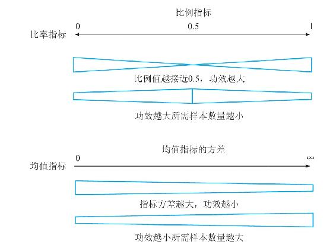

图4-7 不同类型指标的基线水平与功效、实验样本量的关系

&#x20;  对于均值类的指标，主要是考虑对照组的方差分布，也就是这个指标的波动，数据整体偏离平均值的情况如何。如果方差小，意味着波动小，那么实验更容易检测出差别，功效大，如果保持功效不变，那么所需要的样本数量变少；如果方差大，意味着波动大，那么实验更不容易检测出差别，功效变小，如果保持功效不变，那么所需要的样本数量变大，如图4-7所示。

#### 4.3.4 最小检出水平

&#x20;  顾名思义，最小检出水平用于衡量实验判断精确度的最低要求。参数越大说明期望的精度越低，比如10%，说明我们希望实验能够检测出10%的差别即可。检测这么大的差别当然比较容易（功效变大）​，保持功效不变的情况下，需要的样本量会变小。参数小（比如1%）​，说明我们希望实验可以有能力检测出细微的差别。检测细微的差别当然更加困难（功效变小）​，如果要保持功效不变，需要的样本量会增加。

&#x20;  在工作中，最小检出水平参数的选定往往需要和业务方一起商定。比如在的实验中，我们选定最小检出幅度为5%。这意味着，如果绿色按钮真的提高了5%以上的点击率，我们希望实验能够有足够把握检测出这个差别。如果低于5%，我们会觉得这个差别对产品的改进意义不大（可能是因为点击率不是核心指标）​，能不能检测出来也就无所谓了。

&#x20;  计算最小实验单元数的过程，总结起来就是为了将第一类和第二类错误控制在一定范围内，达到一定的实验置信度和业务评估精度，需要实验单元的参与数量满足最小样本量。影响这个最小样本量计算的有4个因子—显著性、统计功效、指标（方差）、最小检出水平 。 计 算 方 法 可 以 参 考 3.3 节 和 3.6 节 ， 也 可 以 直 接 采用http://www.evanmiller.org/ab-testing/sample-size.html 的小工具。

## 五、AB实验的随机分流

&#x20;  在对实验参与用户进行随机分组时，需要重点关注几个问题：

1）用户如何被随机分为实验组和对照组；

2）实验量增加后，流量不够用的问题如何解决；

3）不同层之间的正交性是如何实现并保证的；

4）随机分流时如何选择散列算法。本章针对这些问题展开讨论。

### 5.1 单层分流模式

&#x20;  先来介绍在AB实验中，变量分配是如何实现的，也就是用户是如何被随机分为实验组和对照组的。通常使用散列函数将用户随机地分配给不同的桶（bucket）。比如，把1000万个用户用散列函数映射到1000个桶中，每个桶中包含随机分配的10000个用户。如果我们的实验计划是要获得20%的流量，那么就从中随机选取200个桶的用户进行实验。将用户分配到桶必须是随机的，且必须是确定性的、不相交的。比较运行相同实验的任意两个桶，须假定它们在统计上相似，这才具有可比性。这种相似性可以通过AA实验（见第7章）进行验证。

&#x20;  随机过程看似简单，往往也会出现很多问题，我们应该配置相应的监控任务。Google、Microsoft等公司通过监控桶特征发现了随机化代码中的错误。还有一个常见的问题是残留效应，先前的实验可能会污染当前实验的桶。对每个实验中的桶进行重新随机化或洗牌，使它们不再连续，也是一种常见的解决方案。

&#x20;  在运行实验初级阶段，实验数量通常很少，采用单层分流模式就可以满足。单层是指不重复利用用户，在同一个时间内，用户最多只会参与一个实验。当同时运行的实验很少时，这是一个看似合理的选择。然而，这么做的缺点是对并发实验数量有限制，必须确保每个实验有足够的实验样本量以获得足够的功效。操作上，在单层系统中管理实验流量可能很有挑战性，即使在早期阶段，实验也是并发进行的，只是不是在单个用户上。

&#x20;  LinkedIn、Microsoft和Google都是从手动管理实验流量的方法开始管理并发的（所有可以参与实验的实验参与单元数量统称为实验流量）。LinkedIn团队使用电子邮件协商实验流量范围。Microsoft由项目经理管理实验流量。而Google从电子邮件和即时消息协商实验流量开始，然后转移为项目经理管理。然而，手动管理流量的方法太影响效率，随着时间的推移，这三家公司都转向了程序化分配。不管采用什么样的分配方式，都会面临实验流量不足的问题，迫切需要解决这个问题。

### 5.2 正交分层模式

&#x20;  为了解决单层随机分流模式下流量不够用的问题，要将实验扩展到单层方法所能实现的范围之外，需要转移至某种并发实验系统。在这种并发系统中，每个用户可以同时进行多个实验。实现方法是拥有多个实验层，其中每一层的行为类似于单层方法。为了确保层间实验的正交性，在把用户分配到桶时，会添加层id，也称为盐值。层与层之间的正交性就是靠散列函数加层id的方式来保证。这就是业界通用的正交分层模式，即通过散列函数和加盐值的方法实现实验流量的复用。本节介绍正交分层模式中的两个关键点：1）正交性是如何保证的；2）如何确定分多少层且如何使用。

#### 5.2.1 正交性问题

&#x20;  简单来讲，如果第一层所有用户都均匀随机地分布到了其他层的实验里，则可以认为第一层实验是符合正交性的，其他层的实验可以依次类推。各层之间类似平行关系，不相交、不影响，这样各层之间的影响就通过正交随机打散的方式被抵消了，每一层看到的仍然是该层中这个特征的实验效果。在多层正交正常的情况下，实验期如果实验组A应用了新策略，实验组A相对于对照组B的指标数据有变化，则这个变化一定是A的新策略导致的。虽然A组中的用户也可能会参与其他层的实验，但是这些实验对于A、B的影响是一样的。下面来简单推导一下正交性是如何实现的，如图5-1所示。

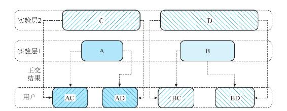

图5-1 层与层之间的正交性&#x20;

&#x20;  实验层1中有实验组A、实验组B，分别占用流量比例为N(A)、N(B)。

&#x20;  实验层2中有实验组C、实验组D，分别占用流量比例为N(A)、N(B)。

&#x20;  如果实验层1和实验层2符合正交性，就有如下等式成立，N(AC)表示同时命中实验组A和实验组C的用户数量。

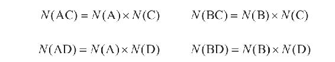

&#x20;  假设实验的观察指标是点击率，当实验组A、B、C、D都不应用任何策略时，R(A)=R(B)=R(C)=R(D)=p，R代表点击率。

&#x20;  假设实验层2的实验组C应用了新策略，点击率相对提升为α，那么此时R(C)=(1+α)×p。

&#x20;  实验组C对实验组A的影响分两部分，一部分是被C策略影响的用户N(AC)，效果为(1+α)×p，一部分是没有被C策略影响的用户1-N(AC)，效果仍然为p，此时原来A策略作用人群总效果，以R'表示，计算公式如下。

&#x20;  因为正交性N(AC)=N(A)×N(C)，上面等式可以变为

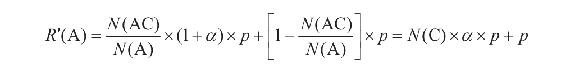

&#x20;  实验组A观察指标变化为

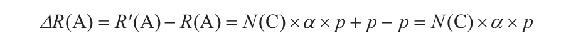

&#x20;  这个变化说明实验C对于实验A的影响和N(A)没有关系，同样的实验C对于实验B的影响也和N(B)没有关系。

&#x20;  实验层2中的实验组C对于实验层1中实验组A、B的影响是完全一样的，在对比A、B两组实验效果的时候，实验组C的效果就完全被抵消了，从而实现了层与层之间实验效果相对独立。如图5-2所示，两个正交层，实验层1中10%的用户命中实验组A，实验层2中30%的用户命中实验组C，从用户视角来看，应该有3%的用户同时命中实验组A和实验组C。分层的同层之间的实验比例N(A)︰N(B)=1︰2，从用户视角看保持不变，即N(AC)︰N(BC)=1︰2。有如下等式：

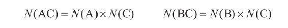

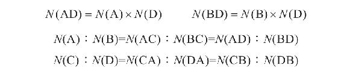

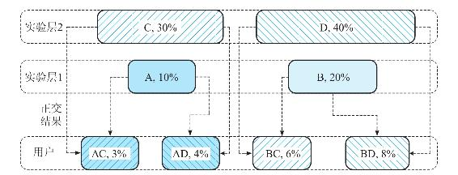

图5-2　层与层之间正交后对效果影响的计算

#### 5.2.2 分层问题

&#x20;  通过正交分层解决流量的复用问题后，接下来要考虑分多少层的问题。一种极端的情况是，将每个实验都单独作为一层，这也被称为全析因实验设计，每一种可能的因素组合都作为变量进行实验。如果我们将其扩展到一个平台，那么用户可能同时参与所有实验。对于每个运行的实验，用户都会被分配一个变量（对照组或任意实验组）。由于每个实验都与唯一的层id相关联，因此所有实验彼此正交。相同实验的迭代通常共享相同的散列id，以确保用户获得一致的体验。这种简单的并行实验结构允许以分散的方式轻松地扩展实验数量。

&#x20;  这种平台设计的主要缺点是不能避免潜在碰撞，如果两个不同实验中的某些实验参数同时发生变化，用户的体验会很差。例如，有两个实验，在实验1中测试蓝色文本，在实验2中测试蓝色背景。对于碰巧同时接受这两个实验的用户来说，这将是一次可怕的体验，显示屏是一片蓝色，完全看不清字体。用统计学的术语来说，这两个实验是“互动”的。在没有考虑两个实验之间产生交互的情况下，每个实验单独测量出的结果也可能是不正确的。需要注意的是，并不是所有的相互作用都是对抗性的，有时两种策略方法都有帮助，只是不是简单叠加。直观来讲，分的层数越多，碰撞的概率就越大。

&#x20;  为了避免糟糕的用户体验，可以使用有限层的划分方式，将系统参数划分为多个层，不同层运行不同类的实验，组合在一起可能会产生较差用户体验的实验必须在同一层中，并防止设计为向同一用户运行。例如，可能有一层实验用于通用UI元素实验（例如页面的标题和标题中的所有信息）​，第二层用于内容实验，第三层用于后端系统实验，第四层用于算法实验等。

&#x20;  有限层有以下两个关键点。

●同类业务互斥且进入同一层。同类业务的含义是改变同一类参数的实验都属于同类，进入同一层是指这一类实验只能放在同一个实验层进行。核心目的还是避免参数碰撞、互动的发生。这里同类的定义不是绝对的，而是相对的，例如，在实验量不是很大的情况下，可以采用较粗粒度，比如UI层算作同类。如果实验量很大，一个层放不下UI实验，就需要继续拆分，比如UI层还可以拆分为文字字体、文字颜色、文字大小等不同的实验参数，放入不同的实验层。还能继续往下拆分为按钮颜色、字体颜色吗？建议最好不要拆到特别细的类目中，这样容易出现冲突和碰撞，带来不好的用户体验。在推荐算法的分层里面，召回、粗排、精排等都可以独立成为一层。

●不同类业务可以拆分到不同层，并行进行，保证实验流量足够，通过正交实现层间效果相互影响的隔离。

&#x20;  仅约束层数有时候不能完全满足实验需求。例如，把字体、大小和颜色都拆分为不同的层，如何做一个同时改变字体、大小和颜色的联合实验呢？为了解决这种层细分后无法进行联合实验的情况，可在层的基础上进行打通，形成贯穿域。在贯穿域中，可以进行各种跨层的联合实验。

&#x20;  在实际工程中，为满足复杂的需求，将层和域演变为各种复杂的组合，这些不同层和域的构造组合，使用的是一种嵌套平台设计。具体选择什么样的组合，取决于业务的实际情况和复杂度。Google、LinkedIn、Microsoft和Facebook的实验架构都使用了这种设计的不同变体。无论选择什么样的构造，在实现层和域的架构时，最好具备灵活组合的能力，否则后期一旦需求变得复杂，就无法满足了。如图5-3所示是一些经典的层域架构。

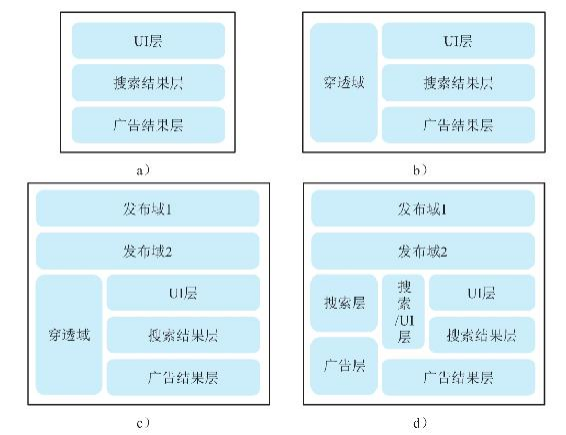

图5-3　常用层域嵌套框架

&#x20;  图5-3中，a图是包含三层的正交层基本框架，b图是包含穿透域、正交层的框架，c图是包含穿透域、正交层、发布域的框架，d图是一个层域嵌套的复杂框架。简单来说，没有被分为多个层的流量称为域。层和域不是绝对关系，可以在层中分域，在域中分层。以图5-3b中的架构为例，一个实验要么在穿透域实验中，要么在分层实验中。在分层实验中，一个实验参与单元最多可以同时命中3个实验（UI、搜索、广告）​，但是绝对不会同时命中穿透域实验和分层实验。也就是说，域和域之间的实验是不会重复的，同一个用户只会被分到一个域的实验中。

### 5.3 散列算法

&#x20;  我们都知道，随机分流的随机性是通过散列算法来实现的。如何选择散列算法呢？不同的散列算法是否会对分流结果有影响呢？一般在工程实践中，对散列算法的评估主要考虑3个方面—**计算性能、均匀性、相关性**。

&#x20;  计算性能主要是指开始分流时散列算法的速度，如果速度不够快，可能会影响线上的响应速度。

&#x20;  均匀性是指在同层之中分为不同实验组的时候，每个组分到的参与用户的数量尽量一致。我们可以用组间差异（Hash\_diff）来表示不同实验组之间参与用户数量的差异。Hash_diff越小，均匀性越好。

&#x20;  相关性是指在不同层的组之间的混合尽量均匀，可以用层间差异（Layer\_diff）来表示，Layer_diff越小，相关性越低。

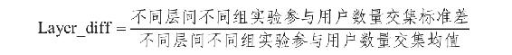

&#x20;  比如有1000万个用户，分为20层，每层100组。

&#x20;  均匀性是在理想的情况下，每个层每个组都有100000个用户，这样同层不同组的实验组数量的标准差为0，Hash\_diff=0。

&#x20;  相关性是在理想的情况下，每个层每个组和其他层某个组的交集的数量都是1000，这样不同层间不同组实验参与数量交集的标准差为0，Layer\_diff=0。

&#x20;  常见的散列算法有MD、SHA、JDB、Murmur等。其中最为常用的是MD和Murmur，Murmur的运算性能更好，抗碰撞性更强，表现出的均匀性、相关性也是最好的，在工程实践中也是运用最多的。

&#x20;  虽然散列算法能从理论上保证分流的均匀性，但是在实际情况中，由于各种复杂的原因，用户的分布可能不是完全均匀的，就有可能导致随机分流的实验组之间出现不均匀的情况。分流不均的一个重要观察指标就是，两组策略完全一致的用户的实验指标数据出现显著的不一致。

&#x20;  这里需要特别强调的是显著的不一致。如果只观察数据绝对值，两组均值通常是不相等的，这是因为存在天然的波动，而且用户量级越小，波动越大，如果是在满足了一定用户量的情况下出现了显著差异，这时大概率是出现了分流不均的情况。分流不均的原因很多，可能是系统出错，也可能是随机过程用户不同质，例如有一小部分特别活跃的用户，因为占比低，所以容易出现各个组之间的不均匀分配，或者受到遗留实验的影响等。为了防止这个问题的出现，一般在实验开始前需要进行检验（如SRM校验、AA实验）​，以确保实验的基础没有偏差。

## 六、AB实验的SRM问题

&#x20;  很多人认为实验一定是按照设计进行的，实际上这一假设失败的概率远高于人们的预期。失败的实验分析结论通常是有严重偏颇的，甚至一些结论是完全错误的。样本比例不匹配问题（Sample RatioMismatch，SRM）是常见的一种导致实验失败的原因。多家公司都在实验中发现了SRM问题，并认为在AB实验中测试SRM是非常有价值的。推荐的做法是每一次实验都包括SRM测试，以保证实验结果的内部有效性和可信性。本章会重点讨论SRM问题发生的原因以及应对方法。

&#x20;  保护指标是一类关键指标，旨在提醒实验者注意可能违反实验假设的情况。保护指标有两类：组织性保护指标和实验可信度保护指标。组织性保护指标用于保护业务不受伤害，实验可信度保护指标针对的是实验本身的可信度，SRM指标就是一种实验可信度保护指标。

### 6.1 什么是SRM问题

&#x20;  SRM问题主要是指实验组和对照组之间的实验参与单元数量（比如用户数、页面数、会话数等）的 比率不匹配 。比如，实验设计要求将一定比例的用户暴露给这两组变量，结果应该与设计非常匹配。由于可能受实验影响，不同实验组的指标会出现差异不同，将用户暴露于不同实验组必须独立于实验处理，因此不同实验组中的用户比例应该与实验设计相匹配。

&#x20;  举例来说，在一个实验中，实验组和对照组分别被分配10%的用户，理想的情况是在每个组中看到大致相等的用户数，而实际结果是实验组有821588个用户，对照组有815482个用户。两者的比率是0.993，而根据实验设计比率应该是1.0。0.993的样本比率的P值为1.8×10-6（计算方法见6.3.1节）​，意味着在实验组和对照组具有相同用户数量的设计中，出现此比率或更极端情况的概率为1.8×10-6。于是，我们认为这属于观察到了一个极不可能发生的小概率事件。

&#x20;  由于小概率事件发生了，因此我们倾向于认为实验的实现过程有较大概率存在错误。因为大概率存在错误，所以不应该信任该实验的任何指标和结果。简单来说，在样本比例的P值较低，且实验样本量足够大的时候，大概率存在SRM问题，此时其他的指标也无法被信任和采用，基本都是无效的。SRM问题体现为实验组和对照组的实际比例和理论比例有所偏差，而分析基于的是理论比例，这个偏差使得分析结果失真，严重时甚至会得到完全相反的结论。

&#x20;  需要特别注意的是，SRM问题中用户比率采用的数量是暴露给实验的全部用户，而不是实验后续漏斗路径中的用户，漏斗用户量的差异可能是实验效果导致的，这不属于SRM问题。

### 6.2 导致SRM问题的原因

&#x20;  导致SRM问题的原因很多，在实验的部署、执行、数据处理和分析阶段都有可能出现SRM问题。

#### 6.2.1 部署阶段

&#x20;  在实验部署阶段，有缺陷的用户随机化是引起SRM问题的主要原因，主要涉及随机性算法的性能和稳定性，如能否完成理想的正交分层，能否完成大量、实时的随机分组，能否在一段时间后依然保持效率和稳定等。虽然基于实验设计比例对实验组和对照组的用户进行简单的Bernoulli随机化是很容易理解和想象的，但由于实验逐步放量（例如从1%开始实验，逐渐增加到50%）、排除和选择（比如实验A中的用户不应该在实验B中）以及试图通过回溯历史数据并调整权重来平衡协变量等问题，因此实验在实践中会变得更加复杂。此外，一些实时服务的漏洞，也会导致分组不符合预期。实验平台在有重要迭代或修改后，尤其需要验证是否对分层分组产生了影响。SRM测试为结果的可信性提供了有效的保障。在随机分流时，有几个典型的问题会导致SRM问题。

##### 1.残留效应

&#x20;  残留效应是指前一个实验污染了相同用户分组的后续实验。通过AB实验发布产品特性的过程通常涉及多个迭代，这些迭代逐步增加，以此降低新特性发布带来的风险，提高新特性发布过程中产品的稳定性和质量，防止发生大面积用户崩溃，甚至回退等严重损害用户体验的情况。为了保持用户体验的一致性，在不同迭代、新特性逐步发布的过程中，需要保持相同的用户分组。具体来说就是在上一个迭代中被分到实验组的用户，在下一个迭代中继续保留在实验组。如果实验改变了用户重新触发实验的概率，这将产生潜在的残留效应。如果一个用户从实验开始就被标记为唯一的用户标识，样本大小和比率就应该符合期望。

&#x20;  然而，为了避免Simspon悖论，人们通常需要在增加实验时重新启动分析。在这种情况下，当用户重新被触发，实验的概率被改变时，样本大小和比率将不符合预期，这是因为用户是从实验开始后的一个时间点计数的。在一个评估“可能认识的人”算法的实验中发现了这个现象。实验表明，虽然这个帮助用户发现“可能认识的人”的算法使得用户有更好的参与度，但在第一次迭代之后开始出现SRM问题。经过仔细调查发现，这是由于该算法非常好，使用户更经常使用这一功能。区分用户中第一次触发实验的用户和返回的用户后发现，在第一次触发实验的用户上没有不匹配，主要是返回用户造成了SRM问题。当残留效应是主要原因时，随着分析周期的延长，样本量比率通常会收敛于预期比率。

&#x20;  这种偏差可以通过重新随机化，或者从实验开始计数唯一的用户来纠正。比如修复漏洞的后遗症也会带来SRM问题，当有漏洞时，一般会重新启动实验。当实验策略对用户可见时，由于要保持一致的体验，不希望改变实验组的用户，因此将分析开始日期设置为引入错误修复之后的时间点。如果漏洞严重到足以让用户放弃，那么就会出现SRM问题，因为实验组的用户数明显低于对照组的用户数。

##### 2.触发前状态

&#x20;  偏差虽然在代码中触发实验的可能只是一行简单的代码，但应用代码的逻辑顺序可能决定实验是否会导致SRM问题，下面用一个例子来说明。某产品推出了一个功能，允许用户通过跟踪他们关心的内容来重建自己的信息流。为了提高用户对该功能的认知，在提要页面的顶部向用户展示了一个交叉推广的小部件。小部件是通过AB实验启动的，这样我们就可以测量它的双重影响，一方面，小部件有可能改进后续新功能产品的使用情况；另一方面，因为小部件分散了用户的注意力，所以它可能会影响用户对信息流的浏览和阅读。此外，为了避免用户每次回来都重复看到小部件，当用户看到小部件超过两次或至少点击一次时，用户就会进入冷却状态。最初，这个交叉推广实验是用下面的逻辑来实现的，虽然代码的逻辑看似为实验提供了正确的逻辑，但在实验启动后，观察到了严重的SRM问题。

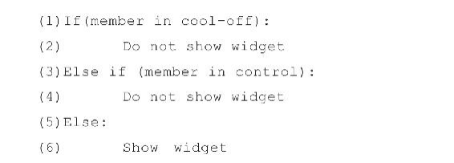

&#x20;  因为触发分析依赖于在实验评估期间触发的跟踪事件（第3行代码）​，所以当用户处于冷却状态时，上面的逻辑不会触发跟踪事件。由于只有实验组的用户在满足条件后才会处于冷却期，因此除非我们从实验开始就计算成员，否则实验组的独特用户就会相应地减少。一旦分析重新开始，就会出现SRM问题。

&#x20;  基于以上逻辑，用户的分析通常是偏负向的，因为更活跃的用户更有可能在早期触发实验，所以更有可能被排除在分析报告之外。解决这个问题的方法是交换第1行和第3行代码。

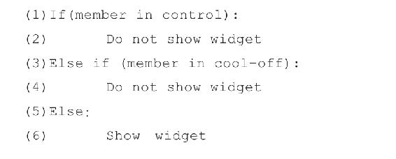

##### 3.动态定向

&#x20;  目标定向目标是指实验运行在特定的用户集上，基于用户的属性和活动特征为他们提供个性化的产品体验。用于确定目标的属性可以是静态的（如性别）​；也可以是动态的，如用户参与度或当时状态（如活跃程度、求职状态、参与度等）等。如果目标属性是静态的，则目标用户集是固定的，几乎不会产生偏差。

&#x20;  动态的目标属性容易发生频繁的变化。如果需要基于这些动态属性来确定目标，则需要在属性的更新时效性和潜在偏差之间进行权衡。如果不考虑用户属性的最新状态，可能会影响用户的体验，比如一个用户已经很活跃了，还在不停采用使其活跃的策略进行刺激，或者一个用户已经不属于新用户，还在对其采用新用户策略。如果考虑用户的最新状态，并因此而改变策略，这种处理方式又可能会改变目标用户的数量。如果在实验开始后更改目标属性，可能会得到不具有可比性的实验组。

&#x20;  在大多数情况下，来自动态定向目标的偏差和残留效应的偏差相似，上一次迭代通常会导致下一次偏差。比如，针对流失用户的实验，实验策略尝试用推送、小红点等拉活手段重新召回他们。当一些用户通过这些活动被召回时，他们不再被归类为沉睡用户，从而导致下一次迭代产生偏差。例如招聘网站对求职信息不完整用户进行实验，试图使用户完成求职信息的填写，当他们填完信息后，就不再属于沉睡用户了。

&#x20;  在一些特殊的情况下，即便是第一次迭代，也会出现SRM问题。

&#x20;  有一个测试“你可能感兴趣的工作”算法的相关性AB实验。首先建立实验，对主动求职者随机提供算法A或算法B服务，其余用户随机提供算法C或算法D服务。同样的随机用户拆分应用于活跃的求职者和其他用户。用户是否主动求职者是一个独立机器学习算法生成的目标属性，主要考虑用户交互的情况。

&#x20;  这个实验的SRM测试失败了。有趣的是，SRM测试只在主动求职者分组之间失败了，也就是算法A和算法B之间的比较测试失败了。事实上算法C的性能非常好，它提升了页面浏览量和页面点击等活动。这些活动在分类模型中用来识别求职者的特征。一些用户被转换为活跃的求职者，并落入算法A的用户组，导致算法A中的用户计数超过预期。即使剩余用户的SRM测试没有失败，算法C和算法D之间的比较仍然被污染了，因为一些被包括在算法C中的人实际上得到了算法A。

&#x20;  这样类似的案例在实际中有很多，假设根据存储在用户配置文件数据库中的数据属性对休眠用户进行实验。如果实验效果足以使一些休眠用户变得活跃，那么在实验结束时基于该属性识别用户将会出现SRM问题，早期休眠而现在活跃的用户将被触发条件排除在外。分析应该在实验开始之前（或分配给每个用户之前）触发休眠属性的状态。基于机器学习算法的触发条件尤其可疑，因为模型可能会在实验运行时更新，并受到模型效果的影响。如果没有进行SRM测试，就很难发现其中存在的问题。

#### 6.2.2 执行阶段

&#x20;   实验部署后进入执行阶段，执行阶段需要下发策略，下发策略时需要对齐时机，保持下发人群的可对比性。假设客户端需要给用户展示两套UI，同时对实验组和对照组下发，以避免下发时机不同带来的偏差。如果实验组下发完，再下发对照组，很可能两个时间段网络情况不一致，用户活跃度有差异，引入不必要的变量，最终会体现到实际样本的偏差上。

&#x20;  即使是同时下发，也需要注意避免引入“不必要的过滤条件”。

&#x20;  以一个我们经常会遇到的实验场景为例，如图6-1所示，A组下发新策略，B组不下发策略。如果实验执行时是A组下发策略而B组不下发策略，最后用A组下发策略成功的用户来和B组对比，可能引入一个“过滤条件”​，因为A组并非100%能下发成功，所以拿A组中下发成功的用户对比整个B组，可能会出错。如图6-2所示，如果我们采用A组下发策略，B组下发空策略，那么下发成功这一层过滤就可以避免掉。

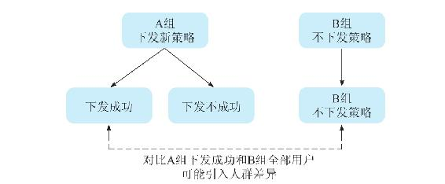

图6-1　是否下发策略可能引入用户过滤

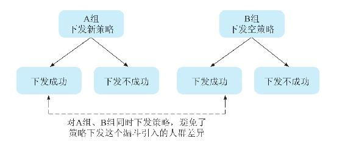

图6-2　通过下发空策略避免用户过滤

#### 6.2.3 数据处理和分析阶段

&#x20;  在数据处理阶段，检查数据处理管道的各个阶段和步骤是否有可能导致SRM问题的漏洞。SRM的一个常见的来源是机器人过滤。数据处理中的一个常见操作是删除机器人流量，因为它们增加了噪声，降低了分析的敏感度。据统计，Bing在美国地区有超过50%的网络流量被识别为机器人行为。这是什么意思呢？简单以一个视频网站举例来说，这个网站50%的视频播放都是机器人的行为，而不是真实的用户在播放。在微软的一个案例中，有一种机器人过滤处理方法过滤掉了最好、最活跃的用户，这不仅触发了SRM问题，更为关键的是导致了数据失真。在数据处理的各个阶段需要非常谨慎。

&#x20;  在数据分析阶段，SRM问题主要是分析过程中一些样本偏差被忽视，以理论的样本比例进行分析而造成的错误。在第五部分会结合一些具体实验案例进行讨论。

### 6.3 SRM指标计算和定位

&#x20;  SRM问题会导致AB实验无效，本节介绍SRM指标计算和定位。

#### 6.3.1 SRM指标计算

&#x20;  虽然导致SRM问题的原因很多，但最终影响实验分析结果时，都是通过实验组和对照组实验参与单元的可比性来实现的。当采样比例指标的P值较低时（一般低于0.001时）​，应该假定大概率是系统中的某个地方存在错误。在找出出错的地方之前，甚至都不用查看其他指标，因为对于实验结论没有参考价值。下面通过一个例子来说明如何计算采样比例指标的P值。

&#x20;  假设有一个实验组和一个对照组，两组样本的期望用户数量是一样的，分别为447500和447500。预期的理想情况是，实验组用户数/总用户数=447500/(447500+447500)=0.5。实际观测发现，实验组用户为445000，对照组用户为450000，实际的实验组用户数/总用户数=445000/(445000+450000)=0.4972。根据比率类指标的方差计算公式计算方差和Z值如下。

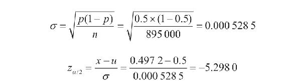

&#x20;  根据Z值反查P值，P值等于1.17×10-7，P值很低（远低于0.001）​，倾向于认为这个实验中出现了SRM问题。

#### 6.3.2 定位SRM问题

&#x20;  当从SRM指标中发现SRM问题后，需要定位SRM的具体原因。

&#x20;  定位SRM通常都很困难，以下是一些常见的定位方法。

&#x20;  验证随机化点或触发点上游没有差异。例如，如果因为更改了结账功能而从结账点开始分析用户，确保该结账点上游的变量之间没有差异。如果在结账处评估五折和买二送一哪个方案更好，不能在主页上提到这些选项中的任何一个，如果提到了，就必须从主页开始分析用户。否则就很容易导致SRM问题。

●验证变量分配是否正确。用户是否在数据流水线的顶端进行了适当的随机化？虽然大多数变量分配系统开始基于用户id的简单随机化方案，但随着时间的推移，分配变得复杂，以支持并发实验和隔离组，其中保证不同的实验不会暴露给相同的用户。

●是否有相同的初始区间。有没有可能这两个变量组并不是一起开始的呢？在某些系统中，一个对照组在多个实验组之间共享，各个实验组的开始时间不同也可能会导致SRM问题。例如，缓存需要时间来启动，应用程序需要时间来推送，手机网络可能离线导致延迟。这种情况出现的概率是很高的，在实际中经常在实验开始后，追加一个实验组，这个追加的实验组和之前的对照组和实验组之间很容易出现SRM问题，以及一些其他的数据不均匀问题。

●查看细分市场的样本比率。

■分别查看每天是否有异常事件，例如，有没有人在某一天提高了实验的实验百分比或者另一个实验开始“窃取”流量？

■有没有某个细分市场的数据很突出？

■新用户和老用户是否显示出不同的比例？查看与其他实验的交集，实验组和对照组应该有与其他实验相似的百分比变化。

&#x20;  在某些情况下，如果了解了SRM出现的原因，就有可能在分析阶段修复问题，例如，修复机器人爬虫导致的数据问题。然而，在其他情况下，涉及流量分配等问题，无法用数据分析来处理时，最好重新运行实验。

## 七、AA实验

&#x20;  随机选取两组用户，对这两组用户使用一样的策略，除了参与实验的对象之外没有其他不同的实验称为AA实验，也称为AA测试、空转测试。简单来说，AA实验就是实验组和对照组的参数完全相同的AB实验。运行AA实验是建立实验平台信任的关键。AB实验在实际实施中存在很多陷阱和问题，比如常见的实验参与对象分布不均、不同质、平台异常、数据异常等，这些问题都会导致实验结果不可信。AA实验能帮助我们发现其中的问题。

&#x20;  AA实验的想法非常朴素和直观，简单设想一下，如果我们在AA实验阶段发现，相同的策略只是作用在不同的用户组上，观察实验评估指标相差了5%，AB实验的结果也差了5%，就很难说清楚AB实验的5%的差异究竟是用户不同产生的，还是因为AB实验组策略不同带来的。如果在AA实验阶段发现，相同的策略在两组用户上指标表现无差异，然后应用不同策略后出现了差异，那就可以认为差异有很大概率是因为策略不同导致的。

### 7.1 AA实验的意义

&#x20;  因为AA实验的两个组的策略完全一样，只有实验参与人群不同，所以我们可以运用AA实验来做以下的事情：1）控制第一类错误；2）确保用户同质，即确保实验组和对照组用户之间具有可比性，不存在实验以外的其他差异；3）数据指标对齐，评估指标的可信度和可变性；4）估计统计方差。

#### 7.1.1 控制第一类错误

&#x20;  通过AA实验可以将第一类错误控制在预期范围内。第一类错误是实验无效却被判断为有效果的情况。因为AA实验中的两组策略没有任何不同，如果一切运行正常，在不断重复实验中，给定指标在P值小于5%的情况下，统计指标有显著变化的情况应该不高于5%的概率。在进行t检验计算P值时，重复实验的P值分布应接近均匀分布。如果出现了指标显著异常的情况，且概率高于5%，那么基于该实验数据做出的实验结论，犯第一类错误的概率就很高。     导致第一类错误的原因有很多，比如对于某些指标，标准方差计算的方法可能不正确，或者实验偷窥等。AA实验将帮助实验者发现这些必须解决的问题。

&#x20;  下面通过一个例子了解AA实验如何发现和控制第一类错误。实验参与单元可能有不同的随机化粒度，比如网页浏览的实验，可以按用户分析，也可以按页面分析。例如，由于监控系统通常通过近实时地聚合每个页面来查看页面的加载时间和点击率，因此有时也需要按照页面来估计实验效果。计算点击率有两种常用方法，每种方法有不同的分析单元。第一种方法是先计算点击量，然后除以页面浏览量；第二种方法是先对每个用户的点击率进行平均，然后对所有点击率进行平均。如果采用用户随机化方式，则第一种计算方法采用与随机化单元不同的分析单元，这违反了独立性假设，使得方差计算更加复杂。下面对两种方法进行分析和比较。

&#x20;  设n为用户的数量，$$K_i$$为用户i的页面浏览量，则页面浏览量总数N为:

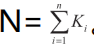

&#x20;  $$x_ij$$是用户i在其第j个页面上的点击次数。现在来看一下我们对点击率ctr的两个定义。

&#x20;  定义1：计算所有点击量并除以总的页面浏览量。

&#x20;  如果有两个用户，一个没有点击，只有页面浏览量，另一个有两次点击，两个页面浏览量各一个，那么：

&#x20;  定义2：对每个用户的ctr进行平均，然后对所有ctr进行平均，实质上是两次平均。

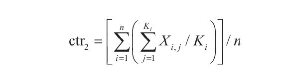

&#x20;  应用定义1中的示例，计算出此时ctr如下。

&#x20;  这些定义没有对错之分，都是ctr的有用定义，但使用不同的用户平均值会产生不同的结果。在实践中，更推荐定义2，因为它对异常值更健壮，不会被一个拥有巨大页面浏览量和巨大点击的机器人账号干扰太多。

&#x20;  如果AB实验由用户随机化，则在计算定义1的方差时得到以下结果。

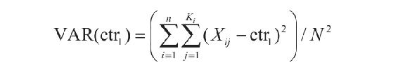

&#x20;  这个方差计算其实是不正确的，因为它假设点击之间是独立的，实际上由于随机的粒度是用户，因此点击之间并不是独立的。要计算方差的无偏估计，可以使用Delta或Bootstrapping方法。观察到这一点并不是由于它明显违反了独立假设，因为这种不满足理论假设的问题通常很难被直观地发现，而是因为在AA实验中，$$ctr_1$$出现了的显著性差异。

&#x20;  除了上面提到的方差计算问题，实验偷窥也会导致第一类错误。

&#x20;  通常使用的统计数据假设在实验结束时只进行一次测试，而在实验进行过程中多次“偷看”违反了这一假设，导致的假阳性比使用经典假设检验时预期的要多得多。这里的“偷看”是一个比较形象的比喻，意思就是在实验预定的结束时间之前去偷偷查看结果，就像还不到答案揭晓的时刻提前去偷窥答案。

&#x20;  提前偷看结果的问题在于，看到的实验可能还没有稳定，或者还没有到达预定所需的实验参与单元数量等。早期一些AB实验鼓励实验过程中提前多次“偷看”实验结果，从而让实验提早停下来，导致了许多“伪成功”的实验。伪成功的意思是这些实验其实并没有获得正向效果，由于过程中多次偷窥，实验者误以为是获得了正向效果。当一些实验者开始进行AA实验时，他们认识到了这一点。AA实验能帮助实验者发现很多难以直接发现的问题，从而控制第一类错误。

#### 7.1.2 确保用户同质AA实验

&#x20;  在识别偏差方面非常有效。确保实验用户和对照用户之间不存在偏差，特别是在重复使用先前实验中的人群的情况下。例如，使用连续的AA实验来确定残留效应，先前的实验会影响在相同用户上运行后续的实验。

&#x20;  通过观察两组策略完全一样的AA实验的指标，如果两组指标差异很大，那么说明这两组用户本身就存在差异，不能进行后续的AB实验。两组用户如果是同质的，在策略一样的情况下，指标不应该出现大的差异。如果在AA实验阶段，所有观察的指标差异都是不显著的，则可以继续进行AB实验。

&#x20;  引起用户不同质的原因比较多，一部分原因在第10章进行讨论，还有一些系统平台的问题也会导致用户不同质的问题。比如，不均衡的分组比例可能会导致潜在的不同质问题。例如，10%和90%的分组，其中90%的分组，在占用共享资源的时候，可能会有比较明显优势。具体地说，在对照组和实验组之间共享的最小最近使用缓存对于较大的组具有更多的缓存条，运行10%和10%的分组实验更容易避免缓存问题。实验分组百分比不等，除了共享资源时可能会出现不同，还有一个问题是，收敛到正态分布的速度也不同。如果某一指标具有高度倾斜的分布，则中心极限定理规定平均值将收敛到正态分布，但当百分比不相等时，比率将不同。

&#x20;  此外，硬件问题也会导致潜在的差异。Facebook有一项服务在一组机器上运行，他们构建了该服务的新机器，并希望对其进行AB实验。他们在新旧机器之间进行了AA实验，尽管他们认为硬件是相同的，但是没有通过AA实验。微小的硬件差异可能会导致意想不到的差异。

&#x20;  在实施过程中，有各种各样意想不到的原因会导致用户的不同质，AA实验能很好地帮我们检测到不同质情况的发生，虽然有时候甚至找不到原因，但也能通过重新开启实验组的方式，保证实验结果的可信度。

#### 7.1.3 数据指标对齐

&#x20;  AA实验另一个重要作用是，将实验数据与日志系统进行比较。在组织中开始使用AB实验之前，通常将AA实验作为第一步。如果实验数据是使用单独的日志记录系统收集的，一个好的验证步骤是确保关键指标（例如，用户数、版本、点击率）与业务指标计算系统进行数据对齐。因为实验数据处理的过程中如果有一些特殊的数据处理逻辑，难免在某些环节出现差异或者问题，所以需要进行指标数据的对齐。

&#x20;  在AA实验中，有一个最重要的环节，就是将实验的指标数据和大盘指标数据对齐。具体来讲，一般有两个重点检查的环节，1）生效的用户量是不是和预估的实验流量匹配；2）各项比率、人均指标是不是和大盘日志监控系统的数据对齐。举例来说，某App的日活用户为1000万，做一个10%流量的AA实验，每组5%，那么每个组的参与用户数为50万是符合预期的。再看，App整体的人均时长是20min，那么AA实验中，各实验组的人均时长也应该在20min左右，如果实验组的人均数据时长为25min左右，这个时候需要检查实验流程中的相关环节，常见的检查环节如下。

●实验分流是不是针对某个特殊群体生效了。例如，有一些实验是跟随客户端版本发布后才能生效的，只是在大于某个版本以上的用户中生效了。因为这些升级版本的用户本来就是活跃度较高、时长偏高的用户，所以导致实验组的人均时长高于大盘人均时长。实验是否真正在预期的场景对预期的用户生效，一般要通过染色日志来观察。

●上报、计算规则问题，即实验平台指标的上报、计算规则有没有对齐。例如，在计算时长的时候，一般会剔除一些明显异常的用户，比如一天的活跃时长超过了24小时等这样一些明显不符合常识的用户。如果实验指标计算的时候没有保持和业务指标一样的逻辑，实验指标的人均时长就会明显高于大盘人均时长指标。

&#x20;  实验系统的数据指标与日志系统、大盘数据对齐，是建立实验系统使用者对实验系统数据信任的基础。如果没有对齐指标，实验分析、评估和决策就如空中楼阁，无从谈起。

#### 7.1.4 估计统计方差

&#x20;  当确定了AA实验中的两组用户是同质的，且与大盘数据指标计算能对齐的时候，就可以使用AA实验来估计当前状态和用户构成情况下，不同指标的方差。基于方差和给定的最小可检测效果，可以计算出最小的实验参与量，以及相应的AB实验需要运行的时间。同时，还可以通过来自AA实验的数据，确定随着更多的用户加入实验，不同指标的方差如何变化。可以观察随着用户量的增加，指标的方差是不是会降低，降低到什么程度后，指标的方差就不会再变化等。因为理论上样本容量越大，抽样分布的方差就越小，公式如下。

&#x20;  进而根据抽样分布的方差，计算出在一定置信水平下，在不同的样本容量下，各个指标的天然波动区间。

总体方差已知：

方差未知：

&#x20;  在了解天然波动区间后，就可以根据这个阈值，确定实际业务提升的阈值，或者说最小可检测效果。一般最小可检测效果要大于天然的波动水平才有意义。如何理解呢？举例来说，有一对双胞胎兄弟，他们的身体初始条件是一样的（即可以理解为用户是同质的）​，随后的一周中，给他们完全一样的外部环境（意味着策略也是一样的）​，然后在每天的不同时间随机测一次他们的体重，由于代谢、习惯等各种原因，两兄弟的体重总是会有一定的差异，如表7-1所示。

表7-1 数据对比

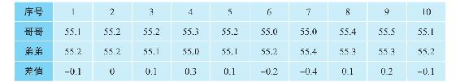

&#x20;   体重均值为$$x_A1$$=55.2，$$x_B1$$=55.2，其中A代表哥哥，B代表弟弟。

&#x20;   体重均值差为$$Δ_1$$=$$\frac{}{x_A1}$$-$$\frac{}{x_B1}$$=0

&#x20;   在总体方差未知的情况下，采用样本方差估计：

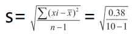

&#x20;   体重波动区间：

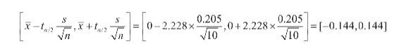

&#x20;   这意味着，在一样的环境策略下，95%的时候两兄弟体重差异在正负0.144kg内波动。第二周，对兄弟两人采用不同的策略，哥哥吃健康餐，弟弟吃和上周同样的饮食，其他不变，一周之后分别得到两个人的数据。

&#x20;   两兄弟体重分别为$$x_A2$$=55，$$x_B2$$=55.2。体重均值差为$$Δ_2$$=$$\frac{}{x_A2}$$-$$\frac{}{x_B2}$$=-0.2

&#x20;   有0.2kg的绝对值差异，根据前面的计算的0.144kg的天然波动，从直观上可以判断，这兄弟俩的体重有比较显著性的差异，也就是说这个健康餐起到了减轻体重的作用。计算一下t值：

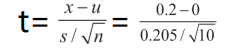

&#x20;  根据计算得出的t值3.16，计算出相应的P值为0.5%，小于显著性水平5%，说明在假设健康餐没有作用的情况下，小概率事件发生了，此时需要拒绝健康餐没有作用的假设，接受健康有作用的假设。

&#x20;  基于上面谈到的这些原因，强烈建议在进行实验的同时运行连续的AA实验，以发现各种可能存在的问题，从而提高实验的可信度。

### 7.2 如何运行AA实验

&#x20;   本节介绍如何判断AA实验是否通过、什么时候需要运行AA实验以及运行多少个AA实验才能保证系统是可靠的。

#### 7.2.1 什么时候运行AA实验

&#x20;   一般在AB实验系统刚开始运行，或是AB实验系统采用了新的随机分流机制（新随机函数、新增加实验层、实验域等）、采用新的数据计算流等任何可能影响实验结果的重大变化的时候，建议随机运行尽可能多的AA实验。理想情况下，可以模拟1000个AA实验，并根据实验结果绘制P值分布图。如果AA实验的P值分布不均匀，则AB实验系统的可信度存疑。在解决这个问题之前，不要信任这个AB实验系统，不能用这个系统的实验结果进行决策。假设有一个简单的H0假设是实验指标的平均值相等（假设指标值是连续值类型）​，即各个实验组的均值相等，那么在H0假设下，P值的分布应该是均匀的。如果P值分布明显不均匀，如图7-1所示，说明实验系统的AA实验失败了。图7-1中AA实验的P值分布均匀的原因是，分析单元和随机单元不均匀导致指标的方差计算错误。根据3.6节介绍的，这种情况可以使用delta方法来处理方差。处理方差后，P值分布的均匀性得到较大的改善，如图7-2所示。

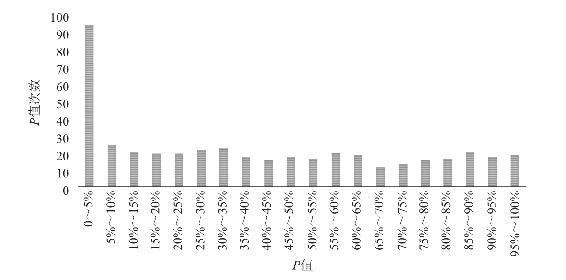

图7-1　AA实验指标的P值分布不一致

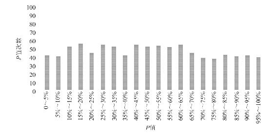

图7-2　AA实验指标的P值分布一致

&#x20;  大规模的AA实验通过测试后才开始运行AB实验。为保证实验的可靠性，防止各种意外情况的发生，一般在运行AB实验前会运行实验级别的AA实验。实验级别的AA实验是相对于大规模的系统级别的AA实验而言的。系统级别的AA实验是不针对任何实验，而是针对整个系统的。实验级别的AA实验是指在开启AB实验之前，先启动AA实验，AA实验进行3～7天，如果多项指标有显著差异，则AA实验不通过，需要重新开启AA实验。如果AA实验通过，则将其中一个A策略修改为B策略，开始AB实验，实验效果是从A策略被修改为B策略开始计算的。AA实验开展的时机如图7-3所示。

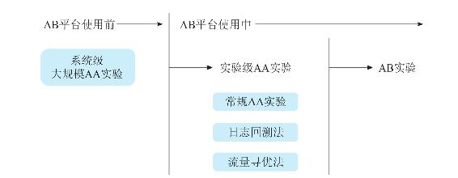

图7-3 AA实验开展时机

&#x20;    日志回溯法是通过日志回溯实验开始前一个时间段两个实验组中用户的各项指标，查看各项指标是否一致，如果一致，就认为AA实验通过。回溯法的前提是数据系统存储了历史周期内相关的原始日志数据。这种方法也有局限性，比如无法发现性能问题或共享资源等实时性比较高、比较动态的问题。虽然如此，这也是非常有价值的方法，可以帮助我们发现绝大多数的问题，而且节省了宝贵的时间，提高了实验效率。

&#x20;    回溯法的基本思想很直观，认为在开始实验之前，这两拨用户是没有差异的，是通过对历史数据的回溯，得到AA实验的结论。AA实验的核心目的是看这一次随机分组的两组用户，在相同的策略下，表现有没有出现明显的差异。这里有一个隐含假定是，如果这两组用户的指标在过去是一致的，且他们没有受到其他干扰，那么未来这两组用户的指标也应该是一致的。

&#x20;   如果系统的流量寻优机制不够好，AA实验失败的概率很高，为了提高AA实验的效率，还可以采用流量换时间的方法。具体做法是同时多开始几组AA实验，比如5～6组，3～7天之后选择两个无显著差异的组进行AB实验，其他分组可以释放。

#### 7.2.2 AA实验失败的常见原因

&#x20;    AA实验失败的原因比较多，常见的有以下一些原因。

●随机分流不随机，导致两组用户不同质、出现SRM问题等。

●指标方差估计错误，比如指标分析单元小于随机化单元，违反了独立性假设，需要使用delta、jackknife、bootstrap等方法正确估计方差。

●最小样本量不符合要求，指标的分布如果是高度偏态的，设置指标上限或最小样本量就是必要的。因为样本量不足可能会导致正态逼近失败。

●脏数据问题，如果P值在0.32附近，表明可能存在异常值问题。

&#x20;   例如，假设数据中有一个非常大的异常值$$\sigma$$。当计算T统计量时，

&#x20;  异常值将落入两个变量中的一个，均值的差值将接$$\frac{\sigma}{n}$$（或其负值）​，因为其他数字都将被该异常值淹没。由于该变量的平均值的方差也将接近$$\frac{\sigma^2}{n^2}$$，因此T值将接近1或-1，该值映射到P值约为0.32。如果看到这一点，则需要调查异常值的原因，或者对数据进行封顶。对于如此大的异常值，t检验很少会产生统计上显著的结果。

&#x20;  以上都是常见的导致AA实验失败的原因，在实践中需要根据实际情况，分析导致AA实验失败的原因。

