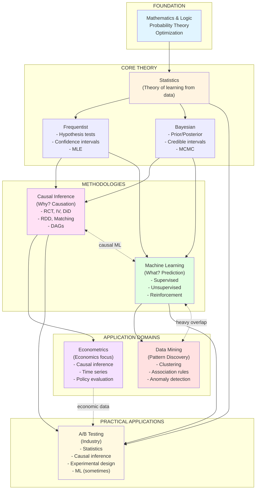

Hi, I'm Jojo, an international student that studied in the U.S. from highschool to Masters, I studied Math, Econ, Data-Sci, Cognitive-Sci as an undergrad at UCSD and Data-Sci (literally the name of the program) at UMich Ann-arbor for my master.

Anyway, this is what I think (means only my opinion) needed to be a "Data scientist", also an outline of my education. 

I'll be glad if this helps

