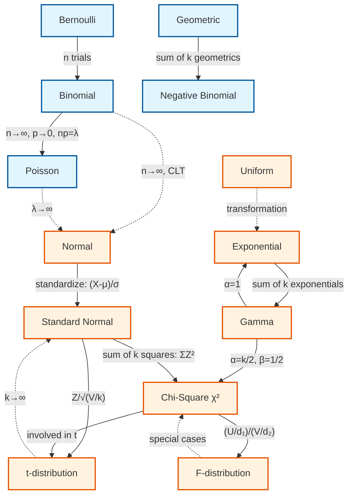

# Probability Theory
- [Probability Theory](#probability-theory)
  - [Combinatorial Analysis (组合分析)](#combinatorial-analysis-组合分析)
    - [Permutations (排列):](#permutations-排列)
    - [Combinations (组合)](#combinations-组合)
  - [Sample Space \& Events (样本空间 \& 事件)](#sample-space--events-样本空间--事件)
  - [Axioms of probability](#axioms-of-probability)
  - [Conditional Probability \& Independence](#conditional-probability--independence)
    - [Law of Total Probability](#law-of-total-probability)
    - [Bayes' Theorem](#bayes-theorem)
  - [Random Variables (随机变量)](#random-variables-随机变量)
    - [Relationship between distributions](#relationship-between-distributions)
    - [Expectation](#expectation)
    - [Variance](#variance)
    - [Discrete RVs (离散随机变量)](#discrete-rvs-离散随机变量)
      - [probability mass function (PMF) (概率质量函数)](#probability-mass-function-pmf-概率质量函数)
      - [Bernoulli](#bernoulli)
      - [Binomial](#binomial)
      - [Poisson](#poisson)
      - [Geometric](#geometric)
    - [Continuous RVs (连续随机变量)](#continuous-rvs-连续随机变量)
      - [probability density function (PDF) (概率密度函数)](#probability-density-function-pdf-概率密度函数)
      - [Cumulative distribution function (CDF) (累积分布函数)](#cumulative-distribution-function-cdf-累积分布函数)
      - [Uniform](#uniform)
      - [Normal (正态分布)](#normal-正态分布)
        - [Standard Normal (标准正态分布)](#standard-normal-标准正态分布)
      - [Exponential (指数分布)](#exponential-指数分布)
      - [chi-square dist.](#chi-square-dist)
      - [t dist.](#t-dist)
      - [F dist.](#f-dist)
      - [Gamma dist.](#gamma-dist)
  - [Jointly distributed RVs](#jointly-distributed-rvs)
    - [Transformations](#transformations)
  - [Properties of Expectation](#properties-of-expectation)
  - [Limit Theorems](#limit-theorems)
    - [Chebyshev's Inequality](#chebyshevs-inequality)
    - [Weak law of Large Numbers](#weak-law-of-large-numbers)
    - [Central Limit Theorem](#central-limit-theorem)

## Combinatorial Analysis (组合分析)

### Permutations (排列):
- Order does matter

- how many ways can we permute(排列) $k$ items from a set of $n$ items (**Order does matter**)? e.g.: choosing 2 items from $\{a, b, c\} \implies \{(ab), (ac), (ba), (bc), (ca), (cb)\}$

- $\frac{n!}{(n-k)!}$

- $\text{If } n=k,\ \text{then }(n-k)! = 0! = 1 \implies \frac{n!}{(n-k)!} = n!$
  
### Combinations (组合)
- Order doesn't matter
- **binomial coefficient**: How many ways can we choose $k$ items from a set of $n$ items (**order doesn't matter**)?
  
  - $\binom{n}{k} = \frac{n!}{k!(n-k)!}$ $k <= n$

- **multinomial coefficient**: How many ways can we arrange $n$ items into $m$ groups of sizes $k_1, k_2, k_3, \cdots$ and $k_m$?
  
  - $\binom{n}{k_1, k_2, ..., k_m} = \frac{n!}{k_1! \times k_2! \times ... \times k_m!}$ where $k_1 + k_2 + ... + k_m = n$
  - **Example**: Arranging 6 letters {a, b, c, d, e, f} into groups of sizes 2, 3, and 1:
    - $\binom{6}{2, 3, 1} = \frac{6!}{2! \times 3! \times 1!} = \frac{720}{12} = 60$ ways

---

## Sample Space & Events (样本空间 & 事件)
- A **sample space** $S$ is the *set* of all possible outcomes of a random experiment or a random process or an observation.
- An **event** $A$ is a *subset* of the sample space $S$.
- *Union*, *intersection*, and *complement* of events are defined as in *set theory*.
- Notation:
  - $S$ or $\Omega$: Sample space
  - $P(A)$: Probability of event $A$
  - $A^c$: Complement of event $A$
  - $A \cup B$: Union of events $A$ and $B$
  - $A \cap B$: Intersection of events $A$ and $B$

## Axioms of probability

The **axioms of probability** (Kolmogorov axioms) are three fundamental rules that define a valid probability measure:

1. **Non-negativity**: For any event $A$, $P(A) \geq 0$
2. **Normalization**: The probability of the entire sample space $S$ is $P(S) = 1$
3. **Additivity**: For mutually exclusive events $A$ and $B$ (i.e., $A \cap B = \emptyset$), $P(A \cup B) = P(A) + P(B)$
   - Extended: if $A_1, A_2, \ldots$ are pairwise disjoint, then $P\left(\bigcup_{i=1}^{\infty} A_i\right) = \sum_{i=1}^{\infty} P(A_i)$

## Conditional Probability & Independence

### Law of Total Probability

### Bayes' Theorem

---

## Random Variables (随机变量)
- A **random variable** (RV) is a function that assigns a real number to each outcome in the ***sample space*** of a random experiment or process or observation.
- Types of random variables:
  - **Discrete Random Variable**: Takes on a countable number of distinct values (e.g., rolling a die).
  - **Continuous Random Variable**: Takes on an uncountable number of values within a given range (e.g., measuring height).

### Relationship between distributions

**Legend:**
- Solid arrows (→): Exact relationships or special cases
- Dashed arrows (-.->): Limiting/approximation relationships
- Blue boxes: Discrete distributions
- Orange boxes: Continuous distributions

### Expectation 
- The long-run average or central tendency of a random variable, also known as expected value or mean
- Linearity: $E[aX + bY] = aE[X] + bE[Y]$
- Additivity: $E[X + Y] = E[X] + E[Y]$
- Scaling: $E[c] = c$ for constant $c$

### Variance
- how far, on average, the values deviate from the center
- $Var(X) = E[(X - E[X])^2] = E[X^2] - (E[X])^2$
- Properties:
  - $Var(aX + b) = a^2 Var(X)$ for constants $a$ and $b$
  - $Var(X + Y) =$
    - $Var(X) + Var(Y)$ if X and Y are independent
    - $Var(X) + Var(Y) + 2Cov(X, Y)$ if not independent
  - $Var(X) \geq 0$

### Discrete RVs (离散随机变量)

#### probability mass function (PMF) (概率质量函数)
- $p_X(x)$ = $P(X = x)$ the probability of the ***[event](#sample-space--events-样本空间--事件)*** "$X = x$", equivalient to saying "the probability of the discrete random variable $X$ takes the value $x$"
- $\sum_{x} p_X(x) = 1$

#### Bernoulli
j
#### Binomial

#### Poisson
- models the number of events occurring in a fixed interval of time or space, given that events occur **independently** at a **constant average rate**
- Notation: $X \sim Pois(\lambda)$
- PMF: $P(X = k) = \frac{e^{-\lambda} \lambda^k}{k!}$ for $k = 0, 1, 2, \ldots$
- Parameter: $\lambda \geq 0$, the average number of occurent of events in the interval, also known as the "**rate**"
- Mean: $E[X] = \lambda$
- Variance: $Var(X) = \lambda$

#### Geometric
- models the number of trials needed to get the first success in a sequence of independent Bernoulli trials, where each trial has the same probability of success
- Notation: $X \sim Geom(p)$
- PMF: $P(X = k) = (1 - p)^{k - 1} p$ for $k = 1, 2, 3, \ldots$
- Parameter: $0 < p \leq 1$, the probability of success on each trial
- Mean: $E[X] = \frac{1}{p}$
- Variance: $Var(X) = \frac{1 - p}{p^2}$

### Continuous RVs (连续随机变量)

#### probability density function (PDF) (概率密度函数)
- from PMF to PDF
  - Since continuous RVs can take on an uncountable number of values, the probability of the RV taking on any specific value is zero, i.e. $P(X = x) = 0$ for any specific value $x$. Instead, we use the **probability density function** to describe the relative likelihood of the RV falling within a certain range.
- $f_X(x)$ satisfies:
  - $f_X(x) \geq 0$ for all $x$
  - $\int_{-\infty}^{\infty} f_X(x) dx = 1$
- $P(a \leq X \leq b) = \int_{a}^{b} f_X(x) dx$
  - Probability that $X$ falls within the interval $[a, b]$

#### Cumulative distribution function (CDF) (累积分布函数)
- $F_X(x) = P(X \leq x)$ which is the probability that the random variable $X$ takes on a value less than or equal to $x$
- for discrete RVs
  - $F_X(x) = \sum_{t \leq x} p_X(t)$
- for continuous RVs
  - $F_X(x) = \int_{-\infty}^{x} f_X(t) dt$
- Properties:
  - *Monotonically increasing*
  - Range: $0 \leq F_X(x) \leq 1$ for all $x$

#### Uniform

#### Normal (正态分布)

##### Standard Normal (标准正态分布)

#### Exponential (指数分布)
- models the time between events in a Poisson process, where events occur continuously and independently at a constant average rate
- Notation: $X \sim Exp(\lambda)$
- PDF: $f_X(x) = \lambda e^{-\lambda x}$ for $x \geq 0$, and $f_X(x) = 0$ for $x < 0$
- CDF: $F_X(x) = 1 - e^{-\lambda x}$ for $x \geq 0$, and $F_X(x) = 0$ for $x < 0$
- Parameter: $\lambda > 0$, the rate parameter, which is the reciprocal of the mean
  - This $\lambda$ is the same as the $\lambda$ in the **Poisson** distribution, representing the average rate of events per interval
- Mean: $E[X] = \frac{1}{\lambda}$
- Variance: $Var(X) = \frac{1}{\lambda^2}$
- **The memoryless property**: $P(\text{wait} > s + t | \text{already waited } t) = P(\text{wait} > t)$ for all $s, t \geq 0$
  - This means that the probability of waiting an additional time $t$ does not depend on how much time has already elapsed $s$

#### chi-square dist.

#### t dist.

#### F dist.

#### Gamma dist.

---

## Jointly distributed RVs

### Transformations

## Properties of Expectation

## Limit Theorems

### Chebyshev's Inequality

### Weak law of Large Numbers

### Central Limit Theorem

