# 一：异动分析框架

不少同学对异动分析这块 既熟悉又陌生&#x20;

一般面试中异动问题的场景比较简单订单下降、或者gmv下滑，很好理解但实际面试当中回答的质量不高，主要是理解比较浅，实践经验少，背答案的痕迹很明显

> 今天就来详细聊聊，通用的排查异动原因的方法，可以归纳为:**验真、横向拆解、纵向拆解、数据到业务**
>
> 1. 「验真」，是确定问题确实存在
>
> 2. 「先横向，再纵向」，就是拆解后定位异动维度
>
> 3. 「数据到业务」，就是从数据原因关联到业务根因

## 1、验真，就是确定问题确实存在

当我们看到一个指标变动，其实不代表它有问题，涨跌的幅度和持续时间超出常态才算是异常，说明有我们没有看到的因素在起作用，这个力量推动指标跳出了原来的惯性轨道(正常波动区间)，在这个环节我们需要排除三种类型的“假”

### 第一、指标变动幅度小

这种情况往往是业务人员看到绝对数字下滑“敏感”反馈，我们通过计算同比环比数字，能发现指标虽然有变动但是幅度不大，更大可能是随机因素引起指标波动，我们只需要“保持观察”即可

这个情况中，需要定义多大幅度是正常波动区间，一般按照 μ±nσ原则，n可依据取2或者3

### 第二、指标发生突变

> 比如，某个指标原来平稳在80%水平，短时间内跳跃并稳定在60%，下了一个台阶

这情况显然是有问题，但很可能是算错了，或者口径变了，因为不论是算法优化还是运营策略，它们起作用都需要时间，指标一般会有明显的爬坡过程，短则一周长则三月，我们看待一个业务，要理解它有惯性，“阶跃”非常少见这种情况，所以

1. 可能是算错了，比如指标计算的中间数据没有及时更新，没算全，往往源于计算资源紧张ETL任务（Extract-Transform-Load是指数据抽取、转换和加载的过程）延后之类原因

2. 可能只是指标口径（统计数据的标准）调整，比如计算完单率时分母订单总量定义发生变化，改了去重逻辑

### 第三、指标变化有周期性

对于大部分指标，平稳是其规律，所以当看到比较大幅度波动我们认为有异常，但有少数指标“周期波动”才是它的规律，那么自然不存在问题;

> 比如，你会认为一年四季温度变化，冬天温度低，夏天温度高，这个是异常么，那比如雪糕的销量呢，泳衣的销量呢，它们也是明显跟随温度变化有周期规律的，这些都是常识，但有一些规律对大部分人可能不是常识，比如治疗上呼吸道过敏类药物也有季节性波动规律

这一类问题，我们都可以通过拉长历史数据，用更宽的统计窗口去研究排除，这种例子还有很多，比如春节的人流量，寒暑假的游戏用户dau，还有双11、618电商节的物流订单数都有明显的波动规律

## 2、先横向，再纵向，定位异动维度

当我们通过验真，确定指标存在异常，那么接下来要做的就是通过维度拆解确定异动原因所在维度，先横向拆解，如有必要再纵向拆解这是“重头戏”

### 横向拆解：

所谓横向拆解，即把整体拆分成部分，MECE原则（相互独立、完全穷尽）不重不漏，从三个角度列举常见维度:

> 1. 用户角度：新老用户、用户价值分层、渠道来源、城市地域划分、性别划分、年龄划分、手机设备划分
>
> 2. 商品商家角度：新老商家、商家星级、规模、商品品类、商品价格带、折扣率
>
> 3. 订单发生场景角度：主站/站外3.站内又可以分成主动搜索、推荐、直播、营销广告位

一般会按照过往的业务经验从最有可能的维度逐个排查，确定主要引起指标异动的维度

> 举个具体例子，比如叮咚买菜的上周的完单GMV金额下降了5%:
>
> -二三线城市的从城市维度看，GMV都在下降;
>
> 从新老客看，老客变化不大，新客下降10%;
>
> 请问是哪个维度引起大盘指标异动?

直觉上可以推断是由新客引起的，由此我们得到一个感性认知：维度中子项的指标变化相差较大的维度，更可能是异动维度，为什么呢我们可以这么理解:

> 比如某个策略变化对新客户的付费意向影响是最大的，对老客影响不大，那么新老客户间交易金额环比变化的差异是第一层传导的直接结果，继续，因为每个城市的新老客户占比是有差异的，所以每个城市受到这个策略影响的程度不一样，但由于同个城市层级中既有新用户占比高的城市，也有新用户占比低的城市，参差不齐，整体上拉平，最后体现在城市层级之间的交易金额差异肯定是相比第一层削弱的

像不像地震时，震中心的震级是最高的，那么我们用逆向的过程，找到子项指标变化差异最大的就是震中心

> 那如果新老客维度，两个人群下降幅度都在4%\~6%区间

就说明 无论是城市还是新老客都不是异动维度，根因不在这里，我们换下一个比较有嫌疑的维度继续排查

> 那如果城市层级维度上，也有部分城市跌幅在10%左右，和新老客维度上的幅度接近

即多个维度下的子项指标变化差异都较大，为了判定哪个是主因哪个是次因，就需要量化对比，这里我们引入两个概念，贡献度、区分度，总结起来整个过程是:

1. 先在每个维度上计算所有子项的贡献度（子项对总体变化的影响大小）

2. 再基于贡献度，利用积分思想，计算不同维度的区分度（衡量子项贡献的不均）

3. 锁定区分度最大的维度，找到贡献度最大的子项，数据原因就找到了

### 纵向拆解

有时候我们通过横向拆解，发现所有想到的维度上，子项的变化幅度相差不大，没有找到明显的异动维度，那么有两种可能:

1.根因在外部，宏观的，无差别得影响了业务，就像阳光照以垂直的方式投射于所有用户，所以维度拆解失效了

2.根因在内部，也均匀得影响到了所有用户那么就大概率是产品层面的问题

对于第二种情况，我们经常会从用户使用产品的行为链路上去分析，既然是交易金额下降那么我们就向前去追溯完整交易链路，分节点分环节统计

比如电商场景

> 打开App ->搜索/浏览信息流 ->进入商品详情页 ->点击支付按钮 ->完成交易；我们可以统计每个环节的人数、环节间的转化率，来定位究竟哪个环节是下跌的起点，并进一步探查原因

## 3、数据原因到业务原因

目前为止，我们定位到的原因叫做“数据原因’

> 比如叮咚的例子中我们锁定了问题出在新客的GMV下滑，但是到此为止我们还是不知道为什么新客GMV会下滑，那当然也得不出应对策略，所以还需要去找到一个业务原因
>
> 到底是某个内部的新客策略调整
>
> 还是外部竞争对手补贴加码
>
> 或是产品上有调整导致承接转化新客能力下降
>
> 可以是其中一个或多个原因综合影响

那怎么确定是哪个业务原因呢，有两个办法:

1.时间点上匹配数据变化时间和业务原因发生作用的节点

2.业务原因对不同群体作用效果是结构化的.对比不同群体的指标变化幅度和这个结构化差异

那如果是更大的原因，比如PEST宏观因素（政治（Political）、经济（Economic）、社会（Social）、技术（Technological））怎么验证呢，这个确实没有太好办法，纯逻辑支撑，而且这种因素一般领导们会先知道，他们对行业大气候更加敏感\~

# 二：异动分析定量框架

异动分析-因子贡献度计算方法

对应指标拆解的加法、乘法、除法3种方式，因子贡献度的量化方法也分为加法、乘涉除法 3种:

> 加法型计算：指标总体变化量等于各子维度指标变化量之和
>
> 乘法型计算：总体指标是由各子指标相乘
>
> 除法型计算：比值型指标，总体指标是由各子指标相除

异动分析中，在通过指标拆解和维度拆解确定问题原因的过程中，经常会碰到的一个问题就是「多个因素混合导致整体指标下跌的情境下，各个因素对指标波动的影响程度分别是多少?」此时，就需要采用「异动归因方法」来量化各个因素对总体指标波动结果的贡献程度。

对应指标拆解的加法、乘法、除法 3种方式，因子贡献度的量化方法也分为加法、乘法、除法3种:

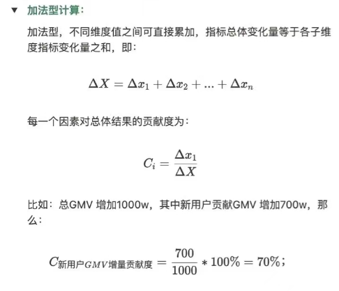

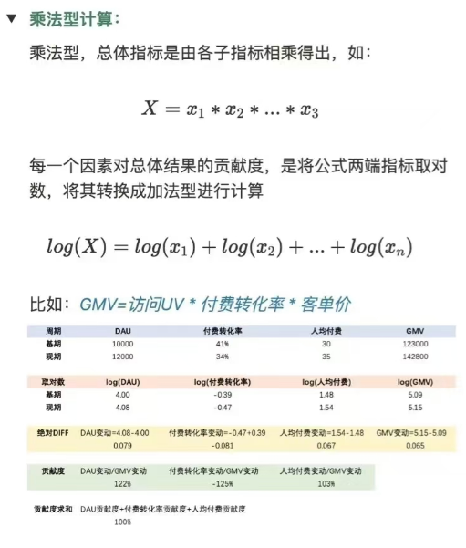

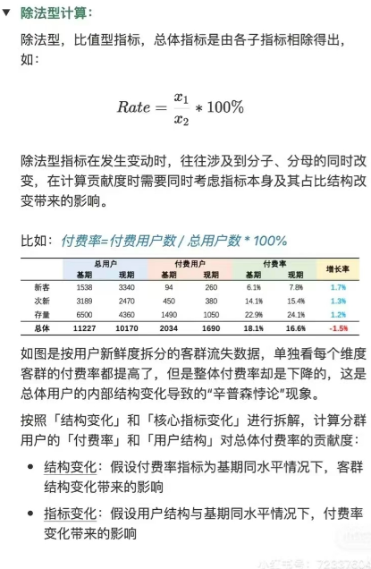

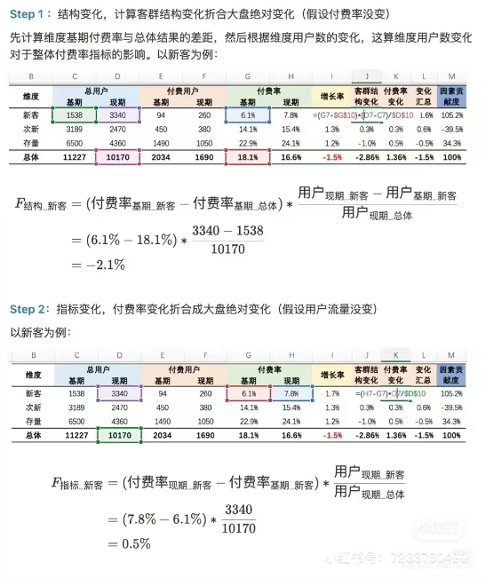

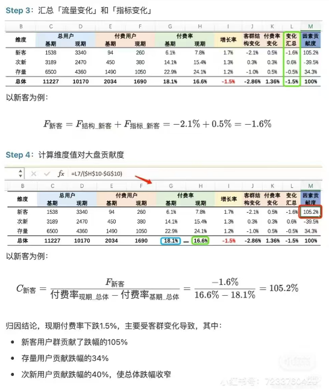

# 三：指标体系搭建（主OSM方法）

OSM方法：

指标体系思维在日常业务中是非常关键的，一个业务的所有策略依据都基于指标数据，而北极星指标的选取，指标体系的搭建，都是数据分析师功力的体现。

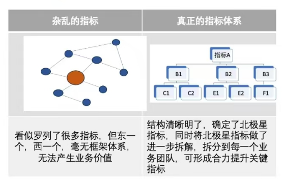

### 1. OSM的定义和组成部分

OSM模型是目标（Objective）、策略（Strategy）和度量（Measurement）的缩写，它是一套业务分析框架，用于在明确了业务目标的情况下，确定策略和监控指标。OSM模型将宏大的目标拆解为具体的、可落地、可度量的行为，确保执行计划不偏离大方向。

### 2. OSM方法的应用场景和步骤

1. 定义目标（Objective）：明确业务目标，例如提升沉睡用户付费激活率至少提高一倍。

2. 制定策略（Strategy）：围绕业务目标，制定具体的策略动作，例如建立精准的用户流失预测模型、派发优惠券等。

3. 设置度量（Measurement）：确定监控指标，评估策略的实际效果，例如用户激活率、优惠券使用率等

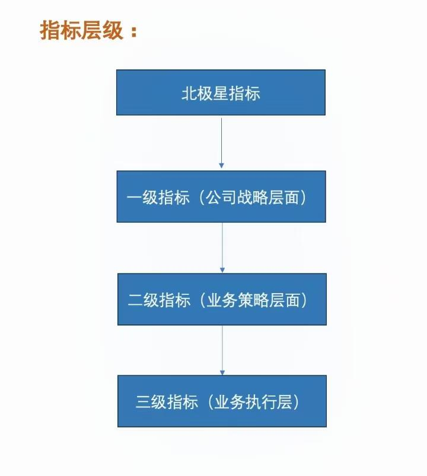

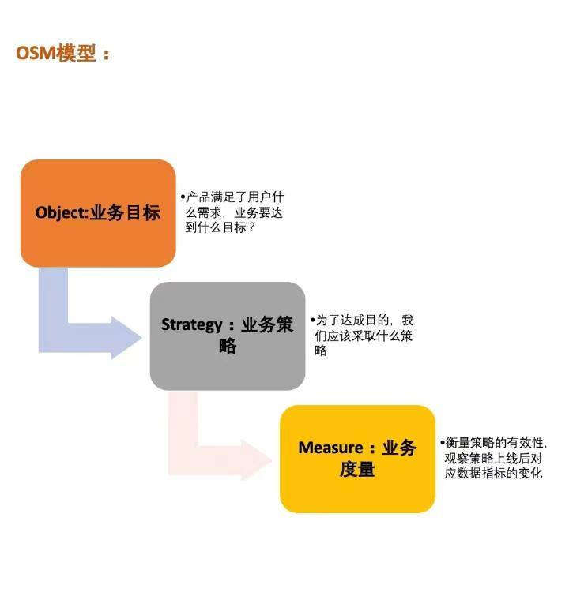

### 3. OSM指标体系搭建实例

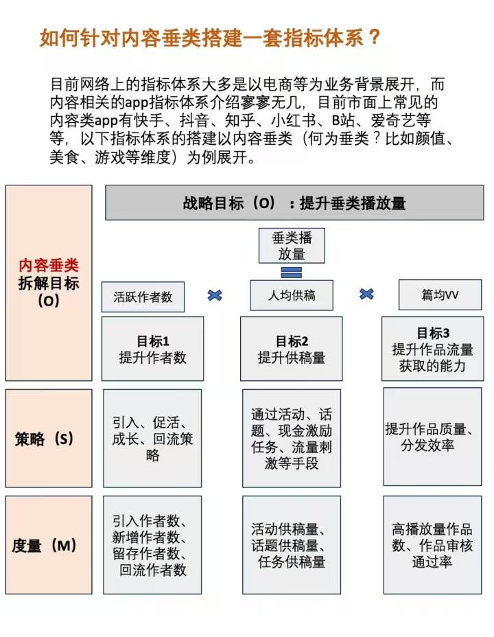

# 四：APP问题

APP题可以说是产品sense考察的一个核心类题型，伴随着一连串问题，可以对候选人的产品sense有由浅到深的考察。此类问题可以通过阅读产品相关材料学习

## 类型一：用户侧问题

### 问题一：你平时喜欢用什么APP？

### 问题二：请你简单介绍一下这款APP（举例B站）

> 哔哩哔哩创站初期的定位为ACG弹幕视频网站，主要目标用户为二次元爱好者；平台初期的核心功能在于分享第三方平台视频的同时，在视频上进行“弹幕”形式的评论与交流。B站主要做了两方面的完善和优化：业务领域扩充和内容领域深耕。

1.产品定位

b站不仅仅是一家UGC（User-generated-Content，用户生成内容）平台，而是由自身的属性衍生了多元化的业务。在整个视频领域中b站独树一帜，难觅对手，平台提供数量庞大的原创内容，且风格“只此一家”，用户在消费这些内容的同时，逐渐提高自身对于b站的黏度。平台又依靠着自身“二次元与泛二次元”的属性与UGC平台的效益，拓展出游戏、电商等一系列业务。

2.产品受众

B站的目标用户应该分为两类：内容消费者和内容生产者，

对于内容消费者:

1. 二次元用户：番剧、国创、漫画狂热爱好者，希望尽可能全面且及时的观看其感兴趣的剧目，希望能有较多的二次元用户及时交流、沟通。

2. 兴趣多元化的用户：兴趣广泛，经常在零碎时间或者闲时间，随意的浏览自己感兴趣的相关领域视频，同时能够理解弹幕文化，渴望交流、分享。

3. 希望自我提升的用户：有强烈的自我提升意愿，该意愿包括课程学习，科普，眼界提升等等方面，热爱交流，重视用户体验。

4. 二次元游戏爱好者：喜欢二次元类游戏的用户，希望能有众多的同类用户一起交流，分享。

5. 直播用户：热爱观看直播的用户。

对于内容生产者:

1. 想在平台上分享自己的生活经历、某个领域知识的人群

2. 通过在平台专职制作视频，将其作为自己一份工作的人群。

3. 中长时长 UGC/PGC（Professionally-generated Content，专业生产内容）生产者：生产视频时长大概在3min 以上的UGC/PGC生产者，同时重视用户体验，重视视频曝光度。

4. 新人UGC生产者：没有粉丝基础的新人UP主，重视视频曝光度，重视早期粉丝的积累和点赞、评价等相关反馈。

5. PGC生产者：重视初始年轻化粉丝积累，重视视频曝光度，重视变现效率

### 问题三：这款APP的优化点？（今日头条优化）

取消浏览页面的右下角“X”的「举报，拉黑作者|功能，只保留「不感兴趣」功能，增加使用率。

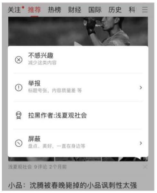

### 问题四：如何要优化，怎么优化？如何度量这个优化的效果？（今日头条）

**取消功能的原因:**

1. 令用户一眼可见「不感兴趣」入口，可以提高用户使用屏蔽功能的机会，目的是使用户画像越来越清晰，之后系统推荐的内容也会更加符合用户的喜好。用户的需求一直可以得到正反馈，自然就会增加用户的粘性，留存，浏览时长，浏览话题数等指标数据；

2. 用户对回答进行正确举报或拉黑的前提是已经浏览过内容，然而在这个页面上，只显示了标题和图片，用户几乎不能从中判断其是否为不友好信息。因此我猜测，此时对回答进行有效举报的概率是非常低的。并且，点击新闻详情后，右上角的更多有「举报」功能完全解决了这一问题，用户可以在浏览回答之后再进行举报，相比较，设置在此处的举报功能更加的合理和实用。

**如何评估改进效果**

1. **对用户：屏蔽功能人均使用次数，人均浏览时长，浏览话题数，留存率**（这些可能要以之前就使用该功能的用户群作为观察对象）

如果用户使用“屏蔽”功能后，之后推荐的都是自己想看的，需求一直可以得到正反馈，自然就会增加用户的粘性，留存，浏览时长，浏览话题数等指标数据（可以从这几个指标验证是否得到了改进）

* **对内容：内容屏蔽率（点击 pv/曝光 pv）、喜欢率，收藏率，评论率**

当屏蔽的按钮更加明显后，会使得创作者更加注重内容质量以避免内容屏敝率过高，会更加注重标题、配图、开头和内容等，这对整个产品的内容生态也是很重要的（可以从内容屏蔽率和喜欢率，收藏率，评论率来验证），内容屏敝率高的其他三个指标就会低

**改进带来的收益:**

根据用户使用“屏蔽”功能可以更加精确捕捉用户的偏好，可进一步扩展用户标签和内容标签，进行更好的内容分发和内容推荐：用户粘性增加，日活，留存，浏览时长，浏览话题数增加

内容生态也会得到提升，屏蔽功能的优化，用户的使用频率会提高，进一步会促使创作者更加精心的创造，如注重标题，配图和内容，以避免被用户高频次地屏蔽。

**改进带来的风险:**

可能会打击一部分作者（内容好，但是标题，配图不太吸引人等），使得部分创作者流失;

对内容分发和推荐算法提出了更高的要求，如何根据用户的屏蔽行为分发何种内容;

## 类型二：行业侧问题

### 问题一：这款APP的优缺点？（番茄小说）

#### 优点：

1. 拥有海量的书籍资源，并且是免费阅读，对于一款免费读的小说软件来说，这无疑是最好的一个优点，对于正版观看需要花费来说，番茄小说的资源全部免费可以说非常的劲爆;

2. 各种小说类型一应俱全，各种类型可以轻松找到，并且分类细致，让我们可以在不同的类型中找到对应的小说资源，可以轻松的进行观看;

3. 还有就是番茄小说还可以看小说赚零花钱，完成其中的看书任务，还有其它的任务，就可以获得金币奖励，看的时间越久，赚的就越多，利用金币兑换现金;

4. 还可以听书，其中内置了听书的插件，让我们可以随时随地的使用听书功能，在不同的场景中都可以听书，还可以切换不同的声音听书:

5. 更新内容实时同步，小说作者更新时用户的内容也会实时更新，可以查看到最新的章节内容，和各大平台一致，拥有海量的签约作家;

6. 还有各种其它软件都有的功能，都是非常便捷的操作，可以轻松的使用带来简单的看书体验，着重突出看小说的沉浸体验。

番茄小说背靠字节跳动，利用公司强大的算法能力，通过用户信息进行精准推送用户可能喜欢的书籍内容

#### 缺点:

1. 番茄小说每阅读三十分钟需要看一个三十秒的广告，使得用户的阅读投入感降低。

2. 番茄小说的作品质量参差不齐，而番茄小说前身的木叶文学网知名度较梧桐中文网较低，积累的作品和作者数量较少。

3. 番茄小说的用户互动性较差，而且在交互上BUG问题会极大的影响产品使用体验，降低用户愉悦度。

4. 番茄小说【福利】界面和其他界面差别较大，不统一

### 问题二：这款APP和竞品的区别？【用户端；产品端；变现方式；业务sense（相关指标体系的拆解分析）】

### 快手和抖音的区别--2020年之前

#### 1. 用户

快手：更下沉，三四线及农村的用户较多，如小镇青年，普通工作者

抖音：更精致，一二线的用户更多

#### 3.2 产品观

快手：快手是社区，从内容生产者角度思考，强调多元化、平民化和去中心化，满足用户“记录和分享”需求，去中心化有助于视频内容多样化，容易让观众产生共鸣，形成认同感和强烈的社区凝聚力。

抖音：是一款关乎美好感的产品，从内容消费者角度思考，把消费体验做到极致，给自己打上“酷、潮、年轻”标签，满足看到美好事物的需求。

#### 3.3 视频风格

快手：视频风格接地气，视频内容主要为记录日常生活，内容创作者以普通人为主，与生活密切相关，社交属性强。

抖音：视频内容更加新潮、个性化。抖音的美颜滤镜、搞怪贴纸以及VR 特效，搭配上高节奏性音乐，使得它更具“潮”、“个性化”特色。抖音中心化定位，在抢眼的同时，热门内容又具备较高的相似性和重复性。

# 五：活动评估类问题

## 方法论

### Step 1：确定活动评估目标&#x20;

1. 用户增长目标（DAU，新DAU，召回用户流失数，拉回活跃用户数），

2. 业务变现目标；&#x20;

### Step2：基于目标确定评估体系指标&#x20;

需要建立起一定的评估体系，一般活动会主要分为增长类和变现类两大类。如果是增长类，那么会主要考虑增长目标，比如DAU、DAC（Daily Active Customers），如果是变现类则会更注重GMV。目标因不同活动而异。

### Step3：确定活动过程

* 双十一促销前是活动宣发，进行站位广告投入；

* 活动期间的优惠券，GMV，COST，margin；

* 活动后是用户活跃降低，高活变低额，用户流失率的复盘；

### Step4：策略间ROI的评估，以启迪未来运营活动策略

#### 活动是否有需要改进的环节？方案是什么?

这个问题需要通过拆解定位问题，那么拆解的维度和流程在这个方面就比较重要。

以某拉新活动为例：

##### 1. **活动关键指标达成分析：**

活动关键核心指标达成情况：拉新多少用户，达成多少GMV，ROI如何？

##### 3.3.2 **关键流程分析：**&#x5404;个流程的漏斗分析：用户的触及范围，用户参与度，留存，流失率。

##### 3.3.3 **活动的渠道、用户分析：**

* 活动在哪些渠道推送？

* 每个渠道的流量，拉新，留存，转化分析活动推送给哪些用户？

* 用户画像是什么样的？各渠道用户的质量/ROI如何？

##### 3.3.4&#x20;**&#x20;活动策略、节奏分析**

* 活动玩法的裂变效果（通过用户自我复制和传播实现用户增长的策略）如何？利益点是否有吸引力？

* 活动整个过程节奏把控如何，前期预热、中期爆发和尾期是否过短/过长，运营应该在何时进行适当干预。

# 六：费米问题

费米问题主要考察公式拆解的case能力，一般可以从需求和供给两个方面入手。如果需求侧更容易切入则从需求侧切入，反之从供给侧切入。

## 例题一：一家优衣库门店的年销量

### **问题**

1. 这家门店在市中心还是在城市周边的商圈？规模有多大？

随便挑一个你去过的优衣库门店讲就行

* 销量的单位是件数还是元?

元

* 是否可以不考虑线上付款但货品从店内发货，以及在其他门店付款但货品从这家店内调拨过去的场景？

可以

### **公式拆解**

一家门店的年销量

\= 日均销售收入 \* 年营业天数

\=（日均销售件数 \* 平均单价）\* （365天 - 由于疫情等停业歇业天数）

\=（日均客流量 \* 消费转化率% \* 人均消费件数 \* 平均单价） \* （365天 - 由于疫情等停业歇业天数）

### **关键假设**

日均客流量 = 日均营业时长12h * 小时平均客流量

* 将天数按照工作日 vs 休息日节假日细分

* 将小时按照高峰 vs 低谷时段划分

日均销售收入 = 日均消费人数 * 客单价 =（日均客流量 * 消费转化率% * 人均消费件数 * 平均单价）

* 将客流按照收入水平细分，收入越高，转化率%人均消费件数，平均单价越高

所有快时尚/运动服饰等等线下店铺的年销量都是相似的方法\~只是客流量、单价等等会有很大不同，过去常考H\&M、Zara，现在常考优衣库、UR等，换汤不换药！

## 例题二：直播电商2025年市场规模

### **问题**

请问直播电商市场规模是指在直播电商渠道的年成交额吗？还是指直播电商平台的年佣金收入？

### **公式拆解**

#### **方法一**

中国直播电商2025年市场规模

= 2025年预期电商年成交额 * 直播电商的预期年贡献率

\=（最近一年电商年成交额 * 预期增长率）\* 直播电商的预期年占比

\=（2021年电商年成交额 \* (1+CAGR 16'-21’)^4) \* 时间序列预测4年后直播电商的预期占比

2025年电商年成交额也可以拆解为 = 2025年预期全国居民总消费水平 * 电商占比

直播电商的预期占比可以用过去几年的平均值/最近一年的占比/通过时间序列回归分析预测2025年的市场规模

#### **方法二**

直播电商市场规模

\=∑每一品类直播电商规模

\=∑各品类(年销量\*平均价格)

\=∑各品类(消费人数\*消费频率\*单次消费量\*时间\*平均价格

根据产品档次可以分为高档贵价、中档均价、低档平价对产品与销量进行细分

这种从需求端(从人数入手)计算，比较复杂，所以可行性很低

#### **方法三**

直播电商市场规模

= 直播卖货频次 * 平均每场直播销售额

\=（年直播数 * 卖货占比）\*（平均每场直播的销量 * 平均价格）

\=（各大平台主播数 * 主播每周直播频次 * 52周 * 卖货直播占比）\*（平均每场直播的销量 \* 平均价格)

* 可以根据产品品类（食品/服装汽车/家具..）细分，直播卖房与直播卖食品的主播数/直播频率/需求量或成交量/平均价格会有极大的差异。可以抓住最核心的几大品类做详细计算，非核心品类用multiple x一笔带过。

* 可以根据平台（淘宝/快手/抖音...）细分，不同平台的DAU不同，用户的画像不同，进而导致销售的品类与成交量会不同。

* 可以根据主播（李佳琪/薇娅/辛巴1..）进行细分，直播电商有很强的马太效应，头部主播有可能会瓜分e.g.80%的市场份额，余下的市场由中尾部主播瓜分，所以完全可以盘点头部主播的年成交量。

# 七：ROI分析

### 1. **ROI模型的应用**

ROI（return of investment），是所有经营决策的重要参考标准。如果一个事情投入产出比较低，那么说明这一项事情至少在短期上入不敷出，不如不干。

ROI分析，是只要有损和益的存在，就一定有的概念。

比如，我们补贴用户打车，损是补贴金额，益是用户打车的增量GMV，那么ROI = 增量GMV/补贴成本（一般增量用实验度量）

比如，我们多出广告，损是用户的体验（留存），益是广告收入，那么ROI = 增量收入/用户体验损伤带来的未来收入损失（一般用实验度量）

一般而言，ROI在企业中是有很强的量化标准的，有些业务的ROI易于量化，但是有的业务ROI就不易量化。

如果是交易产品类行业，比如天猫淘宝，那么APRU（Average Revenue Per User）可以理解为用户的总交易额，活跃天数如果一旦下降，那么将直接影响未来的收入。但是如果是抖音等非广告产品，那么用户的拉新ROI就相对难以量化，需要专门的ROI团队进行量化。

一般来说，用户全生命周期的收入可以按照以下方式估算

### 2. 通过LTV衡量全生命周期ROI

1.回本周期计算拆解

ROI=收入/成本=LTV/成本=LT*ARPU/成本

1. LTV=LT*ARPU(用户平均生命周期*每用户的平均收入）

2. LT=1+次日留存率+3日留存率+.. +n日留存率

3. ARPU=某周期内的总收入除以该周期内的总用户数

LTV的计算涉及到顾客保持率、顾客消费率、变动成本、获得成本、贴现率等信息的正确取得。其中:

1. 顾客保留率(retentionrate,RR)=本年度的顾客总数/上年度的顾客总数:

2. 顾客消费率(spendingrate,SR)=顾客总消费额/顾客总数;

3. 变动成本(variablecost,VC)=产品成本+服务管理费用等;

4. 获客成本(Customer acquisition cost,CAC)=(营销总费用+销售总费用)/同时期新增用户数;

通过上面的定义，我们知道LT和留存率相关，所以我们通过留存率曲线，计算曲线下的面积，即可计算出LT。那重点要拟合这个留存率曲线

不同类型的产品，变化幅度略有区别，但是衰减趋势是一致的，都遵循幂减函数的规律。若产品表现的趋势不是幂因数则要引起警惕。y=ax^b

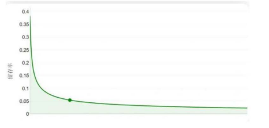

### 3. 如何提升ROI（以广告投放为例）

ROI是什么？书面解释是投资回报率，通俗来讲就是你投入100块钱能收回多少钱，收回150，ROI就是150/100=1.5，这就是ROI，**ROI也可以简称为投产**。

最开始接触ROI是做手游运营的时候，那时候广告投放是以百万级起步的，我们算ROI并不是算单日的投产，而是拉长来看，一个月、两个月、三个月，一般三个月能回本，ROI为正，说明投放是OK的。

知道ROI的定义并不难，难的是我们要知道如何提升ROI，**所有的公司讲来讲去都离不开ROI，ROI为正，公司持续经营，为负的话，公司离倒闭就不远了**。

所以，如果具备了提升ROI的能力，在职场中绝对是有很强的话语权了，那如何提升ROI呢？

#### 方法一：精准人群

人群越精准，你的转化率越高，在PPC（Pay-Per-Click，按点击付费）不变的情况下，你的ROI自然会随着人群的精准度提升而提升。

想起我做渠道的时候，我们手里有30万用户，那时我们已经意识到要对用户进行标签化处理了，当给用户打完标签，等我们接到广告时，我们就在想了，这里面有些用户的质量挺高，如果继续按照CPM（Cost Per 1000 Impressions，每千次展示成本）=8元去结算，我们有点亏，于是我们在给广告主匹配人群时，会特意掺杂一些低质量的流量进去。

当然了，如果你一来就给到CPM=20元去结算，我们可能一开始就全部给灌精准流量了，这就是渠道的骚操作，大家懂了这一点，应该就能够理解，**为什么加大投放后，转化率降低了，ROI也降低了，就是因为用户群扩大，流量不精准了**。

在广告投放的角色上来看，无非是广告主和流量主，大家投放广告时，想的是我花最少的钱买来最优质的用户，流量主想的是我怎么把手里的流量卖出最多的钱，这是一个斗智斗勇的过程。

你千万别想白嫖流量，不可能的，**买的永远没有卖的精明，你只需要老老实实的交好份子钱，流量主自然不会亏待你**。

现在的用户标签（大数据）系统已经十分的完善，我们可以投放到任何自己想投放的用户上，比如结婚人群、有宠物人群、想出去旅游的人群等等，甚至你的朋友是不是有钱人都能给你摸得清清楚楚。

不同平台的用户筛选方式不同，简单举一个例子，小红书投放可以筛选搜索词、地域，其他平台也都有类似的功能，记住，人群选的越精准，你的ROI就会越高，反之亦然。

#### 方法二：提升点击率

说个反常识的结论，在**移动端投放广告，并不是谁出价高，谁的排名越靠前**，而是谁的点击率越高，排名靠前的几率越大。

我们当时投放移动端广告时，每天预算10万，结果怎么着，根本投不出去，有钱花不出去的滋味也不好受，为什么投不出去，因&#x4E3A;**素材的点击率太低，即使加价，还是拼不过同行**。不像某度，只要加钱就有排名，那真的是无脑投放了。

为什么移动端高价不一定投的出去广告呢？这又要回到流量的话题上来，任何渠道，哪怕是国民级应用，它的广告位日均展现次数都是有限的，流量主想的永远是流量的价值最大化，一个CPM我能卖出去100，绝不会80卖出去。

&#x800C;**CPM的收益等于什么？等于1000*点击率*单价**，看到没，点击率和单价两个因素决定了流量主的收益，所以想降低你的出价，**提升你的ROI，最好的方式就是提升点击率了**，此消彼长大概就是这个道理。

我有次测了个图，点击率达到15%，这是一个什么概念呢？要知道同行的素材点击率普遍是7\~8的样子，能超过10的没多少，正因为我到了15，平台真的是一个劲的给我曝光量。

我的PPC也比同行低很多，也就是同样花100元的广告费，我能比别人获得更多的用户，如果转化率稳定，结果不就是我的成本降低了嘛，那么我的ROI自然就提升了，提升ROI要么降本，要么增效，也就这么回事。

#### 方法三：提升转化率

为什么广告投放前产品需要内测，电商需要优化内功（主图详情评论等），就是为了确保你的产品转化率是没问题的。

转化率高和转化率低在ROI的呈现上区别真的是很大，别人下单转化率10%，你的是5%，**就是这么不起眼的5个点的差距，你的广告费就要比别人多花一倍**。

最近做电商运营，听到很多新人在问，我的转化率上不去要怎么办呢？老师就是一句话回复：优化内功。其实别人真正想知道的是，内功要如何优化才能把转化率提升上去。

这里给大家分享几个经验，以电商为例，我们提升转化率有个核心思路是但凡是用户看到的地方，都要有完美的呈现。

你可以给每一个用户所看的入口进行打分，比如主图你们得几分、标题得几分、买家秀得几分、详情得几分、评论又是得几分，还有各个电商平台落地页面特有的功能得几分，不要小看这些细节，用户可能就因为你标题里有“省电”二字而下单了。

**魔鬼的魅力在于细节，提升商品的转化率就是不断的优化细节就可以了**，所以那些老师给你说优化内功，却不说方法，因为没什么方法，就是一点点的扣细节，主图里颜色调调、文字改改，不要奢望大改版带来几倍的数据提升，不可能的。

优化细节提升个0.01，每个地方都提升0.01，你的产品转化率整体就比别人高5\~6个点了，这已经是很了不得的成绩了。

记得我做高客单产品时，转化率就是上不去，后来主图里面加了一张图，转化率提升了2倍，提升转化率就一句话：多看、多测，没有啥捷径可走。

# 八：度量评估类

# 九：指标设计类

