# 一、DID双重差分

&#x20;    我们都知道，计量分析的本质在于因果识别，而准确进行因果识别的一大关键就是对内生性的处理。虽然说工具变量法是解决内生性最常规的手段，但好的工具变量往往可遇不可求，或者需要突破天际的脑洞，或者需要深厚的文献积累。这个时候，似乎只剩下了一条明路：**选题的时候就不要选那些明显有坑的主题，即核心解释变量明显内生的主题。**&#x4E00;般来说，有三个原因会导致内生性——`双向因果、遗漏变量与测量误差`。由于后两者在选题之初并不突出，因而核心解释变量明显内生的主题便是那些核心解释变量与被解释变量明显互相影响的主题，比如经典的“**制度环境与经济增长**”。

&#x20;    之前在推文【[计量经济学基础介绍（一）](http://mp.weixin.qq.com/s?__biz=MzI4NTY1MzgzMQ==\&mid=2247484177\&idx=1\&sn=62de78e27f3be34dd66b90bd54931a27\&chksm=ebe9ad39dc9e242f82132414e191532bd2234e5bab4a887dff3cda75501ed5ba44ca5bc9581a\&scene=21#wechat_redirect)】里讲OLS时推荐过一篇论文“**子女性别与父母幸福感**”，这篇论文的核心解释变量是子女性别，被解释变量是父母幸福感。很显然，子女的性别是老天丢色子决定的，并不受父母幸福与否的影响，从而子女性别这一变量是外生的，回归分析时直接上OLS就好了。因此，为了避免找不到工具变量的苦恼，我们在选题的时候就可以尽量选类似逻辑的主题，比如对政策实施效果的考察。

&#x20;    通常来说，政策的制定与实施对于微观主体（个人或企业）而言是明显外生的，从而双向因果这一最大的问题迎刃而解，除此之外，遗漏变量和测量误差也不再是问题：首先，只有与政策冲击相关的遗漏变量对结果才有影响，而几乎很少有微观因素能影响到政策的实施；其次，政策实施与否以及政策的目标群体往往是很明确具体的，因而在度量上也不容易存在误差。**一言以蔽之，当研究主题是政策效果评估时，基本不需要担忧内生性问题，回归估计时一般直接上OLS就好了。**

&#x20;    我们同样都知道，DID是政策评估时经常使用的方法，听上去和用起来比OLS“高级”了很多，受到了无数应付毕业论文的同学的青睐。上面不是说一般用OLS就行了么，那什么时候上DID呢？这就需要细致考察DID这个方法的前提条件和适用范围了。

在介绍DID的基本原理之前，先了解两个使用DID的前提条件，以直观地判断自己的研究主题是否真的合适用DID：

1. 至少两年的面板数据。如果只有截面数据，一般还是别考虑DID了。

2. 政策冲击并非一刀切，具有受政策影响的实验组和不受政策影响的对照组。否则，同样别考虑DID了。

## 1.1 DID简介

&#x20;    DID，中文名“双重差分法”，英文名“Differences-in-Differences”，别名“倍差法”，小名“差中差”。作为政策效应评估方法中的一大利器，双重差分法受到越来越多人的青睐，概括起来有如下几个方面的原因：

* 可以很大程度上避免内生性问题的困扰：政策相对于微观经济主体而言一般是外生的，因而不存在逆向因果问题。此外，使用固定效应估计一定程度上也缓解了遗漏变量偏误问题。

* 传统方法下评估政策效应（比如OLS），主要是通过设置一个政策发生与否的虚拟变量然后进行回归，相较而言，双重差分法的模型设置更加科学，能更加准确地估计出政策效应。

* 双重差分法的原理和模型设置很简单，容易理解和运用，并不像空间计量、DSGE等方法一样让人望而生畏。

* 尽管双重差分法估计的本质就是面板数据固定效应估计，但是DID听上去或多或少也要比OLS、FE之流更加“时尚高端”，因而DID的使用一定程度上可以满足“虚荣心”。

* ······

&#x20;   在讲DID的原理之前先看一看DID的基准模型设定方程，如下所示：

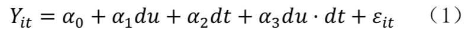

其中，$$d_u$$为分组虚拟变量，若个体i受政策实施的影响，则个体i属于处理组，对应的$$d_u$$取值为1，若个体i不受政策实施的影响，则个体i属于对照组，对应的$$d_u$$取值为0。$$d_t$$为政策实施虚拟变量，政策实施之前$$d_t$$取值为0，政策实施之后$$d_t$$取值为1。$$d_u$$·$$d_t$$为分组虚拟变量与政策实施虚拟变量的交互项，其系数$$\alpha_3$$就反映了政策实施的净效应，也是我们使用DID时最为关注的。

&#x20;    从模型的设定形式就知道了为什么上面要强调DID的两个前提条件：截面数据的话没法构造政策冲击变量$$d_t$$，一刀切政策的话没法构造分组变量$$d_u$$。现在再回过头来问：为什么交互项$$d_u$$·$$d_t$$的回归系数$$\alpha_3$$就反映了政策实施的净效应呢？这个问题的答案可以通过下表来体现，下表的展示也形象体现了双重差分法五个字的真正含义：

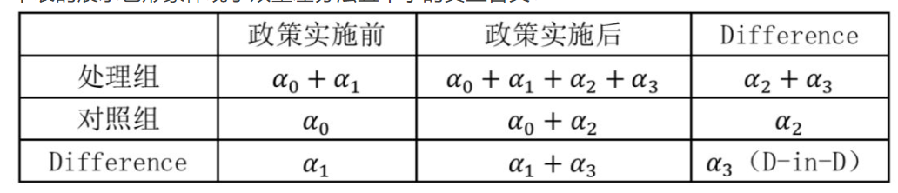

&#x20;    很显然，$$\alpha_3$$是两次差分的结果，一次差分在时间维度，一次差分在个体维度。更直观地，可以用图形来表述上图以及DID的逻辑：

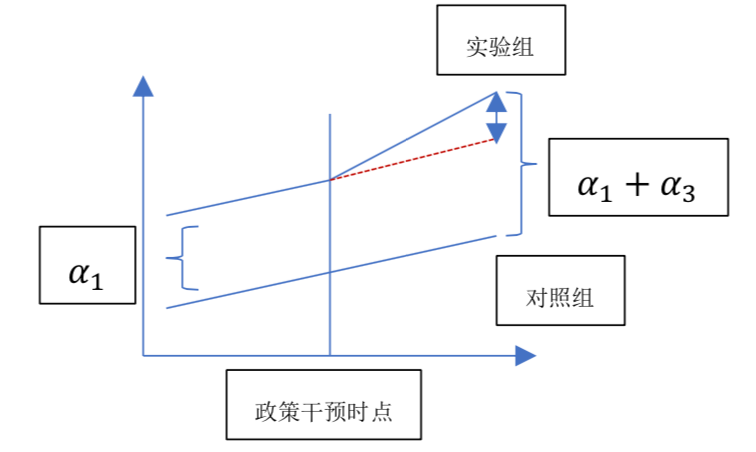

&#x20;    图中红色虚线表示的是假设政策并未实施时，实验组的变化趋势，即实验组的反事实情况。实际上，这个图形也反映出了DID最为重要和关键的前提条件：共同趋势（Common Trends），也就是说，处理组和对照组在政策实施之前必须具有相同的变化趋势。这一点后面再说。

&#x20;    因此，总结来说，双重差分法的基本思想或原理就是通过对政策实施前后对照组和处理组之间差异的比较构造出反映政策效果的双重差分统计量。将该思想与上表的内容转化为简单的模型（1），这个时候只需要关注模型（1）中交互项的系数，就得到了想要的DID下的政策净效应。模型（1）是DID的基准形式，在实际使用时，只需要加上控制变量就可以了。


## 1.2  DID的前提假设与稳健性检验

&#x20;    如同最基本的OLS也有四五个前提假设一样，使用DID时一定要注意这个方法本身的假设或前提条件。上面提到的使用DID的两个前提条件只是这个方法的适用范围，并不是方法本身的假设。其实上面的图形已经有所提示，DID最为重要、最为关键（甚至可以说唯一）的假设就是：处理组和对照组在政策实施之前必须具有共同的变化趋势。DID不要求随机分组，都随机了的话还要Double Difference干嘛呢，直接一个差就可以了；DID也不要求政策冲击是随机的。

&#x20;    很久以前推荐过一篇论文【[论文推荐3：国内双重差分法的研究现状与潜在问题](http://mp.weixin.qq.com/s?__biz=MzI4NTY1MzgzMQ==\&mid=2247483718\&idx=1\&sn=375cee028a6e06cf94a25f309773aeae\&chksm=ebe9af6edc9e267858f174b9a3fe45532a6cb46604f1bf2518152762a6248e1d6206bc54a360\&scene=21#wechat_redirect)】，发表于《数量经济技术经济研究》2015年第7期，这篇论文就大谈特谈随机，误导了很多人（我认识的人就中过枪，答辩时被老师批了）。陆铭老师曾批这篇文章“**影响极坏**”。那实际应用时应该怎么来检验共同趋势假设是否满足呢？首先强调一下，对于只有两年的面板数据，共同趋势假设是无法直接验证的，所以很多文章就不提这事儿。在多年的面板数据下，有两种方式可以用以关注CT假设：画图和回归。

A: 对于画图，举个例子，假设考察某一政策冲击对企业生产率的影响，政策发生在2001年，样本期间为1995-2006年，便可以画出1995-2001年间实验组和对照组的年度生产率（年度生产率均值）趋势图，如果两条线的走势完全一致或基本一致，说明CT假设是满足的。

B: 对于回归，还是继续看这个例子，可以建立如下的回归模型：

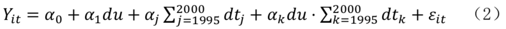

其中，$$d_u$$还是分组虚拟变量，但这时$$d_t$$有所变化，$$d_t$$为年份虚拟变量，当年份为1995时，$$d_t$$取值为1，反之为0，当年份为1996时，$$d_t$$取值为1，反之为0，等等。从而，政策实施前有6个年份虚拟变量，以及$$d_u$$与其得到的6个交互项。交互项的系数反映的便是，对于政策实施前的某一年，实验组和对照组的差异。如果回归得到的这6个交互项都不显著，说明政策实施前实验组和对照组不存在明显的差别，从而CT得证。其实，“都不显著”可以稍微放松，即便存在一两个显著的情况，但只要这6个**联合不显著**，也是能够说明问题的。

&#x20;    除了验证完CT假设外，DID的使用就算结束了？显然不是，一般的方法下尚且需要不少的稳健性检验呢。事实上，即便CT假设满足，我们也不能拍着胸脯说交互项的系数反映的一定是我们关注的政策效应而不是其他什么东西，这就需要进一步的稳健性检验以论证估计结果的可靠性了。DID中常用的稳健性检验有下面几种：

1. 安慰剂检验。具体可以：a）选取政策实施之前的年份进行处理，比如原来的政策发生在2008年，研究区间为2007-2009年，这时可以将研究区间前移至2005-2007年，并假定政策实施年份为2006年，然后进行回归；b）选取已知的并不受政策实施影响的群组作为处理组进行回归。如果不同虚构方式下的DID估计量的回归结果依然显著，说明原来的估计结果很有可能出现了偏误。

2. 利用不同的对照组进行回归，看研究结论是否依然一致。

3. 选取一个完全不受政策干预影响的因素作为被解释变量进行回归，如果DID估计量的回归结果依然显著，说明原来的估计结果很有可能出现了偏误。要说明的是，如果回归结果显著，说明原结果是一定有问题的，而如果回归结果不显著，并不一定能表明原结果没问题。

## 1.3 **面板数据固定效应形式**

&#x20;    之前介绍的模型（1）是DID最普通和一般的形式，然而我们在看文献时往往发现别人的模型不长这个样子，哪里出问题了？先来看一看别人的DID模型的样子：

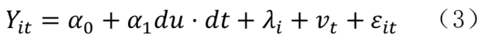

&#x20;    我们知道，凡是做交互项，组成交互项的各个部分（A、B以及A·B）是一定要同时存在的，可是别人的模型里只有交互项，$$d_u$$哪里去了，$$d_t$$哪里去了？其实，模型（3）在多年面板数据里比基准形式更为常见，对于面板数据，通常的估计方法是双向固定效应。这里面，$$\lambda_i$$为个体固定效应，更为精确地反映了个体特征，替代了原来粗糙的分组变量du；$$v_t$$为时间固定效应，更为精确地反映了时间特征，替代了原来粗糙的政策实施变量$$d_t$$。因而，$$d_u$$和$$d_t$$并未真正从模型中消失，只是换了个马甲而已。

&#x20;    既然模型（1）和（3）本质是一样的，那实际使用时应该用哪个好呢？其实都行，根据研究需要选择，比如除了交互项系数，还想关注下$$d_u$$或$$d_t$$的系数，那这时无疑应该用模型（1）。

## 1.4 扩展部分

&#x20;    在上面的部分，首先介绍了DID的基本模型设定和方法原理，接着强调了使用DID的关键假设和稳健性检验，最后说明了多年面板数据下DID模型设定的另一种常见形式。应该说，这些就是DID这个方法最基本和基础的内容了。会了这些东西，用DID行走江湖问题应该不大了。

&#x20;   但是，这里又有一个但是，江湖路途险恶，凭一把菜刀能走多远呢？严肃一点说，DID之所以这么流行和受大家喜欢，很大程度上与它的灵活多变有关系，做适当的调整就能用来应对不同的状况。所以，接下来再介绍一些DID的扩展内容。

### 1.4.1 **滞后效应与预期效应**

&#x20;    不论是模型（1）还是模型（3），估计出来的都是政策实施后的一个**平均效应**。然而，对于有些政策，其效果的显现需要一定的时间，比如政策2008年开始实施，但其效果2010年才开始出现。对政策**滞后效应**的考察往往很重要，有助于我们准确地评估政策的动态效果，为政策的调整和完善提供建议。同样的，政策的出台和实施通常不是突然的毫无预兆的，微观主体如果预期到某个时点政策一定会推行，可能会提前做出反应，这便是**预期效应**。对预期效应的考察一样很重要。

&#x20;    上面的模型（2）除了可以用来观察CT外，还可以用来考察预期效应，比如政策是2001年实施的，而2000年的交互项显著，说明可能存在预期效应。将模型（2）中的年份换成政策实施之后，便可以用以考察滞后效应了，比如政策是2001年实施的，2002年和2003年的交互项不显著，从2004年开始才显著，说明政策效应可能存在两年左右的时滞。

### **1.4.2 倾向得分匹配倍差法（PSM-DID）**

&#x20;    倾向得分匹配法（PSM）本身就是一个单独的方法，内容也很多，所以当和DID结合时这里就不细讲了，以后再专门介绍PSM这个方法。

&#x20;    PSM和DID都是单独可用的方法，结合在一起能干嘛呢？可以这么简单理解，DID不是要求共同趋势吗？共同趋势不是意味着实验组和对照组基本类似吗？然而很多时候我们的原始样本并不满足这个条件。这时，我们可以先用PSM在原始样本中挑选出基本特征都比较相似的新的实验组和对照组，然后再基于新的实验组对照组进行DID回归，这种情况下CT假设肯定妥妥的满足了。另外，对于某些政策冲击，实验组和对照组之间可能存在自选择性，而这会对结果产生影响。比如，研究出口问题时，企业是否出口（是否进入实验组或对照组）可能就并不是偶然的，这时用PSM也能较好地解决这个问题。不过，不是所有政策冲击情景下都能PSM搭配DID，这涉及到PSM的基本原理，以后细说。

### **1.4.3 连续型DID**

&#x20;    不管是DID的基准模型还是面板数据双向固定效应形式的模型，$$d_u$$和$$d_t$$都是虚拟变量的形式，从而交互项估计系数的结果表明的是：政策实施之后的效应。也就是说，这里体现的是有与无之间的区别。以一个具体的例子为例，在研究出口的问题中使用DID，交互项表明的是，企业出口（有这个行为）的影响。这种设定**无法体现出程度的变化**，比如无法体现出出口数额的影响，出口数额每增加一单位的影响。

&#x20;    如果我们想考察程度的变化，便可以采用连续型DID进行估计，基准模型设定如下：

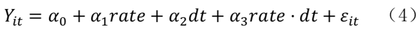

&#x20;    模型（4）与模型（1）的区别在于，原来的分组虚拟变量被**连续型变量rate**所替代了。在出口问题的考察中，rate可以是企业的出口额或出口比例；在空气污染问题的考察中，rate可以是AQI（空气质量指数）的具体数值，等等。此时，交互项的系数反映的是，政策实施之后，rate每一单位变化带来的净效应。

&#x20;    尽管模型（4）看上去就是最普通的交互项模型，跟传统的DID好像一点也不搭，但它确实也是DID大家庭中的一种。之前就说过，DID十分的灵活多变，若是死板地认为模型（1）才是DID，可就贻笑大方了。模型（4）这种形式较早出现在Nancy Qian的文章里，她称这种形式“具有DID的一切优点”。

### **1.4.4 截面数据DID**

&#x20;    是不是有点郁闷？最开始的时候不是说截面数据就不要想着用DID了？回过头去再看一下，说的是“一般还是别···”，没说“一定”。和模型（1）或（3）一样的传统型DID肯定是无法适用于截面数据的，但模型（4）都算DID，截面数据做DID也不是不可能的。

&#x20;    这里还是举个例子来说明这种情况。Chen and Zhou有一篇文章是研究大饥荒的影响的，数据是CHNS的截面数据。由于大饥荒发生于1959-1961年间，他们根据人们的出生年份构造出几个出生队列虚拟变量，比如cohort2（饥荒前2年出生）、cohort1（饥荒前1年出生）等等（说明一下，论文中的原设定不是这样随便，这里简化了一下），然后用出生队列与省份层面的饥荒严重程度进行交乘：

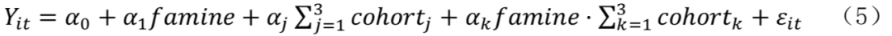

&#x20;    模型（5）和模型（2）以及（4）是不是很像？这时，交互项的系数反映的便是截面意义上的DID效果。对这篇论文感兴趣的可以下载原文下来看看，论文于2007年发表在JHE上。

# 二、matching

## 2.1 PSM（倾向得分匹配）

&#x20;      当无法进行AB实验或者AB实验不够有效（如存在不依从现象）时，正确评估因果效应就需要排除混淆变量的干扰，而排除混淆变量干扰最常用的方法之一就是倾向性得分匹配。倾向性得分匹配通过估计样本被分配到干预组的概率，并将干预组和对照组的参与者匹配来提高因果推断的可靠性。

### 2.1.1 背景

#### 1. **混淆变量对因果推断产生干扰**

> 因果推断目标：测算干预对结果产生的真实影响，即干预效果

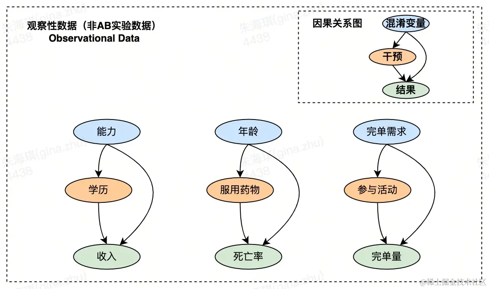

* **案例1：** **学历对收入的影响**

  * **现象**：高学历人群收入更高

  * **问题**：能否能说明学历对收入有正面影响？

&#x20;        不能，也许是更强的**能力**同时导致了高学历及高收入，学历本身并不提升收入

* **案例2**：**服用药物对死亡率的影响**

  * **现象**：服药人群死亡率更高

  * **问题**：能否说明药物导致了更高的死亡率？

  &#x20;   不能，也许是更大的**年龄**的同时导致了更高的服药率和更高的死亡率，服药本身对死亡率的影响未知

* **案例3**：**参与活动对完单量的影响**

  * **现象**：参与活动的人群完单量更高

  * **问题**：能否说明活动促进了用户完单？

  &#x20;   不能，也许是更强的**完单需求**导致了更高的活动参与率和活动期间的完单量，活动本身并未促进完单

&#x20;     以上案例中，「能力、年龄、完单需求」为**混淆变量**（Confounders），指对**干预**（Treatment：学历，药物，活动）和**结果**（Outcome：收入、死亡率、完单量）同时产生影响的变量

&#x20;     混淆变量的存在导致「干预和结果的**相关关系**」（或干预样本和未干预样本的差异）无法代表「干预和结果的**因果关系**」。想要获得准确的因果关系，需要剔除混淆变量的干扰

#### 2. **如何剔除混淆变量干扰？**

&#x20;     需要“阻断”混淆变量对干预的影响，使混淆变量和干预从相关变为不相关/正交，进而准确测量干预效果

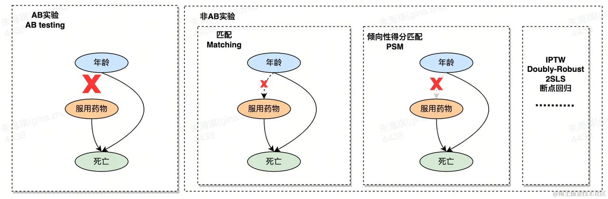

##### （1）**AB实验** **——最有效**

&#x20;    例如，通过进行关于药物的随机试验，是否用药便和年龄或其他混淆变量无关了（阻断了年龄等混淆变量对是否用药这一干预的影响），从而得出药物对死亡率的真实影响。AB实验能最有效地剔除混淆变量的干扰，是因果推断的黄金准则

##### （2）**非AB实验** **——当无法进行AB实验或AB实验不够有效**

**场景：**

&#x20;   ①**无法进行** **AB实验**：如学历和收入，这种场景无法进行AB实验

&#x20;   ②**实验无法有效评估干预效果**：即便有AB实验，实验组也可能因用户 **“** **不依从** **”** （Non-Compliance，例如虽然对实验组用户开放了某个功能，但实验组用户不一定都会去使用），导致**只有少数用户真正受到干预（** **干预覆盖率低** **）** ，干预即使对这部分用户有效，但从整体看效果往往不显著

**方法：**

&#x20;    **匹配**：以药物-死亡率的案例为例，一种很自然的想法是比较不同年龄层内服药和死亡率的关系，每个年龄层内相对同质。这其实是一种**匹配（Matching）** ，即将**同质**（混淆变量近似）样本放到一起比较，避免因不同质而不可比。通过这种方式阻断了年龄对服药的影响

&#x20;    **倾向性得分匹配（Propensity Score Matching）**：PSM是一种使用**倾向性得分**进行**匹配**的**因果推断方法**，由Paul R. Rosenbaum和Donald Rubin两位统计学家在1983年首次提出，可以**降低或消除混淆变量的干扰**，从而更准确地测算干预的效果

### 2.1.2 整体框架

#### 1.**倾向性得分计算**

&#x20;   建立机器学习模型，模型预测每个样本“**受干预概率**”（Propensity Score），即**倾向性得分**

#### 2.**样本匹配**

&#x20;   匹配：为「受干预样本」寻找倾向性得分接近的「未受干预样本」

&#x20;   检验匹配样本**同质性**

#### 3.**干预效果计算**

&#x20;   对比匹配样本差异，计算干预效果

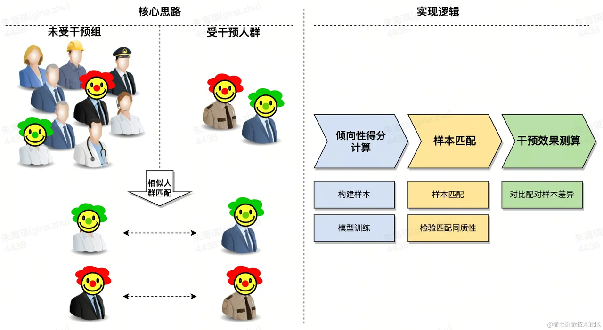

### 2.1.3 使用步骤

> T: 受干预样本集合，以下简称**干预组**
>
> C: 未受干预样本集合，以下简称**空白组**
>
> $$T_i$$: 第i个受干预的样本
>
> $$C_i$$: 第i个未受干预的样本
>
> $$T_match$$: 配对的受干预样本
>
> $$C_match
> $$:配对的未受干预样本

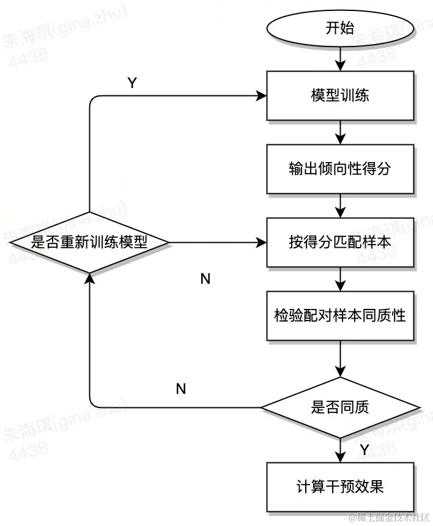

#### 1.倾向性得分计算

> &#x20; Y：关注的结果指标，如单量、GTV
>
> &#x20; X：混淆变量集合，同时也是模型特征。数据时间需要在T发生之前
>
> &#x20; **T：是否受到干预，1-是，0-否**

##### （1）**构建模型**

**样本**：

**特征**：需要尽可能包含所有对 T 和 Y 都有重要影响的混淆变量（X）

**标签**：样本是否受到干预（T：1-受到干预，0-未受干预）

**a. 样本筛选**：

&#x20;    如果是观察性数据（无AB实验），则使用**所有样本；**

&#x20;    如果是AB实验数据，则**只使用实验组数据**（因为对照组无法受到干预，如果包含对照组数据，则会导致模型学习到有偏的 X 和 T 的因果关系）。

**b. 模型训练**：

&#x20;   以X为自变量，T为因变量，训练二分类模型（如逻辑回归、Xgb等）；

*&#x20;  &#x20;****模型效果要求:*&#x6CA1;有明确要求**。PSM的最终目标并非训练一

个AUC很高的模型，模型的预测结果是为下一步的匹配服务的，**关键在于匹配的样本是否同质。**

##### （2）**倾向性得分输出**：

&#x20;   使用模型预测所有样本的**受干预概率**，这个概率就是**倾向性得分**

#### 2.匹配

&#x20;   匹配：从空白组中为干预组样本匹配倾向性得分接近的样本

&#x20;   以**最常用**的**卡尺最邻近匹配**（Nearest Neighbor Caliper Matching）为例，过程为：对每个干预组样本，从空白组中寻找一个（通常为一个，但也可以是多个）与其倾向性得分最接近的样本，且两者差异小于某阈值

> &#x20;倾向性得分∈\[0，1]，下面例子为了表述方便没有做这一限制

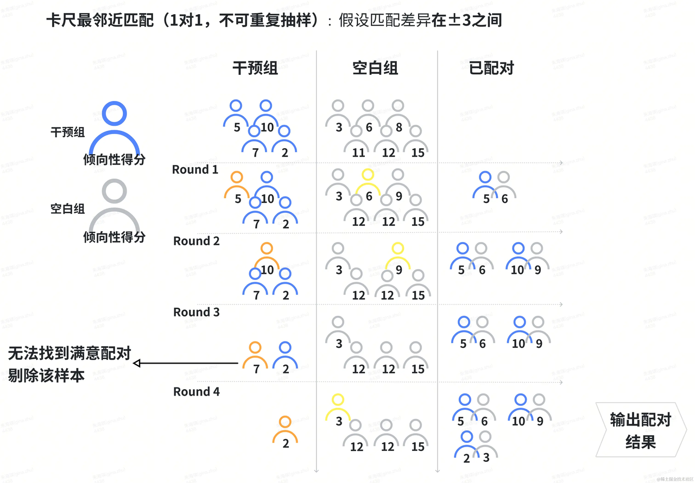

##### （1）**卡尺最近邻匹配**

&#x20;   根据使用细节的不同有以下细分类型：

*&#x20;   $$C_i$$是否能重复和多个$$T_i$$匹配：*

&#x20;  **否**：不重复抽样（without replacement），**更常用是**：可重复抽样（with replacement）

*&#x20;   $$T_i$$与几个$$C_i$$产生匹配：*

&#x20;  **1个**：1对1匹配（one-to-one matching），**更常用大于1个**：1对多匹配（one-to-many matching）

&#x20;  此外，还有一些其他匹配算法（相对不常用），如核函数匹配、半径内匹配等。

##### **（2）匹配的偏差与方差**

&#x20;   不同算法的主要差异在于**匹配到的空白组样本数量**的多少。一般来说，匹配到的空白组样本越多，**Bias**（估计值和实际值的系统性**偏差**）越大，**Variance**（估计值本身的**波动**）越小

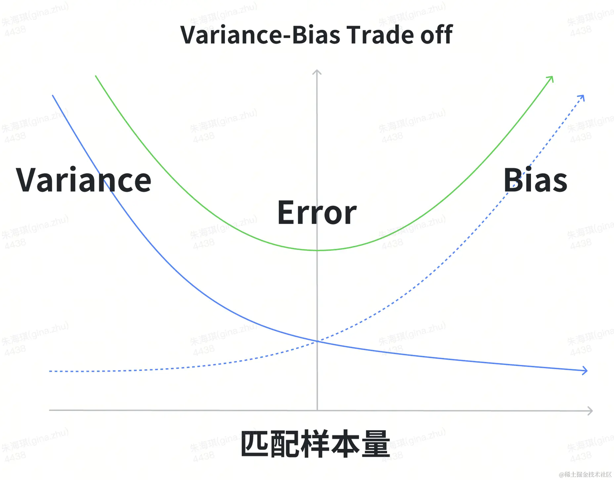

#### （3）**算法选择**

&#x20;   没有某种算法严格优于其他（不同场景优劣排序可能有不同）

&#x20;   推荐使用**卡尺最邻近匹配**（常用、简单、一般而言效果好），通常选择**不重复抽样、1对1匹配**，遇不同场景可进行微调 **：**

a. 空白组样本相对不足：可使用可重复抽样

b. 空白组样本相对充足：不可重复抽样

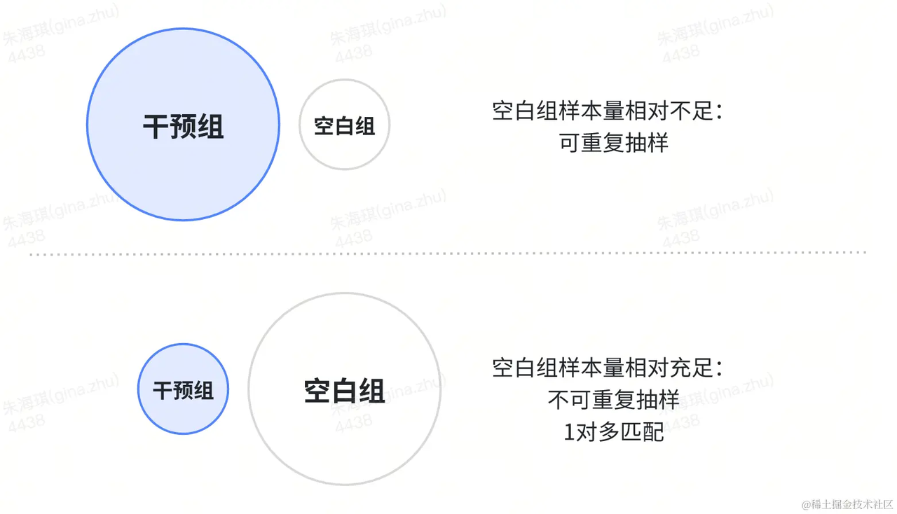

#### 3.同质性检验

&#x20;   ①检验「配对的干预组」（$$T_match$$）和「配对的空白组]$$C_match$$混淆变量（X）同质性：

&#x20;   a. 图示法：画出干预组和空白组变量的分布，比较是否存在显著不同

&#x20;   b. 假设检验法：使用Z检验、t检验、卡方检验等

> &#x20; 下图展示了PSM的作用，匹配前（Before Matching）空白组和干预组分布差异较大，匹配后（After Matching）分布则非常近似
>
> 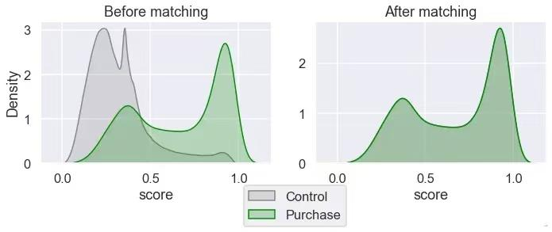

&#x20;   ②若使用卡尺最近邻匹配，则可能有部分干预组样本被丢弃，此时需要检验获得匹配的干预组和原始干预组的分布是否有显著差异

&#x20;   ③根据检验结果，决定是否进入下一步骤

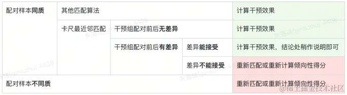

#### 4.干预效果计算

&#x20;  计算「配对的干预组」$$T_match$$和「配对的空白组」$$C_match$$结果指标（如单量、GTV）差异，即为干预效果。

### 2.1.4 应用案例：**金秋拉货节司机活动效果评估**

* **场景：无** **AB实验**

* **背景**：

  * **活动种类**：2022金秋拉货节期间全量上线了「司机战队」、「王者小程序」、「开大奖」、「积分抽奖」等活动，无AB实验

  * **活动目的**：

    * 借助大型活动，提升平台影响力，抢占更多市场份额

    * 九月为高峰期，通过司机活动促进司机**接单完单**，提升响应率

  * **目标**：评估司机活动是否对司机完单有正向影响

**PSM活动效果评估流程：**

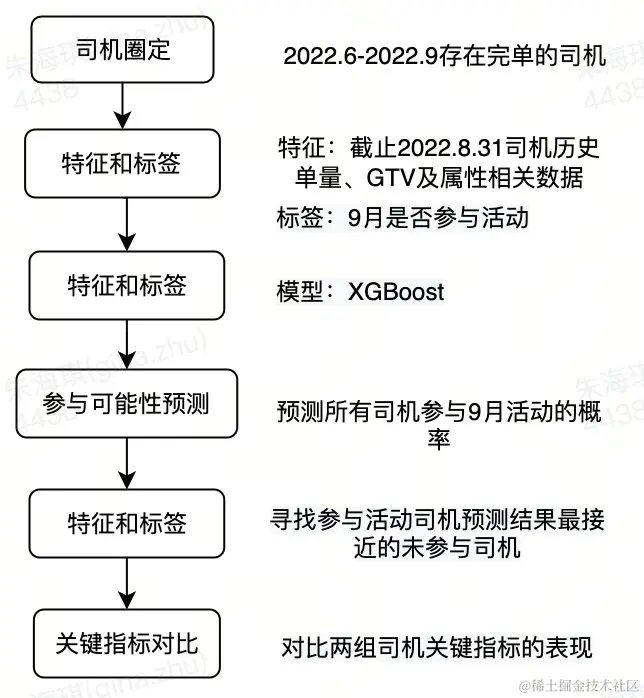

* **司机范围：** 6-9月存在完单的司机

* **特征数据（混淆变量）：** 截止8.31司机历史单量、GTV（总成交金额）、属性相关特征

* **预测标签（干预）：** 是否参与拉货节活动

* **倾向性得分输出**：预测每个司机在9月份参与活动的概率

* **匹配：** 使用卡尺最近邻匹配（1对1，不重复抽样）对于每个参与活动的司机，找到其对应预测参与概率最接近的未参与活动的司机

* **同质性检验**：匹配司机实验前核心指标同质，部分参与活动司机未配对，但差异在可接受范围内

* **对比结果**：对比两类司机的单量及GTV指标差异，拉货节活动对司机单量及GTV存在显著正向效果，人均单量较未参与司机高31.6%，人均GTV较未参与司机高12.2%

### 2.1.5 结语

&#x20;    本文介绍了由于种种原因在无AB实验或AB实验覆盖率较低情况下常用的干预效果评估方式——倾向性得分匹配。本文并同时建立了进行倾向性得分匹配分析的整体框架和操作步骤，以及案例演示。同时请读者期待后续货拉拉数据科学组AB实验白皮书体系的因果推断技术介绍。


## 2.2 CEM（粗化精确匹配）

&#x20;    本文主要讲解粗化精确匹配的思路，不涉及stata具体代码的讲解。其实弄懂了思路，代码的输出结果也就大概了解了。本文的观点主要是根据（Blackwell, Iacus, King, & Porro, 2009；Iacus, King, & Porro, 2012）这两篇文献得来的，并结合自己的经验和案例进行分享，如果要深入了解该方法建议阅读原文。

参考文献：

Blackwell, M., Iacus, S., King, G., & Porro, G. (2009). cem: Coarsened exact matching in Stata. *The Stata Journal*, *9*(4), 524-546.

Iacus, S. M., King, G., & Porro, G. (2012). Causal inference without balance checking: Coarsened exact matching. *Political [<span style="color: rgb(36,91,219); background-color: inherit">analysis</span>](https://zhida.zhihu.com/search?content_id=199257228\&content_type=Article\&match_order=1\&q=analysis\&zhida_source=entity)*, *20*(1), 1-24.

&#x20;    粗化精确匹配（coarsened exact matching，CEM）是Blackwell和Gary King等人在2010年左右提出的一种基于匹配思想的样本加权方法，并不是一种[<span style="color: rgb(36,91,219); background-color: inherit">参数估计</span>](https://zhida.zhihu.com/search?content_id=199257228\&content_type=Article\&match_order=1\&q=%E5%8F%82%E6%95%B0%E4%BC%B0%E8%AE%A1\&zhida_source=entity)方法。简单说就是先进行匹配并赋予观测值权重，随后再对加权的样本进行最小二乘或[<span style="color: rgb(36,91,219); background-color: inherit">极大似然</span>](https://zhida.zhihu.com/search?content_id=199257228\&content_type=Article\&match_order=1\&q=%E6%9E%81%E5%A4%A7%E4%BC%BC%E7%84%B6\&zhida_source=entity)等参数估计方法。

&#x20;    本文的内容主要分为为匹配的目的、精确匹配、粗化精确匹配、粗化精确匹配的粗化原则、粗化精确匹配的权重计算（选看）、粗化精确匹配的步骤、粗化精确匹配的优缺点七个部分。

注：本文不会对不平衡性（imbalance）的相关概念进行讲解，原因在粗化精确匹配的步骤中给出。

### 2.2.1 匹配的目的

&#x20;    匹配的目的是通过删减观测值，使控制组和处理组在变量上具有更好的平衡性（Blackwell et al., 2009）。（原文为：The key goal of matching is to prune observations from the data so that the remaining data have better balance between the treated and control groups.）

&#x20;    用学术一点的说法就是，匹配可以缓解样本自选择问题，也就是核心解释变量和某些[<span style="color: rgb(36,91,219); background-color: inherit">解释变量</span>](https://zhida.zhihu.com/search?content_id=199257228\&content_type=Article\&match_order=2\&q=%E8%A7%A3%E9%87%8A%E5%8F%98%E9%87%8F\&zhida_source=entity)存在相关关系。当然，我们需要认识到匹配的缺陷，它仅仅是缓解，而且仍可能存在反向因果、遗漏解释变量等[<span style="color: rgb(36,91,219); background-color: inherit">内生性</span>](https://zhida.zhihu.com/search?content_id=199257228\&content_type=Article\&match_order=1\&q=%E5%86%85%E7%94%9F%E6%80%A7\&zhida_source=entity)问题。因此，匹配经常和DID结合在一起使用。

&#x20;    下面拿大家常见的例子来说明一下：

&#x20;    上大学与工资的关系。在研究中，我们会想考察上大学对工资的影响，一般来说，我们可以直接拿上大学的人的工资和不上大学的人的工资进行直接比较，这样就可以求出，即：E(y|Di=1)−E(y|Di=0)

&#x20;    这种做法当然没有错，但是在实际研究的过程中，我们可能会更加关心上大学这个行为对工资的影响，也就是教育作为[<span style="color: rgb(36,91,219); background-color: inherit">信号作用</span>](https://zhida.zhihu.com/search?content_id=199257228\&content_type=Article\&match_order=1\&q=%E4%BF%A1%E5%8F%B7%E4%BD%9C%E7%94%A8\&zhida_source=entity)对工资的影响。这时候我们关注的是参与者的[<span style="color: rgb(36,91,219); background-color: inherit">平均处理效应</span>](https://zhida.zhihu.com/search?content_id=199257228\&content_type=Article\&match_order=1\&q=%E5%B9%B3%E5%9D%87%E5%A4%84%E7%90%86%E6%95%88%E5%BA%94\&zhida_source=entity)（Average treated effect on the treated, ATT），我们想要知道一个人如果上了大学跟没上大学的工资差异,即：ATT=E($$Y_1i$$−$$Y_0i$$|D=1)

&#x20;    但是我们通常观察不到这种行为，因为一个人不可能既上了大学又没上大学。要解决这个问题，用文艺一点的说法，A如果上了大学，且我们观察到[<span style="color: rgb(36,91,219); background-color: inherit">平行时空</span>](https://zhida.zhihu.com/search?content_id=199257228\&content_type=Article\&match_order=1\&q=%E5%B9%B3%E8%A1%8C%E6%97%B6%E7%A9%BA\&zhida_source=entity)里的A’没上大学，那么二者工资相减，就可以得到ATT了。但这并不实际，匹配是目前靠谱的方法之一，同学A如果上了大学，然后我们在没有上大学的人里面找一个或几个同学B，同学B的一些特征（智力、家庭背景等）和A相似，这时候我们用A的工资减B的工资就可以得到ATT啦。

&#x20;    这时候聪明的小伙伴可能会问，那我们为什么不直接进行回归，然后控制住智力、家庭背景等变量呢？因为[<span style="color: rgb(36,91,219); background-color: inherit">线性回归</span>](https://zhida.zhihu.com/search?content_id=199257228\&content_type=Article\&match_order=1\&q=%E7%BA%BF%E6%80%A7%E5%9B%9E%E5%BD%92\&zhida_source=entity)中仅控制住了这些变量的“线性”影响，而它们可能产生“[<span style="color: rgb(36,91,219); background-color: inherit">非线性</span>](https://zhida.zhihu.com/search?content_id=199257228\&content_type=Article\&match_order=1\&q=%E9%9D%9E%E7%BA%BF%E6%80%A7\&zhida_source=entity)”的影响。

&#x20;   好了，对匹配的目的简单介绍就到这里，本文的主要目的是介绍CEM。如果对匹配的概念还有不了解的可以去其他地方看看，这类文章还是挺多的。

### 2.2.2 精确匹配（Exact matching）

&#x20;    精确匹配的意思是用处理组的[<span style="color: rgb(36,91,219); background-color: inherit">个体匹配</span>](https://zhida.zhihu.com/search?content_id=199257228\&content_type=Article\&match_order=1\&q=%E4%B8%AA%E4%BD%93%E5%8C%B9%E9%85%8D\&zhida_source=entity)在控制组中拥有相同特征的个体（Blackwell et al., 2009）。（原文：matches a treated unit to all the control units with the same covariate values.）

&#x20;    沿着刚才的例子，我们随手构造了一个样本，表1是该样本精确匹配的结果，里面有个体1-6属于处理组（上了大学），个体7-12属于控制组（没上大学），[<span style="color: rgb(36,91,219); background-color: inherit">因变量</span>](https://zhida.zhihu.com/search?content_id=199257228\&content_type=Article\&match_order=1\&q=%E5%9B%A0%E5%8F%98%E9%87%8F\&zhida_source=entity)是工资，协变量是家庭条件，strata代表的是[<span style="color: rgb(36,91,219); background-color: inherit">匹配层</span>](https://zhida.zhihu.com/search?content_id=199257228\&content_type=Article\&match_order=1\&q=%E5%8C%B9%E9%85%8D%E5%B1%82\&zhida_source=entity)（这个词会反复在CEM中用到，意思是具有相同特征的处理组和控制组个体会被分配到同一层级中，且一个层级中至少要有一个控制组个体和一个处理组个体，若仅有控制组个体或仅有处理组个体，则不存在该匹配层）。在[<span style="color: rgb(36,91,219); background-color: inherit">精确匹配</span>](https://zhida.zhihu.com/search?content_id=199257228\&content_type=Article\&match_order=14\&q=%E7%B2%BE%E7%A1%AE%E5%8C%B9%E9%85%8D\&zhida_source=entity)的结果中，一共12个个体，他们根据家庭条件进行匹配，例如，编号为1、5、7、9的同学，他们的家庭条件一样，且有两个是处理组的（1和5），两个是控制组的（7和9），因此他们都被分到了第一层。

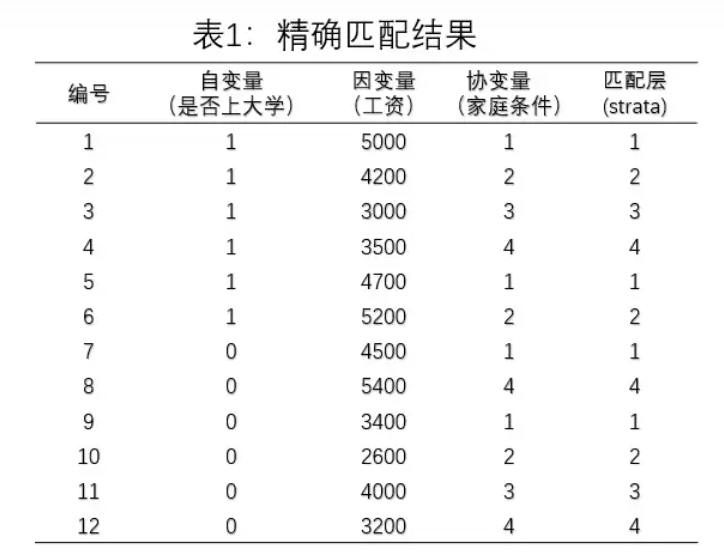

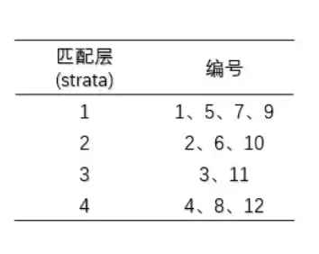

&#x20;     表1反映了只有一个匹配变量，且该变量为[<span style="color: rgb(36,91,219); background-color: inherit">分类变量</span>](https://zhida.zhihu.com/search?content_id=199257228\&content_type=Article\&match_order=1\&q=%E5%88%86%E7%B1%BB%E5%8F%98%E9%87%8F\&zhida_source=entity)时的精确匹配结果，所有的个体都匹配上了。这时候让我们引入一个连续的匹配变量，智力水平。表2为引入智力水平后的精确匹配结果，这时候要想匹配需要拥有相同的智力水平和相同的家庭条件，很可惜，只有1和7满足了该条件并进行了匹配，这时候由12个观测值，直接缩水为2个观测值（本不富裕的家庭更加雪上加霜）。这里我们可以发现精确匹配的一个最大问题，在引入连续变量后，很难有观测值匹配得上，正如King所说“Adding one continuous variable to a dataset effectively kills exact matching because two observations are unlikely to have identical values on a continuous measure.”不得不说[<span style="color: rgb(36,91,219); background-color: inherit">kills</span>](https://zhida.zhihu.com/search?content_id=199257228\&content_type=Article\&match_order=2\&q=kills\&zhida_source=entity)用的很精髓。那这种情况下，应该怎么办呢？

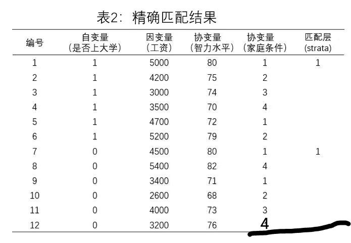

### 2.2.3 粗化精确匹配

&#x20;    这时候终于要进入本文的主题了，粗化精确匹配。由于精确匹配无法解决连续变量的匹配问题，因此自然而然的，我们会想到，那我们将连续变量（当然也可以是有序多分类变量）转化为[<span style="color: rgb(36,91,219); background-color: inherit">有序多分类变量</span>](https://zhida.zhihu.com/search?content_id=199257228\&content_type=Article\&match_order=2\&q=%E6%9C%89%E5%BA%8F%E5%A4%9A%E5%88%86%E7%B1%BB%E5%8F%98%E9%87%8F\&zhida_source=entity)（这个过程我们可以称之为粗化（coarsen）变量）不就行了吗，粗化精确匹配正是基于这样的思想，这句话是粗化精确匹配的核心思想，牢记！！！粗化变量+精确匹配=粗化精确匹配。（顺便吐槽一下，不知道为什么有人会叫它广义精确匹配，明明粗化精确匹配的翻译就把它的含义把握住了）

&#x20;    按照作者的说法，你如果懂如何画直方图你就会粗化精确匹配（Iacus et al., 2012）（原文：If you understand how to draw a histogram, you will understand this method.），画[<span style="color: rgb(36,91,219); background-color: inherit">直方图</span>](https://zhida.zhihu.com/search?content_id=199257228\&content_type=Article\&match_order=2\&q=%E7%9B%B4%E6%96%B9%E5%9B%BE\&zhida_source=entity)时，我们根据某种规则（可能是1-10为一组，11-20为一组）来描述一个东西的分布情况，在粗化变量时，我们也会按照这种做法来进行。

&#x20;   沿着上一个例子，我们现在进行粗化精确匹配，将智力水平粗化为3个水平，60-69为智力水平一般，70-79为智力水平较高，80-89为智力水平很高，然后再进行精确匹配。由于智力水平现在有3个水平，家庭条件有4个水平，理论上我们最多有12个strata。但是由于本来的观测值就少，无法做到每一层至少包含一个控制组和处理组的观测值，因此只有4个strata。例如，个体2和6虽然拥有相同的智力水平和家庭条件，但他们都是处理组的个体，因此都没能匹配上。

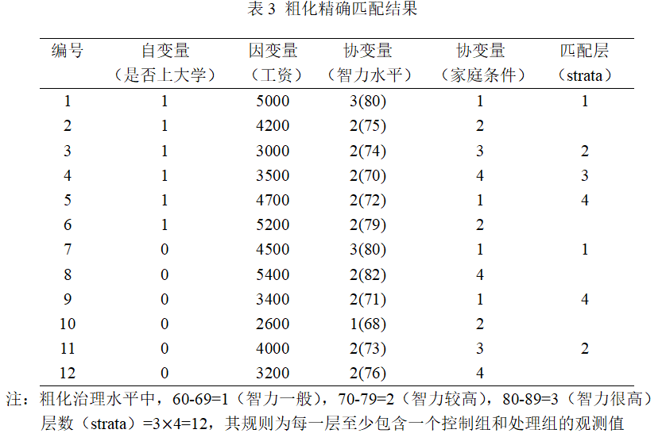

&#x20;    我们可以通过表4来具体看看匹配的情况，标红的为处理组的个体，标黑的为控制组的个体。在表4中，个体10、2、6和8由于层数中缺少另一组的个体所以没能进入到匹配。这还是有些可惜，12个观测值中有4个观测值匹配不上要丢弃，那有没有什么方法可以增加粗化精确匹配的观测值的数量呢？

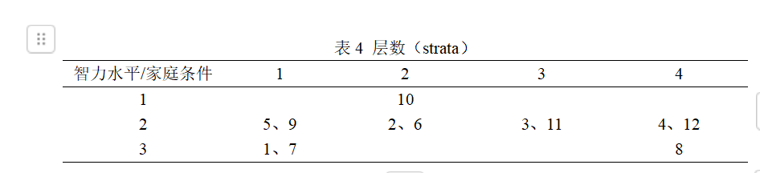

### 2.2.4 粗化精确匹配的粗化原则

&#x20;   一般来说，粗化变量并没有一个准确的粗化标准（这也是该方法的缺陷之一，或许对manipulate data的人来说也算是优点？），所以我们可以通过改变粗化的标准，要提醒的是，实际文献中，像本文用等距来粗化连续变量（智力水平）的情况十分少见，本文只是为了举例方便才这样做的，实际上更多用分位数粗化。在文献中常见的粗化标准有两个：（虽然CEM有不同的算法可以实现粗化，但我个人认为依据以下两点粗化足以）

（1）根据分位数粗化，例如，根据中位数将连续变量或[<span style="color: rgb(36,91,219); background-color: inherit">有序分类变量</span>](https://zhida.zhihu.com/search?content_id=199257228\&content_type=Article\&match_order=1\&q=%E6%9C%89%E5%BA%8F%E5%88%86%E7%B1%BB%E5%8F%98%E9%87%8F\&zhida_source=entity)粗化为有序的二分类变量，或者根据[<span style="color: rgb(36,91,219); background-color: inherit">四分位数</span>](https://zhida.zhihu.com/search?content_id=199257228\&content_type=Article\&match_order=1\&q=%E5%9B%9B%E5%88%86%E4%BD%8D%E6%95%B0\&zhida_source=entity)将连续变量或有序分类变量粗化为有序的四分类变量（如家庭收入这类变量）。

（2）根据先验知识（prior knowledge）粗化，例如，我们知道年收入低于1万为低收入家庭，我们就可以将年收入这个连续变量粗化为二分类（低收入家庭和非低收入家庭）。

&#x20;    接下来，我们用上面的栗子并分别使用这两个原则进一步讨论。

&#x20;    首先是[<span style="color: rgb(36,91,219); background-color: inherit">分位数</span>](https://zhida.zhihu.com/search?content_id=199257228\&content_type=Article\&match_order=4\&q=%E5%88%86%E4%BD%8D%E6%95%B0\&zhida_source=entity)粗化，我们依据家庭条件的中位数粗化了该变量，将家庭条件为1和2的归为家庭条件较差，将家庭条件3和4的归为家庭条件较好。表5呈现了该结果。这时候智力水平有3个水平，家庭条件有2个水平，理论上最多有6个strata，由于观测值有限，我们匹配上的观测值分别属于3个strata。

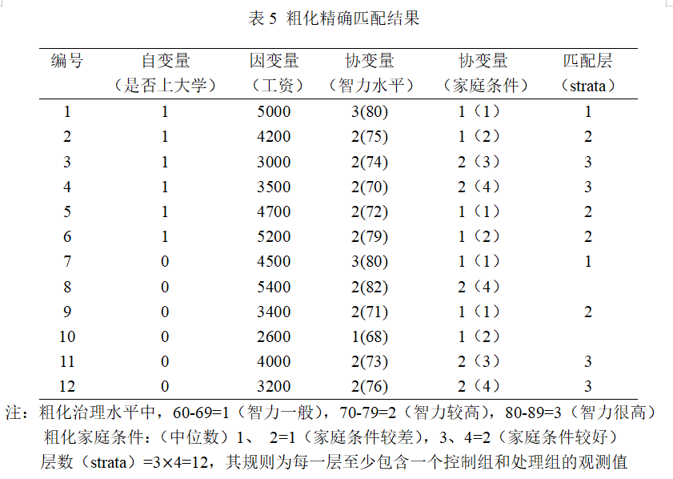

<span style="color: rgb(143,149,158); background-color: inherit">层数（strata）=3</span>$$\times$$<span style="color: rgb(143,149,158); background-color: inherit">2=6，其规则为每一层至少包含一个控制组和处理组的观测值</span>

&#x20;  表6呈现了具体的匹配情况，可怜的10和8还是没能匹配上，然后我惊讶的发现10属于是智力一般且家庭较差的咸鱼，8属于是智力很高且家庭条件较好的大神，这两种是极端情况。实际上，在现实情景中也难以匹配上一些极端值（我真的没有预先设置这种情况，今天写的时候才发现有这个巧合）。不过较之前匹配上8个观测值而言，我们如今已匹配上10个观测值了！

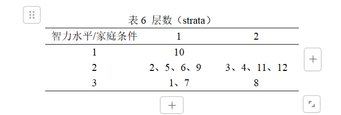

&#x20;   接下来展示依据先验知识粗化，假设存在信息，表明了家庭条件为1的为低保户，家庭条件为2、3和4的为非低保户，粗化之后的结果如表7所示。

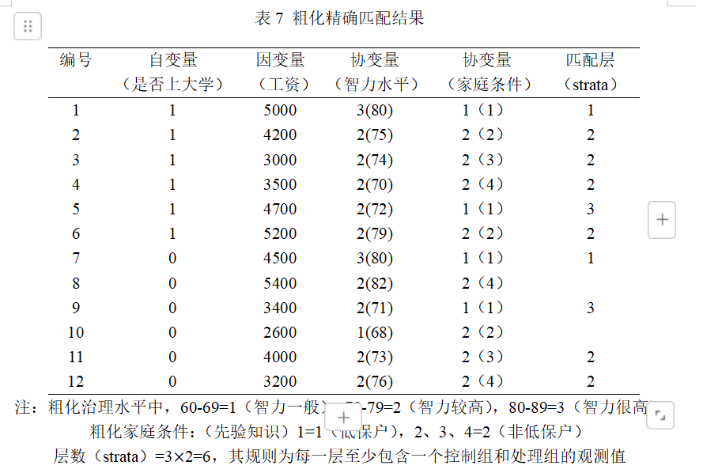

&#x20;   匹配的具体情况如表8所示，依旧匹配上了10个，阴差阳错，8和10还是没匹配上。虽然依据先验知识匹配的观测值数量跟依据中位数匹配的观测值数量是一样的，但是二者最终计算是否上大学对工资的影响的结果是一样的吗？

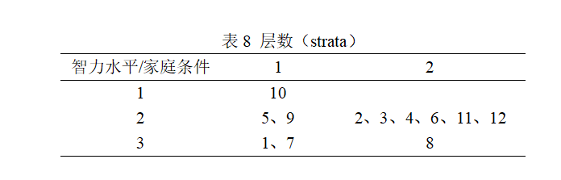

### 2.2.5 粗化精确匹配的权重计算（选看）

&#x20;   粗化精确匹配的权重一般是不一样的，这是因为虽然匹配上的观测值数量一样，但是他们在层级之间的分布不一样，这会使得粗化精确匹配的权重（用cem\_weight表示）不一样，最终导致结果不一样。

&#x20;   刚才讲了匹配的原则，现在再来讲一下粗化精确匹配的权重，虽然这部分的数值stata会直接汇报，但大家可以了解一下这部分的算法，因为真的很简单。

&#x20;   先简单讲一下匹配中的[<span style="color: rgb(36,91,219); background-color: inherit">加权</span>](https://zhida.zhihu.com/search?content_id=199257228\&content_type=Article\&match_order=3\&q=%E5%8A%A0%E6%9D%83\&zhida_source=entity)，无论是PSM还是CEM，大多时候都涉及到样本的加权问题。因为我们经常不是进行的一对一匹配（即一个处理组观测值对应一个控制组观测值），我们更可能面对的是多对一的情况（例如，一个处理组观测值对应多个控制组观测值，当然也可能反过来），或者多对多的情况（例如，在CEM的一个strata中，包含了多个处理组和控制组的观测值），不加权可能会使得出来结论有偏。

&#x20;   下图为CEM中的[<span style="color: rgb(36,91,219); background-color: inherit">加权算法</span>](https://zhida.zhihu.com/search?content_id=199257228\&content_type=Article\&match_order=1\&q=%E5%8A%A0%E6%9D%83%E7%AE%97%E6%B3%95\&zhida_source=entity)（Iacus et al., 2012），

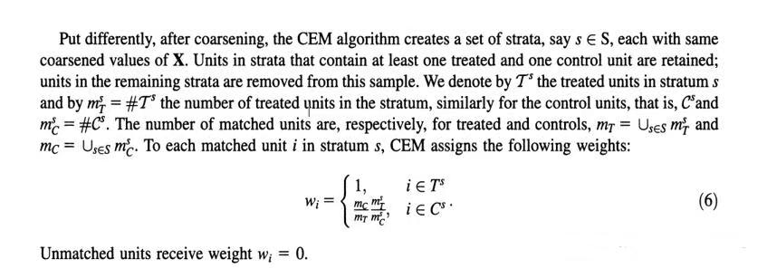

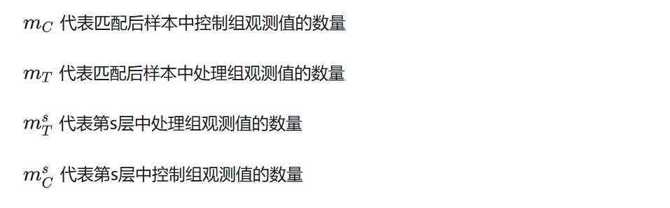

&#x20;    因此，结合来看，如果是处理组的观测值，则赋权重为1；如果是控制组的观测值，则赋权重为：（匹配后样本中控制组观测值数量/匹配后样本中处理组观测值数量）\*（层级中处理组观测值数量/层级中控制组观测值数量）；如果没有匹配上赋权重为0。

&#x20;    这个赋权规则是怎么得来的呢？

&#x20;    我们可以尝试反推，进一步计算出：

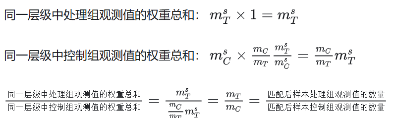

&#x20;   这样我们就知道了，权重依据匹配后处理组和控制组的观测值数量计算出来的。

&#x20;   接下来，我们可以手动计算一下刚才案例中的权重，用表8的数据来算，以控制组中的编号为9和11的人为例（因为处理组的个体不需要算权重，它们的权重为1）

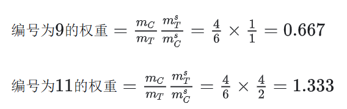

&#x20;  最终算出来的结果为表9：

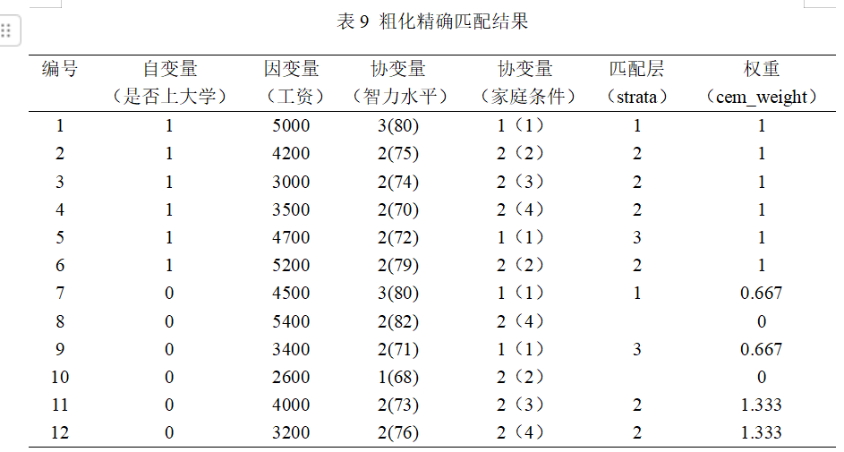

&#x20;    接下来，我们可以通过简单的运算来验证为什么粗化精确匹配可以自动满足协变量平衡性，也就是说的without balance checking，即在匹配后处理组和控制组在[<span style="color: rgb(36,91,219); background-color: inherit">协变量</span>](https://zhida.zhihu.com/search?content_id=199257228\&content_type=Article\&match_order=3\&q=%E5%8D%8F%E5%8F%98%E9%87%8F\&zhida_source=entity)上的取值没有显著差异。在本例中，协变量分别为智力水平和家庭条件。

&#x20;    首先，计算匹配后控制组和处理组的智力水平的均值：

&#x20;    匹配后处理组智力水平的均值为个体1-6的智力水平的加权平均：

匹配后处理组智力水平的均值=$$\frac{1}{6}$$(3×1+2×1+2×1+2×1+2×1+2×1)=$$\frac{13}{6}$$

&#x20;    匹配后控制组智力水平的均值为个体7、9、11和12的智力水平的加权平均：

匹配后处理组智力水平的均值=$$\frac{1}{4}$$(3×$$\frac{2}{3}$$+2×$$\frac{2}{3}$$+2×$$\frac{4}{3}$$+2×$$\frac{4}{3}$$)=$$\frac{13}{6}$$

&#x20;    由此可见，匹配后两组的智力水平的是一样的。

&#x20;    接下来，计算匹配后控制组和处理组的家庭条件的均值：

&#x20;    匹配后处理组家庭条件的均值为个体1-6的家庭条件的的加权平均

匹配后处理组家庭条件的均值=$$\frac{1}{6}$$(1×1+2×1+2×1+2×1+1×1+2×1)=106

&#x20;    匹配后控制组家庭条件的均值为个体7、9、11和12的家庭条件的加权平均

匹配后处理组家庭条件的均值=$$\frac{1}{4}$$(1×$$\frac{2}{3}$$+1×$$\frac{2}{3}$$+2×$$\frac{4}{3}$$+2×$$\frac{4}{3}$$)=106

&#x20;    由此可见，匹配后两组的家庭条件的是一样的。

&#x20;    因此，当我们粗化变量且进行匹配后，所得到的样本根本无需进行平衡性检验，两组观测值在协变量上不仅没有显著差异，而且根本没有差异。

### 2.2.6 粗化精确匹配的步骤

&#x20;   好啦，到这里已经说完了CEM的基本思想、粗化的原则和权重的计算方法。在这里，我们可以简单总结一下CEM的步骤：

（1）粗化匹配变量

（2）确定匹配样本（计算不平衡性（L1），这部分的内容没有讲，因为一般而言，在实际操作过程中计算出来的[<span style="color: rgb(36,91,219); background-color: inherit">不平衡性</span>](https://zhida.zhihu.com/search?content_id=199257228\&content_type=Article\&match_order=3\&q=%E4%B8%8D%E5%B9%B3%E8%A1%A1%E6%80%A7\&zhida_source=entity)都无限趋近于零，而且我们会根据分位数或[<span style="color: rgb(36,91,219); background-color: inherit">先验知识</span>](https://zhida.zhihu.com/search?content_id=199257228\&content_type=Article\&match_order=4\&q=%E5%85%88%E9%AA%8C%E7%9F%A5%E8%AF%86\&zhida_source=entity)先粗化变量所以不平衡性实际上是确定的，以上是我个人的理解！欢迎讨论）

（3）计算权重

（4）进行加权分析（可以是reg、logit或者did等等）

&#x20;    第二步和第三步是电脑帮你算，第四步是你本来就要做的，所以CEM中你只需要做第一步，即粗化变量，这么一看，CEM真的是简单易学的方法！

### 2.2.7 粗化精确匹配的优缺点

&#x20;    谈到优缺点时，我们需要将CEM和常用的PSM放在一起比较。

#### 1.优点

（1）逻辑简单。粗化精确匹配是精确匹配的拓展，精确匹配的原则还是非常易懂的，即精确匹配需要满足处理组和控制组的个体在协变量的取值上完全相等。粗化精确匹配只是补救了精确匹配中观测值损失严重的做法。

（2）自动满足协变量平衡性（without balance checking）。CEM不用像PSM一样进行平衡性检验，在粗化精确匹配的权重计算中，已经简单的验证了这个结论。

（3）适合进行[<span style="color: rgb(36,91,219); background-color: inherit">异质性分析</span>](https://zhida.zhihu.com/search?content_id=199257228\&content_type=Article\&match_order=1\&q=%E5%BC%82%E8%B4%A8%E6%80%A7%E5%88%86%E6%9E%90\&zhida_source=entity)。自动满足协变量平衡性的特质不仅适用于匹配后的样本，同时适用于匹配后的样本在匹配变量的某一水平中。这个在stata里面，可以通过svyset \[pweight=cem\_weights]，然后在对不同的样本进行均值比较得出，在视频中我会细讲。

（4）能够充分利用信息。虽然看似在粗化过程中，我们遗漏了很多变量的信息，例如将智力水平按10分来分组，但是我们可以在随后的检验中，将未粗化的智力水平作为控制变量引入，这样可以充分利用信息。正如（Blackwell et al., 2009）提到的，CEM仅仅是暂时粗化变量以便分组（原文：The idea of CEM is to temporarily coarsen each variable into substantively meaningful groups.），在随后的分析过程中，我们依旧可以充分利用变量的信息。

（5）能够清楚知道哪些观测值匹配上了，凡是cem\_weight>0的样本均是匹配上了的。相较而言，在进行PSM时，初学者经常分不清楚哪些观测值到底是否匹配上了，在on support范围内的观测值并不一定是最终匹配上的观测值。

#### 2.缺点

（1）该方法最大的缺点就是会损失样本量，这样会使得研究的[<span style="color: rgb(36,91,219); background-color: inherit">外推性</span>](https://zhida.zhihu.com/search?content_id=199257228\&content_type=Article\&match_order=1\&q=%E5%A4%96%E6%8E%A8%E6%80%A7\&zhida_source=entity)存疑。要是控制变量越多，控制变量的水平越多，那么损失的样本量也就越大。举个例子，要是你有10个控制变量（这个应该算比较常见的），每个变量有两个水平，那么理论上就会有210=1024个strata，在很多的[<span style="color: rgb(36,91,219); background-color: inherit">strata</span>](https://zhida.zhihu.com/search?content_id=199257228\&content_type=Article\&match_order=8\&q=strata\&zhida_source=entity)中可能存在缺少控制组观测值或处理组观测值的情况。总的来说，相较于PSM，CEM损失的样本量更多。

（2）其次，该方法缺乏一个统一的粗化标准，所以对匹配的效果仍存有一定的质疑。比如，对于一个[<span style="color: rgb(36,91,219); background-color: inherit">连续变量</span>](https://zhida.zhihu.com/search?content_id=199257228\&content_type=Article\&match_order=8\&q=%E8%BF%9E%E7%BB%AD%E5%8F%98%E9%87%8F\&zhida_source=entity)，我可以将它粗化为二分类变量，也可以粗化为三分类变量，不同的粗化结果可能会导致结果的不一致。

### 2.2.8 总结

&#x20;    综合来看，CEM还是一种正在逐渐广泛运用的匹配方法，它有优点也有缺点，取决于我们如何使用。

&#x20;    最后，要提醒大家，CEM反映的是科研人员对匹配效果和样本量的权衡，如果要想匹配效果好，匹配变量会被分的越细，粗化精确匹配会逐渐向精确匹配逼近，损失的样本量也越多；如果想要样本量保留的越多，匹配变量会被分的越粗，匹配的效果就会越差。

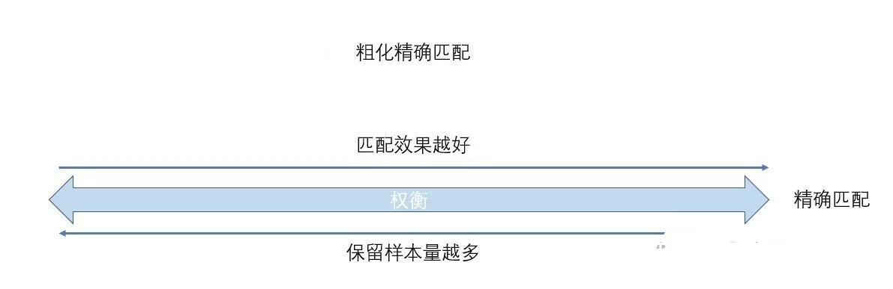


# 三、合成控制方法

&#x20;   合成控制法是近些年来出现最具影响力的准实验(quasi-experiment)与因果推断方法之一。2021年诺贝尔经济学奖获得者Imbens和其太太Athey在2016年称合成控制法称之为“过去十年内[<span style="color: rgb(36,91,219); background-color: inherit">政策评估</span>](https://zhida.zhihu.com/search?content_id=220236196\&content_type=Article\&match_order=1\&q=%E6%94%BF%E7%AD%96%E8%AF%84%E4%BC%B0\&zhida_source=entity)领域最重要的进展''(most important development in program evaluation in the last decade- Athey and Imbens)。当然，作为一名数据科学码畜，对于一个fancy的策略评估工具，我们关键的点是如何掌握其核心思想，针对自己关注的问题可以更好地做基于统计与业务的假设并基于真实的观察性研究数据或经济学据编码实现策略评估。把内生性([<span style="color: rgb(36,91,219); background-color: inherit">endogenous</span>](https://zhida.zhihu.com/search?content_id=220236196\&content_type=Article\&match_order=1\&q=endogenous\&zhida_source=entity)),异质性(Heterogeneity)让经济学家们去关心。而\<Causal Inference for the Brave and True>很好地为我们展示了掌握与使用合成控制法一个框架原型。

## 3.1 什么是合成控制法

&#x20;     简而言之，合成控制法是于观察性研究，如比较案例研究(comparative case studies)，其干预(treatment, intervention)是binary情况下的进行[<span style="color: rgb(36,91,219); background-color: inherit">因果推断</span>](https://zhida.zhihu.com/search?content_id=220236196\&content_type=Article\&match_order=3\&q=%E5%9B%A0%E6%9E%9C%E6%8E%A8%E6%96%AD\&zhida_source=entity)的统计模型。其我们通过对与干预组(treatment group)相似的其他若干组进行[<span style="color: rgb(36,91,219); background-color: inherit">线性加权</span>](https://zhida.zhihu.com/search?content_id=220236196\&content_type=Article\&match_order=1\&q=%E7%BA%BF%E6%80%A7%E5%8A%A0%E6%9D%83\&zhida_source=entity)，构造出一个虚拟的对照组，用构造出来的虚拟对照组用来近似模拟干预组(treatment group)未接受到干预的情况。

&#x20;     从另一个角度，我们可以认为合成控制其是对difference-in-difference (DiD)评估方法的进一步改良。 DID方法通常用一个带干预的测试单元与另一个不带干预的测试单元进行比较，来评估干预的因果效应值。但DID对用于比较的两个组有着很高的要求，如 parallel trend假设, 也就是说试验组与测试在没有干预的情况其时序趋势是相似的(如成都vs重庆)，但很多时候，我们很难找到两个带有相同趋势的测试单元。 而合成控制法，相对找一个相似很高的潜在对照组，我们可以对和试验组相似的几个测试单元赋予不同的权重进行[<span style="color: rgb(36,91,219); background-color: inherit">线性组合</span>](https://zhida.zhihu.com/search?content_id=220236196\&content_type=Article\&match_order=1\&q=%E7%BA%BF%E6%80%A7%E7%BB%84%E5%90%88\&zhida_source=entity)，构造出一个虚拟的对照组, 而我这组权重构成的虚拟组称为一个“合成控制''(synthetic control)。

## 3.2 具体案例

&#x20;    我们这里考虑合成控制法在经济学实证研究中的经典实证应用案例, 烟草税对烟草消费的影响。在经济学中，专家们对于烟草税征收对烟草消费的影响之一议题长期争论不休。争论中一方认为对香烟加税将增加烟民们抽烟的成本，从而降低烟草(如香烟)消费的需求。而争论的另一方认为香烟具有[<span style="color: rgb(36,91,219); background-color: inherit">成瘾性</span>](https://zhida.zhihu.com/search?content_id=220236196\&content_type=Article\&match_order=1\&q=%E6%88%90%E7%98%BE%E6%80%A7\&zhida_source=entity)，对香烟加税对烟草消费的影响很小。用经济学的术语来描述，就是我们认为香烟的价格是缺乏弹性的(价格不敏感), 所以对香烟加税最终成为政府增加收入而让烟民买单的手段，而对香烟真实的销量影响有限。

&#x20;   1988年，加州通过了著名的99号提案：烟草税与健康保护法。其主要内容是对加州的卷烟销售征收每包25美分的州[<span style="color: rgb(36,91,219); background-color: inherit">消费税</span>](https://zhida.zhihu.com/search?content_id=220236196\&content_type=Article\&match_order=1\&q=%E6%B6%88%E8%B4%B9%E7%A8%8E\&zhida_source=entity)，对其他商业类烟草产品（如雪茄和咀嚼型烟草）的销售也征收约同等的消费税。烟草销售的其他限制包括禁止在青少年可进入的公共区域安装自动售烟机，禁止个人销售香烟。同时，该法案产生的收入专门用于各种环境和保健计划以及反[<span style="color: rgb(36,91,219); background-color: inherit">烟草广告</span>](https://zhida.zhihu.com/search?content_id=220236196\&content_type=Article\&match_order=1\&q=%E7%83%9F%E8%8D%89%E5%B9%BF%E5%91%8A\&zhida_source=entity)。

&#x20;    为了评估该提案的对烟草销售的效果，研究者们收集多个州跨多年的香烟销售数据，具体而言，包含39个州从1970年到2000年的数据。(考虑到有些州采取了和和加州类似的烟草控制法案，为避免干扰，排除了这些州的数据)。

数据链接: [https://github.com/matheusfacur](https://link.zhihu.com/?target=https%3A//github.com/matheusfacure/python-causality-handbook/tree/master/causal-inference-for-the-brave-and-true/data)

## 3.3 数据准备

&#x20;     运行以下python代码，对数据进行清洗和筛选。

```plain&#x20;text
cigar = (pd.read_csv("data/smoking.csv").drop(columns=["lnincome","beer", "age15to24"]))
cigar.query("california").head()
```

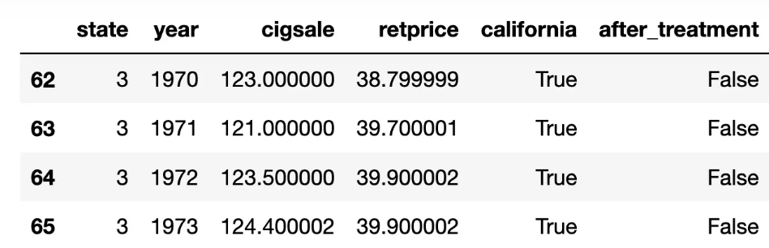

&#x20;   上述表格结果中state代表美国的州，该列中3是加州对就的编号。同时我们能看到两个[<span style="color: rgb(36,91,219); background-color: inherit">协变量</span>](https://zhida.zhihu.com/search?content_id=220236196\&content_type=Article\&match_order=1\&q=%E5%8D%8F%E5%8F%98%E9%87%8F\&zhida_source=entity)(covariates):retprice和cigsale，retprice是香烟的零售价, cigsale是以盒数计算的人均销量。 在我们该评估任务中我们关注的结果变量是cigsale。同时，上图中的后两列是个[<span style="color: rgb(36,91,219); background-color: inherit">布尔型</span>](https://zhida.zhihu.com/search?content_id=220236196\&content_type=Article\&match_order=1\&q=%E5%B8%83%E5%B0%94%E5%9E%8B\&zhida_source=entity)的辅助变量，分别标注是否是加州和是否是政策干预(treated)后的数据。 如果把加州和其他州的香烟销量按时间轴作图的话，则如下图所示.

```plain&#x20;text
ax = plt.subplot(1, 1, 1)
(cigar
 .assign(california = np.where(cigar["california"], "California", "Other States"))
 .groupby(["year", "california"])
 ["cigsale"]
 .mean()
 .reset_index()
 .pivot("year", "california", "cigsale")
 .plot(ax=ax, figsize=(10,5)))
plt.vlines(x=1988, ymin=40, ymax=140, linestyle=":", lw=2, label="Proposition 99")
plt.ylabel("Cigarette Sales Trend")
plt.title("Gap in per-capita cigarette sales (in packs)")
plt.legend();
```

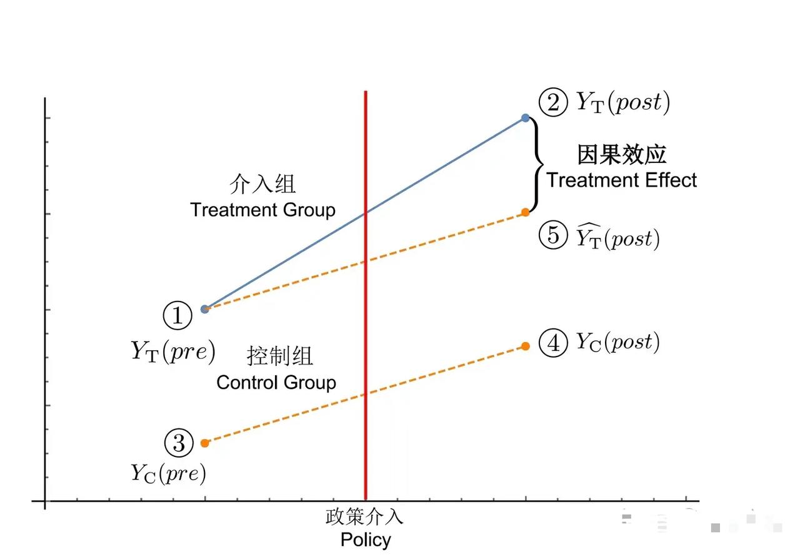

&#x20;   上图显示，在该数据的时间轴范围内，加州居民的香烟消费量(cigsale)明显低于全国平均水平。 另外从80年代起，整体，香烟消费量是在下降的。 而在99号提案生效后，看上去加州的数据相比其他州有加速下降趋势，但我们不能过于肯定，毕竟这只是基于图示的猜测。

&#x20;   为了回答99号提案究竟对降低烟草消费有没有效果，我们基于开头介绍的合成控制的思想，通过干预前(pre-treatment period)的数据生成一个合成控制, 也就是说我们把其他州的数据通过线性加权组合起来，生成一个趋势和加州非常相像的假数据, 然后看看到这个合成控制对于干预后的预测结果。

## 3.4 建模

&#x20;    我们现在用更加正式的术语描述我们的[<span style="color: rgb(36,91,219); background-color: inherit">合成控制方法</span>](https://zhida.zhihu.com/search?content_id=220236196\&content_type=Article\&match_order=1\&q=%E5%90%88%E6%88%90%E6%8E%A7%E5%88%B6%E6%96%B9%E6%B3%95\&zhida_source=entity),

1. 设我们有J+1个测试单元，如在99号法案数据集里，我们一共有J+1个州。

2. 一致起见，我们设第一个测试单元收到一个干预(intervention或treatment), 对于其他J个未接受到干预的测试单元的集合, j=2,...,J+1,我们将其称之为捐赠池("donor pool")。

3. 数据的整体时间周期长度为T, 干预发前的时间周期长度为$$T_0$$。

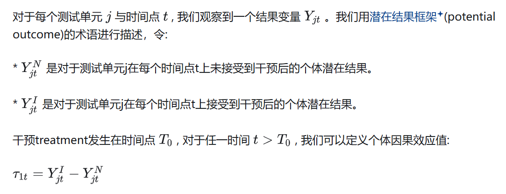

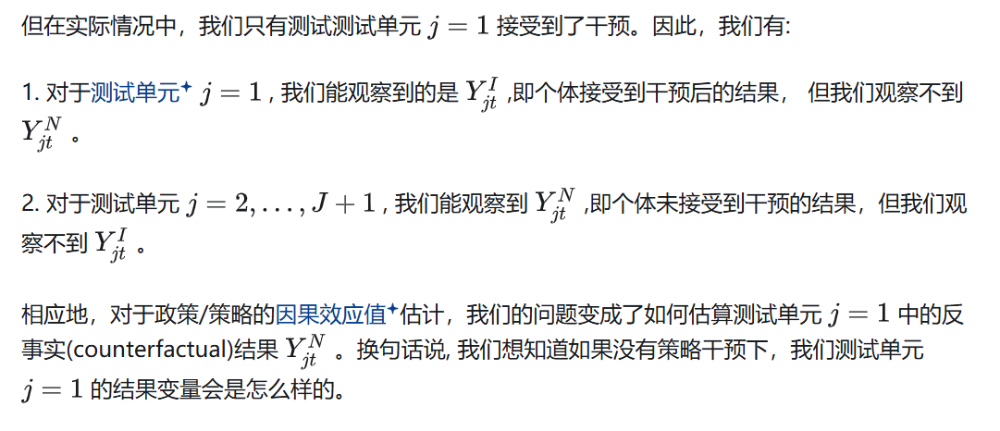

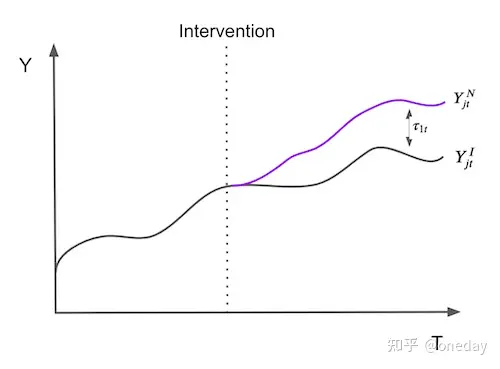

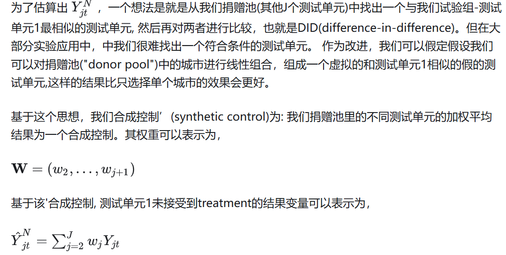


&#x20;  回顾我们统计中的多元[<span style="color: rgb(36,91,219); background-color: inherit">线性回归</span>](https://zhida.zhihu.com/search?content_id=220236196\&content_type=Article\&match_order=1\&q=%E7%BA%BF%E6%80%A7%E5%9B%9E%E5%BD%92\&zhida_source=entity)，我们会觉得上述的方式和线性回归很类似：线性回归也是也是一种用多个 量的加权平均做预测的[<span style="color: rgb(36,91,219); background-color: inherit">统计方法</span>](https://zhida.zhihu.com/search?content_id=220236196\&content_type=Article\&match_order=1\&q=%E7%BB%9F%E8%AE%A1%E6%96%B9%E6%B3%95\&zhida_source=entity)。

&#x20;  在线性回归里，我们通过如最小化[<span style="color: rgb(36,91,219); background-color: inherit">均方误差</span>](https://zhida.zhihu.com/search?content_id=220236196\&content_type=Article\&match_order=1\&q=%E5%9D%87%E6%96%B9%E8%AF%AF%E5%B7%AE\&zhida_source=entity)(mean-square error)得到自变量的权重权重，我们预测的结果是这些自变量加权和。下图是我们基于[<span style="color: rgb(36,91,219); background-color: inherit">矩阵乘法</span>](https://zhida.zhihu.com/search?content_id=220236196\&content_type=Article\&match_order=1\&q=%E7%9F%A9%E9%98%B5%E4%B9%98%E6%B3%95\&zhida_source=entity)表示的线性回归:

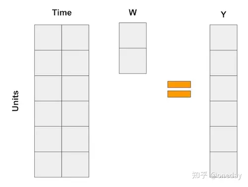

&#x20;   在上图中，我们的输入是 N∗2 的矩阵(N个样本，每个点包含两个协变量)，我们的权重W是 2∗1 的向量(vector), 我们预测的结果是 $$\frac{}{y}$$是一个包含 N∗1 个向量。

&#x20;   如下图所示, 在合成控制法中，我们设我们试验周期的长度为6, 我们的捐赠池("donor pool")包含4个测试单元的数据(其数据可以是我们关心的结果变量,如在这里是sigsales)。

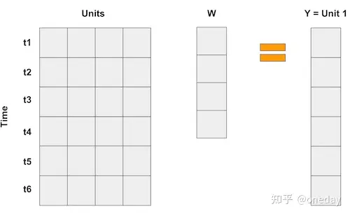

&#x20;  我们的输入是 T∗J 的矩阵(T个样本，每个点包含J=4个协变量，我们的权重W的维度是 4∗1 的向量(vector), 我们基于加权平均预测的结果 $$\frac{}{y}$$ 是 T∗1 的矩阵。

&#x20;  当然，有时间我们关注的指标不单只有一个，如在该案例中我们希望同时关cigsales和 retprice,;在短视频场景中我们可能会同时关注营收与时长。这类情况下，我们可以以如下的方式进行将变量或feature堆积在一起。

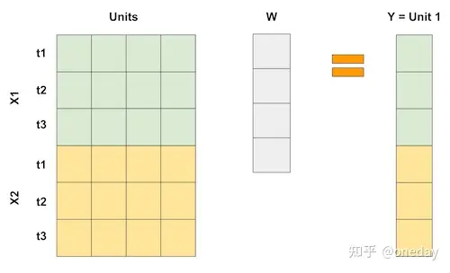

&#x20;  在上图中，我们把两个自变量 $$x_1$$,$$x_2$$并行堆积在一起。这样组织数据， 可以确保确保一个测试单元j对应一个权重参数。

&#x20;  当然很多时候我们会遇到如$$x_1$$，$$x_2$$ 的经验数据量纲存在差异的情况，如 $$x_1$$ 是时长，量纲在1000左右，$$x_2$$ 是率，均值<1。这种情况下，我们也需要对数据量级进行调整，相应地缩放或扩张再进行拟合， 确保我们对于不同的变量有相对较好的[<span style="color: rgb(36,91,219); background-color: inherit">权重系数</span>](https://zhida.zhihu.com/search?content_id=220236196\&content_type=Article\&match_order=1\&q=%E6%9D%83%E9%87%8D%E7%B3%BB%E6%95%B0\&zhida_source=entity)。

&#x20;  我们前面说了，如果合成控制法可以看作是线性回归的一种，那我们是不是也可以用如[<span style="color: rgb(36,91,219); background-color: inherit">最小二乘法</span>](https://zhida.zhihu.com/search?content_id=220236196\&content_type=Article\&match_order=1\&q=%E6%9C%80%E5%B0%8F%E4%BA%8C%E4%B9%98%E6%B3%95\&zhida_source=entity)(ordinary least-square)的方法对其进行权重估计？让我们动手试一下先。

## 3.5 基于线性回归实现

&#x20;  我们现在尝试用线性回归的方式来进行合成控制法中测试单元的权重估计。在合成控制法中，为了更好地对因果效应值(treatment effect)进行估计，我们尝试对捐赠池(donor poor)内的测试单元进行线性组合，合成一个虚拟的对照组(fake unit)，用来拟合试验中没有接受干预情况下的结果变量。那试验组测试单元与该合成控制下的结果变量间的差异，就是我们关心的策略/政策因果效应值(causal effect)。

&#x20;  具体而言，我们取干预(treatment)前的[<span style="color: rgb(36,91,219); background-color: inherit">时序数据</span>](https://zhida.zhihu.com/search?content_id=220236196\&content_type=Article\&match_order=1\&q=%E6%97%B6%E5%BA%8F%E6%95%B0%E6%8D%AE\&zhida_source=entity)，我们基于最小二乘(ordinary least square)法，通过最小化试验组测试单元的结果变量与捐赠池内测试单元线性加权预测结果，两者间均方误差来拟合捐赠池中各个测试单元的权重。对于post-treatment期，我们用捐赠池里的测试单元的结果变量与学习到权重的 W=($$w_2,....,w_j+1$$) 相乘法，来预测我们在试验组的反事实结果 $$Y_jt^n$$ 。

&#x20;  为了在python中实现线性回归，我们对数据的结构进行调整，我们把测试单元(unit)在这里对应是美国的州调整至列的位置，时间调整至行的位置。这里，我们有两个[<span style="color: rgb(36,91,219); background-color: inherit">特征变量</span>](https://zhida.zhihu.com/search?content_id=220236196\&content_type=Article\&match_order=1\&q=%E7%89%B9%E5%BE%81%E5%8F%98%E9%87%8F\&zhida_source=entity), cigsale和retprice, 我们用之前介绍过的方法将这两个特征进行整体(具体看如下代码)。

&#x20;  做完数据调整后，我们基于策略干预前的数据(1988年)用线性回归的方法拟合合成控制的权重向量，接着我们用干预后的数据来验证该合成控制的效果。

&#x20;  通过观察和分析cigsale和retprice的数据，我们可以看其数据量纲差不多，因此我们可以尝试直接拟合。但如果我们的特征变量处于不同的量纲, 如像我们前面提到的一个是几千而另一个是零点几，这种情况如果我们用最小二乘法进行回归的话，量纲大会直接决定拟合的结果。如果存在这类情况，我们需要对量纲进行调整。

```go
features = ["cigsale", "retprice"]
inverted = (cigar.query("~after_treatment") # filter pre-treatment period
            .pivot(index='state', columns="year")[features] # make one column per year and one row per state
            .T) # flip the table to have one column per state
inverted.head()
```

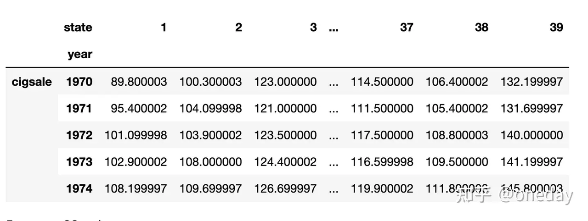

```go
inverted.tail()
```

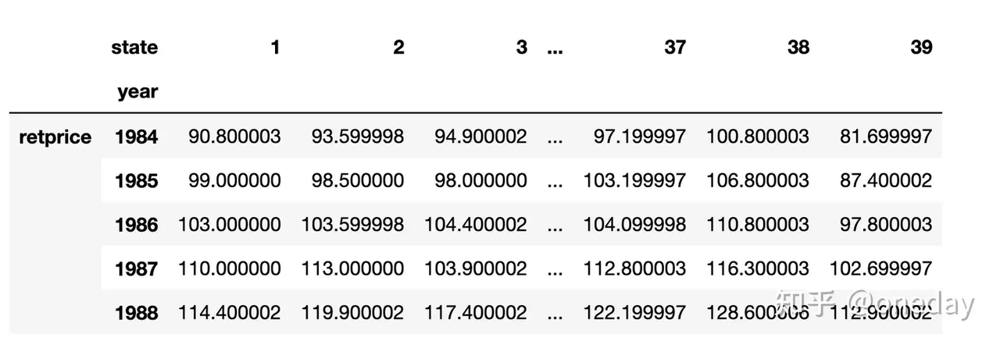

数据准备，线性回归中变量Y是加州(试验组)的结果变量;X是其他州共同的结果变量数据。

```plain&#x20;text
y = inverted[3].values # state of california
X = inverted.drop(columns=3).values  # other states
```

为了简便起见,我们直接调用sklearn里的linear\_model进行拟合。同时我们可以通过.ceof\_命令得到各个测试单元(州)的权重结果。

```plain&#x20;text
from sklearn.linear_model import LinearRegression
weights_lr = LinearRegression(fit_intercept=False).fit(X, y).coef_
weights_lr.round(3)
```


我们可以基于上述线性回归的权重结果构造出一个合成控制。我们将上述的权重结果和捐赠池里的测试单元进行相乘，如对于州1我们权重乘以(-0.436),州2乘以-1.038, 以此类推。在实现上，我们直接对结果变量与权重向量取点积(dot product)。

```plain&#x20;text
calif_synth_lr = (cigar.query("~california")
                  .pivot(index='year', columns="state")["cigsale"]
                  .values.dot(weights_lr))
```

我们现在用可视化来观察该合成控制的拟合与预测结果。

```plain&#x20;text
plt.figure(figsize=(10,6))
plt.plot(cigar.query("california")["year"], cigar.query("california")["cigsale"], label="California")
plt.plot(cigar.query("california")["year"], calif_synth_lr, label="Synthetic Control")
plt.vlines(x=1988, ymin=40, ymax=140, linestyle=":", lw=2, label="Proposition 99")
plt.ylabel("Gap in per-capita cigarette sales (in packs)")
plt.legend();
```

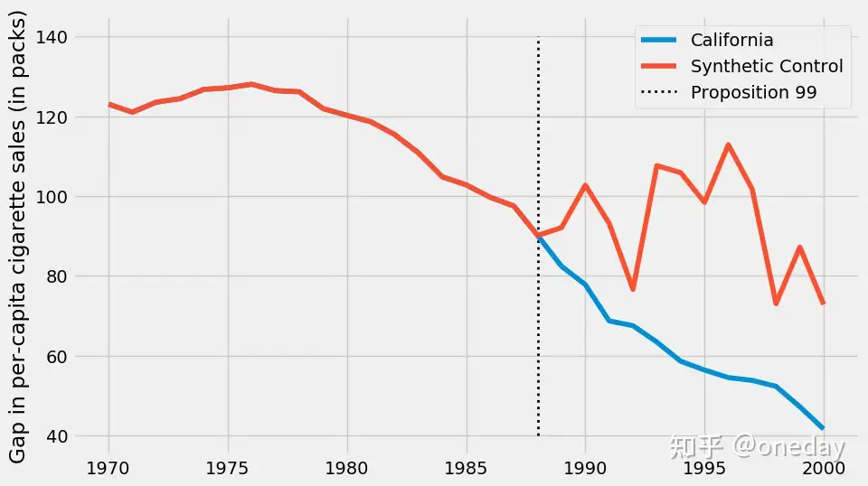

在上图中，蓝色的曲线是真实的加州香烟销量的结果，红色的曲线是基于线性回归合成控制的结果，垂直的虚线是政策生效的时间点。我们可以先该合成控制对于干预发生后的预测结果，我们第一印象是，在没有干预的情况下香烟的销量是高于政策生效后的销量，也就是该法案降低了香烟的销量。但同时我们可以看到基于在干预前(in-sample)的数据红色的线与蓝色的线完全重合了，说明线性回归对于干预前的[<span style="color: rgb(36,91,219); background-color: inherit">数据拟合</span>](https://zhida.zhihu.com/search?content_id=220236196\&content_type=Article\&match_order=1\&q=%E6%95%B0%E6%8D%AE%E6%8B%9F%E5%90%88\&zhida_source=entity)的很好；但在干预后(out-of-sample)的数据，上上下下波动很大，而非理想情况下平滑的模式。这意味我们基于线性回归生成的合成控制预测结果很大可能是[<span style="color: rgb(36,91,219); background-color: inherit">过拟合</span>](https://zhida.zhihu.com/search?content_id=220236196\&content_type=Article\&match_order=1\&q=%E8%BF%87%E6%8B%9F%E5%90%88\&zhida_source=entity)了(overfitting)。

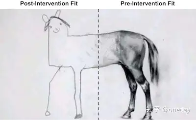

我们可以进一步思考上述结果的原因，在捐赠池中数据中我们有38个州的数据，相应地我们的权重系数有38个点。给定这么多的参数以及该数据集中较小的数据点在线性回归中，我们基于干预前的数据进行线性回归拟合很容易过拟合。当然，我们可以尝试带正则项的[<span style="color: rgb(36,91,219); background-color: inherit">回归模型</span>](https://zhida.zhihu.com/search?content_id=220236196\&content_type=Article\&match_order=1\&q=%E5%9B%9E%E5%BD%92%E6%A8%A1%E5%9E%8B\&zhida_source=entity)(sparse linear models)如lasso或ridge进行拟合来改善上述的结果。但在这里，让我们先尝试经典的合成控制中[<span style="color: rgb(36,91,219); background-color: inherit">参数拟合</span>](https://zhida.zhihu.com/search?content_id=220236196\&content_type=Article\&match_order=1\&q=%E5%8F%82%E6%95%B0%E6%8B%9F%E5%90%88\&zhida_source=entity)的实现方法。

## 3.6 内插值法(Interpolation)

&#x20;    我们先回顾下我们在之前学习到的权重。

```plain&#x20;text
 weights_lr.round(3)
```

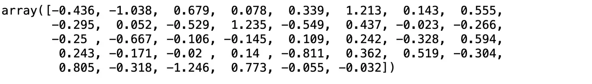

&#x20;   我们可以从中找到其权重的最大值与最小值:1.235 对应州12, 和最小值 -1.246，对应州35。简便起见，我们可以考虑一个假想情况中只考虑基于这两个州的线性回归结果。

```plain&#x20;text
X2 =  X[:,[11,34]]weights_lr_2 = LinearRegression(fit_intercept=False).fit(X2, y).coef_weights_lr_2.round(3)
```

&#x20;   结果: array(\[-0.82 , 1.955])。对于州12，我们的权重系数是-0.82, 相当于我们创造出一个虚拟的测试单元结果-0.82\*cigsale 和-0.82\*retprice, 对于这个结果，对应我们在真实的业务场景是没有意义的(真实场景不可能包含负的价格与负的销量)。我们接着看第二个权重2，对于该权重生成的结果，用数值分析的术语，我们称之为外插值(extrapolation)点，也就是说该值映射后的cigsale,retprice远高于真实的数据点。下图是几张数学上内插(interpolation)和外插(extrapolation)的区别[<span style="color: rgb(36,91,219); background-color: inherit">示意图</span>](https://zhida.zhihu.com/search?content_id=220236196\&content_type=Article\&match_order=1\&q=%E7%A4%BA%E6%84%8F%E5%9B%BE\&zhida_source=entity):

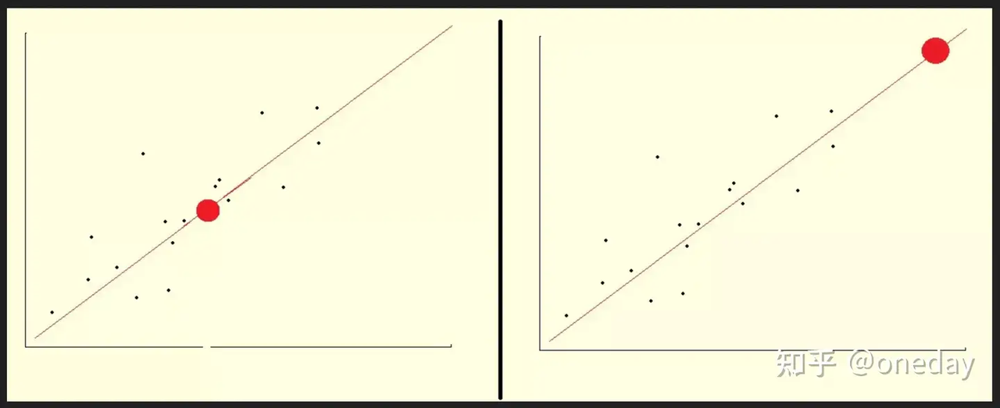

&#x20;   这就是我们基于线性回归权重生成合成控制的原因，我们的权重结果有很多是属于外插值(Extrapolation)。从技术角度而言，使用外插值并没有问题。但对于这里的因果推断或策略评估的场景，使用外插值就很危险，会使得我们的结果不可靠。也就是说，我们更希望我们的结果是内插值interpolation,在我们能观察到的数据分布内部)。

&#x20;   在社会科学里，使用外插值进行预测是件比较危险的事，一个经典的例子是人口增长预测,我们用人口较小时的增长率来预测多年以后的人口基数。同样，对这里的因果推断或策略评估的场景，会使得我们的结果不可靠。也就是说，我们更希望我们的结果是内插值(在我们能观察到的数据分布内部)预测的结果。

&#x20;   我们可以通过如下方式来保证我们权重结果是内插的。具体而言，我们使用最优化中的受约束[<span style="color: rgb(36,91,219); background-color: inherit">优化方法</span>](https://zhida.zhihu.com/search?content_id=220236196\&content_type=Article\&match_order=1\&q=%E4%BC%98%E5%8C%96%E6%96%B9%E6%B3%95\&zhida_source=entity)，我们限制1.)我们捐赠池中的测试单元权重都为正，2.)其权重和为1， 在该约束下我们最小化试验组测试单元的结果变量与捐赠池内测试单元线性加权预测结果。相应地，我们的合成控制就变成优化中基于捐赠池(donor poor)中测试单元的的凸组合问题(convex combination)。

&#x20;   我们接下来用最优化的术语进行描述，我们回顾一下convex hull(可参考Stephen Boyd \<convex optimization> chapter 2) 简单而言，凸包(convex hull)是包含观测值的最小凸集(convex set),如下图是在给定双变量数数据点生成的convex hull。

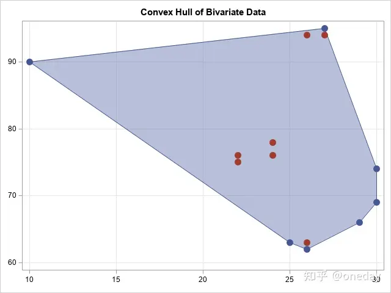

&#x20;   相应地，我们更希望合成控制的结果是投影在由捐赠池(donor poor)中测试单元构成的凸包(convex hull)内部,而非外部。

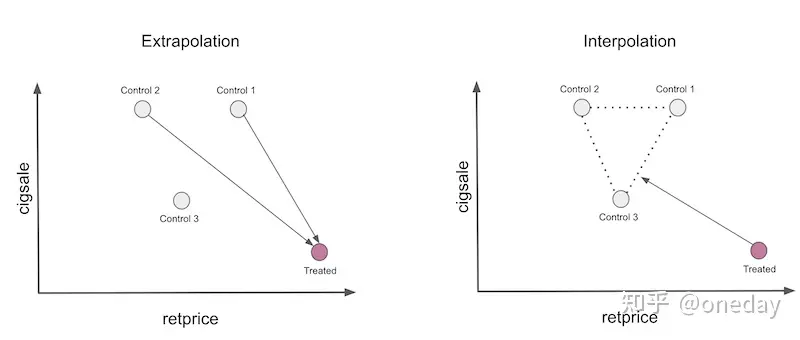

&#x20;    根据上述，我们用最优化的框架重新来表述定义我们合成控制方法框架:

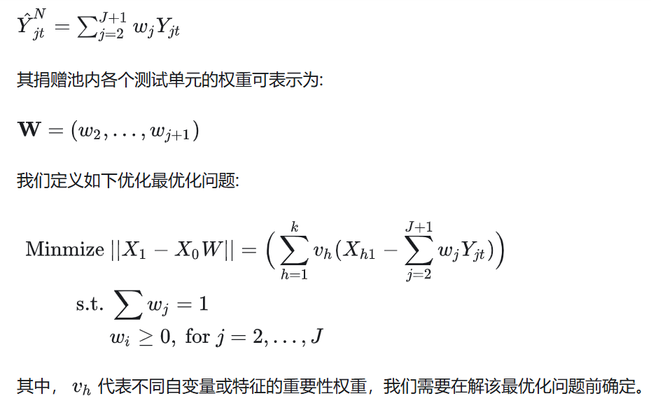

&#x20;   确定该权重值常用的方式就是我们选择将其归一化: 使其变量的均值为0, 方差为1,从而。另一种更复杂的方式可以是基本预测的结果, 对于更好预测其重要性的变量我们给更高的重要性权重。为了简单起见，我们在这里先采用权重一样的方式:

```plain&#x20;text
from typing import Listfrom operator import addfrom toolz import reduce, partialdef loss_w(W, X, y) -> float:return np.sqrt(np.mean((y - X.dot(W))**2))
```

&#x20;    上述中，我们给retprice和cigsale这两个变量一样的权重(默认都是1)。接下来，我们将使用scipy里optimize模块来解该受约束的优化问题( quadratic programming optimization), 不要惊讶，对于python的用户而言，scipy是个功能强大并且低调的包，包含了[<span style="color: rgb(36,91,219); background-color: inherit">信息论</span>](https://zhida.zhihu.com/search?content_id=220236196\&content_type=Article\&match_order=1\&q=%E4%BF%A1%E6%81%AF%E8%AE%BA\&zhida_source=entity)，统计，优化大部分功能。比如说笔者的团队在2020年kdd-cup中拿了两个奖，我们主要功能实现都是scipy里的函数且代码十分简洁。我们用如下[<span style="color: rgb(36,91,219); background-color: inherit">函数式编程</span>](https://zhida.zhihu.com/search?content_id=220236196\&content_type=Article\&match_order=1\&q=%E5%87%BD%E6%95%B0%E5%BC%8F%E7%BC%96%E7%A8%8B\&zhida_source=entity)来保证我们拟合的权重向量和为1:

```plain&#x20;text
lambda x: np.sum(x) - 1
```

&#x20;   我们这里使用scipy.optimize里的fmin\_slsqp来解受约束的优化问题，对cvxpy熟悉的同学也可以尝试cvxpy。

```plain&#x20;text
from scipy.optimize import fmin_slsqp
def get_w(X,y):
    w_start = [1/X.shape[1]]*X.shape[1]
    weights = fmin_slsqp(partial(loss_w, X=X, y=y),
                        np.array(w_start),
                         f_eqcons = lambda x: np.sum(x)-1,
                         bounds = [(0.0,1.0)]*len(w_start),
                         disp=False
                        )
    return weights
```

&#x20;   根据上述函数代码，我们可以求解得到一组新的权重系数。

```plain&#x20;text
calif_weights = get_w(X, y)
print("Sum:", calif_weights.sum())
np.round(calif_weights, 4)
```

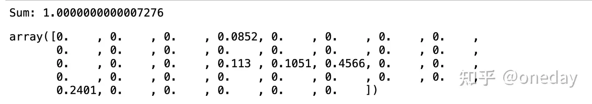

&#x20;    我们可以看到，基于[<span style="color: rgb(36,91,219); background-color: inherit">二次规划</span>](https://zhida.zhihu.com/search?content_id=220236196\&content_type=Article\&match_order=1\&q=%E4%BA%8C%E6%AC%A1%E8%A7%84%E5%88%92\&zhida_source=entity)解的内插值的合成控制选择了州4,州18,州19,州20,州34这5个州，如州4的权重是0.0852。我们对该权重进行观察与验证:

* 这个结果是非常稀疏的(sparse), 该合成控制从38个州里选择了5个州,其他州的结果都是0。

* 其权重和为1.

* 所有权重值都在0与1之间。

&#x20;   我们根据上述生成的权重结果来生成新的合成控制:

```plain&#x20;text
calif_synth = cigar.query("~california").pivot(index='year', columns="state")["cigsale"].values.dot(calif_weights)
```

&#x20;   我们可以按先前的画出该合成控制的预测结果图，我们可以看到，我们现在得到一个更加平滑(smoother)的曲线。同时我们可以看在，在干预前的时间，我们两个曲线也没有完全重合，这也意味着其并没有像之前那样过拟合。

```plain&#x20;text
plt.figure(figsize=(10,6))
plt.plot(cigar.query("california")["year"], cigar.query("california")["cigsale"], label="California")
plt.plot(cigar.query("california")["year"], calif_synth, label="Synthetic Control")
plt.vlines(x=1988, ymin=40, ymax=140, linestyle=":", lw=2, label="Proposition 99")
plt.ylabel("Per-capita cigarette sales (in packs)")
plt.legend();
```

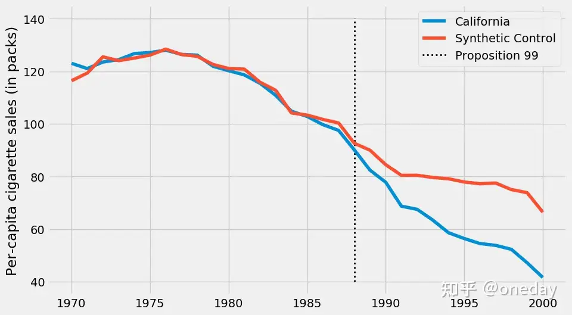

给定该合成控制结果的

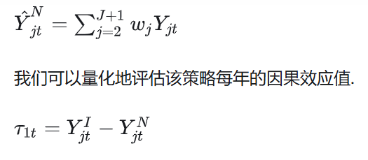

&#x20;  即上图的蓝红两条曲线之间的gap, 我们可以看到随着时间推移,策略的效应值越来越明显(烟草销量降的更多)。

```plain&#x20;text
plt.figure(figsize=(10,6))
plt.plot(cigar.query("california")["year"], cigar.query("california")["cigsale"] - calif_synth,
         label="California Effect")
plt.vlines(x=1988, ymin=-30, ymax=7, linestyle=":", lw=2, label="Proposition 99")
plt.hlines(y=0, xmin=1970, xmax=2000, lw=2)
plt.title("State - Synthetic Across Time")
plt.ylabel("Gap in per-capita cigarette sales (in packs)")
plt.legend();
```

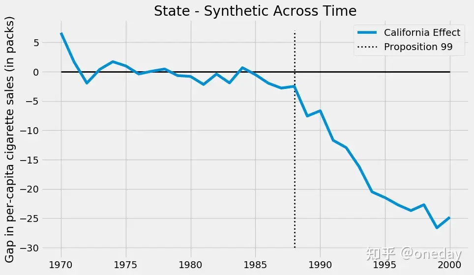

&#x20;   上述的图结果则更加明显，我们可以看到在Propostion99在2000年左右减少了大约25 packs香烟的销量。当然，在因果推断中，我们关心的另一个问题则是，我们学习到的因果效应值在统计上是显著的吗？

## 3.7 显著性推断

&#x20;   在比较案例研究中，我们经常遇到的问题是我们的样本规模过小。如在这99号法案里我们总共有约小有39个点(N<40)，这种情况下，我们可以考虑Fisher’s Exact Test(对于N>=40的情况，我们可以考虑(chi-square)[<span style="color: rgb(36,91,219); background-color: inherit">卡方检验</span>](https://zhida.zhihu.com/search?content_id=220236196\&content_type=Article\&match_order=1\&q=%E5%8D%A1%E6%96%B9%E6%A3%80%E9%AA%8C\&zhida_source=entity))。我们检验的思想很简单，对所有的测试单元枚举着排列组合。在我们之前的例子里，我们的试验组是测试单元 j=1 , 在后续我们假定每个测试单元 j=2,...,J 都有机会是试验组，而其余的是控制组。

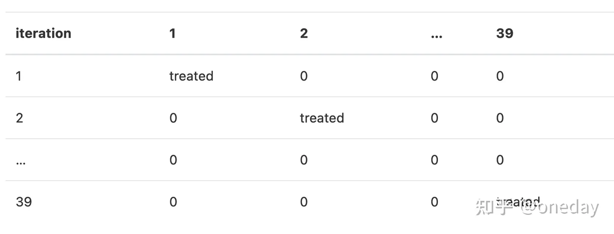

&#x20;   参照上表，对于每个州，我们重复使用之前的受约束的优化框架框架进行权重拟合，计算并生成一个对应合成控制(synthetic control)和相应的因果效应值。我们知道，在该数据集中，99号法案只对于加州生效。那我们把其他州当成试验组的情况，理论上我们做的是一个A/A测试或安慰剂试验(placebo test),相应地，理论上其因果效应值应该是很小的，甚至接近于0的。在给定生成的所有州的结果，我们可以用加州拟合出来的因果效应值与其他州的进行比较，如果加州的因果效应值远高于其他州的结果，那我们结果大概率是可信的。基于上述想法，我们可以写如下函数,该函数将一个州做为试验组输入然后进行合成控制法的计算。同时，该函数返回一个包含四列的dataFrame，列1是state\_id,列2是year,列3是cigsale，列四是州的合成控制结果。

```plain&#x20;text
def synthetic_control(state: int, data: pd.DataFrame) -> np.array:
    features = ["cigsale", "retprice"]
    inverted = (data.query("~after_treatment")
                .pivot(index='state', columns="year")[features]
                .T)
    y = inverted[state].values # treated
    X = inverted.drop(columns=state).values # donor pool
    weights = get_w(X, y)
    synthetic = (data.query(f"~(state=={state})")
                 .pivot(index='year', columns="state")["cigsale"]
                 .values.dot(weights))
    return (data.query(f"state=={state}")[["state", "year", "cigsale", "after_treatment"]].assign(synthetic=synthetic))
```

我们可以先看看第一个州的结果:

```plain&#x20;text
synthetic_control(1, cigar).head()
```

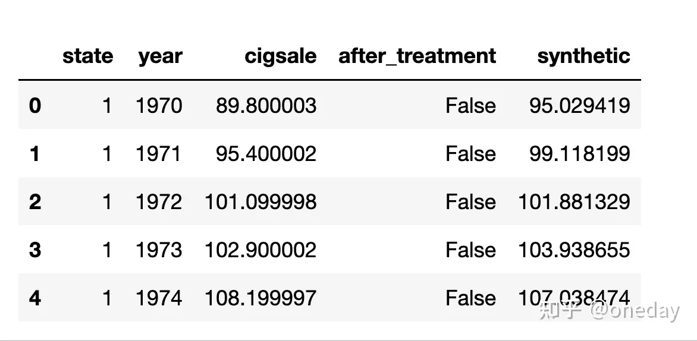

&#x20;   我们现在计算其余州的结果，我们可以用如下多进程的代码实现方式，下面代码可以返回如上述结果一样一系列dataFrame的list。

```plain&#x20;text
from joblib import Parallel, delayed
control_pool = cigar["state"].unique()
parallel_fn = delayed(partial(synthetic_control, data=cigar))
synthetic_states = Parallel(n_jobs=8)(parallel_fn(state) for state in control_pool)
synthetic_states[0].head()
```

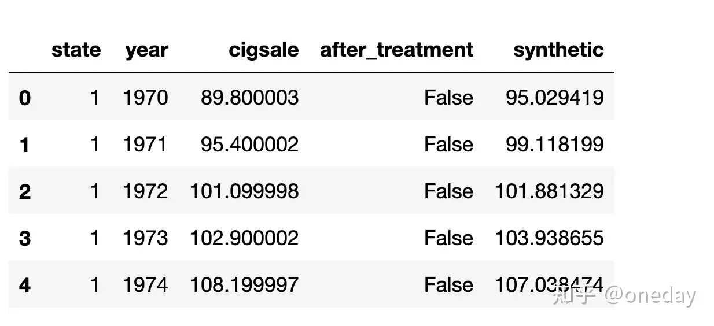

&#x20;    我们现在有了所有州结果dataframe, 我们现在就可以比较比较合成控制预测的结果变量和真实的结果变量之间的差异。用田野试验的术语(field experiments), 对于加州，我们做的是A/B试验， 我们比较的结果是因果效应值。而对于其他州，我们做的试验则是，安慰剂试验(placebo testing)或A/A试验，我们比较的结果是[<span style="color: rgb(36,91,219); background-color: inherit">安慰剂效应</span>](https://zhida.zhihu.com/search?content_id=220236196\&content_type=Article\&match_order=1\&q=%E5%AE%89%E6%85%B0%E5%89%82%E6%95%88%E5%BA%94\&zhida_source=entity)(placebo effect)。我们可以把加州策略的效应值和其他州的placebo effect用可视化的方式呈现:

```plain&#x20;text
plt.figure(figsize=(12,7))
for state in synthetic_states:
    plt.plot(state["year"], state["cigsale"] - state["synthetic"], color="C5",alpha=0.4)
plt.plot(cigar.query("california")["year"], cigar.query("california")["cigsale"] - calif_synth,
        label="California");
plt.vlines(x=1988, ymin=-50, ymax=120, linestyle=":", lw=2, label="Proposition 99")
plt.hlines(y=0, xmin=1970, xmax=2000, lw=3)
plt.ylabel("Gap in per-capita cigarette sales (in packs)")
plt.title("State - Synthetic Across Time")
plt.legend();
```

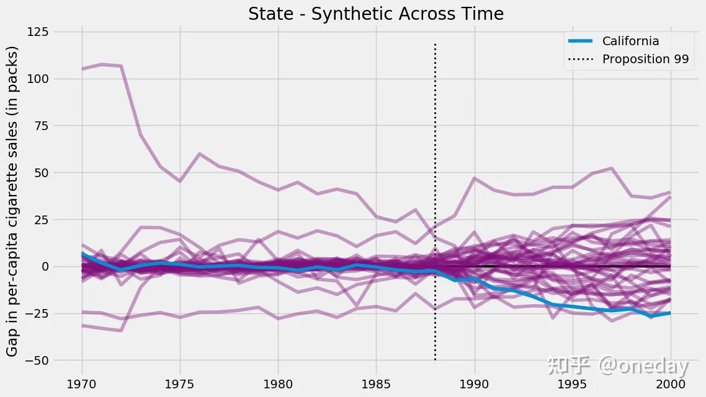

&#x20;   我们可以观察到如下结果。1.)我们可以看到在干预后的方差(variance)要远高于干预前的方差, 这和我们预期中的是一致的，我们新方法的优化目标是最小化干预前的数据点的均方误差。2.)我们同时也可以观察到对于有些州(测试单元)我们的模型即使是在干预前的数据，拟合的不是很好。这和我们预期中的也是一致的，如对于一个销量最高或最低的州，我们基于内插值interpolation思想的模型是不可能拟合的很好的。当然，这也给了我们一些启示，在实验设计中，我们也需要谨慎地选择我们的试验组。

&#x20;   这里，对于拟合结果不太好的州，我们可以认为其是噪声从数据集中去除。一个简单的方法是我们对于干预前(pre-intervention)设置一个误差的阈值(threshold), 对于误差大于阈值的州我们将其从数据中删除。

```plain&#x20;text
def pre_treatment_error(state):
    pre_treat_error = (state.query("~after_treatment")["cigsale"]
                       - state.query("~after_treatment")["synthetic"]) ** 2
    return pre_treat_error.mean()
plt.figure(figsize=(12,7))
for state in synthetic_states:

    # remove units with mean error above 80.
    if pre_treatment_error(state) < 80:
        plt.plot(state["year"], state["cigsale"] - state["synthetic"], color="C5",alpha=0.4)
plt.plot(cigar.query("california")["year"], cigar.query("california")["cigsale"] - calif_synth,
        label="California");
plt.vlines(x=1988, ymin=-50, ymax=120, linestyle=":", lw=2, label="Proposition 99")
plt.hlines(y=0, xmin=1970, xmax=2000, lw=3)
plt.ylabel("Gap in per-capita cigarette sales (in packs)")
plt.title("Distribution of Effects")
plt.title("State - Synthetic Across Time (Large Pre-Treatment Errors Removed)")
plt.legend();
```

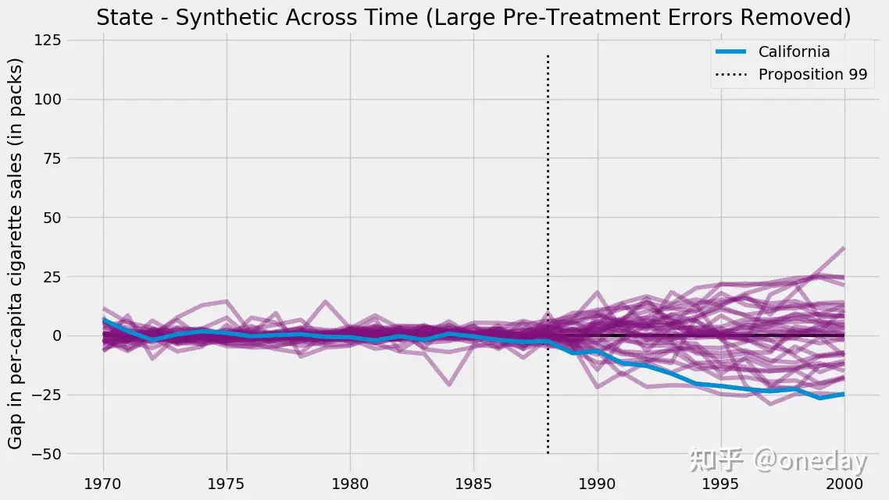

&#x20;   通过去除数据中的noise,我们可以从上图中看到和其他州的效应值相比，加州在干预后有明显的降低的效果。但我们更希望有更严格的基于[<span style="color: rgb(36,91,219); background-color: inherit">假设检验</span>](https://zhida.zhihu.com/search?content_id=220236196\&content_type=Article\&match_order=1\&q=%E5%81%87%E8%AE%BE%E6%A3%80%E9%AA%8C\&zhida_source=entity)的结论。

```plain&#x20;text
calif_number = 3
effects = [state.query("year==2000").iloc[0]["cigsale"] - state.query("year==2000").iloc[0]["synthetic"]
           for state in synthetic_states
           if pre_treatment_error(state) < 80] # filter out noise
calif_effect = cigar.query("california & year==2000").iloc[0]["cigsale"] - calif_synth[-1] 
print("California Treatment Effect for the Year 2000:", calif_effect)
np.array(effects)
```

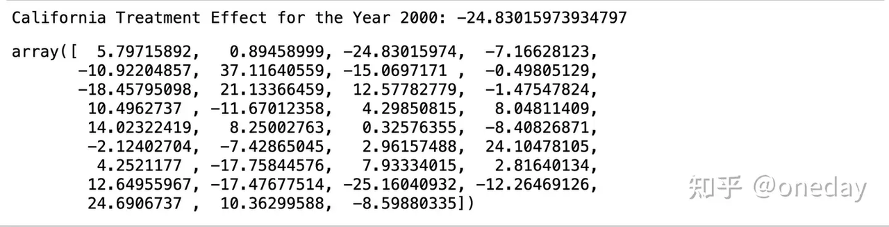

&#x20;     我们可以尝试做一个单边测试(one-sided hypothesis)来验证我们结论:99号法案对香烟销量的影响是负的。 我们的[<span style="color: rgb(36,91,219); background-color: inherit">原假设</span>](https://zhida.zhihu.com/search?content_id=220236196\&content_type=Article\&match_order=1\&q=%E5%8E%9F%E5%81%87%E8%AE%BE\&zhida_source=entity) H0 可以是99号法案对香烟销量的影响是非负的( ≥0 )；我们的备择假设 (alternative hypothesis) H1 可以为:9号法案对香烟销量的影响是负的(<0)。我们可以基于Fisher exact test来计算P-value: 具体而言，我们可以计算在上述计算出的效应值中，将加州作为试验组计算出的效应值高于其他州的比例。

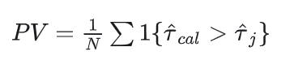

&#x20;   对于上式，以2000年为例，我们计算出来的加州的效应值是 −24.8 ，在其余34个 placebo effects中，我们只观察到一个州的效应值高于加州。因此，我们有 PV=1/35 。

```plain&#x20;text
np.mean(np.array(effects) < calif_effect)
```

&#x20;  最后，我们可以将所有州结果的效应值用[<span style="color: rgb(36,91,219); background-color: inherit">直方图</span>](https://zhida.zhihu.com/search?content_id=220236196\&content_type=Article\&match_order=1\&q=%E7%9B%B4%E6%96%B9%E5%9B%BE\&zhida_source=entity)的图示表示，然后显示加州的结果在图中的位置。

```plain&#x20;text
_, bins, _ = plt.hist(effects, bins=20, color="C5", alpha=0.5);
plt.hist([calif_effect], bins=bins, color="C0", label="California")
plt.ylabel("Frquency")
plt.title("Distribution of Effects")
plt.legend();
```

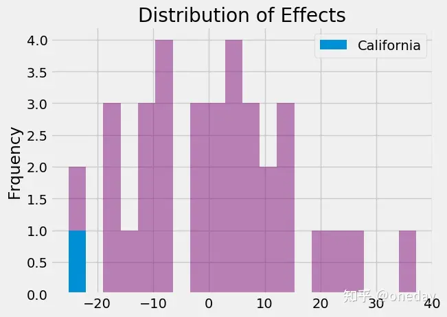

## 3.8 总结

&#x20;   在政策/策略评估中场景中，如果我们只有如城市/省/州等实体的聚合数据(aggregated data), 这时候DID(difference-in-difference)方法并不能很好地做归因。在DID中，我们需要寻找一个和试验组相似，可以表征试验组反事实情况(假设试验组没有接受到干预)的对照组，但这样理想的对照组，在现实中我们很难找到。

&#x20;   作为DID的升级版，合成控制法给了我们一个更好的解决方案。我们可以学习和构成基于若干个和试验组相近的测试单元线性组成的合成控制来表征一个虚拟的试验组。基于该合成控制，我们模拟出试验组没有接受到干预的结果并计算因果效应值。

&#x20;   最后，我们展示了如何基于Fisher的精确试验(Fisher’s Exact Tests)来测试该合成控制结果统计上的显著性。具体而言，我们对所有没有接到干预的测试单元都尝试生成一个成合成控制，然后计算其安慰剂效应值(placebo effect)或A/A效应值，再和我们试验组的效应值进行比较。通过这样的方式，我们来评估我们学习到的策略的因果效应值是否显著。


# 四、uplift model&#x20;

&#x20;   随着移动互联网和人工智能技术的发展，[<span style="color: rgb(36,91,219); background-color: inherit">智能化营销</span>](https://zhida.zhihu.com/search?content_id=221322809\&content_type=Article\&match_order=1\&q=%E6%99%BA%E8%83%BD%E5%8C%96%E8%90%A5%E9%94%80\&zhida_source=entity)正渗透到各行各业。如何衡量和预测营销干预带来的"增量提升"，而不把[<span style="color: rgb(36,91,219); background-color: inherit">营销预算</span>](https://zhida.zhihu.com/search?content_id=221322809\&content_type=Article\&match_order=1\&q=%E8%90%A5%E9%94%80%E9%A2%84%E7%AE%97\&zhida_source=entity)浪费在"本来就会转化"的那部分人身上，成为[<span style="color: rgb(36,91,219); background-color: inherit">智能营销算法</span>](https://zhida.zhihu.com/search?content_id=221322809\&content_type=Article\&match_order=1\&q=%E6%99%BA%E8%83%BD%E8%90%A5%E9%94%80%E7%AE%97%E6%B3%95\&zhida_source=entity)最重要的挑战。我们以Uplift Model为基础，构建营销增益[<span style="color: rgb(36,91,219); background-color: inherit">预测模型</span>](https://zhida.zhihu.com/search?content_id=221322809\&content_type=Article\&match_order=1\&q=%E9%A2%84%E6%B5%8B%E6%A8%A1%E5%9E%8B\&zhida_source=entity)，帮助商家锁定营销敏感人群，驱动收益模拟测算和投放策略制定，促成营销推广效率的最大化。本文将分享营销增益模型的原理和常见的建模及评估方法，并介绍Uplift Model技术的实践经验。

## 4.1   背景和问题定义

&#x20;   目前，智能化的营销手段越来越普及，商家可以通过多种渠道触达消费者，比如，商家可以圈定他想要的目标人群，进行广告推送，为店铺拉新，也可以通过短信或旺旺这些渠道定向发放[<span style="color: rgb(36,91,219); background-color: inherit">优惠券</span>](https://zhida.zhihu.com/search?content_id=221322809\&content_type=Article\&match_order=1\&q=%E4%BC%98%E6%83%A0%E5%88%B8\&zhida_source=entity)。无论是红包还是广告，我们都称为营销的干预手段，其背后都是有成本的。营销的目标就是在成本有限的情况下最大化营销的总产出，这里面最关键的一点是我们能否准确找到真正能被营销打动的用户，我们称他们为营销敏感人群，可以通过下面的图进行简单的解释：

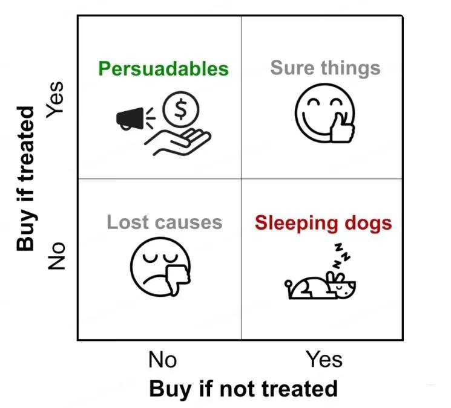

&#x20;  比如，我们对人群做[<span style="color: rgb(36,91,219); background-color: inherit">四象限</span>](https://zhida.zhihu.com/search?content_id=221322809\&content_type=Article\&match_order=1\&q=%E5%9B%9B%E8%B1%A1%E9%99%90\&zhida_source=entity)的划分，横纵坐标分别是用户在有干预和无干预情况下的购买状况。如上图，左上角人群的购买状况在干预后发生了正向变化，如果我们不对这类人群进行干预，那他有可能是不购买的，但是干预之后的购买概率有极大提升，所以这类人群是我们真正想要触达的用户，即营销敏感人群。而其他人群比如第2类和第3类，在干预前后的购买状况没有变化，所以预算花费可能是浪费。右下角是一类比较特殊的人群，虽然其在干预前后的状态有跳变，但这种跳变不是我们希望看到的，因为确实有一些人群对营销是反感的，所以对这类人群我们应该极力避免触达。Uplift Model正是为了识别我们想要的营销敏感人群。

### 4.1.1  什么是Uplift model？

&#x20;   Uplift models预测增量值，也就是lift的部分：

&#x20;Lift =P( buy | treatment )−P( buy | no treatment )

&#x20;   而传统模型通常直接预测目标：

&#x20;Outcome =P( buy | treatment )

&#x20;   Uplift Model是一个[<span style="color: rgb(36,91,219); background-color: inherit">增量模型</span>](https://zhida.zhihu.com/search?content_id=221322809\&content_type=Article\&match_order=1\&q=%E5%A2%9E%E9%87%8F%E6%A8%A1%E5%9E%8B\&zhida_source=entity)，目的是预测某种干预对于个体状态或行为的因果效应。在数学上可以表达为两个[<span style="color: rgb(36,91,219); background-color: inherit">条件概率</span>](https://zhida.zhihu.com/search?content_id=221322809\&content_type=Article\&match_order=1\&q=%E6%9D%A1%E4%BB%B6%E6%A6%82%E7%8E%87\&zhida_source=entity)的差值形式，如下图所示：

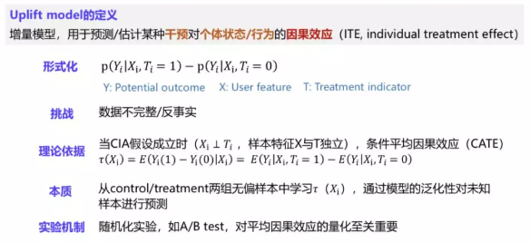

&#x20;   Y代表的结果 ( 比如用户的点击，转化等 )，X是用户维度的特征，T代表的是营销的变量 (1代表有干预,0代表无干预 ).

&#x20;   因此这个[<span style="color: rgb(36,91,219); background-color: inherit">概率差值</span>](https://zhida.zhihu.com/search?content_id=221322809\&content_type=Article\&match_order=1\&q=%E6%A6%82%E7%8E%87%E5%B7%AE%E5%80%BC\&zhida_source=entity)表示的是用户在有干预和没有干预情况下的变化，这个模型建模的难点在于我们获取到的训练数据是不完整的，对于个体来说，我们不可能同时观测到在有干预和没有干预两种情况下的表现，也就是[<span style="color: rgb(36,91,219); background-color: inherit">因果推断</span>](https://zhida.zhihu.com/search?content_id=221322809\&content_type=Article\&match_order=1\&q=%E5%9B%A0%E6%9E%9C%E6%8E%A8%E6%96%AD\&zhida_source=entity)中经常提到的反事实的问题。我们应当如何去建模呢？

&#x20;   可以换一种思路，从人群的角度来对[<span style="color: rgb(36,91,219); background-color: inherit">平均因果效应</span>](https://zhida.zhihu.com/search?content_id=221322809\&content_type=Article\&match_order=1\&q=%E5%B9%B3%E5%9D%87%E5%9B%A0%E6%9E%9C%E6%95%88%E5%BA%94\&zhida_source=entity)做统计，假设我们有两群同质用户，均来自一线城市/年龄段为25-35/女性，我们可以对其中一组用户进行广告投放，另外一组不进行任何干预，之后统计这两群人在转化率上的差值，这个差值可以被近似认为是具备同样特征的人可能的平均因果效应。所以Uplift Model本质是从训练样本中学习条件的平均因果效应，同时因为模型是具有一定的泛化能力，可以对没有见过的样本也进行预测。

&#x20;   但这里需要强调的是，Uplift建模对样本的要求是比较高的，需要服从CIA ( Conditional Independence Assumption ) [<span style="color: rgb(36,91,219); background-color: inherit">条件独立</span>](https://zhida.zhihu.com/search?content_id=221322809\&content_type=Article\&match_order=1\&q=%E6%9D%A1%E4%BB%B6%E7%8B%AC%E7%AB%8B\&zhida_source=entity)假设，要求X与T是相互独立的。

&#x20;   什么样的样本有这样的特征，又如何获取呢？最[<span style="color: rgb(36,91,219); background-color: inherit">简单的方式</span>](https://zhida.zhihu.com/search?content_id=221322809\&content_type=Article\&match_order=1\&q=%E7%AE%80%E5%8D%95%E7%9A%84%E6%96%B9%E5%BC%8F\&zhida_source=entity)就是随机化实验AB Test，因为通过AB Test拆分流量得到的这两组样本在特征的分布上面是一致的，也就是X和T是相互独立的。因此[<span style="color: rgb(36,91,219); background-color: inherit">随机化实验</span>](https://zhida.zhihu.com/search?content_id=221322809\&content_type=Article\&match_order=2\&q=%E9%9A%8F%E6%9C%BA%E5%8C%96%E5%AE%9E%E9%AA%8C\&zhida_source=entity)是Uplift Model建模过程中非常重要的基础设施，可以为Uplift Model提供无偏的样本。

### 4.1.2 Uplift model 有什么价值？

&#x20;  以广告投放为例，对于两个用户群，我们知道他们对广告投放的转化率分别是0.8%和2%，假如只有一次广告曝光的机会，应该向哪类用户投放广告？

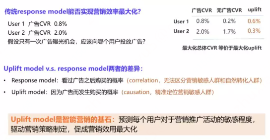

按照以往的经验和直觉，可能会向第二类用户群投放广告，因为其转换率是最高的，但这个结论是对的吗？经过进一步分析，除了广告曝光转化率之外，我们还能知道这两类用户群体在没有广告触达情况下的自然转化率，从而推算出广告所带来的增量。比如第一类用户的[<span style="color: rgb(36,91,219); background-color: inherit">广告转化率</span>](https://zhida.zhihu.com/search?content_id=221322809\&content_type=Article\&match_order=1\&q=%E5%B9%BF%E5%91%8A%E8%BD%AC%E5%8C%96%E7%8E%87\&zhida_source=entity)虽然低，但在没有广告触达情况下的转化率更低，即广告所带来的增量反而是比第二个用户更高的，而我们要最大化总体的转化率其实等价于最大化广告的增量，按照这个逻辑，我们应该向第一个用户投放广告。也就是说Response Model很有可能会误导我们做出错误的决策，Uplift Model和Response Model之所以有差异，主要在于两个模型的预测目标不一样。

* Response Model的目标是估计用户看过广告之后转化的概率，这本身是一个相关性，但这个相关性会导致我们没有办法区分出自然转化人群；

* Uplift Model是估计用户因为广告而购买的概率，这是一个因果推断的问题，帮助我们锁定对营销敏感的人群。所以Uplift Model是整个智能营销中非常关键的技术，预知每个用户的营销敏感程度，从而帮助我们制定营销策略，促成整个营销的效用最大化。

## 4.2 Uplift Model

&#x20;    增益模型通常用于用于估算CATE/ITE，基础的uplift model有以下三种：

1. Two-Model：建立两个对于outcome的预测模型，一个用实验组数据、一个用对照组数据。

2. One-Model：Class Variable Transformation：响应结果为[<span style="color: rgb(36,91,219); background-color: inherit">二元变量</span>](https://zhida.zhihu.com/search?content_id=221322809\&content_type=Article\&match_order=1\&q=%E4%BA%8C%E5%85%83%E5%8F%98%E9%87%8F\&zhida_source=entity)时可用。

3. 对uplift直接建模：对现有ML模型（树、RF、SVM）的改造

### 4.2.1 双模型 Two-Model Approach

> 通常作为baseline模型。

&#x20;    对 E\[Yi(1)∣Xi] 和 E\[Yi(0)∣Xi] 分别建模，一个用户通过两个模型进行预测并对结果取差则得到预估的[<span style="color: rgb(36,91,219); background-color: inherit">uplift值</span>](https://zhida.zhihu.com/search?content_id=221322809\&content_type=Article\&match_order=1\&q=uplift%E5%80%BC\&zhida_source=entity)：

* 优点：简单易用，可以使用常用的回归/分类模型

* 缺点：不是对uplift直接建模，可能会错失一些uplift相关的信号、导致表现较差

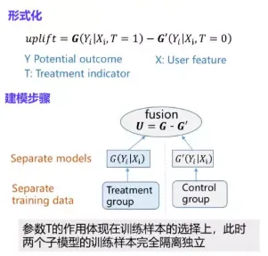

&#x20;    最简单的Uplift建模方法是基于Two Model的[<span style="color: rgb(36,91,219); background-color: inherit">差分响应模型</span>](https://zhida.zhihu.com/search?content_id=221322809\&content_type=Article\&match_order=1\&q=%E5%B7%AE%E5%88%86%E5%93%8D%E5%BA%94%E6%A8%A1%E5%9E%8B\&zhida_source=entity)，它的形式和前面介绍的Uplift Model的定义非常相似，包含了两个响应模型，其中一个模型G用来估计用户在有干预情况下的响应，另外一个模型G'是用来学习用户在没有干预情况下的响应，之后将两个模型的输出做差，就得到我们想要的uplift。这种建模方法的优点是比较简单容易理解，同时它可以套用我们常见的机器学习模型，如LR，GBDT，NN等，所以该模型的落地成本是比较低的，但是该模型最大的缺点是精度有限，这一方面是因为我们独立的构建了两个模型，这两个模型在打分上面的误差容易产生[<span style="color: rgb(36,91,219); background-color: inherit">累积效应</span>](https://zhida.zhihu.com/search?content_id=221322809\&content_type=Article\&match_order=1\&q=%E7%B4%AF%E7%A7%AF%E6%95%88%E5%BA%94\&zhida_source=entity)，第二是我们建模的目标其实是response而不是uplift，因此对uplift的识别能力比较有限。

### 4.2.2 One Model：The Class Transformation Method

> 适用于 Yiobs={0,1} 的二分类场景。

[<span style="color: rgb(36,91,219); background-color: inherit">类别变换</span>](https://zhida.zhihu.com/search?content_id=221322809\&content_type=Article\&match_order=1\&q=%E7%B1%BB%E5%88%AB%E5%8F%98%E6%8D%A2\&zhida_source=entity)

> 该部分可同时参考Pylift实现原理：[https://tech.wayfair.com/data-science/2018/10/pylift-a-fast-python-package-for-uplift-modeling/](https://link.zhihu.com/?target=https%3A//tech.wayfair.com/data-science/2018/10/pylift-a-fast-python-package-for-uplift-modeling/)

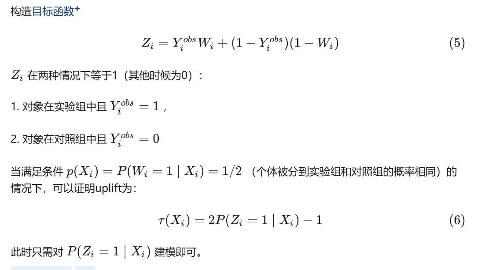

缺点：需要满足两个假设——1. 二分类场景，2. 数据在实验/对照组的分布一致，较为严格

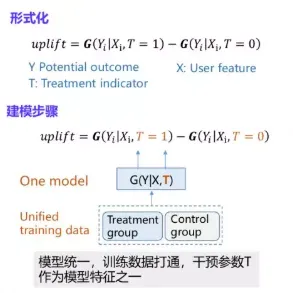

&#x20;    进一步地，还有一个基于One Model的差分响应模型，它和上一个模型最大差别点在于，它在模型层面做了打通，同时底层的样本也是共享的，之所以能实现这种模型层面的打通，是因为我们在样本的维度上做了一个扩展，除了user feature之外，还引入了与treatment相关的变量T ( T如果是0，1的取值可以建模single treatment，T也可以扩展为0到N，建模multiple treatment，比如不同红包的面额，或者不同广告的素材 )。

&#x20;   One Model版本和Two Model版本相比最大的优点是**训练样本的共享可以使模型学习的更加充分，同时通过模型的学习也可以有效的避免双模型打分误差累积的问题**，另外一个优点是从模型的层面可以支持multiple treatment的建模，具有比较强的实用性。同时和Two Model版本类似，它的缺点依然是其在本质上还是在对response建模，因此对uplift的建模还是比较间接，有一定提升的空间。

拓展到分布不均衡样本

> 不均衡样本的情况下，倾向分不为1/2.

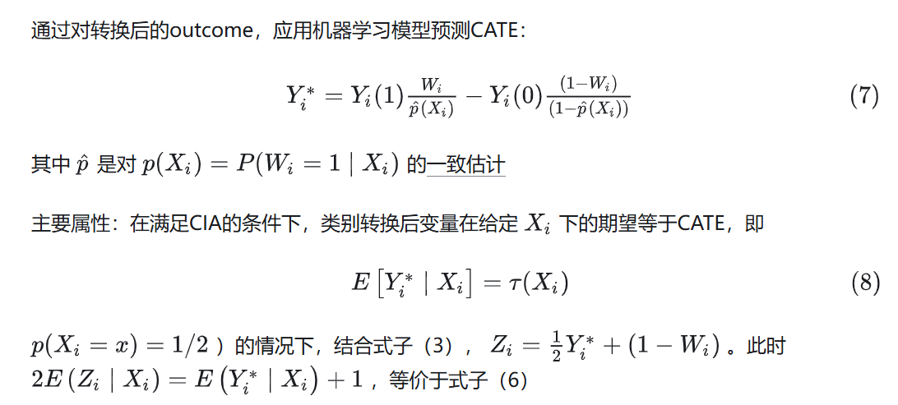

### 4.2.3 直接对Uplift进行建模

> 通过对现有机器学习算法的改造直接对增益效果建模，最流行的是树模型，本文主要讨论树的分裂标准（[<span style="color: rgb(36,91,219); background-color: inherit">二叉树</span>](https://zhida.zhihu.com/search?content_id=221322809\&content_type=Article\&match_order=1\&q=%E4%BA%8C%E5%8F%89%E6%A0%91\&zhida_source=entity)）。

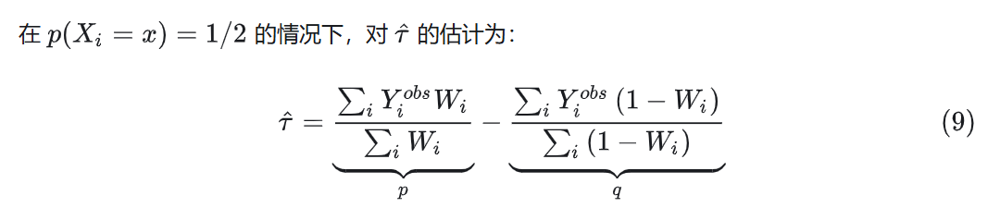

&#x20;   这是实验组的平均结果减去对照组的平均结果。

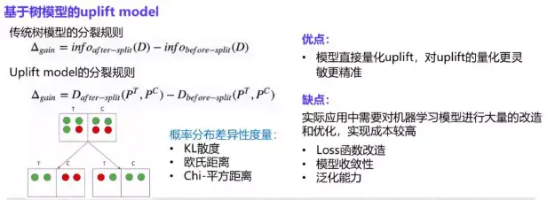

&#x20;   所以后续也有相关研究提出了第三种建模方法，通过对现有的模型内部进行深层次的改造来直接刻画uplift，其中研究较多的是基于树模型的[<span style="color: rgb(36,91,219); background-color: inherit">uplift建模</span>](https://zhida.zhihu.com/search?content_id=221322809\&content_type=Article\&match_order=1\&q=uplift%E5%BB%BA%E6%A8%A1\&zhida_source=entity)。

&#x20;   下面主要介绍它的思想，在传统的[<span style="color: rgb(36,91,219); background-color: inherit">决策树</span>](https://zhida.zhihu.com/search?content_id=221322809\&content_type=Article\&match_order=1\&q=%E5%86%B3%E7%AD%96%E6%A0%91\&zhida_source=entity)构建中，最重要的环节是分裂特征的选择，我们常用的指标是[<span style="color: rgb(36,91,219); background-color: inherit">信息增益</span>](https://zhida.zhihu.com/search?content_id=221322809\&content_type=Article\&match_order=1\&q=%E4%BF%A1%E6%81%AF%E5%A2%9E%E7%9B%8A\&zhida_source=entity)或者信息增益比，其背后的含义还是希望通过[<span style="color: rgb(36,91,219); background-color: inherit">特征分裂</span>](https://zhida.zhihu.com/search?content_id=221322809\&content_type=Article\&match_order=1\&q=%E7%89%B9%E5%BE%81%E5%88%86%E8%A3%82\&zhida_source=entity)之后下游节点的正负样本的分布能够更加的悬殊，也就代表类的纯度变得更高。

&#x20;   类似的，这种思想也可以引入到Uplift Model的建模过程中，虽然我们并没有用户个体的uplift直接的label，但是我们可以通过[<span style="color: rgb(36,91,219); background-color: inherit">treatment组</span>](https://zhida.zhihu.com/search?content_id=221322809\&content_type=Article\&match_order=1\&q=treatment%E7%BB%84\&zhida_source=entity)和control组转化率的差异来刻画这个uplift，以图中左下角的图为例，我们有T和C两组样本，绿色的样本代表正样本，红色的代表负样本，可以看到在分裂之前T和C两组正负样本的比例比较接近，但是经过一轮特征分裂之后，T和C组内正负样本的比例发生了较大的变化，[<span style="color: rgb(36,91,219); background-color: inherit">左子树</span>](https://zhida.zhihu.com/search?content_id=221322809\&content_type=Article\&match_order=1\&q=%E5%B7%A6%E5%AD%90%E6%A0%91\&zhida_source=entity)中T组全是正样本，C组全是负样本，右子树正好相反，C组的正样本居多，意味着左子树的uplift比右子树的uplift更高，即该特征能够很好的把uplift更高和更低的两群人做一个区分。

&#x20;   如何从数学上度量这种[<span style="color: rgb(36,91,219); background-color: inherit">概率分布</span>](https://zhida.zhihu.com/search?content_id=221322809\&content_type=Article\&match_order=1\&q=%E6%A6%82%E7%8E%87%E5%88%86%E5%B8%83\&zhida_source=entity)的差异的方式呢？

&#x20;   一些文章提出了可行的方法，比如基于KL散度，[<span style="color: rgb(36,91,219); background-color: inherit">欧式距离</span>](https://zhida.zhihu.com/search?content_id=221322809\&content_type=Article\&match_order=1\&q=%E6%AC%A7%E5%BC%8F%E8%B7%9D%E7%A6%BB\&zhida_source=entity)，卡方距离的等等。这种模型的优点是可以直接对uplift进行建模，因此它的精度理论上是更高的，但是在应用层面我们需要做大量的改造和优化，除了前面介绍的分裂规则之外，我们还需要改造它的loss函数，后续的剪枝等一系列的过程，所以它的实现成本是比较高的。

### 4.2.4 Uplift建模核心问题

#### 1.混杂因素偏置 Confounding Bias

&#x20;   由于干预机制导致的选择偏差，引起干预样本和不干预样本的特征分布不一致，产生了混杂因素。这一类混杂因素一方面会影响干预，也会影响结果。由于混杂因素的存在，我们无法得到一个干净的因果效应。具体案例比如：

* 流行度偏差：曝光集中在热门干预；

* 选择偏差：不同人群物品曝光差异。

&#x20;   基于这样的样本去建模大概率是得不到[<span style="color: rgb(36,91,219); background-color: inherit">置信度</span>](https://zhida.zhihu.com/search?content_id=221322809\&content_type=Article\&match_order=1\&q=%E7%BD%AE%E4%BF%A1%E5%BA%A6\&zhida_source=entity)高的结论的。

&#x20;   主要的解决方法：

* 在 loss 引入倾向分正则项；

* 在模型结构引入倾向分链式、对抗结构；

* 倾向分逆加权采样；

* 解离表征：试图将混杂因素项解离到一个向量中。

#### 2.归纳偏置 Inductive Bias

&#x20;   如下图所示：当样本/个体分别在干预/不干预的模型下进行打分后的分布不一致时，我们对干预打分-非干预打分差值（CATE）进行分布统计时会发现抖动很厉害，不同个体/群体之间的 UPLIFT 差别很难分辨，这说明 UPLIFT 模型预测基本是失效的。

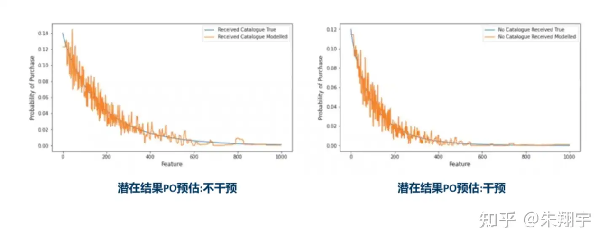

&#x20;   这个案例就展示了归纳偏置（Inductive Bias）问题：从模型架构角度，预估反事实结果无监督信号，或潜在结果预估正则化程度不一致，导致最终 Uplift 预估不稳定。

&#x20;   回到 Neyman-Rubin 潜在结果框架，对于不同的个体我们只知道干预的结果或者不干预的结果，不可能同时知道干预和不干预的结果，这导致了两个潜在结果预估的分布不一致；而且我们的深度模型建模目标往往是 CTR 或者 CVR ，他们本身不可能直接得到一个增益得分（uplift），这就导致我们的建模目标和最终评估的指标是不一致的。在图中我们可以看到 CATE 的分布与潜在结果预估得分分布完全不一致。这一系列的问题我们都总结为归纳偏置问题。归纳偏执问题是 UPLIFT 模型的一个核心问题，目前学界大概提出了以下四种解决方法：

* 反事实输出向量一致性，MMD 等分布对齐方法；

* 设计合理的共享参数架构，FlexTENet、S-Net；

* 反事实参数差异限制；

* 在模型结构引入重参结构（reparametrization），EUEN。

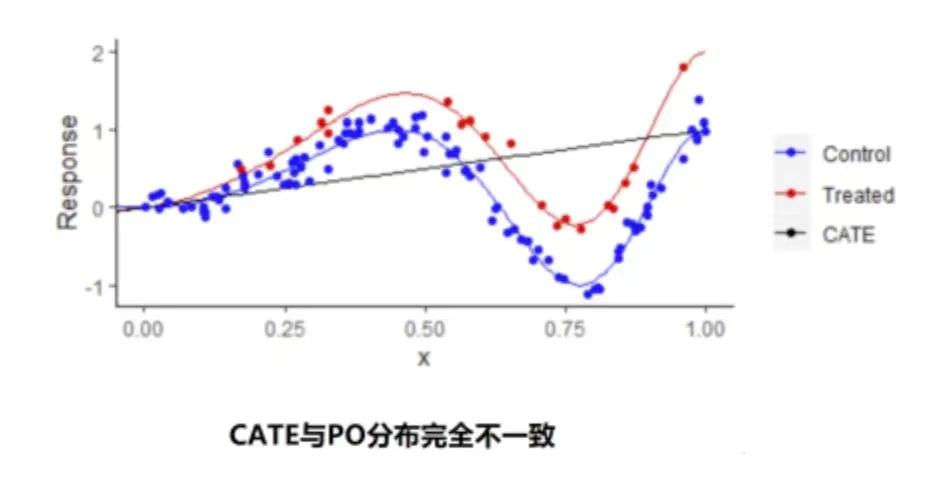

## 4.3 Evaluation metrics 评估指标

&#x20;    uplift model特点，是没有监督学习的label，所以不能使用传统评估指标。因为我们的目标是圈人，所以根据业务目标，可以按照预估uplift降序排，按照[<span style="color: rgb(36,91,219); background-color: inherit">直方图</span>](https://zhida.zhihu.com/search?content_id=221322809\&content_type=Article\&match_order=1\&q=%E7%9B%B4%E6%96%B9%E5%9B%BE\&zhida_source=entity)思路选择一些quantile分组（树模型直接对叶子进行计算排序）。因为我们之前提到RCM是估计"总体“ uplift。

&#x20;    RCM的experimental causal核心是，假想每一个treat组的人都有一个counterpart在control组，这一点在uplift model是被model默认考虑进的，一般没人去过多讨论这点。实际上在因果推断中，对照组和实验组的matching strategy也是一个研究方向，比如kernel matching、propensity score matching（逆概率加权）、 Mahalanobis distance matching等，可以作为优化点。

&#x20;   回到评估问题。传统ML模型需要准确，而uplift model不但需要准确，还要能找出最大化效应的人群。（举个例子，比如模型把所有人uplift预估为整体平均uplift，误差为0，但是模型不知该选谁发券，就没有意义了）。重点关注哪些指标需要根据不同业务具体分析。Radcliffe提出了五点可以作为评估uplift model的指标，大致分为准确性指标和效应指标(模型能否更好把人群分类，ROI指标)。

1. Monotonicity （真实效应高的排在前面，类似[<span style="color: rgb(36,91,219); background-color: inherit">皮尔逊相关系数</span>](https://zhida.zhihu.com/search?content_id=221322809\&content_type=Article\&match_order=1\&q=%E7%9A%AE%E5%B0%94%E9%80%8A%E7%9B%B8%E5%85%B3%E7%B3%BB%E6%95%B0\&zhida_source=entity)。准确性指标）

2. Prediction error （真实与预测uplift误差。准确性指标）

3. Spread （效应指标）

4. Maximum cumulative uplift（累计能获得多少ROI，效应指标）

5. Impact at cut-off（效应指标）

&#x20;   准确性和高效应不像ML中偏差和方差，是不矛盾的。但是基于统计的模型，高效应的更容易被异常值影响（[<span style="color: rgb(36,91,219); background-color: inherit">均值回归</span>](https://zhida.zhihu.com/search?content_id=221322809\&content_type=Article\&match_order=1\&q=%E5%9D%87%E5%80%BC%E5%9B%9E%E5%BD%92\&zhida_source=entity)现象），一般任务更倾向于效应指标，毕竟提升ROI才是业务！还有一些业务是目标发现negative effect的（发券更不买的）。

### &#x20;  4.3.1 Qini curve

&#x20;  Qini curve是uplift建模过程中最难的是提出一个有效的评估指标，也是最典型的评估指标。

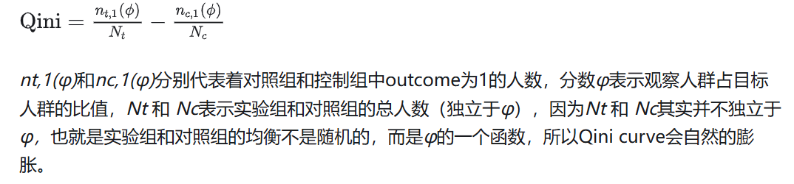

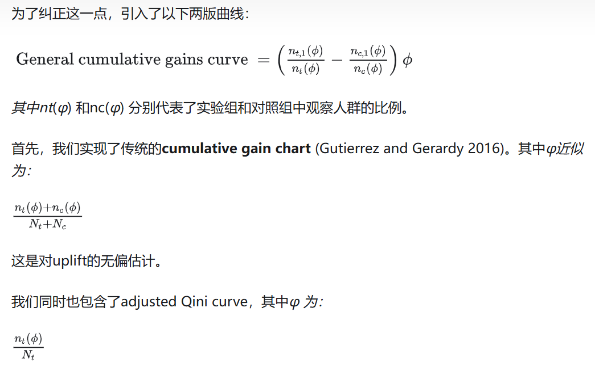

### &#x20; 4.3.2 AUUC

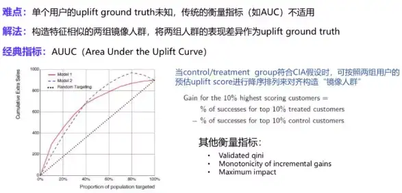

&#x20;   有了以上三种常见uplift的建模方法，我们需要对uplift模型进行评估，因为uplift评估最大的难点在于我们并没有单个用户uplift的ground truth，因此传统的评估指标像AUC是无法直接使用的。

&#x20;   解决的一个思路是通过构造镜像人群的方式来间接拿到uplift的ground truth，

&#x20;   比如说经典的AUUC的指标就是这样去计算的，假设现在有两个满足CIA条件假设的样本组，我们可以对两群人分别预估他们的uplift score，之后将人群按照uplift score进行降序排列，通过score分数这一桥梁，可以把两组人群进行镜像人群的对齐，之后分别截取分数最高的比如10%的用户出来，计算这一部分人转化率的差异，这个差异就可以近似地认为是分数最高的这群人真实的uplift，

&#x20;   类似地，我们可以计算前20%，40%一直到100%的点上面的值，连线就能得到uplift curve。

&#x20;   理论上如果模型对uplift的识别比较准确，我们预测uplift比较高的区间段，真实的uplift也较高，uplift curve就会呈现上凸的形式，我们也可以计算曲线下的面积度量不同模型的表现差异。当然除了这种方法之外，还有一些其他的指标如Validated qini等，在此不展开介绍。

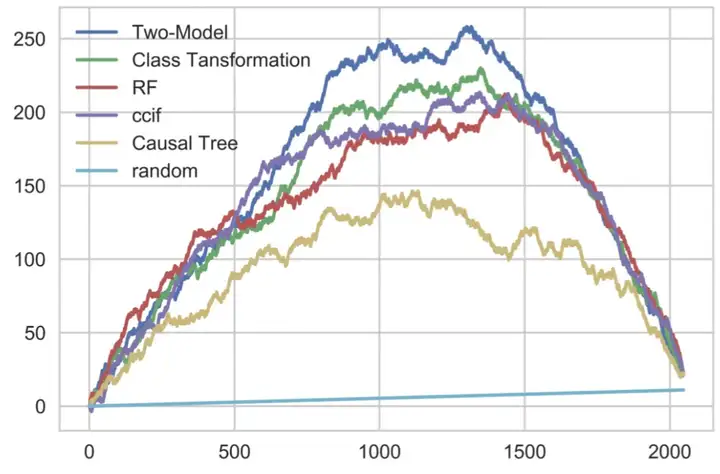

&#x20;   除了以上两种常见具体的评估方式，线下评估Uplift模型的有效性时，可以采用多种指标来衡量模型的性能和准确度。

1. Uplift Score

* 定义：Uplift Score是衡量Uplift模型效果的关键指标之一，表示个体在接受干预后相比于未接受干预时的响应增益。

* 计算方法：通常基于Uplift模型的预测结果，将个体分为干预组和对照组，然后计算两组之间的平均响应差异。

- Uplift Curve

* 定义：一种绘制干预效果随着个体被排序的曲线，帮助了解在不同个体子集上的干预效果。

* 评估方法：将所有样本按照模型给出的uplift得分降序排列，计算并绘制累积增量效果曲线。曲线越接近45度斜线，表示模型效果越好。

- Uplift at K

* 定义：在前K个个体中计算的干预效果，帮助了解在特定数量的个体中干预的效果如何。

* 评估方法：计算前K个个体中Treatment组和Control组的平均响应差异，K值可以根据具体需求设定。Uplift at K的值越高，表示模型在选定数量的个体中效果越好。

- Cumulative Uplift & Cumulative Gain

* 定义：Cumulative Uplift通过计算Top K组内Treatment和Control组的平均响应差值，表达在特定分组内的增量效果。Cumulative Gain则是在此基础上乘以样本量，得到增量绝对量。

* 评估方法：通过分组并计算累积增量或累积增益，来[<span style="color: rgb(36,91,219); background-color: inherit">评估模型</span>](https://zhida.zhihu.com/search?content_id=221322809\&content_type=Article\&match_order=1\&q=%E8%AF%84%E4%BC%B0%E6%A8%A1%E5%9E%8B\&zhida_source=entity)在不同分组上的效果。

- 单调性（Monotonicity of Incremental Gains）

* 评估方向：检查模型预测的uplift值与实际uplift值在单调性上是否一致，即预测uplift值较大的样本子集，实际uplift值也应较大。这反映了模型的准确性。

- 预测误差（Prediction Error or Tight Validation）

* 评估方法：比较每个分组内预测uplift值与实际uplift值是否接近，误差越小表示模型越准确。

- 差值（Spread or Range of Prediction）

* 评估方向：检查模型预测的最大uplift值与最小uplift值之间的差值，差值越大表示模型的区分度越高，这对于圈选头部人群用于营销等场景尤为重要。

&#x20;   综上所述，线下评估Uplift模型的有效性时，可以根据具体需求选择适合的评估指标，并结合多个指标进行综合评估。这些指标不仅能够帮助我们了解模型的性能和准确度，还能够指导我们如何优化模型以提高其在实际应用中的效果。

## 4.4 Uplift model 在实际业务中的应用

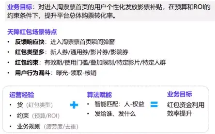

&#x20;   下面以淘票票实际场景为例，来说明uplift model如何在实际场景中进行应用。该项目的目标是希望对进入到首页的用户个性化地发送红包，实现在预算和ROI的双重约束下提升平台总体购票转化率。我们的权益就是首页的红包，红包的使用规则、红包类型、预算和交互样式由[<span style="color: rgb(36,91,219); background-color: inherit">产品运营</span>](https://zhida.zhihu.com/search?content_id=221322809\&content_type=Article\&match_order=1\&q=%E4%BA%A7%E5%93%81%E8%BF%90%E8%90%A5\&zhida_source=entity)设计，算法的作用是实现人和权益的精准匹配，我们需要确定应该给哪些用户发放以及发放哪种类型的权益。

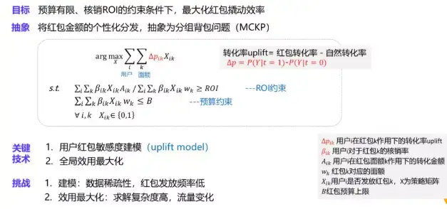

&#x20;   我们以平台通用券为例来说明问题是如何抽象和形式化的。在该场景下，每个用户最多只能发放一个红包，同时面额有固定几个分档，因此问题就精细化到如何对用户进行个性化的面额发放上，这可以通过经典的[<span style="color: rgb(36,91,219); background-color: inherit">背包问题</span>](https://zhida.zhihu.com/search?content_id=221322809\&content_type=Article\&match_order=1\&q=%E8%83%8C%E5%8C%85%E9%97%AE%E9%A2%98\&zhida_source=entity)来抽象，如图所示，第一个公式是我们的目标，最大化的是红包撬动效率，下面的约束条件一个是ROI约束，一个是预算约束。目标函数公式中标红的部分是第i个用户在第k个红包下转化的uplift，$$x_ik$$表示是否对用户i发放第k个红包，因此我们最终要决策的变量就是X矩阵。

&#x20;   该问题的求解中有两个关键点，一个是用户红包敏感度的建模，第二是在敏感度已知的情况下怎么进行全局效用最大化的求解。下面重点介绍uplift model模块。Uplift model的目标是预测每个用户在不同的红包金额下的转化率，从而构建出千人千面的敏感度曲线。

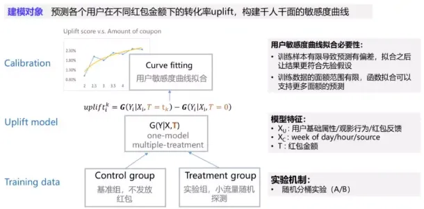

&#x20;   我们将建模的任务拆分成三个步骤：

1.收集训练样本

&#x20;   训练样本的收集和我们的实验是强相关的，我们采用的是随机化的分桶实验，它有两个好处，一是可以严谨公平地进行效果的评估，二是可以为uplift model的建模提供无偏的样本。建模中control组我们取的是随机化实验中的基准组，这部分用户是不进行红包发放的，而treatment组选用的是随机化实验中专为uplift model建模预留的一小部分随机探测的流量，之所以没有用有算法干预下的样本是因为用户的发放的面额与用户的特征是强相关的，并不满足CIA条件，因此这一部分样本虽然量较大，但是不能用于训练。

2.模型的构建和训练

&#x20;   收集到样本之后可以进行建模，考虑到业务迭代的周期，我们使用的是前面介绍的One Model的差分响应模型，特征层面，除了user维度的基础属性，还有历史的观影行为，以及历史红包的反馈，同时也会引入线上实时的环境特征，最重要的是跟营销相关的特征T，目前T代表的是红包的金额。

3.面向业务层的模型校准和优化

&#x20;   理论上到模型训练完成，就可以直接把模型放到线上去应用了，但是在离线调研时，我们发现一个问题，我们绘制的用户敏感度曲线和我们的预期不太一样，并不是严格的平滑递增的走势。我们分析有两个可能的原因：

* 一是与我们整体的样本规模比较有限有关，因为这种无偏样本目前大概只有几百万的量级；

* 二是 由于用户行为的稀疏性，在这种场景下我们比较难收集到用户在不同面额下的历史数据，因此也会加剧这种不平滑性。

&#x20;   针对该问题，我们做了校准处理，把原始曲线做了一个函数的拟合，一方面可以让结果更加符合我们[<span style="color: rgb(36,91,219); background-color: inherit">先验的</span>](https://zhida.zhihu.com/search?content_id=221322809\&content_type=Article\&match_order=1\&q=%E5%85%88%E9%AA%8C%E7%9A%84\&zhida_source=entity)假设，一方面经过这种函数化之后可以在后续支持更多面额的预测，但这种做法是否是最优的还值得进一步探讨。

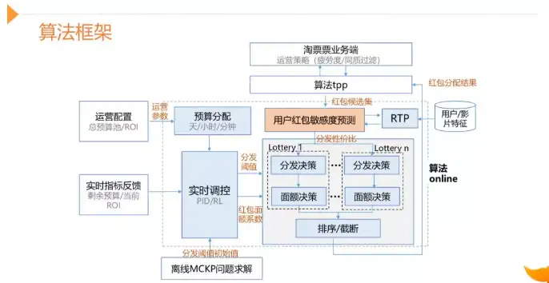

&#x20;   模型在线上应用的框架图，如上图所示，黄色区域是基于uplift model的实时预测的模块，当一条用户的请求过来的时候，我们会实时去[<span style="color: rgb(36,91,219); background-color: inherit">数据库</span>](https://zhida.zhihu.com/search?content_id=221322809\&content_type=Article\&match_order=1\&q=%E6%95%B0%E6%8D%AE%E5%BA%93\&zhida_source=entity)中取用户的特征以及影片的特征，同时结合当前的环境特征预测用户在当前状态下真实的敏感度，基于这个敏感度可以进行后续分发的面额决策等。

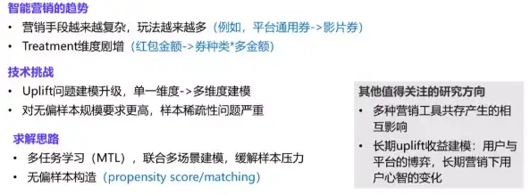

&#x20;   之后智能营销的发展态势是营销手段会越来越复杂，玩法也会越来越多，比如之前我们发放的更多是平台的通用券，后面也会发一些和影片相关的影片券或者影院券，这意味treatment的维度是在不断增长的，除了红包的金额之外还需要考虑不同的红包类型，这会给算法带来两个方面的挑战，一是我们需要对问题的建模形式做一个升级，除了之前单一维度的建模之外，我们可能还要考虑多维度的建模，同时维度的剧增会对样本的量级要求越来越高，样本的稀疏性问题会更加严重，针对这个问题我们有两个可能的解法：

（1）可以采用多任务学习的方式，联合其他场景一起建模缓解单场景样本的压力，同时也可以通过人为构造无偏样本的方式增加整体的样本量。当然除了技术侧，整个营销上面还有非常多很有意思的研究方向，比如之前更多考虑的是单个营销场景，但其实多个场景下怎么去建模和刻画他们之间的相互影响也是非常有意思的课题；

（2）我们之前uplift model建模更多考虑的是单次或者短期用户行为的增益，但实际上的营销往往是常态化或持续化的，用户的心智可能会不断发生变化，如何去建模长期的uplift也值得进一步去探讨。

## 4.5 预算分配与权益管理

&#x20;   众所周知，近些年随着人口红利带来的自然增长逐步放缓，各行各业逐步进入到增量价值挖掘。在这个阶段，智能化权益的营销策略会显得越来越重要，比如如何将预算在渠道以及时间维度去进行分配，以及以何种形式将权益发放给消费者，这是我们整体的业务背景以及需要去解决的问题。

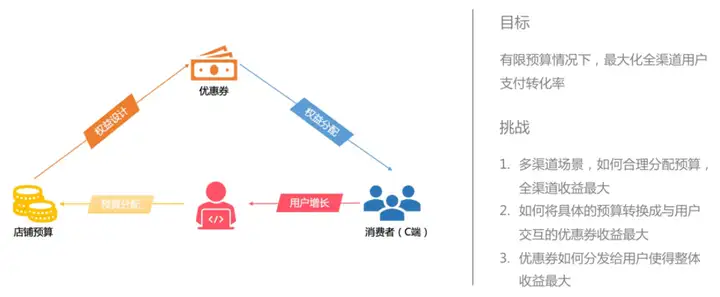

&#x20;   我们的目标是在有限预算情况下，最大化全渠道用户支付转化率。

&#x20;   我们所面对的挑战主要有：

* 多渠道场景，如何合理分配预算，全渠道收益最大；

* 如何将具体的预算转换成与用户交互的优惠券收益最大；

* 优惠券如何分发给用户使得整体收益最大。

### 4.5.1 [<span style="color: rgb(36,91,219); background-color: inherit">业务建模</span>](https://zhida.zhihu.com/search?content_id=221322809\&content_type=Article\&match_order=1\&q=%E4%B8%9A%E5%8A%A1%E5%BB%BA%E6%A8%A1\&zhida_source=entity)整体方案

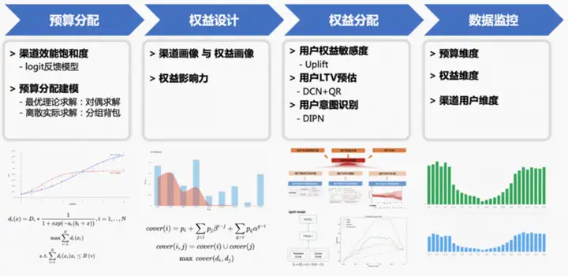

* 预算分配：当业务同学手头有一笔预算，想知道在什么时候、在什么渠道花多少钱才能使这笔钱花得最有价值。这就是预算分配所要解决的问题。主要基于渠道效能饱和度和预算分配建模这两块能力去做决策。

* 权益设计：当决策在某渠道要投放一笔预算后，这些钱是不能直接发给用户的，我们需要一种权益的形式载体，如优惠券、红包、购物金等等。这里以优惠券为例，会用到渠道画像和权益画像，以及权益影响力去做决策。

* 权益分配：权益设计完成后，就到了权益分配阶段。比如某个渠道的优惠券形式和张数都已确定，接下来面对的将是如何分发给用户使业务收益最大化的问题。将分两个阶段去解决，第一个阶段是决策是否要给某个用户发放优惠券，会基于用户意图识别和用户 LTV 预估来做决策；第二个阶段如果决定要发，发哪种优惠券，会基于用户权益敏感度来做出判断。

* 数据监控：在发放优惠券之后，会有一个整体的监控，以便后续的模型迭代。

### 4.5.2 预算分配

&#x20;   在何时以何种渠道花一笔预算才能获得最大收益，这是手头有预算的业务同学以及做营销算法的同学都非常关心的问题。

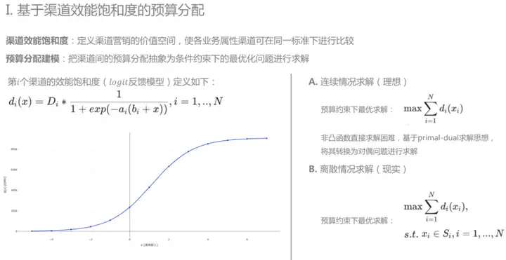

&#x20;   比如有 A 和 B 两个场景，我们会基于渠道效能饱和度做预算分配。渠道效能饱和度是定义渠道的营销价值空间，使各个业务渠道属性可以在同一个标准下进行比较。比如有多个渠道，A 渠道主要的业务价值是拉新，B 渠道的业务价值是拉订单或者拉 GMV ，它们在业务价值上是不对等的。我们要去做预算分配的时候，需要有统一的标准去做比较。

&#x20;   渠道效能饱和度借鉴于经济学里面非常经典的 logit 反馈函数，横坐标是成本投入，纵坐标是成本投入之后带来的收益。上图中以 GMV 预估为例，当成本投入为正向时，即给用户投放了成本，如降价或发放了优惠券，让利后 GMV会有相应的提升；成本为负，比如价格抬升，那么 GMV 则会下降。这是某一个渠道的效能饱和度。

&#x20;   我们也可以用同样的公式刻画多个渠道。比如有 A 和 B 两个渠道去做投放，可以刻画两个渠道的曲线，然后是把渠道间的预算分配抽象为条件约束下的最优化问题，即最优理论求解。理想情况下是连续情况求解，即预算分配可以精确到分或元的细粒度，求解全渠道收益最大化，也就是一个非[<span style="color: rgb(36,91,219); background-color: inherit">凸函数</span>](https://zhida.zhihu.com/search?content_id=221322809\&content_type=Article\&match_order=1\&q=%E5%87%B8%E5%87%BD%E6%95%B0\&zhida_source=entity)直接求解，这是比较困难的，所以我们可以使用对偶求解的方法。当然在现实中，很难将预算分配到一元两元，基本会在万的单位，也就变成了离散[<span style="color: rgb(36,91,219); background-color: inherit">问题求解</span>](https://zhida.zhihu.com/search?content_id=221322809\&content_type=Article\&match_order=1\&q=%E9%97%AE%E9%A2%98%E6%B1%82%E8%A7%A3\&zhida_source=entity)，我们可以使用分组背包求解。

### 4.5.3 权益设计

&#x20;   当确定了预算分配，那么预算应该以什么形式、门槛分发给用户呢？

&#x20;   对于优惠券来说，如果门槛过高，用户购买时决策成本会提升；

&#x20;   如果优惠券面额小，对用户的吸引力又不高。

&#x20;   因此要制定合理的券门槛和券面额。

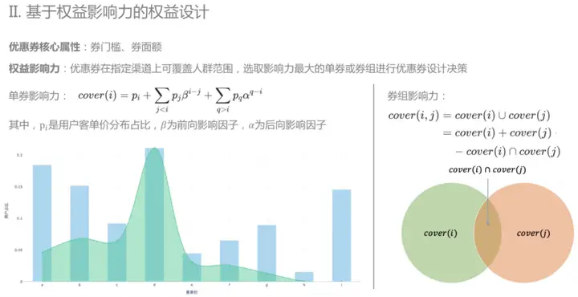

&#x20;   这时就需要定义权益影响力，优惠券在指定渠道上可覆盖人群范围，选取影响力最大的单券或券组进行优惠券设计决策。上图中的[<span style="color: rgb(36,91,219); background-color: inherit">柱状图</span>](https://zhida.zhihu.com/search?content_id=221322809\&content_type=Article\&match_order=1\&q=%E6%9F%B1%E7%8A%B6%E5%9B%BE\&zhida_source=entity)，横坐标是渠道用户客单价的分布，纵坐标是某一客单价下的人数占比，整个柱状图就是每个渠道下基于客单价的用户分布。可以看到分布在 d 区间的用户占比是最高的。假如d区间客单价是 10 元，那么我们设计一个 10 元的门槛是对整个用户群的覆盖最好的。

&#x20;   单券影响力公式如上图所示。其中， 是用户客单价分布占比，β 为前向[<span style="color: rgb(36,91,219); background-color: inherit">影响因子</span>](https://zhida.zhihu.com/search?content_id=221322809\&content_type=Article\&match_order=1\&q=%E5%BD%B1%E5%93%8D%E5%9B%A0%E5%AD%90\&zhida_source=entity)，α 为后向影响因子。比如按照 d 区间设置门槛，那么对于d区间人群影响力可能是 100%，而对于其它区间人群的影响力则会有衰减。影响力因子乘以用户占比，就是在一个客单价区间内的影响力。将每个区间的值累加起来，就是优惠券在这个渠道的影响力。

&#x20;   券组影响力，是多个优惠券影响力的集合。

### 4.5.4 权益分配

&#x20;   设计完权益之后，需要确认权益应该分发给哪些人，也就是权益分配。权益分配的目标是利用算法实现以人为中心的[<span style="color: rgb(36,91,219); background-color: inherit">精准营销</span>](https://zhida.zhihu.com/search?content_id=221322809\&content_type=Article\&match_order=1\&q=%E7%B2%BE%E5%87%86%E8%90%A5%E9%94%80\&zhida_source=entity)投放，最大化预算带来的业务收益。

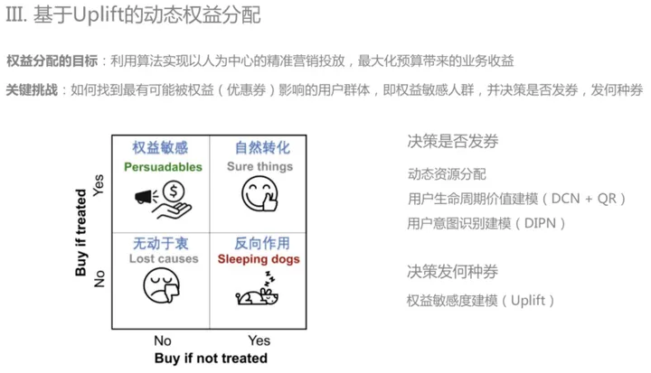

&#x20;   有人曾说在广告上的投资有一半是无用的，但是我不知道具体是哪一半。我们希望对用户进行深度的刻画来衡量和预测在权益干预情况下带来增量价值。

&#x20;   如上图中，横坐标是不发优惠券用户是否会买，纵坐标是发优惠券用户是否会买。第一和[<span style="color: rgb(36,91,219); background-color: inherit">第三象限</span>](https://zhida.zhihu.com/search?content_id=221322809\&content_type=Article\&match_order=1\&q=%E7%AC%AC%E4%B8%89%E8%B1%A1%E9%99%90\&zhida_source=entity)的用户，无论发不发优惠券都不会改变其购买行为，我们就不希望给这部分用户发放优惠券。而[<span style="color: rgb(36,91,219); background-color: inherit">第二象限</span>](https://zhida.zhihu.com/search?content_id=221322809\&content_type=Article\&match_order=1\&q=%E7%AC%AC%E4%BA%8C%E8%B1%A1%E9%99%90\&zhida_source=entity)用户是我们期望投放的用户。

&#x20;   我们所面临的关键挑战就是如何找到权益敏感人群。首先要决策是否发券，接下来是决策发何种券。决策发何种券的核心是权益敏感度建模 Uplift 增量模型。

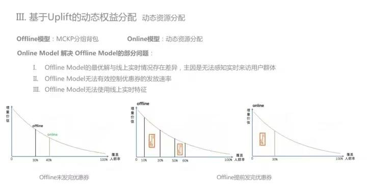

&#x20;   是否给一个用户发券，一是基于用户，另外也要基于库存。当库存不能覆盖全部用户时，就要去决策为哪些用户发券，这就是动态资源分配。我们最初期的模型是 offline 的，分组背包。后面迭代到了 online 模型，解决了线上实时情况与离线最优解存在差异、发放速率、使用实时特征的问题。

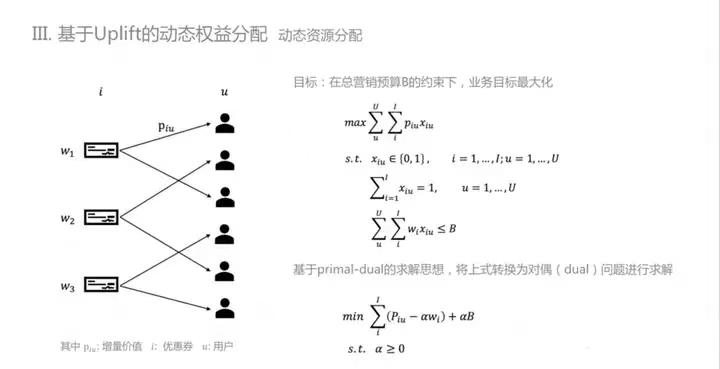

&#x20;   在总预算的约束下，实现业务目标的最大化，同样也是转化为对偶问题进行求解。

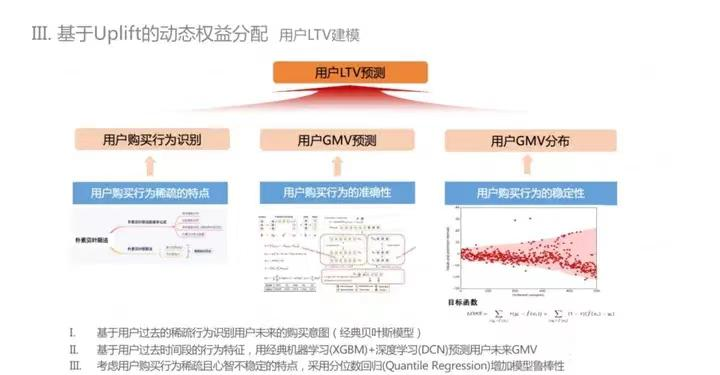

&#x20;   如果纯粹通过动态调控动态资源分配的话，有一个前提是认为所有用户的价值都是一样的，但是从业务视角来看，预算有限的情况下，希望把权益发给价值更高的用户，那么就涉及到了[<span style="color: rgb(36,91,219); background-color: inherit">用户价值</span>](https://zhida.zhihu.com/search?content_id=221322809\&content_type=Article\&match_order=1\&q=%E7%94%A8%E6%88%B7%E4%BB%B7%E5%80%BC\&zhida_source=entity)的预估。

&#x20;   我们会从几个维度考虑，首先会基于过去用户的行为去识别用户的购买意图。但在电商行业，用户的购买行为是比较稀疏的，会导致[<span style="color: rgb(36,91,219); background-color: inherit">样本分布</span>](https://zhida.zhihu.com/search?content_id=221322809\&content_type=Article\&match_order=1\&q=%E6%A0%B7%E6%9C%AC%E5%88%86%E5%B8%83\&zhida_source=entity)非常不均匀，此时需要做用户分层。比如基于用户购买行为去做识别之后，把用户的购买意图分成强中弱三层，对每一层去做用户的 GMV 的预测。然后再结合上述的预算分配、权益设计、权益动态分配。

### 4.5.5 改进方向

* 首先在预算分配方面，希望更精准地刻画渠道效能饱和度，以适应渠道多阶段的变化，比如在电商行业，在大促时间和平日，渠道的人群会发生很多变化，因此我们希望去做更加精准、也更兼容的刻画；另外也希望可以扩展应用渠道，量化多类权益渠道效能饱和度。

* 另外在权益分配方面，现阶段主要集中在优惠券，后续会拓展到红包、购物金、积分等权益方式上，去做多类权益理解与分发。

* 第三方面是去完善会员权益体系设计的搭建与管理。

## 4.6 Deep Uplift Model

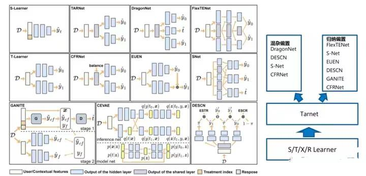

<span style="color: rgb(143,149,158); background-color: inherit">deep uplift model 模型发展脉络</span>

&#x20;   UPLIFT 模型的两大核心问题——混杂因质偏置和归纳偏置，学界和工业界提出了很多解决方案。

&#x20;   首先最基本的是 Meta-Learner，代表的建模方案有 S-Learner 和 T-Learner，随后进入深度学习后就演化出来以解决混杂偏置为代表的 DragonNet、DESCN、S-Net、CFRNet 等，和以解决归纳偏置为代表的 FlexTENet、S-Net、EUEN、DESCN、GANITE、CFRNet 等。

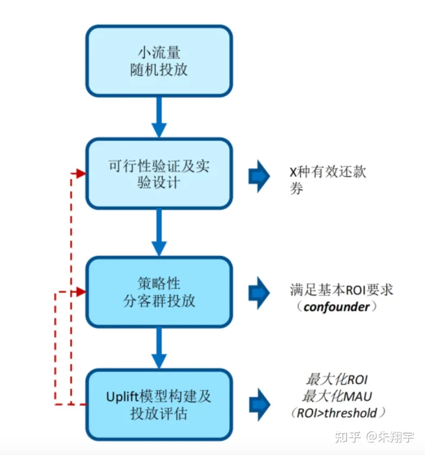

### 4.6.1 方案进化史

&#x20;   第一代解决方案以 Meta-Learner 为主，快速上线以达到业务的目标，业务的痛点是期望控制营销 ROI 并放量。

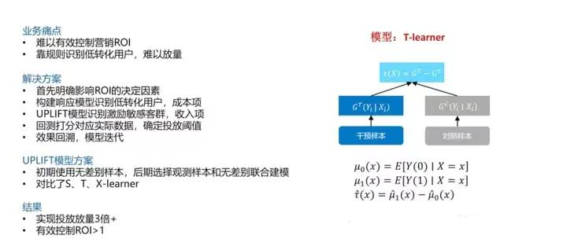

&#x20;   在右图中，模型T-learner是分别对干预T和对照C数据进行建模，差值为uplift值。

### 4.6.2 深度学习解决方案CRFnet\&EFIN

&#x20;  第二代主要是以深度学习架构为基础的，主要目的是为了实现多劵个性化运营， 是一个多值干预的问题。主要用到的模型有 CRFnet 和腾讯的 EFIN （Explicit Feature Interaction uplift Network）。

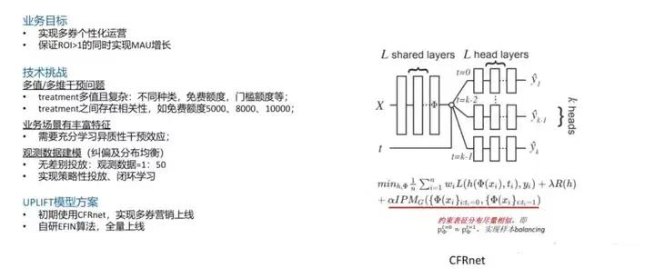

&#x20;   这里介绍下腾讯的 EFIN 模型。这个算法主要有三个模块：

&#x20;   第一个模块是自交互层，用一个 Self-Attetion 网络实现大规模用户特征的充分学习。

&#x20;   第二个模块是整个算法的关键，将干预变量 T 单独进行显式表示学习，这有利于解决多值干预问题。随后将干预 T 和特征 X 采用[<span style="color: rgb(36,91,219); background-color: inherit">注意力机制</span>](https://zhida.zhihu.com/search?content_id=221322809\&content_type=Article\&match_order=1\&q=%E6%B3%A8%E6%84%8F%E5%8A%9B%E6%9C%BA%E5%88%B6\&zhida_source=entity)交叉，加强异质性效应学习，而这恰恰是 UPLIFT 模型要学习的目标。并使用了重参（Reparametrization）法作为预估输出，缓解了潜在结果打分分布不一致的问题。

&#x20;   第三个模块使用干预约束项，让模型难以区分样本是否有被干预过，以图解决混杂偏置（Confounding Bias）问题。

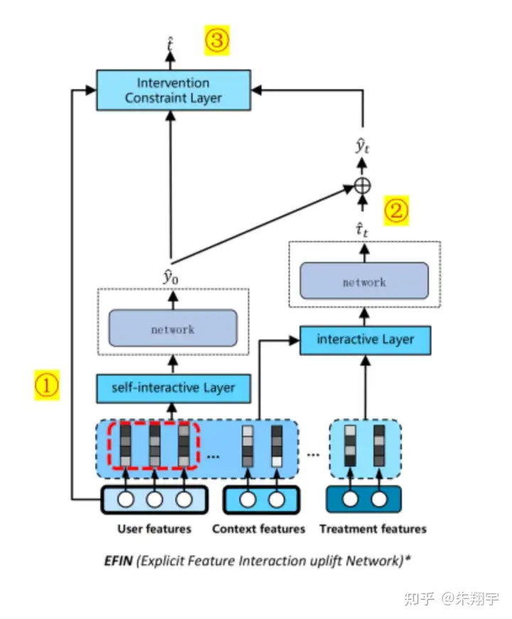

<span style="color: rgb(143,149,158); background-color: inherit">特征交互增强的深度学习模型</span>

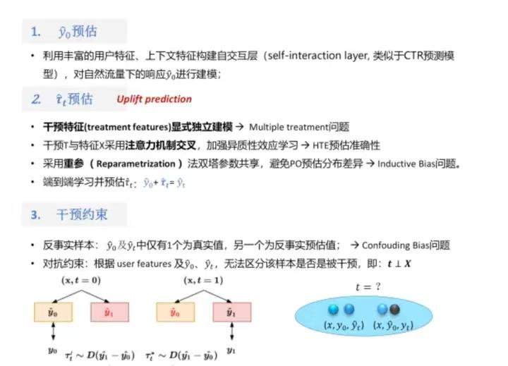


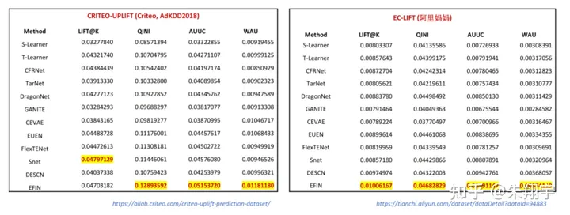

公开数据集效果

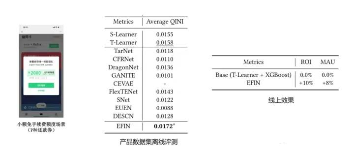

腾讯信用卡还款券线上效果

### 4.6.3 多目标深度学习解决方案

&#x20;   多目标 UPLIFT 模型为了同时建模 Ctr-Lift 和 Value-Lift， 预期实现 ROI>1 的同时实现 GMV 增长。里面最大的难点是金额的 UPLIFT 建模困难，因为金额本身两个反事实的预估结果就方差很大，再相减得到的 UPLIFT 方差更大，想要得到稳定的 UPLIFT 是比较难的，目前还在着力解决中。

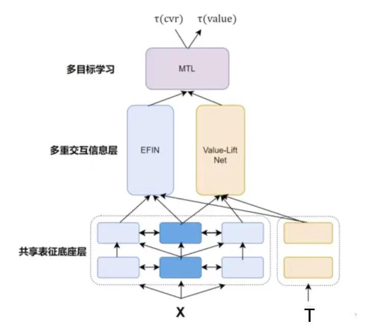


## 4.7 常见问题

Q1：非随机实验获得的有偏样本用 DragonNet 这种网络同时建模 Y 和 T 有效果吗？

A1：这个肯定有效果，我们针对观测数据一般情况下都会选择这种倾向性得分的方式建模，倾向性得分方式的应用可能会用 DragonNet 这样的模型结构，在模型结构中直接加上倾向性得分。另外一个更直接的方式就是直接根据倾向性得分的分布进行样本加权采样。

Q2：潜在结果存在归纳偏置对 UPLIFT 预估会带来什么样的影响？

A2：这个其实我刚刚那个图讲得比较清楚了，因为我们的深度学习模型是分别预估两个反事实的 CTR，它们的建模目标实际上是两个 CTR， 这两个 CTR 求差会发现这个差值的方差较大。

Q3：[<span style="color: rgb(36,91,219); background-color: inherit">神经网络</span>](https://zhida.zhihu.com/search?content_id=221322809\&content_type=Article\&match_order=1\&q=%E7%A5%9E%E7%BB%8F%E7%BD%91%E7%BB%9C\&zhida_source=entity)的输入一般做什么处理，连续型特征和离散型特征有什么区别？

A3：这个问题就不是一个 UPLIFT 问题了，一般情况下就是做 Embedding ，类别型的就做 One-Hot。

Q4：在您的第二代解决方案里，Meta-Learner 比 EFIN 之外的其他 NN 模型都要好，S-Learner 里面的基模型也是这个模型吗？

A4：对，S-Learner 它里面也是一个 DNN 。

Q5：深度学习模型相比于因果森林和 UPLIFT-Tree 模型，各有什么样的优劣势？

A5：深度模型最大的优势就是采用复杂网络结构，如特征交叉、注意力机制等，对特征的充分学习；森林和树模型的最大优势就是稳定性，并且森林类模型的建模目标直接就是 CATE。

Q6：如果只有观测数据的话，怎么评估 UPLIFT 模型的准确性？

A6：评估指标离线我们主要用到的是 AUUC 和 QINI，在线可能主要还是转化成一个财务指标来看它的营销带来的一个 ROI， 取决于我们的任务目标。

Q7：在金融场景下因果推断的应用与搜广推下的应用有什么区别？

A7：金融场景下实际上也有搜广推， 但是确实金融场景有它的独特性的， 这种独特性在于它的转化链路非常长，它涉及到它的授信、核卡等这样的一类审批流程，另外金融里怎么做金额的预估也是一个难点。

Q8：UPLIFT Model 和 DML 各有什么优劣势？

A8：UPLIFT Model 和 DML都用来求解 CATE。UPLIFT Model 以机器学习作为主要工具，如树模型，深度学习，同时融合了因果推断的思想。而 DML 模型以[<span style="color: rgb(36,91,219); background-color: inherit">计量经济学</span>](https://zhida.zhihu.com/search?content_id=221322809\&content_type=Article\&match_order=1\&q=%E8%AE%A1%E9%87%8F%E7%BB%8F%E6%B5%8E%E5%AD%A6\&zhida_source=entity)的思路指导机器学习工具进行 CATE 的预估。UPLIFT Model 是个更大的范畴，部分模型也借鉴了 DML 的思想。

Q9：UPLIFT 模型主要用在新客还是老客上面，如果老客只有百万量级，能否使用模型?

A9：量级问题其实是一个很关键的问题，但是曝光量级其实不是最重要的， 最重要的是你的正样本有多少， 正样本才是决定能否建模的关键。

## 4.8 参考文献

1. [Pylift: A Fast Python Package for Uplift Modeling](https://link.zhihu.com/?target=https%3A//www.aboutwayfair.com/data-science/2018/10/pylift-a-fast-python-package-for-uplift-modeling/)

2. [<span style="color: rgb(36,91,219); background-color: inherit">增益模型（Uplift Model）的基础介绍 —— 估算ITE</span>](https://zhuanlan.zhihu.com/p/425898510)

3. [一文读懂uplift model](https://zhuanlan.zhihu.com/p/100821498)

4. [阿里基于渠道协同的预算分配与权益管理实践](https://zhuanlan.zhihu.com/p/605185881)

5. [深度 UPLIFT 模型在腾讯金融用户增长场景中的应用](https://zhuanlan.zhihu.com/p/616649869)

# 五、因果树与因果森林

&#x20;   在经济领域，我们通常关注某一政策或者微观行为是否产生收益，常用处理效应来进行因果推断

## 5.1 处理效应

### 5.1.1 潜在结果

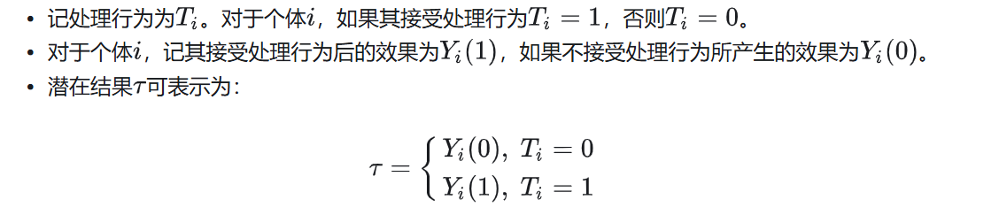

### 5.1.2 个体处理效应（ITE）

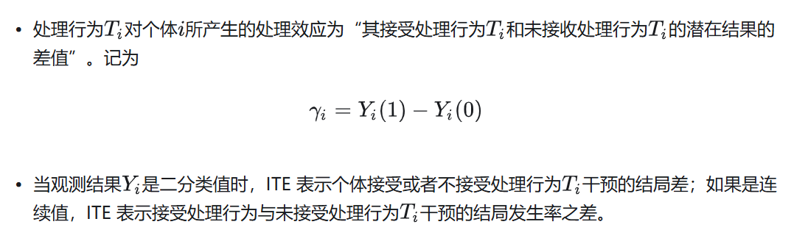

### 5.1.3 平均处理效应

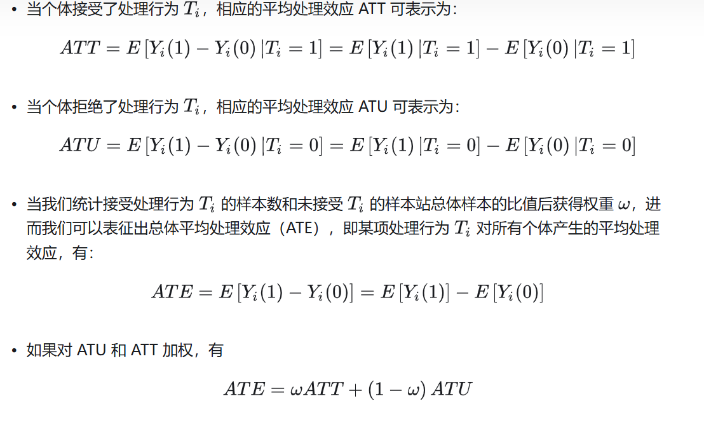

### 5.1.4 反事实结果

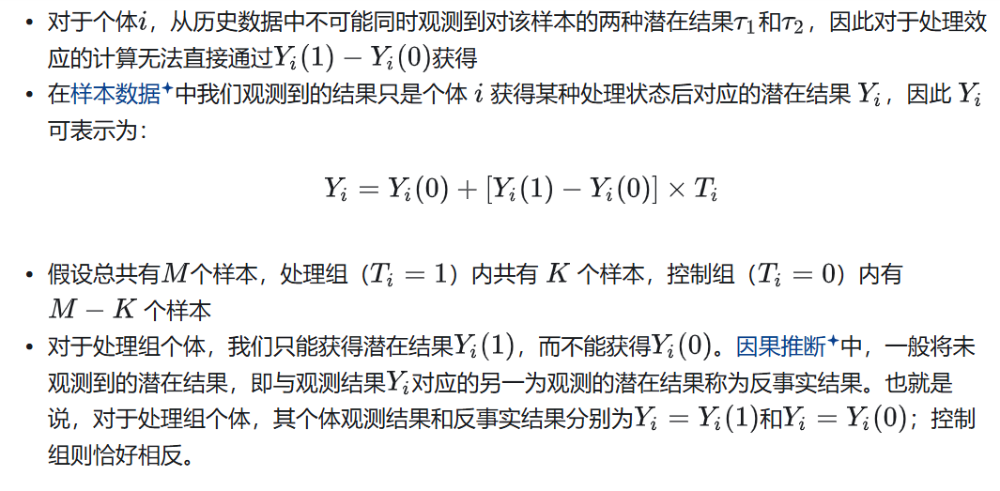

### 5.1.5 选择偏差

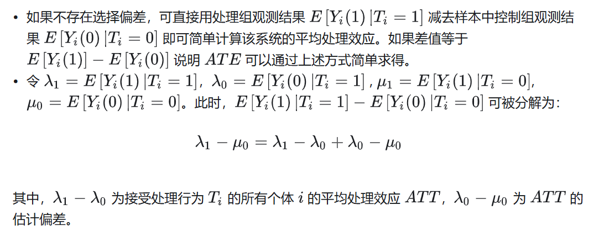

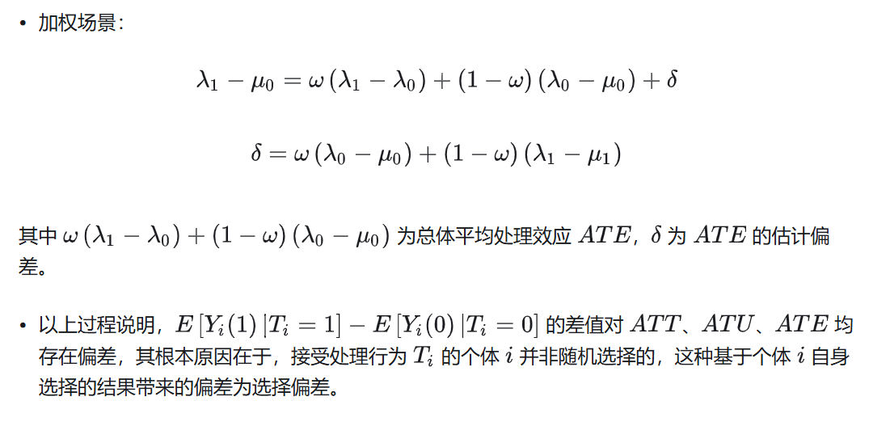

### 5.1.6 随机分配

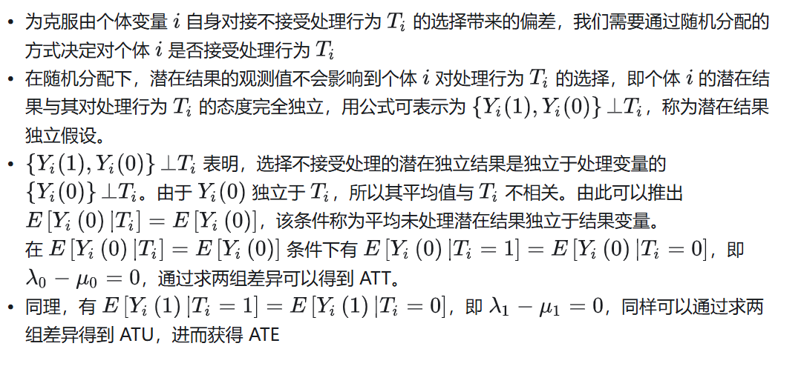

## 5.2 决策树算法

### 5.2.1 决策树算法简介

* 决策树算法是一种建立在目前已知样本中变量发生概率, 并利用这种已知信息构造一棵树形模型并使用该模型进行分析。

* 决策树算法将父结点二分后若[<span style="color: rgb(36,91,219); background-color: inherit">子结点</span>](https://zhida.zhihu.com/search?content_id=244412408\&content_type=Article\&match_order=1\&q=%E5%AD%90%E7%BB%93%E7%82%B9\&zhida_source=entity)中存在叶子结点则算法在该叶子结点处停止不在向下延伸, 叶子结点的类别即为决策树算法的决策结果，[<span style="color: rgb(36,91,219); background-color: inherit">示意图</span>](https://zhida.zhihu.com/search?content_id=244412408\&content_type=Article\&match_order=1\&q=%E7%A4%BA%E6%84%8F%E5%9B%BE\&zhida_source=entity)如下：

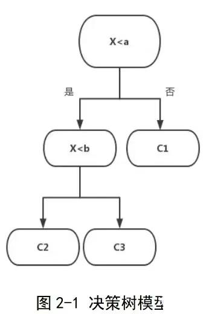

### 5.2.2 决策树算法原理

#### 1 构建过程

* 对于使用决策树实现决策功能而言, 算法的核心就是对决策树的构造。

* 通过对[<span style="color: rgb(36,91,219); background-color: inherit">样本空间</span>](https://zhida.zhihu.com/search?content_id=244412408\&content_type=Article\&match_order=1\&q=%E6%A0%B7%E6%9C%AC%E7%A9%BA%E9%97%B4\&zhida_source=entity)中样本属性的度量, 以此来确定样本数据集中各个属性或者特征之间的拓扑结构; 在完成对属性的把握后, 另一关键步骤选择分裂结点的特征属性。

* 决策树算法的流程为:&#x20;

* （1）将样本空间中所有的属性或者特征视为独立的潜在结点;&#x20;

* （2）对样本空间中所有的潜在结点进行遍历, 获得当前属性或者特征的每一种分裂方式, 以此找到满足某种分裂条件最好的属性或特征, 将样本划分进不同的子结点中, 计算结点的“纯洁度”;&#x20;

* （3）继续遍历所有的属性或特征, 在第 2 步的基础上选择出最优的属性或特征以及该属性或特征的最优的划分方式；&#x20;

* （4）对子结点分别重复执行 2-3 步, 直到每个[<span style="color: rgb(36,91,219); background-color: inherit">叶结点</span>](https://zhida.zhihu.com/search?content_id=244412408\&content_type=Article\&match_order=1\&q=%E5%8F%B6%E7%BB%93%E7%82%B9\&zhida_source=entity)的“纯洁度”尽可能的大。

#### 2 决策树的分割条件与信息增益

* 决策树的效率常常与决策树算法的特征选取有关, 作为一种[<span style="color: rgb(36,91,219); background-color: inherit">贪心算法</span>](https://zhida.zhihu.com/search?content_id=244412408\&content_type=Article\&match_order=1\&q=%E8%B4%AA%E5%BF%83%E7%AE%97%E6%B3%95\&zhida_source=entity)决策树不采取回溯操作只计算当前情况下数据特征最好, 因此对于样本空间中[<span style="color: rgb(36,91,219); background-color: inherit">样本特征</span>](https://zhida.zhihu.com/search?content_id=244412408\&content_type=Article\&match_order=1\&q=%E6%A0%B7%E6%9C%AC%E7%89%B9%E5%BE%81\&zhida_source=entity)的选取直接决定了决策树[<span style="color: rgb(36,91,219); background-color: inherit">算法分类</span>](https://zhida.zhihu.com/search?content_id=244412408\&content_type=Article\&match_order=1\&q=%E7%AE%97%E6%B3%95%E5%88%86%E7%B1%BB\&zhida_source=entity)效果的好坏。

* 为了获得对样本空间的最大的收益, 决策树算法引入了[<span style="color: rgb(36,91,219); background-color: inherit">信息增益</span>](https://zhida.zhihu.com/search?content_id=244412408\&content_type=Article\&match_order=2\&q=%E4%BF%A1%E6%81%AF%E5%A2%9E%E7%9B%8A\&zhida_source=entity)计算某属性用于分类的收益情况。

* 如图 2-2 所示对于总体样本而言, 其样本空间中某属性或者特征的信息增益大, 则表示该属性或者特征对最终的分类结果造成的影响高, 所以更应该选择其作为决策树算法的分裂特征。

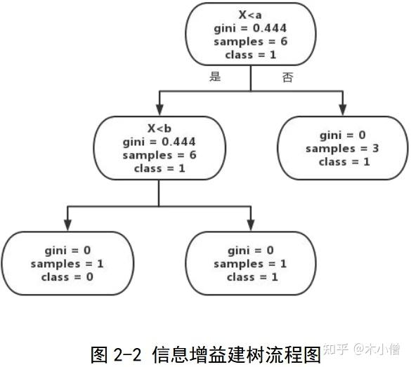

图2-2 信息增益建树流程图

&#x20;  信息增益的计算信息熵与[<span style="color: rgb(36,91,219); background-color: inherit">条件熵</span>](https://zhida.zhihu.com/search?content_id=244412408\&content_type=Article\&match_order=1\&q=%E6%9D%A1%E4%BB%B6%E7%86%B5\&zhida_source=entity), 其中信息熵的概念来自于热力学中熵一词, 在信息学中作为一种描述信息量的大小的工具, 其计算式为：


&#x20;  在[<span style="color: rgb(36,91,219); background-color: inherit">信息论</span>](https://zhida.zhihu.com/search?content_id=244412408\&content_type=Article\&match_order=1\&q=%E4%BF%A1%E6%81%AF%E8%AE%BA\&zhida_source=entity)的一般概述中, 条件熵是集合在[<span style="color: rgb(36,91,219); background-color: inherit">二维随机变量</span>](https://zhida.zhihu.com/search?content_id=244412408\&content_type=Article\&match_order=1\&q=%E4%BA%8C%E7%BB%B4%E9%9A%8F%E6%9C%BA%E5%8F%98%E9%87%8F\&zhida_source=entity)(X,Y) 上自信息期望的理论值。条件熵描述了在随机变量 Y 的值已知的前提下, 随机变量 X 的信息熵的大小, 条件熵的计算为：


&#x20;  通过信息熵与条件熵, 信息增益可表示为：


&#x20;  决策树的构建过程是通过递归实现的, 因此必须给予算法一个停止条件, 否则算法将一直执行下去而不会停止。递归建树的停止条件有两种: 当整个样本空间中子结点内部数据类型相同时停止构建决策树; 当[<span style="color: rgb(36,91,219); background-color: inherit">非叶子结点</span>](https://zhida.zhihu.com/search?content_id=244412408\&content_type=Article\&match_order=1\&q=%E9%9D%9E%E5%8F%B6%E5%AD%90%E7%BB%93%E7%82%B9\&zhida_source=entity)中样本的数量低于某个阈值, 或该棵决策树达到设定的迭代次数时, 算法停止构建决策树。

#### 3  决策树剪枝

* 剪枝是一种防止过度拟合的优化策略, 在前文中提到通过递归产生决策树直到样本空间不能继续划分为止。这样构建的[<span style="color: rgb(36,91,219); background-color: inherit">决策树模型</span>](https://zhida.zhihu.com/search?content_id=244412408\&content_type=Article\&match_order=1\&q=%E5%86%B3%E7%AD%96%E6%A0%91%E6%A8%A1%E5%9E%8B\&zhida_source=entity)在训练集上有良好的表现, 但在测试数据上其分类精度远低于训练数据集即会出现[<span style="color: rgb(36,91,219); background-color: inherit">过拟合</span>](https://zhida.zhihu.com/search?content_id=244412408\&content_type=Article\&match_order=1\&q=%E8%BF%87%E6%8B%9F%E5%90%88\&zhida_source=entity)现象。

* 过拟合现象的产生源于决策树算法对训练集的“优异表现”导致决策树在验证集上泛化能力不强, 一般而言过拟合的决策树算法通常存在模型复杂的问题, 过多的结点保证了算法学习的准确性但过于细分特征使决策树无法对陌生数据进行处理。

* 因此为防止算法在训练集上过拟合导致验证时表现不佳, 通常需要在建立一棵决策树时对其进行剪枝操作防止过拟合。

* 对决策树进行剪枝可以分为前置剪枝和后置剪枝。前置剪枝的过程发生在决策树构建过程中, 该策略下决策树往往比较小, 这也意味着分类规则较少一般无法得到较好的分类效果。后置剪枝则是完成建树操作后对决策树进行剪枝优化, 后置剪枝有两种策略: 将叶子结点代替整棵子树或者用某棵较小的子树代替另一棵较深的子树。


## 5.3 随机森林

### 5.3.1 随机森林算法

* 随机森林算法是在决策树算法的基础上进行优化, 考虑到单棵树因为选取特征以及样本自身特性的原因导致单棵决策树出现结果误差, *利用多棵决策树形成森林以投票的方式对潜在误差进行避免提高分类精度*。

* 虽然随机森林算法具有计算开销小、模型简单等特点, 但其在分类和回归领域有很好的表现。

* 随机森林的随机性主要体现在其对子结点的分割上考虑结点内部属性或特征的随机子集; 在构建树结构时随机采样建树。

* 在使用训练集对算法模型进行训练时, 森林中会从样本空间中随机选择单棵树的训练集, 每一棵树在不同的训练集上接受训练以获得不同分类规则的决策树。

* 在训练结束后被学习后的样本放回样本空间供下一次训练抽取, 这种有放回的抽样方式被称为自助抽样法 (bootstrapping), 虽然使用[<span style="color: rgb(36,91,219); background-color: inherit">自助法</span>](https://zhida.zhihu.com/search?content_id=244412408\&content_type=Article\&match_order=1\&q=%E8%87%AA%E5%8A%A9%E6%B3%95\&zhida_source=entity)抽取单棵决策树的训练集会导致某些样本将被一棵或者多棵树使用, 但是这样中[<span style="color: rgb(36,91,219); background-color: inherit">抽样方法</span>](https://zhida.zhihu.com/search?content_id=244412408\&content_type=Article\&match_order=1\&q=%E6%8A%BD%E6%A0%B7%E6%96%B9%E6%B3%95\&zhida_source=entity)保证了在小样本下每棵树学习的训练集尽可能的不同。

### 5.3.2 自采样算法

* 对于单棵树的生成, 随机森林在样本空间中划分一个包含有n个样本数据的数据集D, 对数据集D进行采样进而得到新数据集 D′

* 从 D中随机选出一个数据样本i ,将数据样本i复制后放入新数据集D′ ,数据样本i不舍弃而是重新放回初始数据集D中, 这样在下次抽样中数据样本i依然可以被抽到。

* 将该过程重复n次后就可以获得n个包含n个样本的数据集D′ ,由于在D′中存在如数据样本i这样的被重复抽取的数据, 而可能存在部分一次都没有被抽取过的样本。

* 假设一个样本α在n次采样中一次都不被采用的概率是 $$（1-\frac{1}{n}）^n=\frac{1}{e}$$, 即约有36.8%的样本不会被抽中, 因此这 36.8%的数据可以用作测试。


### 5.3.3 节点特征的选择

* 在随机森林中, 结点特征的选择是基于随机化的选择

* 由于随机森林的算法效果主要由两大因素决定, 一方面是森林中任意两棵决策树之间的关联程度: 两棵树之间关联程度越高, 算法的效果越差; 另一方面森林中单棵决策树的分类能力越强, 那么森林算法整体效果越好。

* 在随机森林算法中两大因素之间呈现此消彼长的关系, 如果在训练集上减少样本数据的特征个数, 虽然能有效降低树与树之间的关联程度, 但随之而来的是单棵树的分类能力也会相应的降低; 反之如果训练时增加数据集上特征数量, 树与树之间的相关程度增加, 但单棵树的决策能力得到提升。

* 所以在随机森林算法中, 一个关键问题是选对特征数的选取在这里我们假设有 n 个属性, 规定一个属性数量 α

* 重要性评估指标通常使用基尼指数和袋外数据错误率来实现衡量目标。将 Gini 指数写作 GI, 令存在 n 个特征 $$X_1,X_2,...,X_n$$,通过对每个特征 $$X_i$$进行计算得到 $$X_i$$关于 Gini 指数的评分, Gini 指数的计算公式如下所示：

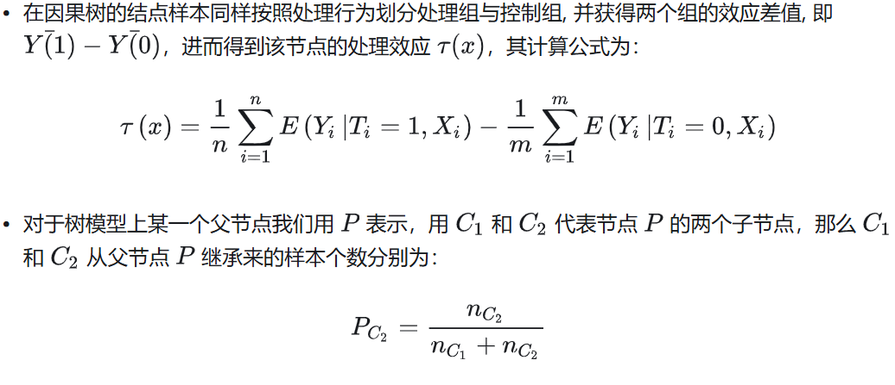

&#x20;   在随机森林算法中，节点 P 分叉为 $$C_1$$和$$C_2$$后误差可以表示为：


&#x20;  从方差角度对上述式子进行分析，当随机森林算法无法最小时即是节点内不方差最小。由于因果森林是在节点进行处理效应的计算，因此我们希望节点间的差别尽可能大，使得[<span style="color: rgb(36,91,219); background-color: inherit">因果效应</span>](https://zhida.zhihu.com/search?content_id=244412408\&content_type=Article\&match_order=1\&q=%E5%9B%A0%E6%9E%9C%E6%95%88%E5%BA%94\&zhida_source=entity)最大化。

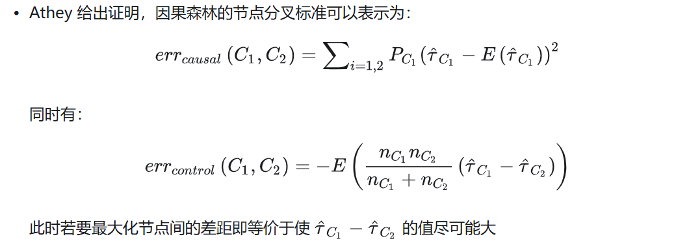

## 5.4 因果森林算法

### 5.4.1 因果森林简介

* 因果森林算法的提出是在各领域被广泛应用的随机森林算法与因果推断相结合的产物

* 该算法遵循的理念源自于绪论中提到的随机森林处理填充反事实结果的中的“匹配”方法。

* 在“匹配”的思路下, 因果森林通过是不同树模型间处理效应最大化, 利用重复划分特征的手段来实现样本数据在局部[<span style="color: rgb(36,91,219); background-color: inherit">特征空间</span>](https://zhida.zhihu.com/search?content_id=244412408\&content_type=Article\&match_order=1\&q=%E7%89%B9%E5%BE%81%E7%A9%BA%E9%97%B4\&zhida_source=entity)中所有数据同质化或者无混淆，以此寻找与被研究个体相似但取值不同的其他个体对反事实结果进行填充。

* 虽然是随机森林与因果推断的结合但因果森林算法在对结点值的计算、拟合树模型的样本集选择、数据集的划分以及结点的分裂上均有所不同。

* 与传统随机森林相比, 不同于随机森林诞生时由于数据稀少所以采用的重复抽样建立模型, 由于因果森林主要面向大数据下的因果推断, 采用了不放回的抽样方式极大地提高了样本的随机性。

* 相比于随机森林的基础决策树, 因果森林的基础是[<span style="color: rgb(36,91,219); background-color: inherit">因果树</span>](https://zhida.zhihu.com/search?content_id=244412408\&content_type=Article\&match_order=1\&q=%E5%9B%A0%E6%9E%9C%E6%A0%91\&zhida_source=entity)。

### 5.4.2 节点的分裂

* 因果树与决策树的结构类似, 但在单一结点内，两者之间的区别在于随机森林算法中决策树用于估计结点的平均结果$$\frac{}{Y}$$是组内所有样本的均值，而因果树计算的是结点内样本的处理效应。

* 在前文对处理效应的计算中提到处理效应的值源自于处理组和控制组的差值, 因果树估计效应上与之类似。


&#x20;  在随机森林算法中，节点 P 分叉为 $$C_1$$ 和 $$C_2$$ 后误差可以表示为：


&#x20;  从方差角度对上述式子进行分析，当随机森林算法无法最小时即是节点内不方差最小。由于因果森林是在节点进行处理效应的计算，因此我们希望节点间的差别尽可能大，使得[<span style="color: rgb(36,91,219); background-color: inherit">因果效应</span>](https://zhida.zhihu.com/search?content_id=244412408\&content_type=Article\&match_order=1\&q=%E5%9B%A0%E6%9E%9C%E6%95%88%E5%BA%94\&zhida_source=entity)最大化。

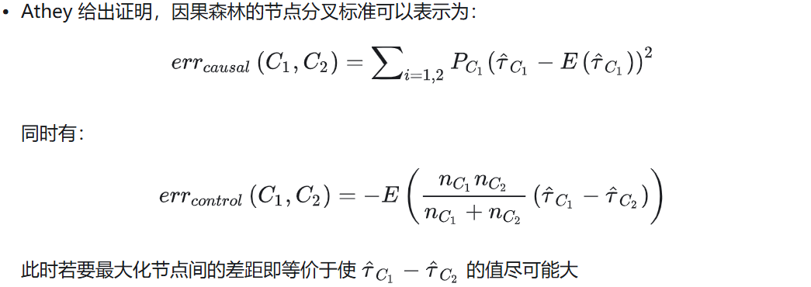

* 另一个与决策树不同的是，有因果树需要满足“诚实”的品质，因此对于样本空间中任意一个个体 i，从样本空间中获得的该个体的观测结果$$Y_i$$仅能用于第一阶段因果树的构建和节点的分裂，或者用于第二阶段计算样本的处理效应，而不能同时用于建树和计算；

* 为了满足因果树这种“诚实”的特征，作者提出了两种算法，双样本树和倾向树。双样本树的思路是从样本空间中随机按照一定比例选取样本（一般默认选取的比例是 50%），并将选取的样本用于建模的训练，也就是第一部分样本仅会用作因果树的生成和节点的分裂；而未被选中的样本数据用于在建树完成后估计处理效应的大小

* 倾向树的思路则是将样本的处理行为视为需要预测的对象，将协变量或者[<span style="color: rgb(36,91,219); background-color: inherit">混淆变量</span>](https://zhida.zhihu.com/search?content_id=244412408\&content_type=Article\&match_order=1\&q=%E6%B7%B7%E6%B7%86%E5%8F%98%E9%87%8F\&zhida_source=entity)用于对是否进行处理行为的预测，在节点内部计算处理效应。

### 5.4.3 因果森林算法原理

&#x20;    我们的目标在于，对于 n 个[<span style="color: rgb(36,91,219); background-color: inherit">独立同分布</span>](https://zhida.zhihu.com/search?content_id=244412408\&content_type=Article\&match_order=1\&q=%E7%8B%AC%E7%AB%8B%E5%90%8C%E5%88%86%E5%B8%83\&zhida_source=entity)的训练样本，准确估计出每个样本 i 的个体和粗粒效应。

* 机器学习模型的一般流程为 : 首先将样本数据进行 shuffle 操作，即随机打散，然后按照合适的比例划分训练集和[<span style="color: rgb(36,91,219); background-color: inherit">测试集</span>](https://zhida.zhihu.com/search?content_id=244412408\&content_type=Article\&match_order=1\&q=%E6%B5%8B%E8%AF%95%E9%9B%86\&zhida_source=entity)，划分比例可以根据实际样本量进行适当调整。大样本量情况下测试集比例可相对较小。一般而言，训练集和测试集比例为 8:2。 接下来，在训练集上训练机器学习模型，将训练好的模型放在测试集上进行测试。如果模型在训练集上表现良好，在测试集上表现很差，此时称为“过拟合”；如果模型在训练集上表现很差 , 称为“欠拟合”。 理想的情况是模型在训练集和测试集上表现都较好 , 此时的模型具有较好的泛化性能。

* 但考虑到估计平均处理效应时 , 每次只能获得潜在结果的一个观测值 , 即 $$Y_i$$(1) 或 $$Y_i$$(0)，因此不能完全按照机器学习的一般流程来训练模型

* 为估计个体效应，还需要进一步严格的假设，即无混淆性假设：在相同$$X_i$$条件下，处理分配变量$$W_i$$独立于潜在结果变量 $$Y_i$$，即：


&#x20;   因此，在指定观测数据点所在的协变量空间中，我们总能找到与之相匹配的归属于对照组或控制组的数据对象（对于因果森林算法而言，匹配模式可以理解为，在根据一定规则进行树的划分之后，在被分配处理变量的数据点所在的叶子上，总能找到与其对应的数据点）

&#x20; 基于无混淆性假设得到的控制组及对照组数据后，最近邻匹配以及其他局部方法通常能得到对于 τ(x) 的一致性估计：

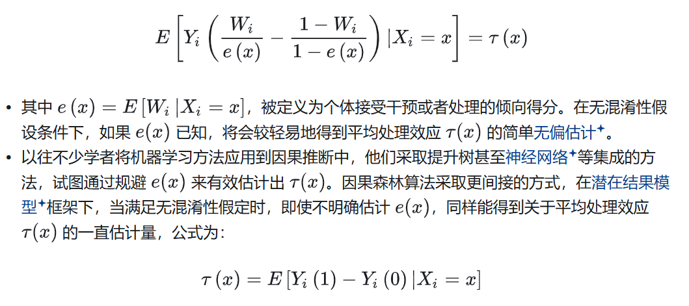

### 5.4.4 因果森林算法过程

&#x20;    以双样本树为例，因果森林算法计算 ITE 的流程如下：

1. 首先采取[<span style="color: rgb(36,91,219); background-color: inherit">无放回抽样</span>](https://zhida.zhihu.com/search?content_id=244412408\&content_type=Article\&match_order=1\&q=%E6%97%A0%E6%94%BE%E5%9B%9E%E6%8A%BD%E6%A0%B7\&zhida_source=entity)的方式从样本空间中随机抽取 n 个子数据集（n 的值由研究者自行决定，默认 n 的占比为 50%），得到 n 个数据集合 {$$a_1,a_2,....,a_n$$}，完成划分后进一步将$$a_i$$分为两个子样本集 b 和样本集 c。

2. 从根节点出发，采用递归的方式建立一棵因果树，当父节点 P 满足节点的分裂标准后分裂为两个子节点$$C_1$$ 和 $$C_2$$，重复上述操作指导不产生新的节点

3. 生成因果树后，对因果树中的每一个叶子节点结算内内部的处理效应

4. 重复以上三步 n 次后获得一个内部由 n 棵树组成的因果森林，综合 n 棵因果树的输出值后得到对应个体的处理效应

&#x20;    由于因果森林有“诚实”的要求，所以子数据集$$a_i$$的两个子样本集只能一部分参与因果树的建立和节点的分裂，另一部分参与处理效应 τ(x) 的计算。此时获得的因果森林具有渐进高斯分布和[<span style="color: rgb(36,91,219); background-color: inherit">参数估计</span>](https://zhida.zhihu.com/search?content_id=244412408\&content_type=Article\&match_order=1\&q=%E5%8F%82%E6%95%B0%E4%BC%B0%E8%AE%A1\&zhida_source=entity)一致性的特征。

&#x20;    因果森林方法实现步骤为：

* 因果森林借鉴随机森林的一般方法，使用 bagging 的方法进行抽样建模，即使用无放回抽样方法从大小为 N 的原始数据集中随机抽取样本量为s

* 基于递归分区的方法生成一棵因果树，即以[<span style="color: rgb(36,91,219); background-color: inherit">基尼系数</span>](https://zhida.zhihu.com/search?content_id=244412408\&content_type=Article\&match_order=1\&q=%E5%9F%BA%E5%B0%BC%E7%B3%BB%E6%95%B0\&zhida_source=entity)为准则 , 基于贪心的方式 , 从根节点开始自顶而下对样本进行划分。需要注意的是 , 因果树采用的是二叉树 , 当满足划分条件时 , 即数据会被分到左子节点 , 否则被划分到右子节点 , 对于子节点采取相同的逻辑进行划分。

* 对于传统的分类回归树 , 我们可能需要指定划分的深度以防止过拟合问题。对于因果树而言 , 在进行树的划分之前 , 需要先将样本分成两份 , 一份用于构造树 , 另一部分用于估计结果 , 即所谓的“诚实树” 。 “诚实树 ” 会一直分裂 , 直至无新的节点产生为止。

* 当因果树生成之后 , 即可用于估计处理效应 , 诚实树得到的个体异质性处理效应的估计量是无偏的 ,并且可以构造有效的[<span style="color: rgb(36,91,219); background-color: inherit">置信区间</span>](https://zhida.zhihu.com/search?content_id=244412408\&content_type=Article\&match_order=1\&q=%E7%BD%AE%E4%BF%A1%E5%8C%BA%E9%97%B4\&zhida_source=entity), 公式如下：

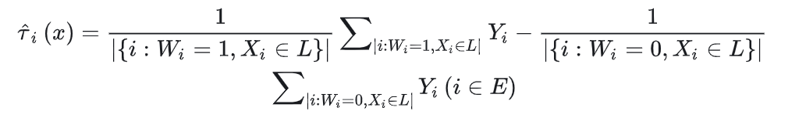

* 上式表示为叶子节点中实验组数据的结果变量均值与对照组数据的结果变量均值的差值，即我们的目标结果——处理效应估计值。

* 单棵树的结果可能受样本划分限制，因此继承继承学习的思想，重复上述程序 B 次，并对 B 棵树的结果取均值得到个体处理效应为：

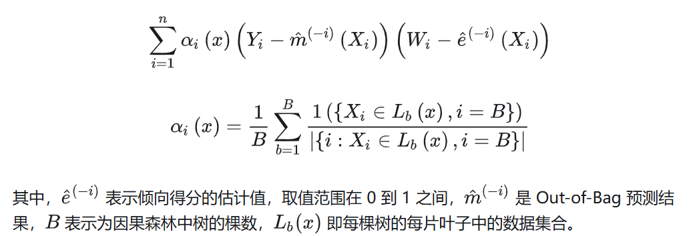

&#x20;   我们建立的因果森林对于个体异质性处理效应的估计的准确性及有效性会受到质疑，当得到模型结果后，还会进行 BLP 检验以评价我们所建立的[<span style="color: rgb(36,91,219); background-color: inherit">因果模型</span>](https://zhida.zhihu.com/search?content_id=244412408\&content_type=Article\&match_order=1\&q=%E5%9B%A0%E6%9E%9C%E6%A8%A1%E5%9E%8B\&zhida_source=entity)对于个体异质性处理效应估计的显著性。

## 5.5 连续因果森林模型的构造与实践

&#x20;  近年来，[<span style="color: rgb(36,91,219); background-color: inherit">因果推断</span>](https://zhida.zhihu.com/search?content_id=173374367\&content_type=Article\&match_order=1\&q=%E5%9B%A0%E6%9E%9C%E6%8E%A8%E6%96%AD\&zhida_source=entity)逐渐成为了机器学习中的热点话题。增益模型（Uplift Model）作为工业界因果推断与机器学习结合最成熟的算法之一，在智能营销中有着广泛的应用。目前大多数增益模型仅讨论了二元处理变量情况下的处理效应估计，然而在网约车市场中存在大量多维、连续的处理变量。针对这一困境，我们构造了连续因果森林模型，并成功地应用在了网约车交易市场策略上。

### *5.5.1&#x20;*&#x524D;言

&#x20;  在网约车供需策略技术基础能力团队，我们最关注的工作之一就是量化价格对网约车供需关系的影响。这对于精细化定价补贴策略的制定和优化有着重要的意义。

&#x20;  在业界，我们称针对某个处理变量(Treatment)，衡量其处理效应(Treatment Effect)的一类模型为增益模型(Uplift Modeling)。

&#x20;  与传统的监督学习模型关注于准确估计响应变量(Y)不同， 增益模型专注于估计处理变量(W)对响应变量(Y)的影响。因此这类问题通常被放在因果推断(Causal Inference)的框架下进行讨论。

&#x20;  目前市面上大多数流行的增益模型框架(如CausalML,pylift,grf)，都很好地支持了二元处理变量(如发券或不发券，吃药或不吃药)的效应估计。但在多元/连续处理变量方面，尚未有很好的支持。

&#x20;  然而，在广大的应用场景中，多元或连续的处理变量更为普遍。例如，价格就是一个[<span style="color: rgb(36,91,219); background-color: inherit">连续变量</span>](https://zhida.zhihu.com/search?content_id=173374367\&content_type=Article\&match_order=1\&q=%E8%BF%9E%E7%BB%AD%E5%8F%98%E9%87%8F\&zhida_source=entity)，存在理论上无限多的可能值。当我们希望估计各个价格点对供需关系的影响的时候，二元处理效应模型的局限性就显露了出来。


<span style="color: rgb(143,149,158); background-color: inherit">图5.5.1 滴滴App截图</span>

&#x20;   针对这种困境，我们开始思考是否可以在因果推断的框架下实现对多元或连续处理变量的效应估计。经过一段时间的开发和测试，在二元因果森林的基础上，我们扩展研发了连续因果森林，初步解决了部分场景下连续变量处理效应的估计问题。

&#x20;   本文主要介绍连续因果森林模型的构建原理及应用，希望对大家在处理相关问题时有所启发和帮助。

### 5.5.2 模型构造

#### 1.因果森林简介

&#x20;    因果森林(Causal Forest)是由Susan Athey、Stefan Wager等人开发，专门估计异质处理效应的机器学习模型，是当前增益模型领域最为流行的算法之一。目前，官方有基于C++/R语言的算法实现([https://grf-labs.github.io/grf](https://link.zhihu.com/?target=https%3A//grf-labs.github.io/grf))。

&#x20;    与其他增益树模型(Tree-based Uplift Model)类似，因果森林以随机森林为基础，通过对[<span style="color: rgb(36,91,219); background-color: inherit">特征空间</span>](https://zhida.zhihu.com/search?content_id=173374367\&content_type=Article\&match_order=1\&q=%E7%89%B9%E5%BE%81%E7%A9%BA%E9%97%B4\&zhida_source=entity)进行重复划分(Recursive Partitioning)，以达到局部特征空间的数据同质/无混淆。在一定的假设下\[3]，我们就可以得到各个维度上异质处理效应(Heterogeneous Treatment Effect)的[<span style="color: rgb(36,91,219); background-color: inherit">无偏估计</span>](https://zhida.zhihu.com/search?content_id=173374367\&content_type=Article\&match_order=1\&q=%E6%97%A0%E5%81%8F%E4%BC%B0%E8%AE%A1\&zhida_source=entity)。

#### 2.二元因果森林

&#x20;   对于二元处理变量，我们对处理效应\[4]做如下定义:

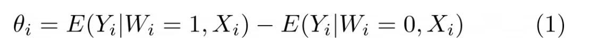

其中

* Y为响应变量,W为处理变量,X为协变量,θ为处理效应

&#x20;   我们称为条件平均处理效应(ConditionalAverageTreatmentEffect)。这里的条件是指，给定局部特征空间下的[<span style="color: rgb(36,91,219); background-color: inherit">平均处理效应</span>](https://zhida.zhihu.com/search?content_id=173374367\&content_type=Article\&match_order=2\&q=%E5%B9%B3%E5%9D%87%E5%A4%84%E7%90%86%E6%95%88%E5%BA%94\&zhida_source=entity)。

&#x20;   下图简略展示了二元因果森林中某一颗决策树的生成逻辑。

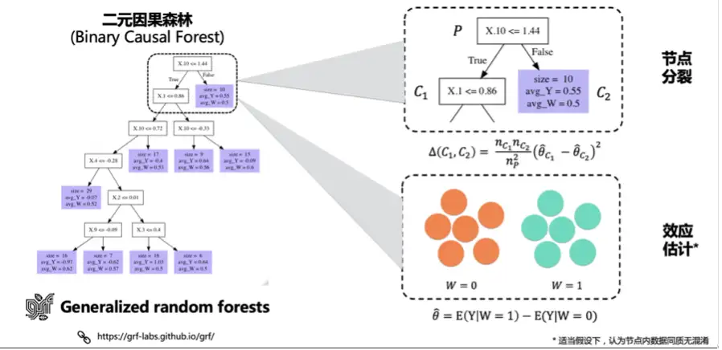

<span style="color: rgb(143,149,158); background-color: inherit">图5.5.2 二元因果森林的构造</span>


定义节点分裂标准为

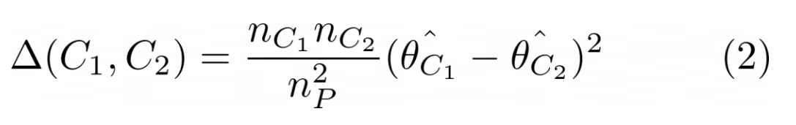

其中P,C: [<span style="color: rgb(36,91,219); background-color: inherit">父节点</span>](https://zhida.zhihu.com/search?content_id=173374367\&content_type=Article\&match_order=1\&q=%E7%88%B6%E8%8A%82%E7%82%B9\&zhida_source=entity)，子节点,n: 样本量,θ: 处理效应

&#x20;   即我们希望从[<span style="color: rgb(36,91,219); background-color: inherit">协变量</span>](https://zhida.zhihu.com/search?content_id=173374367\&content_type=Article\&match_order=2\&q=%E5%8D%8F%E5%8F%98%E9%87%8F\&zhida_source=entity)中，找到一个最优分裂节点，最大化子节点间处理效应差异。

&#x20;   在节点内，我们认为所有样本同质，因此可以应用公式(1)进行处理效应的计算。如此重复分裂，直到满足一些预设的停止条件(节点最小样本值、处理变量不平衡度、最小[<span style="color: rgb(36,91,219); background-color: inherit">信息增益</span>](https://zhida.zhihu.com/search?content_id=173374367\&content_type=Article\&match_order=1\&q=%E4%BF%A1%E6%81%AF%E5%A2%9E%E7%9B%8A\&zhida_source=entity)等)，完成一棵树的构造。

#### 3.基于二元因果森林的多元处理效应估计

&#x20;  不失一般性，我们设多元处理变量W为W=0,1,...,k，其中0为参照(Control)处理值，其余处理值为对照(Treated)处理值。

&#x20;  基于此，我们定义多元处理效应为:

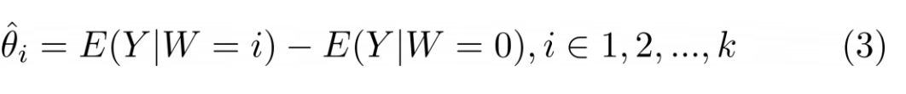

&#x20;  即各个对照处理值相对参照处理值的处理效应。

&#x20;  从上述定义中我们不难发现，对于某个对照处理值，实际上我们仍然还是在计算二元处理变量(i和1)的处理效应。

&#x20;  从这个观察出发，我们可以定义如下简单算法:

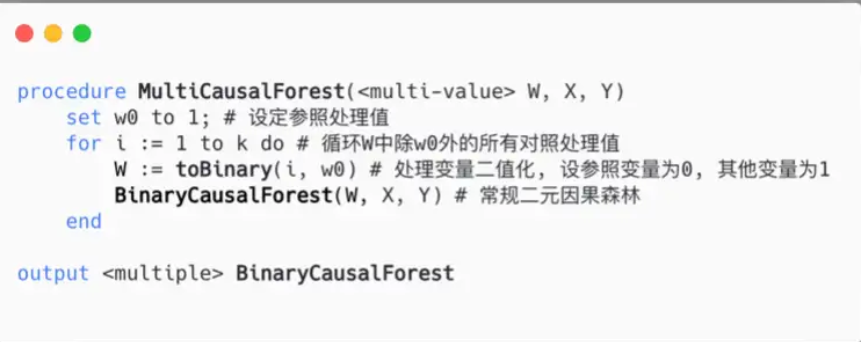

<span style="color: rgb(143,149,158); background-color: inherit">图5.5.3 多重二元因果森林</span>

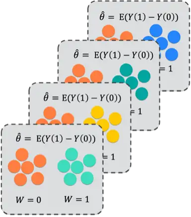

<span style="color: rgb(143,149,158); background-color: inherit">图5.5.4 多元处理效应估计</span>

&#x20;     这样，通过上述的简单改造，我们就可以基于现有的二元处理效应模型，实现多元处理效应的估计。

优点:

* 易于实现，无需额外开发；所有二元处理效应模型均适用；

缺点:

* 当处理变量值较多时，会产生大量模型，增加训练和部署成本；

* 数据利用不充分，单个模型只用到部分($$\frac{2}{k+1}$$)数据；

* 不同处理效应间无关联。这在部分场景中并不合理，例如我们认为价格和供需存在单调关系；

* 无法对未出现在数据集中的对照变量值进行推断

4.连续因果森林

&#x20;   在[<span style="color: rgb(36,91,219); background-color: inherit">定价策略</span>](https://zhida.zhihu.com/search?content_id=173374367\&content_type=Article\&match_order=1\&q=%E5%AE%9A%E4%BB%B7%E7%AD%96%E7%95%A5\&zhida_source=entity)中，所有的模型归根结底都在拟合价格曲线。在需求侧，我们可以合理假设价格曲线具有如下特征:

1. 单调性：价格越高，需求越低 ；

2. 局部线性：在局部价格区间内，价格与需求呈线性关系。

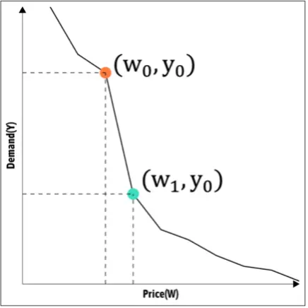

<span style="color: rgb(143,149,158); background-color: inherit">图5.5.5 价格需求曲线</span>

&#x20;    树模型的一个优点在于，在节点内部我们可以自定义统计量的计算方式。

&#x20;    利用价格需求曲线的特性，我们对节点内的样本($$W_1,Y_1$$),($$W_2,Y_2$$),...进行[<span style="color: rgb(36,91,219); background-color: inherit">线性回归</span>](https://zhida.zhihu.com/search?content_id=173374367\&content_type=Article\&match_order=1\&q=%E7%BA%BF%E6%80%A7%E5%9B%9E%E5%BD%92\&zhida_source=entity)，然后以线性回归得到的斜率代表连续处理效应。

&#x20;    基于这个想法，在ATE的基础上，我们定义平均偏效应(AveragePartialEffect)为

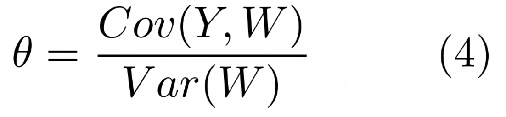

&#x20;   我们可以证明（[https://z.didi.cn/CAPE](https://link.zhihu.com/?target=https%3A//z.didi.cn/CAPE)），上述公式等价于Y对W和做[<span style="color: rgb(36,91,219); background-color: inherit">简单线性回归</span>](https://zhida.zhihu.com/search?content_id=173374367\&content_type=Article\&match_order=1\&q=%E7%AE%80%E5%8D%95%E7%BA%BF%E6%80%A7%E5%9B%9E%E5%BD%92\&zhida_source=entity)后得到的斜率系数。

&#x20;   通过将CAPE代替CATE作为节点统计值用作树分裂，我们就实现了通过单一模型估计多元/连续处理效应。

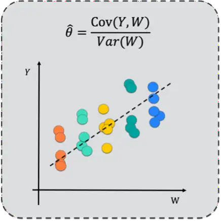

<span style="color: rgb(143,149,158); background-color: inherit">图5.5.6 连续因果森林</span>

&#x20;    在模型的预估/推断阶段，为了跳脱出[<span style="color: rgb(36,91,219); background-color: inherit">线性假设</span>](https://zhida.zhihu.com/search?content_id=173374367\&content_type=Article\&match_order=1\&q=%E7%BA%BF%E6%80%A7%E5%81%87%E8%AE%BE\&zhida_source=entity)的约束， 在估计各个对照处理效应的时候，我们退回之前的定义，仅选取对应的对照/参照变量值样本计算对应的处理效应。

&#x20;    因此在我们的连续因果森林模型中，整体的CAPE仅被用作分裂，不会用于效应估计。

&#x20;    优点：

1. 考虑了不同处理效应间的关系

2. 充分利用数据，不同处理变量间可以互相学习

3. 单一模型，减少训练/部署成本

&#x20;    缺点：使用中需考察线性假设的合理性

### *5.5.3&#x20;*&#x8BC4;估与应用

&#x20;    在离线指标上，我们选择了Qini Score作为评估标准，分别比较多重二元因果森林模型和连续因果森林模型的效果。

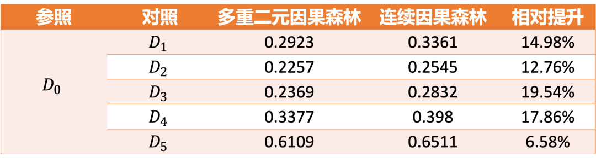

<span style="color: rgb(143,149,158); background-color: inherit">图5.5.7 连续因果森林</span>

&#x20;   基于此，我们上线了基于连续因果森林的定价策略。经过多周的在线AB实验后，取得了15%+的ROI收益。

&#x20;   目前连续因果森林已作为智能主策略覆盖了全国大部分城市。


### 5.5.4 总结与展望

&#x20;   基于一个新的指标(CAPE)，我们构造了连续因果森林，成功地将多元/连续处理效应纳入单一模型进行估计，并取得了显著的离线和在线结果。

&#x20;   目前连续因果森林仍处于早期的开发阶段，存在大量的优化空间。例如:

1. 可否使用非线性假设

2. 如何处理无单调关系的处理变量(如不同套餐)

3. 如何估计多维处理效应(如多个产品线价格间的相互影响)

&#x20;   其中的部分问题，我们在一些离线实验上已有令人期待的结果。期望在不久的将来能够与大家分享。

### *5.5.5&#x20;*&#x8BF4;明

\[1] 常见的假设为: Unconfoundedness, Exchangeability, Positivity

\[2] 为了方便说明，我们省略了local centering的处理。


## 5.6 文献参考：

\[1]刘光园.“一带一路”倡议与中国企业[<span style="color: rgb(36,91,219); background-color: inherit">全要素生产率</span>](https://zhida.zhihu.com/search?content_id=244412408\&content_type=Article\&match_order=1\&q=%E5%85%A8%E8%A6%81%E7%B4%A0%E7%94%9F%E4%BA%A7%E7%8E%87\&zhida_source=entity)\[D].东北财经大学,2020.DOI: 10.27006/d.cnki.gdbcu.2020.000364.

\[2]周静修.基于因果森林的连续处理效应估计方法研究及应用\[D].[<span style="color: rgb(36,91,219); background-color: inherit">西南财经大学</span>](https://zhida.zhihu.com/search?content_id=244412408\&content_type=Article\&match_order=1\&q=%E8%A5%BF%E5%8D%97%E8%B4%A2%E7%BB%8F%E5%A4%A7%E5%AD%A6\&zhida_source=entity),2022.DOI:10.27412/d.cnki.gxncu.2022.001955.

\[3] Susan Athey and Stefan Wager. Estimating Treatment Effects with Causal Forests: An Application. Observational Studies, 5, 2019.

\[4] Susan Athey, Julie Tibshirani and Stefan Wager. Generalized Random Forests. Annals of Statistics, 47(2), 2019.

$$a_i$$

# 六、双重机器学习（DML）

&#x20;  今天要说的主题是：一种结合机器学习做因果推断任务的算法，学术名叫Double Machine Learning（DML），双重机器学习。

&#x20;  围绕DML，本文将首先介绍DML的算法原理；然后使用简单的模拟数据手动实现该算法，并和已有的工具包做对比，以此加深对该算法的理解；在此基础上，针对更实际的案例，尝试求解物理意义更强的因果推断问题。

## 6.1 DML算法原理

### 6.1.1 问题阐述

&#x20;   先回顾一下潜在因果框架中因果推断问题的定义：样本数据集为：D={$$d_1,d_2,d_3,....,d_n$$},n 为样本数量；策略变量为T ∈ { 0 , 1 } ,T=0表示不施加策略，T = 1表示施加策略；协变量X，一般指与策略无关的变量；结果变量Y：$$Y_0i$$ 表示无策略时第i个样本的结果变量，$$Y_1i$$ 表示有策略时第i个样本的结果变量。目标是：基于数据集D= {{$$(T_i,X_i,Y_i)^n$$ ,估计T和Y之间的因果效应。

&#x20;   在这个定义里面，有个前提假设很容易不满足，那就是X和T无关。一方面，在寻找X时，很难确认X和T无关。举个例子，我们想知道冰淇淋的价格与销量间的因果效应，此处T是价格，Y是销量。X很容易想到有：当时的天气温度、当地的生活水平等等。但当地的生活水平和价格之间大概率是正相关的，比如同一款巧乐兹在北京卖的价格和十八线小城市的价格，大概率是有差别的。

&#x20;  另一方面，为了更全面考虑问题，变量X中会纳入尽可能多的特征，而特征越多，就越难保证其和策略变量T是否相关。

&#x20;  当X和T相关后，就会产生混淆变量W，该类变量既影响Y，又影响T，如下图所示。

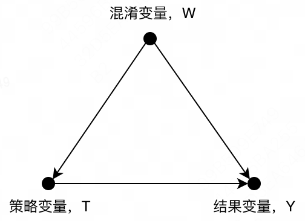

&#x20;  在此情况下，要得到T和Y之间纯净的因果效应就更难了。


### 6.1.2 FWL定理

&#x20;  为了解决包含混淆变量的因果推断问题，本节开始，将介绍一种被称为双重机器学习的算法，英文是：Double Machine Learning (DML)。

&#x20;  为了更丝滑地引入DML，需要先了解一下Frisch-Waugh-Lovell（FWL）定理。该定理的详细内容和证明我附在了文章最后的链接中，其核心想要描述的是：

&#x20;  针对如下的线性模型:

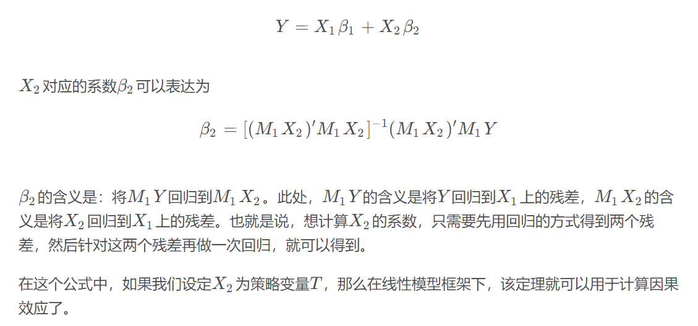

### 6.1.3 DML算法

&#x20;  但在更多的因果推断问题中，W和T、Y之间并非线性关系，FWL定理好像就没法直接用了，那又该怎么办呢？那就到DML算法的主场了。

&#x20;  该算法考虑如下一种线性模型：

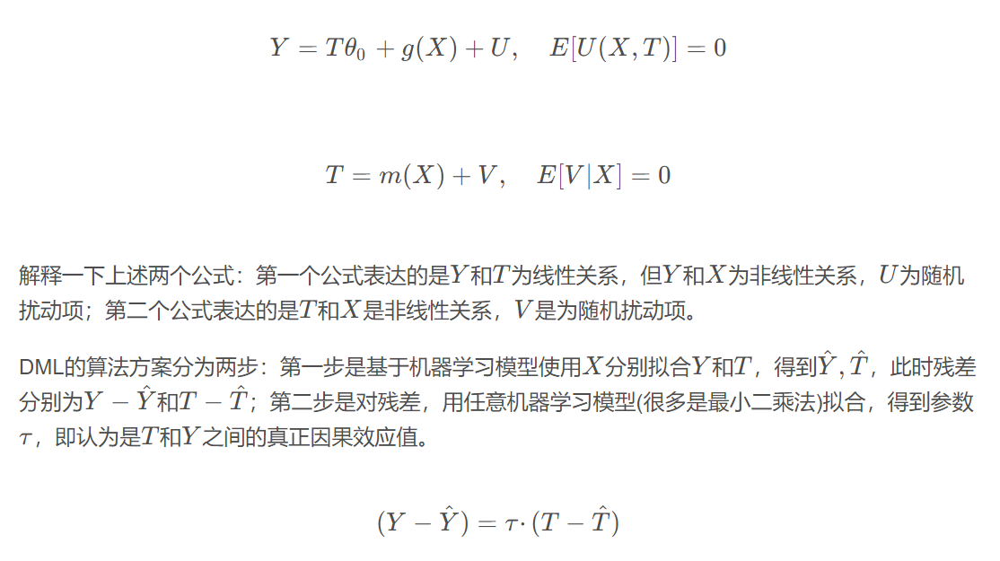

&#x20;  有了FWL定理的过渡，DML算法理解起来并不难，不过有2点需要额外说明：

(1) DML算法的原文是：Double/debiased machine learning for treatment and structural parameters，文章很长，我花了很长时间，也没搞的很懂，B站上和CSDN上都有关于这篇文章的部分讲解，有兴趣的可以参考一下。

(2) DML有个基本假设是：T和Y之间是线性关系。所以如果T不是0/1变量，而是个连续值，那么得到的因果效应值仅在T附近有效。例如在上文提到的冰淇淋价格和销量的因果推断问题中，T是价格，Y是销量，设定τ = 2，我们可以说价格减少1个单位后销量能增加2个单位，但如果价格减少10个单位，就不能确认销量是否可以增加20个单位。


## 6.2 DML代码实现

&#x20;   本节通过两个实例，描述如何将DML应用于求解实际的业务问题。考虑到DML其中一种版本——因果森林DML，在业界很常用，本文也会更多关注因果森林DML的实践应用。

### 6.2.1 策略变量为0/1变量

&#x20;  策略变量为0/1变量是标准的因果推断问题，所以从这类问题入手比较适合。

&#x20;  本节的问题实例是个虚拟的合成数据，实现函数是causalml.dataset.synthetic\_data，这是causalml自带的数据集，而causalml是Uber开源的因果推断工具包，未来肯定还会经常遇到它。

&#x20;  针对这个问题实例，下面的代码分别使用三种策略实现因果森林DML的技术方案：

(1) 自己编写代码实现。在计算Y YY和T TT的残差时，使用sklearn.ensemble.RandomForestRegressor；在拟合残差时，使用sklearn.linear\_model.LinearRegression。

(2) 工具包+手动设置机器学习模型。工具包使用econml.dml.DML，然后依次设置计算残差和残差拟合的机器学习模型。

(3) 工具包一键完成。直接调用econml.dml.CausalForestDML。

&#x20;  这里的工具包需要单独描述一下。econml是微软开源的因果推断工具包，没有继续使用causalml，是因为causalml中暂时还不支持DML。在econml中，DML可以理解为一个简单框架，允许用户自行设置每个步骤上的机器学习模型；CausalForestDML可以理解为一个已经集成好的因果森林DML。

```plain&#x20;text
import pandas as pd
from causalml.metrics import auuc_score, plot_gain
from sklearn.ensemble import RandomForestRegressor
from sklearn.linear_model import LinearRegression
from causalml.dataset import synthetic_data
from econml.dml import CausalForestDML, DML


# 自编代码实现因果森林DML
def algo_by_self_cf_dml(y, treat, X):
    # 计算y的残差
    rf_y = RandomForestRegressor()
    rf_y.fit(X, y)
    y_res = y - rf_y.predict(X)

    # 计算treat的残差
    rf_t = RandomForestRegressor()
    rf_t.fit(X, treat)
    treat_res = treat - rf_t.predict(X)

    # 计算因果效果
    lr = LinearRegression(fit_intercept=False).fit(treat_res.reshape(-1, 1), y_res.reshape(-1, 1))
    print('self_cf_dml: w = {:.2f}'.format(lr.coef_[0, 0]))


# econml工具包实现因果森林DML
def algo_by_econml_dml(y, treat, X):
    # dml + 手动设置
    dml = DML(model_y=RandomForestRegressor(),
              model_t=RandomForestRegressor(),
              model_final=LinearRegression(fit_intercept=False))
    dml.fit(y, treat, X=X)
    print('DML: {}'.format(dml.ate(X)))

    # 因果森林DML
    cf_dml = CausalForestDML()
    cf_dml.fit(y, treat, X=X)
    print('CausalForestDML: {}'.format(cf_dml.ate(X)))

    return dml, cf_dml


# 计算AUUC和绘制gain曲线
def auuc_score_and_plot(y, treat, X, dml, cf_dml):

    # 使用dataframe组织计算AUUC的必要数据
    df = pd.DataFrame({
        'y': y,
        'treat': treat,
        'cf_dml': cf_dml.effect(X),
        'dml': dml.effect(X)
    })

    # 计算AUUC值
    auuc = auuc_score(df, outcome_col='y', treatment_col='treat', normalize=True, tmle=False)
    print(auuc)

    # 绘制gain曲线
    plot_gain(df, outcome_col='y', treatment_col='treat', normalize=True, random_seed=10, n=100, figsize=(8, 8))


if __name__ == '__main__':
    # 使用synthetic_data生成数据
    y, X, treat, _, _, _ = synthetic_data(mode=1, n=10000, p=8, sigma=1.0)

    # 自编代码实现因果森林DML
    algo_by_self_cf_dml(y, treat, X)

    # econml工具包实现因果森林DML
    dml, cf_dml = algo_by_econml_dml(y, treat, X)

    # 计算AUUC和绘制gain曲线
    auuc_score_and_plot(y, treat, X, dml, cf_dml)
```

&#x20;  使用多种策略实现因果森林DML，最重要的价值是可以加深对DML算法原理和工具包的理解。结合实践过程和以下的输出结果，可以发现一些新认知：

（1) 前文介绍的DML算法原理中，直接求解得到的τ，看起来应该是平均因果效应ATE。至于如何使用τ去预测新样本的个体因果效应ITE，并没有提到；但在econml.dml中，dml.effect(X)却可以得到ITE。

(2) 从ATE的计算结果上可以看出，三种策略的结果是相似的，说明对DML算法原理的认知是没有多大问题的；第二种策略和第三种策略得到的结果并不完全相同，说明econml.dml.CausalForestDML相比econml.dml.DML，在代码层面还存在一些不同。

(3) 从auuc的结果来看，econml.dml.CausalForestDML的表现显著优于econml.dml.DML。但由于数据是虚拟的，下钻分析的意义不大，就不继续深入了。

&#x20;  关于auuc的计算还需要再描述一下。目前econml不支持针对auuc的计算和绘图，但是causalml可以。所以在代码中，我用到了 causalml.metrics.auuc\_score和plot\_gain这两个函数。这两个函数需要的数据，至少是2列：第1列是Y值，第2列是T值，其他的列都会被认为是不同模型输出的因果效应值，然后分别评估和输出。

```go
self_cf_dml: w = 0.47
DML: 0.48424327569296155
CausalForestDML: 0.4705562443255083
cf_dml    0.716144
dml       0.505681
Random    0.498693
dtype: float64
```

### 6.2.2 策略变量为连续变量

&#x20;  通过上一节的实例，我们应该对因果森林DML有一个比较直观的感受了。本节尝试使用该模型解决一个业务场景中经常遇到的问题实例：推断商品价格和销量之间的因果效应。

&#x20;  本节实例的数据来源是kaggle竞赛中提供的在线零售销售数据。train\_test\_date\_split函数参考其他内容对原始数据做了预处理，这部分的内容和因果森林DML无关，可以略过其中的逻辑细节（感兴趣的小伙伴可以在相关阅读中找到链接）。

&#x20; 为了将原问题转化为因果推断问题，需要设置：Y为销量的对数，T为价格的对数，X包括：month、DoM、DoW、stock\_age\_days和sku\_avg\_p。

&#x20;  Y和T需要取对数的原因是：价格和销量间的关系大致应该为

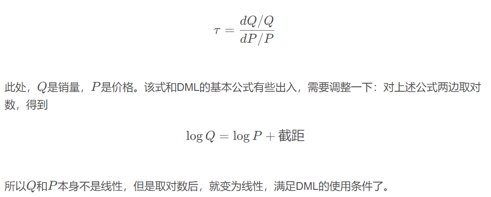

&#x20;  X的维度不多，如果在实际场景中，大概率还会包含商品的信息特征、用户历史购买特征等，本节的主要目标不在于精确给出其因果效应值，而是展现完整的计算过程，所以可以接受特征维度不那么全面的现状。

&#x20;  有了训练集后，使用因果森林DML进行训练，这个过程比较简单，一行代码便可以解决，就不赘述了。

&#x20;  得到模型后，依然需要使用auuc去验证模型的效果。不过在这里尤其需要注意两个方面：

(1) plot\_gain和auuc\_score中使用的treat只能接受0/1变量，而当前场景中价格是连续变量。代码里设置的逻辑是：logP<0认为是1，反之是0，物理意义可以理解为1为降价，0为不降价。

(2) 价格和销量间的因果效应值为负数，所以在传入auuc计算时，需要先取负号，将其转为正数。

```go
import pandas as pd
import numpy as np
from datetime import datetime, date
from causalml.metrics import plot_gain, auuc_score
from sklearn.model_selection import train_test_split
from econml.dml import CausalForestDML


def train_test_date_split():
    # 数据预处理
    df = pd.read_csv('OnlineRetail.csv', encoding="unicode_escape")
    df = df[(df['UnitPrice'] > 0) & (df['Quantity'] > 0)].reset_index(drop=True)
    df = df[~df.StockCode.isin(['POST', 'DOT', 'M', 'AMAZONFEE', 'BANK CHARGES', 'C2', 'S'])]
    df['InvoiceDate'] = pd.to_datetime(df.InvoiceDate)
    df['Date'] = pd.to_datetime(df.InvoiceDate.dt.date)
    df['revenue'] = df.Quantity * df.UnitPrice
    df = (
        df.assign(dNormalPrice=lambda d: d.UnitPrice / d.groupby('StockCode').UnitPrice.transform('median')
                  ).pipe(lambda d: d[(d['dNormalPrice'] > 1. / 3) & (d['dNormalPrice'] < 3.)]
                         ).drop(columns=['dNormalPrice'])
    )
    df = df.groupby(['Date', 'StockCode', 'Country'], as_index=False).agg({
        'Description': 'first',
        'Quantity': 'sum',
        'revenue': 'sum'
    })
    df['Description'] = df.groupby('StockCode').Description.transform('first')
    df['UnitPrice'] = df['revenue'] / df['Quantity']
    df_dml = df[(df.groupby('StockCode').UnitPrice.transform('std') > 0)]
    df_dml = df_dml.assign(
        LnP=np.log(df_dml['UnitPrice']),
        LnQ=np.log(df_dml['Quantity']),
    )
    df_dml['dLnP'] = np.log(df_dml.UnitPrice) - np.log(df_dml.groupby('StockCode').UnitPrice.transform('mean'))
    df_dml['dLnQ'] = np.log(df_dml.Quantity) - np.log(df_dml.groupby('StockCode').Quantity.transform('mean'))
    df_dml = df_dml.assign(
        month=lambda d: d.Date.dt.month,
        DoM=lambda d: d.Date.dt.day,
        DoW=lambda d: d.Date.dt.weekday,
        stock_age_days=lambda d: (d.Date - d.groupby('StockCode').Date.transform('min')).dt.days,
        sku_avg_p=lambda d: d.groupby('StockCode').UnitPrice.transform('median')
    )
    y = df_dml['dLnQ']
    treat = df_dml['dLnP']
    X = df_dml[['month', 'DoM', 'DoW', 'stock_age_days', 'sku_avg_p']]

    y_train, y_test, treat_train, treat_test, X_train, X_test = train_test_split(y, treat, X, test_size=.2)

    return X_train, y_train, treat_train, X_test, y_test, treat_test


if name == '__main__':
    # 整合训练和测试数据
    X_train, y_train, treat_train, X_test, y_test, treat_test = train_test_date_split()

    # 因果森林DML训练
    cf_dml = CausalForestDML(n_jobs=1).fit(y_train, treat_train, X=X_train)

    # AUUC评估训练集效果
    train_df = pd.DataFrame({
        'y': y_train,
        'treat': np.where(treat_train.values < 0, 1, 0),
        'cf_dml': -cf_dml.effect(X_train)
    })
    plot_gain(train_df, outcome_col='y', treatment_col='treat', normalize=True, random_seed=10, n=100, figsize=(8, 8))
    auuc = auuc_score(train_df, outcome_col='y', treatment_col='treat', normalize=True, tmle=False)
    print('train set auuc:')
    print(auuc)

    # AUUC评估测试集效果
    test_df = pd.DataFrame({
        'y': y_test,
        'treat': np.where(treat_test.values < 0, 1, 0),
        'cf_dml': -cf_dml.effect(X_test)
    })
    plot_gain(test_df, outcome_col='y', treatment_col='treat', normalize=True, random_seed=10, n=100, figsize=(8, 8))
    auuc = auuc_score(test_df, outcome_col='y', treatment_col='treat', normalize=True, tmle=False)
    print('\ntest set auuc:')
    print(auuc)
```

&#x20;  以下是代码的输出结果。从结果上来看，模型的auuc优于随机排序的auuc，同时测试集的auuc略低于训练集的auuc，整体上来看是符合预期的。

```go
train set auuc:
cf_dml    0.691234
Random    0.500072
dtype: float64

test set auuc:
cf_dml    0.623231
Random    0.499888
dtype: float64
```

## 6.3 总结

&#x20;  文章正文到此就结束了，本节总结一下三个比较重要的内容：

(1) DML的原理是：基于对结果变量和策略变量残差的拟合，可以得到真正的因果效应值。

(2) econml工具包可以调用DML和因果森林DML算法。

(3) 使用auuc评估DML的预测效果时，可以调用causalml工具包。


## 6.4 相关阅读

DML算法原文：https://academic.oup.com/ectj/article/21/1/C1/5056401?login=false

DML算法原理讲解1：https://academic.oup.com/ectj/article/21/1/C1/5056401?login=false

DML算法原理讲解2：https://blog.csdn.net/a358463121/article/details/123999934

DML实例1：https://cloud.tencent.com/developer/article/191386

DML实例2：https://cloud.tencent.com/developer/article/193813

FWL定理：https://www.bilibili.com/video/BV1dA411H7nP/?spm\_id\_from=333.788\&vd\_source=f416a5e7c4817e8efccf51f2c8a2c70

在线零售销售数据：https://www.kaggle.com/datasets/vijayuv/onlineretail

销售数据预处理：https://github.com/Serena-TT/36-methods-for-data-analysis/blob/main/DML.ipynb


&#x20;                         &#x20;

