## &#x20;

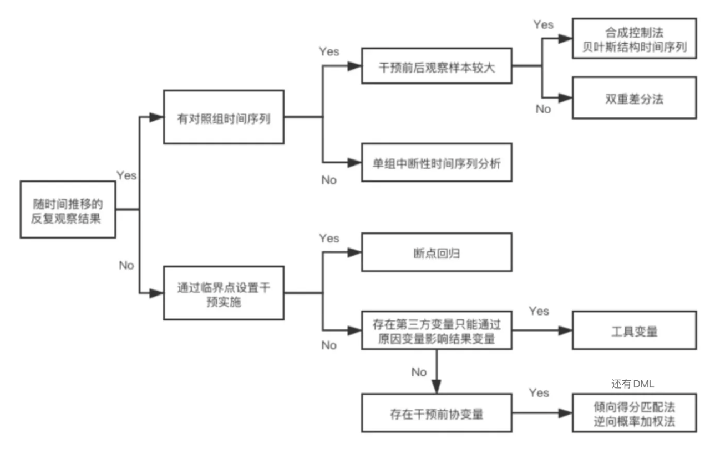

## 因果图和虚拟事实

[因果推断笔记（三）上—— 相关理论：Rubin Potential、Pearl](https://zhuanlan.zhihu.com/p/559743601)

## 基于观测/实验数据的因果推断技术

### 双重机器学习 DML

DML是一种处理**基于观测数据进行因果建模**的方法

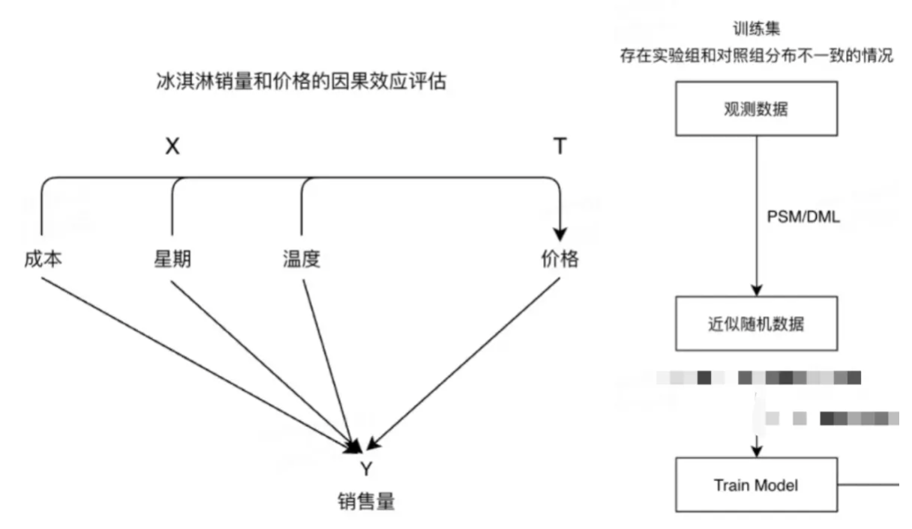

#### 基本思想

通过**混淆变量X**对**处理变量T**和**观测变量Y**进行拟合，而后计算得到残差，这一步目的为从处理变量和观测变量排除掉混淆变量的信息。利用排除掉混淆变量信息的处理变量的残差和观测变量的残差进行建模，利用处理变量的残差对观测变量的残差进行拟合，寻找处理变量的残差和观测变量的残差之间的关系，进而计算ATE和Cate

#### 详细过程

1、步骤一 用任意ML模型，利用X来拟合Y和T，得到残差

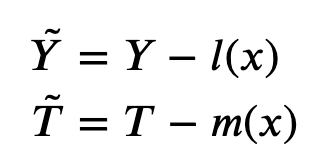

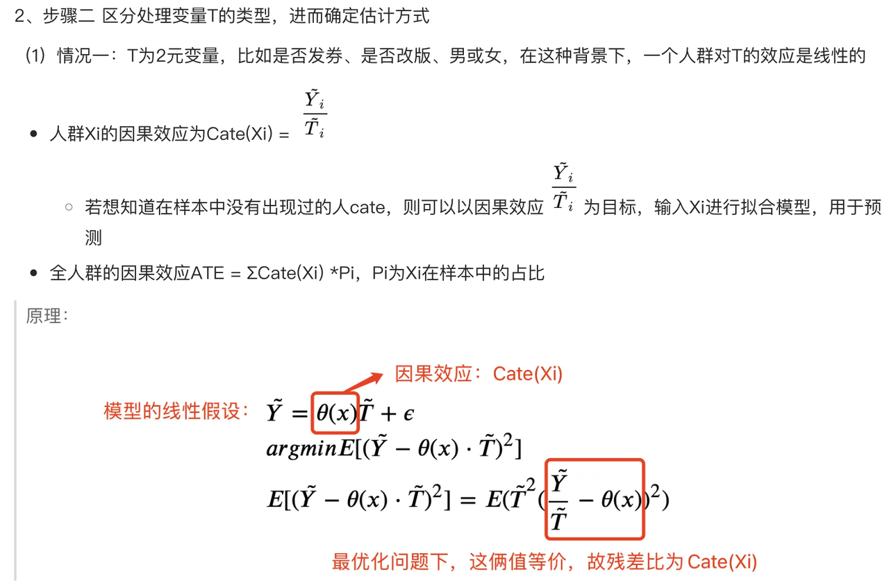

（2）情况二：T为>=2元变量，比如降价（降价$2、$3、$4），在这种背景下，一个人群对T的效应是有可能是非线性的（比如：对于大牌商品降价太多，会被认为低质量，销量可能更低）

* 用任意ML模型，利用X和T的残差对Y的残差进行拟合，得到模型

* 人群Xi的因果效应为**Cate(Xi) = ML(Xi, Ti的残差=a) - ML(Xi, Ti的残差=b)**

  * Xi中包含商品的原价

  * 其中T的残差为T和X的函数

  * 若要观察降价$4的因果效应，则上述a=$4，b=0

  * 若要观察降价$4对比降价$2的因果效应，则上述a=$4，b=$2

* 全人群的因果效应ATE = ∑Cate(Xi) \*Pi，Pi为Xi在样本中的占比&#x20;

3、降低过拟合的风险

假设有一个因果推断问题，想要知道增加一个卧室（处理或干预）会对房价（结果）产生多大的影响，同时考虑其他可能的混淆因素（如面积、地理位置等）。目前有一个包含10000个房源的数据集，每个房源有10个特征（如面积、卧室数量、地理位置等），以及房价（你要预测的目标变量）

我们打算使用双重机器学习（DML）方法，它在第一步使用机器学习模型来控制混淆变量，在第二步使用线性回归模型来估计卧室数量对房价的影响。为了解决机器学习模型的过拟合问题，我们将应用Cross Fitting。

1. &#x20;将数据集随机分为两个等大小的子集，每个子集包含5000个房源的数据。&#x20;

2. &#x20;在第一个子集上训练一个机器学习模型（例如随机森林），基于其他特征（面积、地理位置等），预测房价和卧室数量。然后，我们在第二个子集上应用这个模型，计算预测值，并使用预测值和实际值计算残差。&#x20;

3. &#x20;我们同样在第二个子集上训练一个机器学习模型，然后在第一个子集上应用这个模型，计算预测值，并使用预测值和实际值计算残差。&#x20;

4. &#x20;现在，我们在每个子集上都有一组处理变量（卧室数量）和结果变量（房价）的残差。我们可以在每个子集上使用这些残差进行线性回归，得到卧室数量对房价影响的估计（分别拟合得到两个模型）。&#x20;

5. &#x20;最后，我们可以计算这两个估计的平均值，得到最终的估计。如果需要，我们还可以计算这两个估计的方差或置信区间。&#x20;

通过这种方法，我们可以消除机器学习模型的过拟合影响，并得到一个对因果关系的无偏估计（主要来源于正交）。

#### DML的附录

[【因果推断/uplift建模】Double Machine Learning(DML)](https://zhuanlan.zhihu.com/p/401010271)

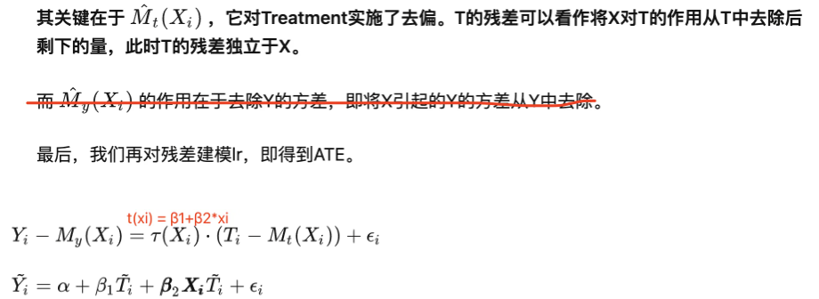

[AB实验人群定向HTE模型4 - Double Machine Learning - 风雨中的小七 - 博客园](https://www.cnblogs.com/gogoSandy/p/12285168.html)

双重机器学习（Double Machine Learning, DML）是一种在高维设定下进行因果推断的方法。它的基本思想是利用现代的机器学习方法来处理混淆变量的高维性，同时保持了统计的一致性和有效性。

**原理：**

首先，双重机器学习**假设所有的混淆变量都可以被观测**。混淆变量是那些同时影响处理变量和结果变量的变量，如果有混淆变量不能被观测，那么我们就无法通过调整这些变量来估计处理效应的无偏估计。

接着，双重机器学习利用机器学习的正则化过程来进行高维变量选择。在高维设定下，传统的统计方法可能因为维数诅咒（curse of dimensionality）而失效（空间稀疏、计算复杂度、过拟合问题）。而现代的机器学习方法，如Lasso和随机森林，可以处理高维数据，并通过正则化过程自动进行变量选择。

然后，双重机器学习利用类似于Frisch-Waugh-Lovell定理的思想来解决正则化带来的偏差。Frisch-Waugh-Lovell定理告诉我们，我们可以通过对处理变量和结果变量进行正交化，来消除混淆变量的影响。在双重机器学习中，我们首先使用机器学习方法对混淆变量进行预测（label为处理变量与结果变量，特征为混淆变量），然后对预测结果进行残差化，得到处理变量和结果变量的正交化版本（正交补空间，消除了线形相关性）。这个过程可以消除混淆变量的影响，从而消除正则化带来的偏差。

最后，双重机器学习使用一个简单的线性模型来估计处理效应。由于处理变量和结果变量已经被正交化，因此这个线性模型的系数就是处理效应的无偏估计。

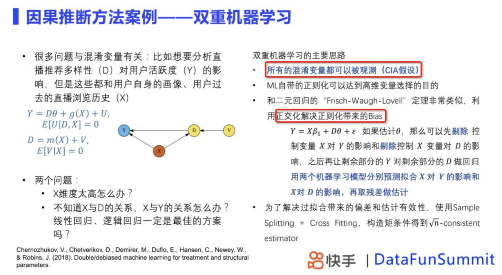

**具体应用：**

在具体应用中，还会存在ML模型下存在偏差和估计有效性的问题，这个时候可以通过Sample Splitting 和 Cross Fitting的方式来解决，具体做法是我们把数据分成一个训练集和估计集，在训练集上我们分别使用机器学习来拟合影响，在估计集上我们根据拟合得到的函数来做残差的估计，通过这种方法，可以对偏差进行修正。在偏差修正的基础上，我们可以对整个估计方法去构造一个moment condition，得到置信区间的推断，从而得到一个有良好统计的估计

### 倾向性得分匹配 PSM

PSM（Propensity Score Matching）的原理是通过匹配处理组和对照组之间的潜在概率得分（即倾向得分或倾向分数），将处理组与最相似的对照组进行配对，以消除处理选择对因果估计的影响。

**原理：**

PSM方法的核心原理是根据个体的特征（协变量）来估计一个概率得分，即倾向得分（通常label为是否分配到实验组）。倾向得分反映了个体被分配到处理组的概率，基于个体的特征，而不是实际的处理状态。然后，通过匹配或权重的方式（1v1最近邻匹配、1vn核方法等），将处理组与对照组中具有相似倾向得分的个体进行配对。

配对后，我们可以比较配对的处理组和对照组的结果，来得出处理的因果效应。这样做的目的是在其他条件相等的情况下，比较处理组和对照组之间的差异，将处理效应与处理选择偏差分开。

**重要前提假设：**

1. &#x20;**无偏性假设（Ignorability Assumption）：** 假设在给定协变量的条件下，处理组和对照组之间的结果差异仅由处理状态引起，而与未观察到的个体特征无关。&#x20;

2. &#x20;**正确模型假设：** 假设倾向得分模型是正确的，即它可以准确地捕捉处理分配与协变量之间的关系。&#x20;

**步骤【柴】：**

* 是否合适使用PSM：从逻辑上可判断有一部分用户无感知到策略

* 倾向分预测

* 匹配（1v1匹配的话不用加权）

* 趋势检验/共变量的拟合优度卡方检验（要求同分布），通过

* diff计算（did为下述的简易方法或直接做差？）

[AB实验的高端玩法系列3 - AB组不随机？观测试验？Propensity Score - 风雨中的小七 - 博客园](https://www.cnblogs.com/gogoSandy/p/11796536.html)重点看例子

首先，得有个背景，是存在不被策略干扰的池子，才有用PSM的可能性

其次，符合上述背景的前提下，必须预测精度够高，才能减少偏差，若不符合上述背景，讨论PSM无意义

最后，解决偏差也可以配合PSM和DID一起用

### 双重差分法 DID

双重差分法（Difference-in-Differences，简称 DID）核心思想是比较处理组和对照组在处理前后的结果变化，从而控制了随时间不变的混淆因素，并估计出处理的因果效应。

**原理：**

DiD方法的基本原理可以用一个简单的数学公式来表示：

DiD效应 = (处理组处理后结果 - 处理组处理前结果) - (对照组处理后结果 - 对照组处理前结果)

假设我们有两个时间点（处理前和处理后）和两组（处理组和对照组）的数据。在DiD中，我们比较了处理前后的结果变化，同时对照了对照组的结果变化。因为处理组和对照组在处理前的结果变化趋势应该是相似的（平行趋势假设），任何处理后两组之间的差异，我们都可以归因于处理的效应。若不满足平行趋势假设，则不确定两组之间的差异是否可以归因于处理的效应（混淆因子带来的效应不同，无法评估）

**重要前提假设——平行趋势假设：** 这是DiD方法的核心假设。平行趋势假设认为在没有处理的情况下，处理组和对照组在处理前的结果变化趋势是一样的。这意味着处理组和对照组在处理前的结果变化趋势是相似的，时间趋势所驱动的，除了处理引起的额外效应。如果平行趋势假设不成立，DiD估计可能会有偏误。&#x20;

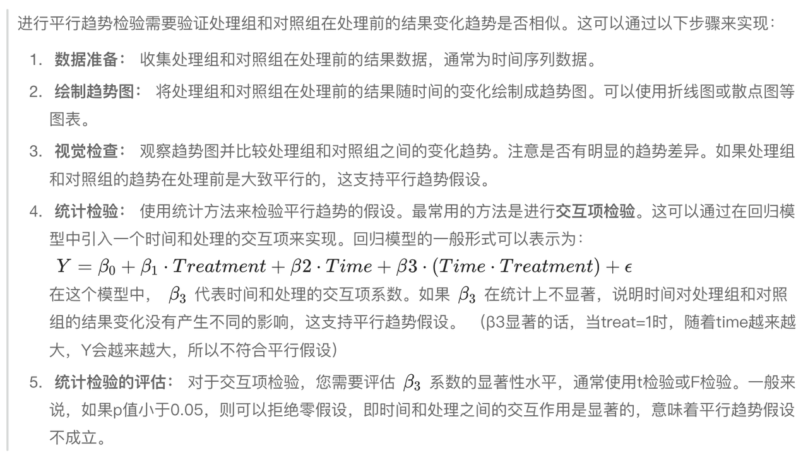

### 三重差分法 DDD

[Stata: 三重差分模型简介](https://zhuanlan.zhihu.com/p/96690721)

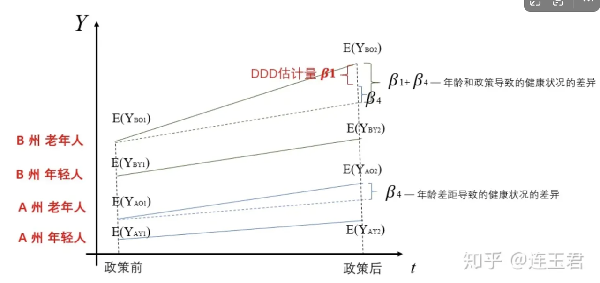

### PSM或合成控制法 + DID

若使用DID时不满足平行趋势假设，使用尝试使用PSM方法构造对照组

倾向评分匹配（PSM）和差分法（DiD）是两种不同的因果推断方法，它们各自有其优点和缺点。PSM通过平衡处理组和对照组在观察到的协变量(混淆因子)上的分布，尽可能地模仿随机实验的情况。然而，PSM只能控制观察到的协变量，对于未观察到的协变量，PSM无法进行平衡——因此匹配出来的对照组可能与实验组的趋势平行但不重合。而DiD方法可以控制那些在时间中不变但在个体间可能有所不同的未观察到的协变量，也就是固定效应。

当我们将PSM和DiD结合使用时，可以充分利用两种方法的优点。首先，PSM可以帮助我们在观察到的协变量上平衡处理组和对照组，从而减少这些协变量的混淆影响。然后，DiD方法可以进一步消除那些固定效应的影响，从而得到更准确的因果效应估计。

1. PSM模拟出来的组跟实验组的线重合 -- 认为同质可比，不用DID直接对比的到因果效应

2. PSM模拟出来的直线跟实验组的线不太重合，但满足平衡趋势 -- 认为还存在部分未观测到的协变量影响了结果，+ DID进行评估

3. PSM模拟出来的直接跟实验组的线不重合也不满足平行趋势，PSM的模型精度不高，需要重新训练，或者换另一种因果推断的方法

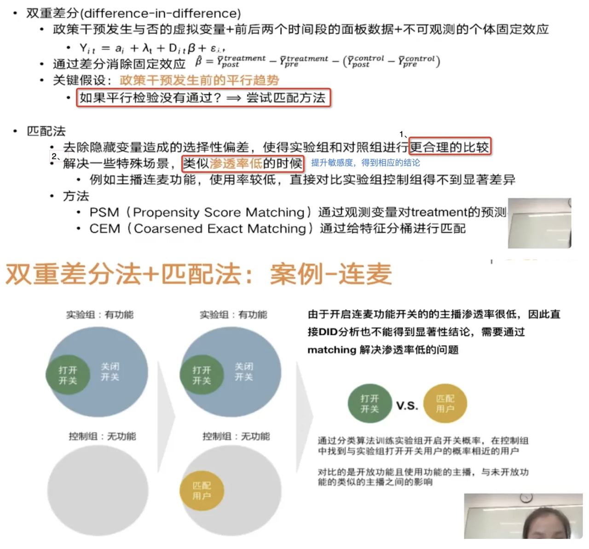

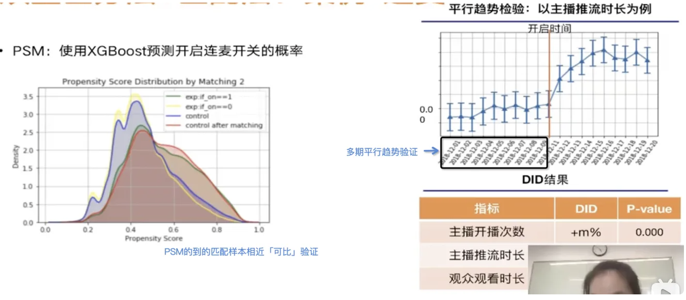

### 贝叶斯结构的时间序列模型

[跟着开源项目学因果推断——CausalImpact 贝叶斯结构时间序列模型（二十一）\_causal impact\_悟乙己的博客-CSDN博客](https://mattzheng.blog.csdn.net/article/details/122103885)

### 合成控制法 SCM

合成控制法（Synthetic Control Method，SCM）是一种用于因果推断的统计方法，用于评估某个处理（政策、干预或事件）对实验单元（地区、组织等）的影响。SCM的核心原理是通过合成一个合成控制组，来估计处理对实验单元的因果效应。这种方法特别适用于没有可用的对照组或对照组样本较少的情况。

**原理：**

SCM的主要思想是在处理前的时间点，寻找一个合成的控制组，使得合成控制组的特征与处理组在处理前是相似的，即实验单元和合成控制组在处理前没有差异。然后，我们用合成控制组的结果来估计处理组在处理后的结果，假设在处理前的趋势仍然成立。

合成控制组的构建是一个加权组合，通过对一些潜在控制组（通常是其他实验单元）的加权平均来生成。权重是通过最小化实验单元和合成控制组在处理前的差异来计算的。这样，SCM将处理组的结果与合成控制组的结果进行比较，从而估计处理对实验单元的因果效应。

**前提假设：**

1. &#x20;**合成控制组的合理性：** 构建合成控制组时，选择的潜在控制组必须在处理前与实验单元相似。&#x20;

2. &#x20;**合成控制组的权重：** 对于合成控制组的加权组合，权重的分配应该是合理的，以确保合成控制组与实验单元在处理前趋势的匹配。&#x20;

当PSM无法从已有样本中匹配到相近的对照组，可以考虑使用合成控制法（加权平均）进行构造（虚拟对照组）

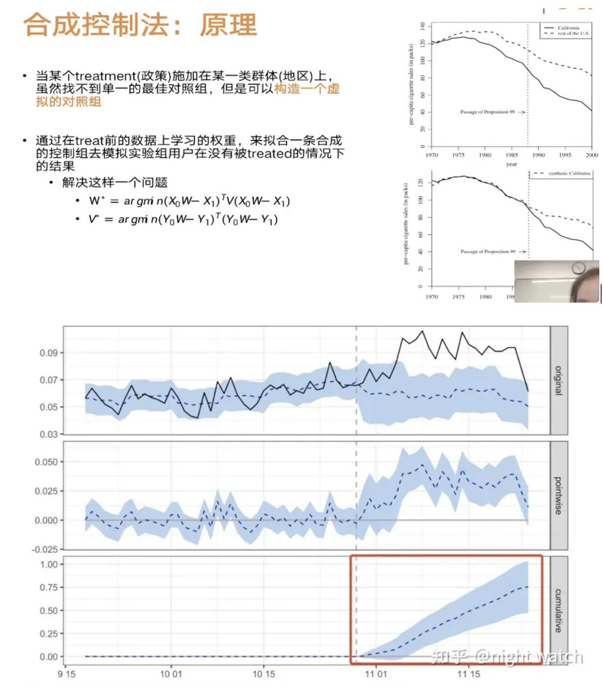

合成控制方法 (Synthetic Control Methods) 原理如何，是怎样操作？ - CanisMajoris的回答 - 知乎
<https://www.zhihu.com/question/43497862/answer/1874867221>

### weighting方法-逆概率加权（IPW）

对于存在用户属性分布不一致的两组样本，通过权重调整缩放样本数，配平该混淆因子在两组用户中的分布比例

***

#### Inverse probability of weighting

* 通过把协变量x的两个取值（male vs. female)分别放大到每一个取值的样本总数大小；

* 比如对于女性用户总数为4，把t=1的女性用户3放大至4个，把t=0的女性用户数1也放大至4个，这样达到了实验组和对照组中女性用户数量的平衡；

* 放大系数weight = 1/p(x)，对于t=1的女性用户，p(x) = count(female|t=1) / count(female) =  3/4

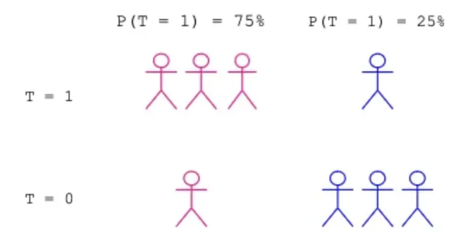

做法示例

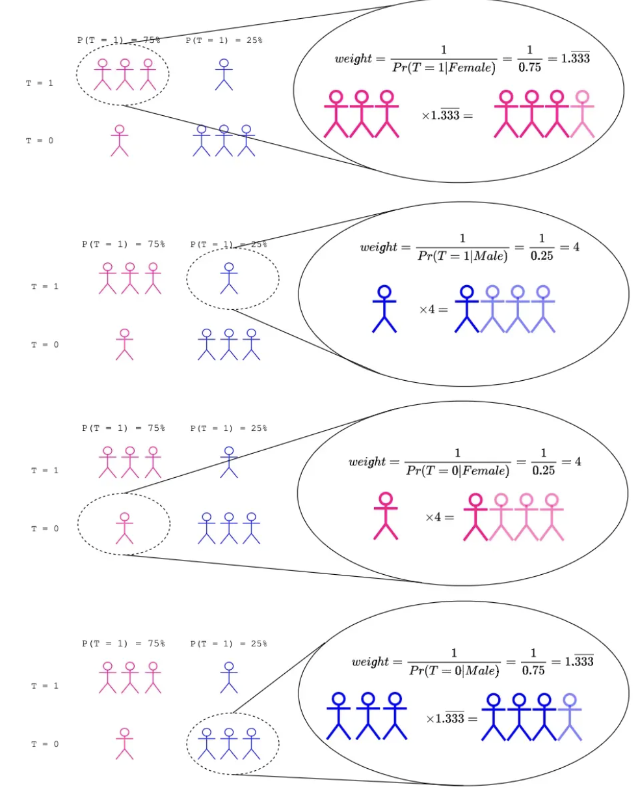

放大操作相当于重采样，样本量会翻倍，这样可能带来类似type 1 error问题，具体可以看参考资料1

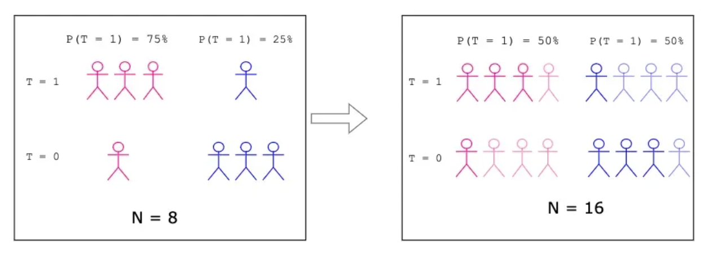

#### Inverse propensity weighting

* 我的理解是，t=1和t=0两个分组，无法像上述示例那样只有一个协变量，所以可以通过倾向性得分（ps）将多个协变量降成一维，只要这个一维的ps接近，那就近似认为配平了混淆；

* weighting和matching的方法的区别在于：

  * 我感觉weighting不需要走近邻匹配的路子，直接根据权重缩放；

  * matching不会匹配上所有样本，weighting会使用全部数据（不会减少样本量）

  * matching计算的是ATT，weighting计算的是ATE

* 如下图所示，把t=1和t=0两组不同e(x)的units数配平，以达到两组e(x)分布一致的效果；

* weight = t/e(x) - (1-t)/(1-e(x))

  * 对于t=1来说，提升ps值低的样本权重，打压ps值高的样本权重（因为t=1组高ps样本比较多我猜）；

  * 对于t=0来说，提升ps值高的样本权重，打压ps值低的样本权重（因为t=0组高ps样本比较少我猜）

  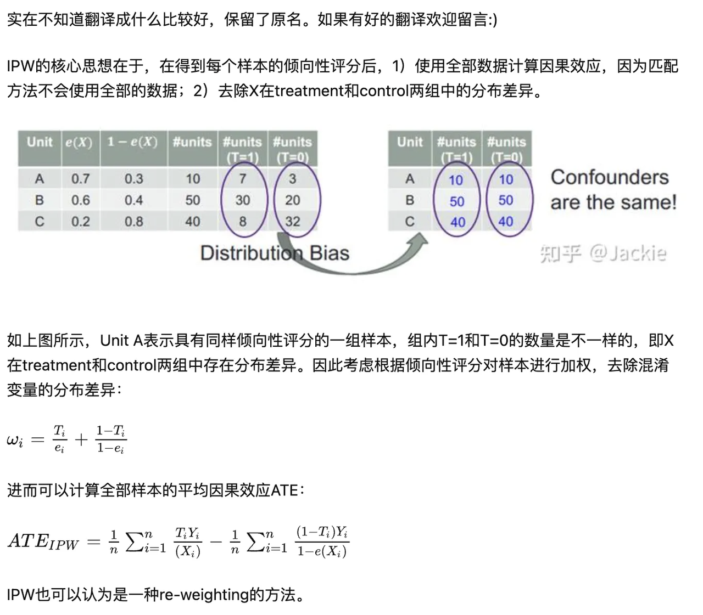

参考资料

* <https://towardsdatascience.com/understanding-inverse-probability-of-treatment-weighting-iptw-in-causal-inference-4e69692bce7e>

* <https://ata.alibaba-inc.com/articles/211580?spm=ata.21736010.0.0.5aa8584dXnSUfw#Yw-y_5Y5>

* <https://zhuanlan.zhihu.com/p/377156645>

### 工具变量法 IV

用于回答：x如何影响y（有时候做实验，进入实验组，不一定能使x变化），但又想知道变化x能使y变化多少

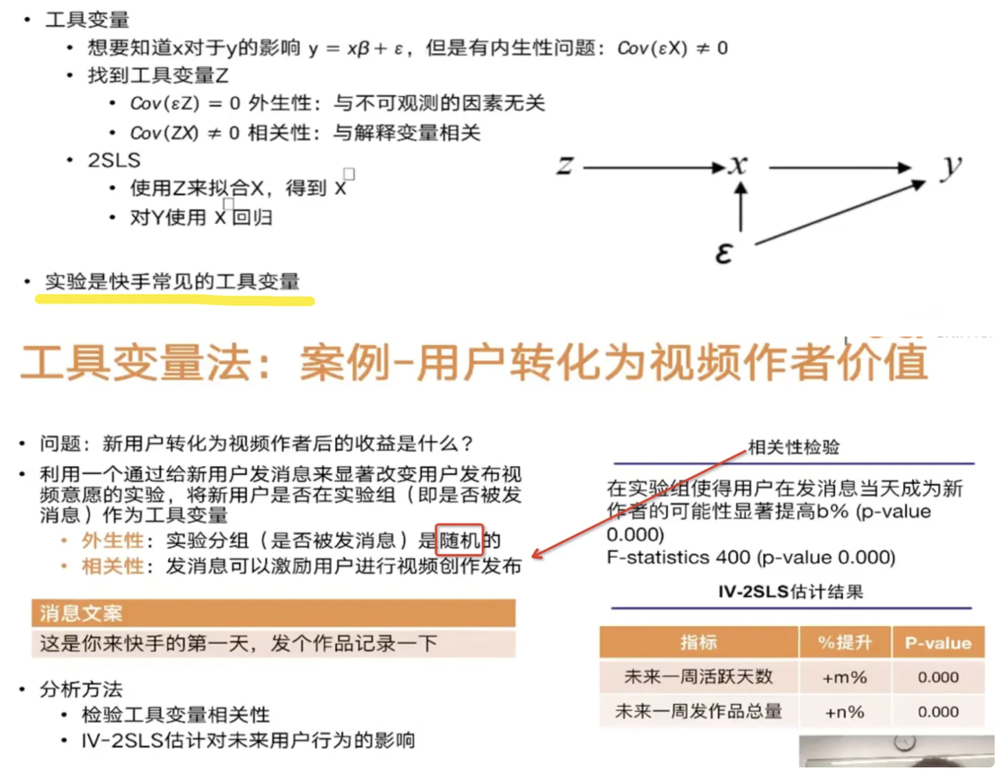

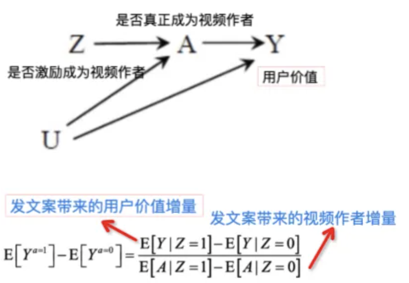

如何评估「如果用户成为视频作者，会带来多少用户价值的提升？」

难点：用户只有一个状态（是视频作者，不是视频作者），如何对比？

* PSM人群匹配，对视频作者与非视频作者进行比较，得到价值差异

* 工具变量法，设计一个只对会激励用户发视频的策略实验，看实验组与对照组的用户发视频比例是否有显著差异（满足工具变量的相关性前提之一），接着使用IV-2SLS进行评估，预估实际影响的系数（e.g. 单位视频作者增量带来的用户价值增量 -- 假设由文案带来的视频作者与用户自然成为的视频作者价值相同，相当于工具变量与因变量无混杂效应的假设）

<https://developer.aliyun.com/article/883110>

<https://zhuanlan.zhihu.com/p/101539590>

### 断点回归RDD

[精确断点回归（RD）理论及评价](https://zhuanlan.zhihu.com/p/513059543)里面判断例子不适用于PDM和DID挺好的

[断点回归（regression discontinuity design）学习笔记\_Claire\_chen\_jia的博客-CSDN博客](https://blog.csdn.net/Claire_chen_jia/article/details/108857734)

设计思想：其基本思想是存在一个连续变量, 该变量能决定个体在某一临界点两侧接受政策干预的概率, 由于X在该临界点两侧是连续的, 因此个体针对X的取值落入该临界点任意一侧是随机发生的, 即不存在人为操控使得个体落入某一侧的概率更大, 则在临界值附近构成了一个准自然实验。

\*\*举例1：\*\*在一条河流随机设置一个水质监测点，设置水质监测点10公里范围内的以上为上游，以下为下游。可以以RDD研究在水质监测点的上下游对企业绩效的影响。因为在10公里范围内，可以默认为企业的其他因素相似（当然也会控制一些固定效应）

\*\*举例2：\*\*一本线附近，刚刚考上和差一点考上可以设计RDD模型来研究考上一本对未来收入的影响。因为在分数范围内，可以默认为考生的其他方面相似（当然也会控制一些特征）

<https://home.huhuaping.com/seminar-econometrics/material/seminar-RDD-part02.pdf>

#### python实战

[rdd/tutorial/tutorial.ipynb at master · evan-magnusson/rdd](https://github.com/evan-magnusson/rdd/blob/master/tutorial/tutorial.ipynb)

## 因果推断与机器学习

因果分析的语言，核心在于因果关系的识别，即合理的估计处理前和处理后现有条件期望的差异，也可以是一种处理缺失数据的问题，**在因果推断上我们非常关心的是如何准确的估计结果以及结果的方差**。而在机器学习中，我们使用准确度来衡量机器学习模型的好坏，其目标是在训练集上估计一个条件期望，使得测试集上MSE最小。机器学习可以通过cross-validation（模型参数）的方法去数据驱动的选择一个最佳模型形式，与传统计量经济学方法相比不需要复杂的假设，例如function form的假设，从这种意义上机器学习能够更准确的预测。

方差反映了对于因果效应估计的不确定性

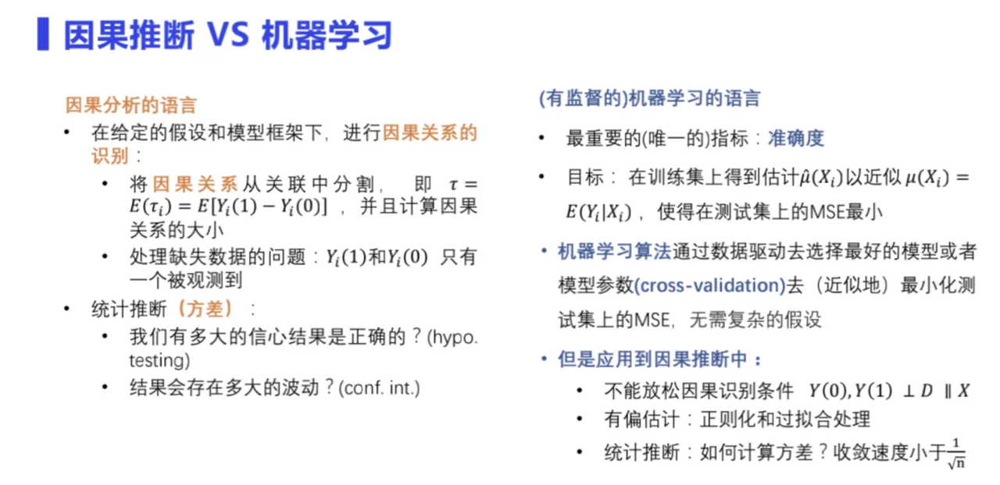

但是在因果推断问题上，机器学习的局限性在于以下几点：

1. 因果识别的条件：机器学习通常强调的是预测，而不是因果关系。不论采用何种机器学习方法，为了得到有效的因果关系，我们必须满足一定的条件，比如无遗漏变量偏误（没有遗漏的混淆因素）、稳定单元处理响应（给定混淆因素，处理的效应是稳定的）等。这些因果识别的条件不能被轻易放松。&#x20;

2. 正则化和过拟合处理：机器学习模型通常使用的正则化方法可能会带来有偏估计，这在预测问题中可能并不重要，但在因果推断中可能会导致问题，因为我们关心的是无偏的处理效应。因此，我们需要使用适当的方法来纠正这种偏差。&#x20;

在机器学习中，正则化通过在模型的损失函数中添加一正则化项，来对模型的复杂度进行惩罚。正则化在一定程度上是通过引入偏差来减小模型的方差，从而达到防止过拟合的目的，但同时也可能导致有偏的估计。

1. 统计推断：有些机器学习模型并不提供直接的方式来计算估计值的方差，这对于因果推断来说是一个问题，因为我们需要估计结果的不确定性。另外，即使我们可以计算方差，也可能存在方差的收敛速度不能满足需求的问题。这就需要我们采用适当的统计方法来处理。&#x20;

对于大多数模型而言(如决策树、SVM)，模型估计值得方法需要通过bootstrap/cross validation构造多个模型多次预测来实现；而线性模型这类相对简单的参数化模型则可以通过参数的方差来反应

总的来说，虽然机器学习在许多问题上表现出色，但在因果推断中仍有一些局限性。我们需要了解这些局限性，并采取适当的方法来处理这些问题。

### 因果森林模型 —— HTE

了解异质性因果效应Heterogeneous Treatment Effect(HTE)，即不同特征的用户子群体对于treatment的不同因果效应，能够帮助更好的归因和理解用户。传统做法是多维下钻分析（对每个可能影响因果关系的变量进行分析），但这方法效率较低且容易犯错（容易忽略联合影响，存在「维度诅咒」问题，随着特征的增加需要的数据量会指数级增长，而实际的样本量是有限的）。相比之下，机器学习方法能够自动地选择重要的变量并考虑它们的交互效应，因此可以更有效地处理高维数据和用户异质性。

通常情况下，可以考虑参考决策树方法，因为决策树的分桶特性能够帮助解决异质性问题（数据集通过特征划分，使得每个分支的数据都具有相似的特征），同时相对于传统的决策树做了两点改动:

1. 数据分成训练集和估计集：在因果树中，我们把数据分为两个部分。一部分数据用来训练决策树（即，确定树的结构），另一部分数据用来在每个决定的分支上估计因果效应和方差。这样做的目的是防止过拟合，并**保证因果效应的估计是独立于训练过程的**。&#x20;

2. 分支方式上的改动：在因果树中，我们不仅考虑每个分支的预测精度（或者考虑最大化因果效应差异，即叶子结点中Control组和Treatment组在Y上的分布差异最大），还要考虑每个分支的因果效应的方差。具体来说，当我们在确定树的结构时（即，数据应该如何分割），我们会选择那些不仅使预测误差最小，而且因果效应方差最小的分割方式。这样可以帮助我们找到那些对政策反应更强烈、更一致的用户群体。&#x20;

因果效应估计值的衡量：对于叶子结点中每个接受了处理的样本i，观测值减去所有未接受处理样本观测值的均值；因果效应估计值的方差即位因果效应方差

通常情况下，我们结合实验来做分析。比如在实验中，通过因果树得到因果效应的分布，然后挑选出来那些实验效果显著的用户，去分析他们的特征，以及找到敏感用户，帮助我们了解策略的影响，作出下一步迭代。

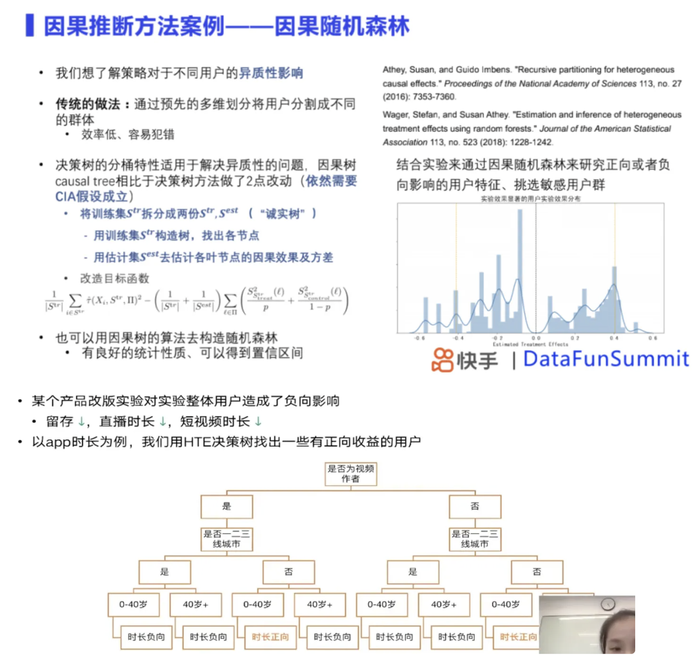

【补充】选择节点的原则

#### 回答：xx群体是否应该被透券

用决策树遍历特征形成节点从而形成人群

#### 回答：xx群体投xx面额的券，才能达到最优

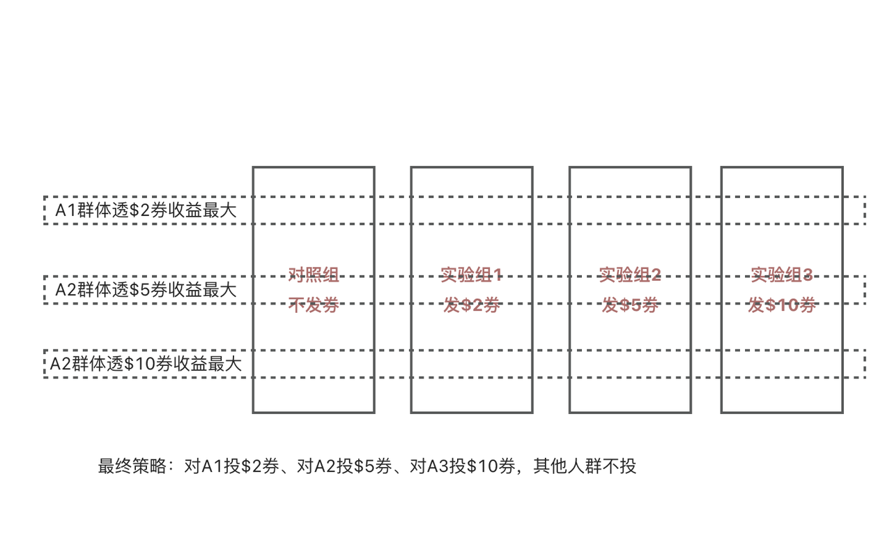

用决策树遍历特征形成节点从而形成人群的同时，对每个人群遍历一遍所有的券面额，确定CATE最大的面额，并打标。具体算法工程实现方法可以再调研一下

### Meta-Learner

[AB实验人群定向HTE模型5 - Meta Learner - 风雨中的小七 - 博客园](https://www.cnblogs.com/gogoSandy/p/12358898.html)

[Uplift Model:X-learner](https://zhuanlan.zhihu.com/p/194246030)

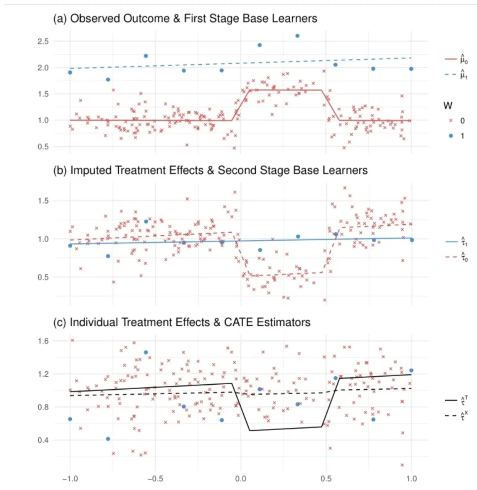

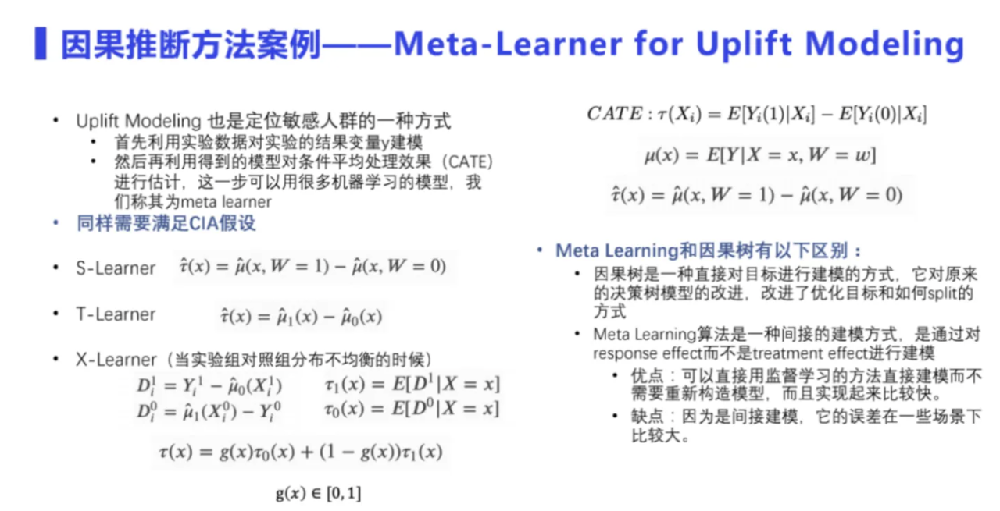

g(x)大多为倾向分

为什么x-learner具有优势？

### uplift model的评估

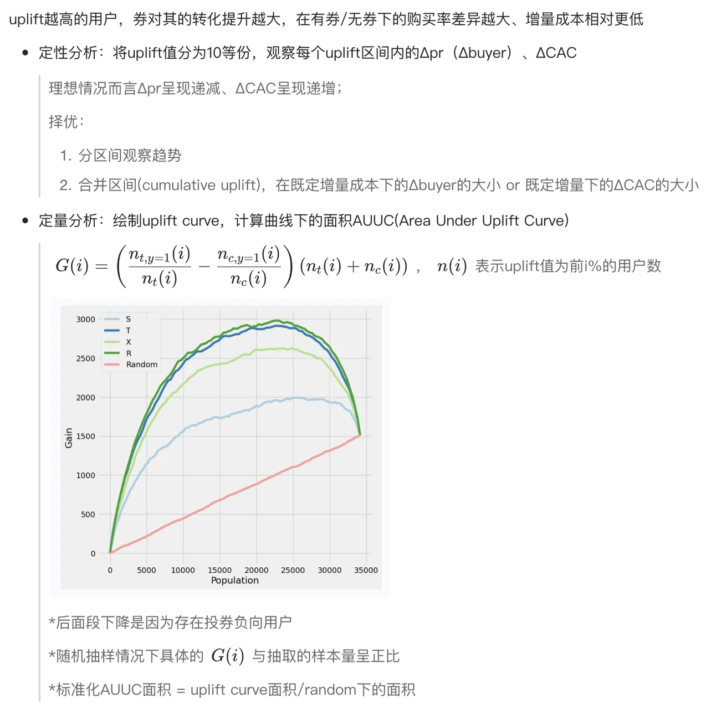
